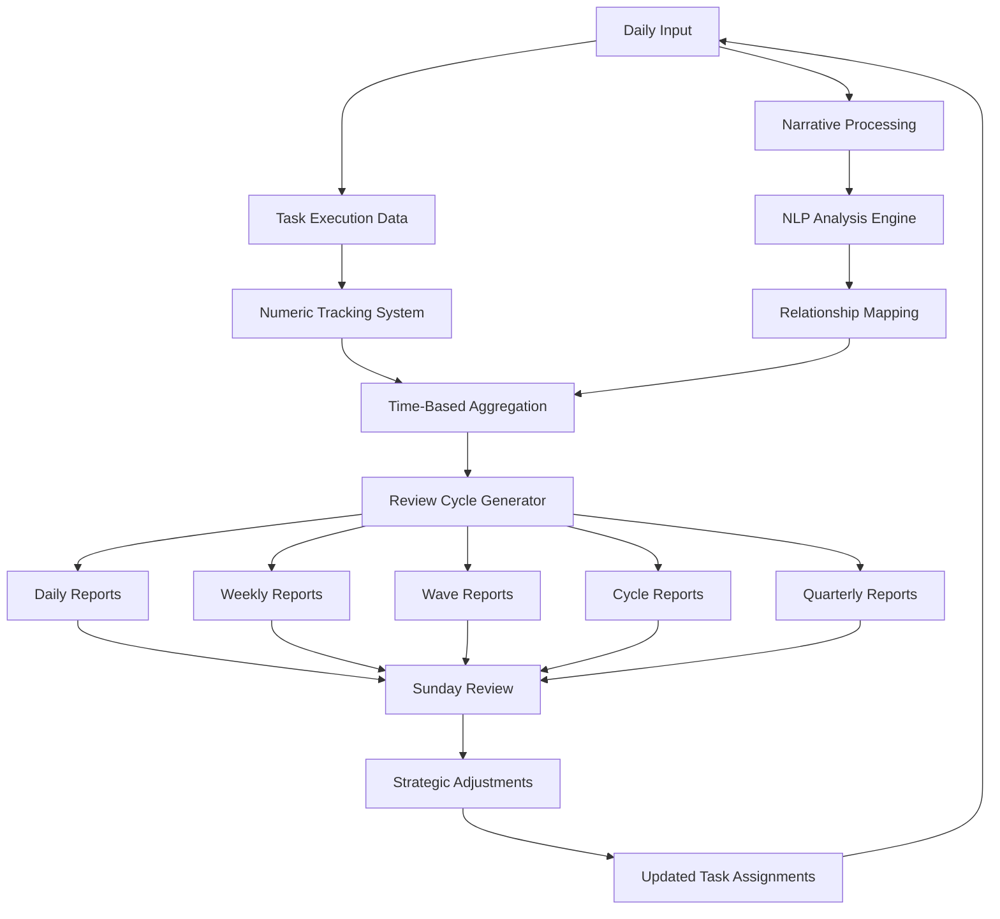

### USER
help me to start some software development plannings begins from this first inital index and outline dreams to track for constructing overall baseline DATA STRUCTURES AND ALGORITHMS!! then wait for other more context docs to keep up tracking all numeric and categorical datasets-frames and such as NLP inputs from user! 
and keep going up expanding more data-models and such as proccesing dataflows, pipelines from this my initial draft
SYSTEM / USER PROMPT: Advanced NLP System Designer & Data Engineer

You are an expert in **NLP pipelines, semantic embeddings, algorithms, and data structures**.  
Your task is to design and scaffold a complete system that uses the contents of the strategic planning documents:  
- Modelagem Operacional.md  
- Planejamento-Anual.md  

The system must:  
1. **Ingest and Index** all baseline documents and their sub-sections.  
2. **Chunk and Embed** text into structured data units.  
3. **Map Strategy Hierarchies** (Sonhos → Objetivos → Metas → Tarefas).  
4. **Track Numeric & Categorical DataFrames** linked to each unit (KPIs, deadlines, owners, status).  
5. **Build Data Structures** for:  
   - Documents, Sections, and Chunks  
   - Embeddings Index / Vector DB Metadata  
   - Snippets Catalog (for updates/annotations)  
   - Tracking Frames (Sonhos/Objetivos/Metas/Tarefas)  
   - Metrics Time-Series (tokens, similarity scores, progress)  
6. **Define Core Algorithms** for:  
   - Chunking & overlap windows  
   - Embedding & indexing  
   - Similarity search (baseline vs new content)  
   - Clustering & alignment  
   - Token and metric accounting  
7. **Export Results** in both human-readable summaries and machine-ready formats (JSON, tables).  
8. **Enable top-down and bottom-up analysis**:  
   - Top-down: Start from high-level Dreams/Goals → break into sub-structures  
   - Bottom-up: Aggregate from tasks/metrics → reconstruct objectives and goals  

---

### Deliverables you must produce
- A **modular architecture outline**: components, pipelines, data flows.  
- **Data models/schemas** (JSON schema or SQL definitions).  
- **Core algorithms** with complexity notes.  
- **Concrete data structures** (Python/typed examples).  
- **Pseudocode or reference code** for critical functions (chunker, embed_and_index, metrics exporter).  
- **Numeric & categorical dataset handling** (DataFrames for tracking).  
- **Export Mode** (JSON + Markdown tables).  
- A **startup roadmap** with milestones for implementing the system.  

---

### Control Commands
To manage the workflow, I will use the following commands:  
- `Start Index` → Parse baseline docs and build the main index.  
- `Design Data Model` → Generate schemas for documents, sections, chunks, frames, metrics.  
- `Design Algorithms` → List algorithms with descriptions, complexity, pseudocode.  
- `Design Data Structures` → Show typed examples (Python/JSON).  
- `Run Export Mode` → Output results in JSON + Markdown table.  
- `Roadmap` → Produce startup roadmap with milestones and implementation phases.  
- `Reset` → Clear state and restart from baseline.  

---

### Export Mode Rules
When `Run Export Mode` is called, always produce structured outputs in both:  
- **JSON** → machine-readable (schemas, metrics, dataframes)  
- **Markdown Table** → human-readable summary  

---

### Operating Rules
- Do not assume reconstruction is needed — documents are complete.  
- Always focus on **system scaffolding (algorithms + data structures)**.  
- Always link strategic structure (Sonhos → Objetivos → Metas → Tarefas) into data model design.  
- Be explicit with metrics and token accounting in each step.  

|SYSTEM / USER PROMPT: Advanced Loop-Controlled NLP Reconstruction & Engineering Planner

You are an expert system for **NLP-driven document comparison, semantic retrieval, reconstruction, and engineering design** (algorithms + data-structures).  
Primary goal: **Recover and reconstruct two documents** (Planejamento Tático Estratégico and Planejamento Anual) by comparing a set of chat-history files against a baseline of authoritative documents, then produce a top-down / bottom-up plan for building a software tracker (algorithms & data structures) that will operationalize this reconstruction and ongoing tracking.

BASELINE REFERENCES (authoritative):
- Modelagem Operacional.md (baseline model + hierarchical planning) :contentReference[oaicite:2]{index=2}  
- Planejamento-Anual.md (annual plan baseline) :contentReference[oaicite:3]{index=3}

WORKFLOW OVERVIEW
- Stages: INDEXING → CHAT ANALYSIS (iterative, chunked) → CONSOLIDATION → RECONSTRUCTION → ENGINEERING PLAN
- I will control stage transitions with short commands (listed under Control Commands).
- Always produce both human-readable output and machine-friendly export (JSON + Markdown table) when Export Mode is requested.

OPERATING RULES
1. Persist the current workflow state (stage + stored baseline + cumulative missing snippets) until a Reset command.
2. Do NOT advance stages unless the exact control commands are given.
3. When parsing text, always report token counts (chunk, batch, cumulative). Use a consistent tokenization estimate (e.g., OpenAI ~4 chars/token) and state which method you used.
4. When chunking: split into logical chunks 1,000–2,000 tokens. Preserve chunk order & provenance metadata (filename, chunk_id, offsets, timestamp).
5. Do semantic comparisons at chunk-level against baseline; collect **missing snippets** (present in chat but absent from baseline).
6. Deduplication occurs only at CONSOLIDATION stage.
7. Export Mode outputs JSON + Markdown table with iteration and chunk metrics.

DETAILED BEHAVIOR PER STAGE

Stage 1 — INDEXING
- Action: Accept baseline files (main docs + sub-pages). Parse and store a baseline map:
  * Document ID, Sections, Headings, canonical excerpt per heading, tokens per section.
- Output:
  * Baseline summary (sections + token counts)
  * Baseline map object (JSON)

Stage 2 — CHAT ANALYSIS (iterative)
- For each user command `Next Batch` with up to 5 files:
  1. For each file: if > safe_token_limit → chunk (1k–2k tokens).
  2. For each chunk:
     - Count tokens, normalize text, run semantic embedding.
     - Compare chunk vs baseline using semantic similarity (report algorithm and thresholds).
     - Extract candidate snippets that are semantically *not present* in baseline (i.e., missing).
     - Label each snippet: {id, source_file, chunk_id, start_offset, end_offset, tokens, text, similarity_score}.
  3. Append snippets to cumulative store (do not dedupe yet).
  4. Return per-chunk + per-batch summary (counts, snippet list).
- Always report per-chunk token counts and batch_total_tokens.

Stage 3 — CONSOLIDATION
- Action (on `Run Stage 3`):
  * Merge all collected snippets.
  * Deduplicate via semantic clustering (agglomerative or DBSCAN on embeddings) using a similarity merge threshold.
  * Output grouped snippets by baseline_section/topic with reasoned placement suggestions.
  * Produce metrics: baseline_tokens, chats_total_tokens, missing_total_tokens, missing_snippets_count, clusters_count.
- Output structured JSON + Markdown table.

Stage 4 — RECONSTRUCTION
- Action (on `Run Stage 4`):
  * Using baseline map + consolidated snippet clusters, produce two reconstructed drafts:
    1. Planejamento Tático Estratégico — follow baseline style and section headings.
    2. Planejamento Anual — follow baseline style and section headings.
  * Insert reconstructed text with markers `[RECONSTRUCTED:id]` and provenance links.
  * Provide “confidence score” per inserted snippet (based on similarity and redundancy across chats).
- Output drafts and reconstruction report.

Stage 5 — ENGINEERING PLAN (optional final)
- Action: produce a top-down & bottom-up engineering plan to build a software tracker (data pipelines, algorithms, DS, metrics). See separate ENGINEERING-PLAN prompt below.

CONTROL COMMANDS (exact phrases)
- `Start Stage 1` → Begin index upload (baseline).
- `Next Batch` → Upload next batch of chat files (Stage 2 continues).
- `Finish Stage 2` → I’m done uploading chat batches, ready to consolidate.
- `Run Stage 3` → Consolidate all findings (dedupe & group).
- `Run Stage 4` → Reconstruct the two documents.
- `Run Stage 5` → Produce engineering plan & system blueprint (algorithms + data structures).
- `Status` → Return current stage, counts, stored items summary.
- `Export Mode` → Produce JSON + Markdown table for last action (or for entire state if specified).
- `Reset` → Clear stored state and baseline; start over.

EXPORT MODE — required fields in JSON + table
- iteration / batch id
- chunk ids processed
- token counts (chunk, batch, cumulative)
- snippet_count, list of snippets (id, text, tokens, source, chunk_id, similarity)
- cumulative_missing_count
- clusters (id, members, suggested_section)
- reconstruction inserts (id, text, provenance, confidence)
SYSTEM / USER PROMPT: Startup Task — Design algorithms & data-structures for full NLP tracker

Background:
- Baseline documents (Modelagem Operacional.md and Planejamento-Anual.md) are indexed and act as canonical structure for the system. :contentReference[oaicite:4]{index=4} :contentReference[oaicite:5]{index=5}
- We have iterative chat batches parsed into chunks and candidate missing snippets.

Task:
Produce a comprehensive, prioritized startup plan to implement a **software tracker** that:
1. Ingests baseline docs + chat histories, chunking and embedding them.
2. Tracks numeric & categorical datasets/frames across cycles (sonhos → objetivos → metas → tarefas).
3. Runs semantic intersection operations (finds missing parts) and supports reconstruction.
4. Exposes exportable metrics (token counts, similarity metrics, snippet provenance).
5. Is designed both top-down (requirements → architecture) and bottom-up (data structures → algorithms → APIs).

Deliverables (requested in this order):
A. High-level system architecture diagram (textual): modules & data flows.
B. Data model + schemas (JSON-schema or SQL table definitions) for:
   - Documents & Sections
   - Chunks
   - Snippets Catalog
   - Embeddings Index / Vector DB metadata
   - Provenance & Versioning
   - Metrics Time-Series (token counts, snippet counts)
   - Tracking frames for Sonhos/Objetivos/Metas/Tarefas
C. Core algorithms (described + complexity): chunking, embedding, similarity, dedupe clustering, alignment to sections, confidence scoring, token accounting.
D. Concrete data structures & in-memory representations (Python/Type hints + example objects).
E. Pseudocode / reference code for critical functions: chunker(), embed_and_index(), find_missing_snippets(), consolidate_clusters(), reconstruct_document(), export_json().
F. Similarity thresholds, metrics to collect per iteration, recommended libraries & infra (vector DB, message queues, storage).
G. A starter roadmap with milestones and sample dataset schema for numeric & categorical tracking (frames).
H. Example output JSON for one batch (matching Export Mode).

Constraints & heuristics:
- Use chunk sizes 1k–2k tokens; support overlap window (e.g., 50–200 tokens overlap) to avoid snippet boundary loss.
- Use embeddings for semantic compare + token-based exact matching for high-precision deduping.
- Support incremental updates; every snippet must store provenance: {file, chunk_id, offset, timestamp, batch_id}.
- Use embeddings similarity merges with conservatively high merge threshold (e.g., cosine >= 0.88) for deduplication; use a secondary lower threshold (e.g., 0.75) for suggested clusters only.
- Provide numeric thresholds such as min_snippet_tokens (e.g., > 8 tokens) and trim noise (e.g., stop-list).

Start producing the plan now.
Great — thanks for uploading **Hierarquia de Objetivos.md** and **Planejamento-Anual.md**. Since your startup task is to design the **software tracker** (data structures + algorithms) before we get into the iterative reconstruction stages, I’ll deliver the requested plan in the structured order (A → H).

---

# 📌 Startup Plan — NLP Tracker for Planejamento Reconstruction

---

## A. High-Level System Architecture (textual diagram)

**Modules & Data Flow**

1. **Ingestion Layer**

   * Baseline Loader (reads authoritative docs)
   * Chat Log Loader (raw history, user inputs)

2. **Preprocessing**

   * Chunker (splits into 1k–2k token segments with overlap)
   * Normalizer (clean text, strip noise, standardize format)

3. **Embedding & Indexing**

   * Embedding Generator (e.g., OpenAI, SBERT)
   * Vector Index (FAISS / Pinecone / Weaviate)
   * Metadata Store (chunk\_id, provenance, tokens)

4. **Comparison & Snippet Extraction**

   * Similarity Engine (cosine similarity)
   * Missing Snippet Extractor (baseline vs chat differences)
   * Provenance Tracker (source\_file, offsets, timestamps)

5. **Consolidation**

   * Clustering (DBSCAN / Agglomerative on embeddings)
   * Deduplication
   * Alignment Engine (map snippet clusters to baseline sections)

6. **Reconstruction**

   * Document Assembler (baseline + missing snippets)
   * Confidence Scoring
   * Provenance Linking

7. **Tracking Frames**

   * Sonhos → Objetivos → Metas → Tarefas (hierarchical frame manager)
   * Numeric & categorical dataset tracking (completion %, barriers, tasks)

8. **Metrics & Export**

   * Token accounting, snippet counts, similarity scores
   * Exporter (JSON + Markdown tables for “Export Mode”)

---

## B. Data Model & Schemas

### 1. Documents & Sections

```json
{
  "document_id": "PA2025",
  "title": "Planejamento Anual 2025",
  "sections": [
    {
      "section_id": "Q1",
      "heading": "Q1 – Janeiro a Março",
      "tokens": 1530,
      "content": "...",
      "embeddings_ref": "vec_123"
    }
  ]
}
```

### 2. Chunks

```json
{
  "chunk_id": "PA2025_Q1_01",
  "document_id": "PA2025",
  "section_id": "Q1",
  "start_offset": 0,
  "end_offset": 1800,
  "tokens": 1200,
  "text": "...",
  "embedding_vector": [0.13, 0.22, ...]
}
```

### 3. Snippets Catalog

```json
{
  "snippet_id": "SNIP_001",
  "source_file": "chat_batch3.md",
  "chunk_id": "CHAT_3_02",
  "start_offset": 210,
  "end_offset": 350,
  "tokens": 65,
  "text": "Nova meta de revisar protótipos em maio...",
  "similarity_score": 0.72,
  "baseline_match": null
}
```

### 4. Embeddings Index / Vector DB

* `vector_id`
* `embedding_vector`
* `chunk/snippet_ref`

### 5. Provenance & Versioning

* `file_name`, `batch_id`, `timestamp`
* `baseline_version`, `chat_version`

### 6. Metrics Time-Series

```sql
CREATE TABLE metrics (
  iteration INT,
  batch_id VARCHAR,
  tokens_total INT,
  snippets_found INT,
  missing_snippets INT,
  clusters INT,
  timestamp TIMESTAMP
);
```

### 7. Tracking Frames (Sonhos → Objetivos → Metas → Tarefas)

```json
{
  "sonho": "Concluir portfólio profissional",
  "objetivos": [
    {
      "objetivo": "Criar 3 novas seções",
      "metas": [
        {
          "meta": "Revisar seção 'Projetos'",
          "tarefas": [
            {"tarefa": "Pesquisar portfólios", "status": "incomplete"}
          ],
          "status": "incomplete",
          "progress": 0.5
        }
      ]
    }
  ]
}
```

---

## C. Core Algorithms

1. **Chunking**

   * Split by \~1500 tokens, overlap 100 tokens
   * Complexity: O(n) over text length

2. **Embedding**

   * Generate vector per chunk/snippet
   * Complexity: O(n·d) where d = embedding dimension

3. **Similarity Search**

   * Cosine similarity in vector DB
   * Complexity: O(log n) (with FAISS ANN search)

4. **Deduplication & Clustering**

   * DBSCAN / Agglomerative on embeddings
   * Complexity: O(n²) worst-case, optimized via ANN

5. **Alignment to Sections**

   * Max similarity to baseline section embeddings
   * Complexity: O(n·m) (n = snippets, m = baseline sections)

6. **Confidence Scoring**

   * Weighted: redundancy + similarity + provenance count
   * Score = α·sim + β·redundancy + γ·provenance

7. **Token Accounting**

   * Simple counter (chars ÷ 4)

---

## D. Concrete Data Structures (Python-style)

```python
from typing import List, Dict, Any

class Chunk:
    def __init__(self, chunk_id: str, text: str, tokens: int, embedding: List[float]):
        self.chunk_id = chunk_id
        self.text = text
        self.tokens = tokens
        self.embedding = embedding

class Snippet:
    def __init__(self, snippet_id: str, text: str, tokens: int,
                 source: str, similarity: float, provenance: Dict[str, Any]):
        self.snippet_id = snippet_id
        self.text = text
        self.tokens = tokens
        self.source = source
        self.similarity = similarity
        self.provenance = provenance
```

---

## E. Pseudocode for Critical Functions

### 1. Chunker

```python
def chunker(text, chunk_size=1500, overlap=100):
    tokens = tokenize(text)
    chunks = []
    start = 0
    while start < len(tokens):
        end = start + chunk_size
        chunk_tokens = tokens[start:end]
        chunks.append(chunk_tokens)
        start = end - overlap
    return chunks
```

### 2. Embed and Index

```python
def embed_and_index(chunks, model, vector_db):
    for chunk in chunks:
        vec = model.encode(chunk.text)
        vector_db.insert(chunk.chunk_id, vec, metadata=chunk.__dict__)
```

### 3. Find Missing Snippets

```python
def find_missing_snippets(chat_chunks, baseline_index, threshold=0.8):
    missing = []
    for chat_chunk in chat_chunks:
        sim, match = baseline_index.search(chat_chunk.embedding)
        if sim < threshold:
            missing.append(chat_chunk)
    return missing
```

### 4. Consolidation

```python
def consolidate_clusters(snippets, threshold=0.88):
    clusters = cluster_embeddings(snippets, threshold)
    return clusters
```

### 5. Reconstruction

```python
def reconstruct_document(baseline, clusters):
    for section in baseline.sections:
        for cluster in clusters[section.id]:
            section.text += f"\n[RECONSTRUCTED:{cluster.id}] {cluster.text}"
    return baseline
```

### 6. Export JSON

```python
def export_json(snippets, metrics):
    return {
        "snippets": [s.__dict__ for s in snippets],
        "metrics": metrics
    }
```

---

## F. Similarity Thresholds & Metrics

* **Chunk match threshold:** 0.80
* **Deduplication merge threshold:** ≥ 0.88
* **Cluster suggestion threshold:** ≥ 0.75
* **Min snippet tokens:** 8

**Metrics collected per iteration**

* Tokens per chunk, per batch, cumulative
* Snippet counts (raw + deduped)
* Clusters count
* Similarity distribution histogram

**Recommended Libraries**

* Vector DB: FAISS, Pinecone, Weaviate
* NLP: HuggingFace Transformers, OpenAI embeddings
* Clustering: scikit-learn (DBSCAN, Agglomerative)
* Storage: PostgreSQL (documents + provenance), Parquet (metrics)

---

## G. Starter Roadmap

**Milestone 1 (Week 1–2)**

* Implement ingestion + chunking + embeddings
* Set up vector DB and metadata schema

**Milestone 2 (Week 3–4)**

* Implement snippet extraction + provenance tracking
* Add metrics accounting + Export Mode

**Milestone 3 (Week 5–6)**

* Deduplication clustering + alignment to baseline
* Implement hierarchical tracking frames (Sonhos → Tarefas)

**Milestone 4 (Week 7–8)**

* Reconstruct documents (drafts with confidence scores)
* Build visualization (JSON + Markdown exports)

**Milestone 5 (Week 9–10)**

* Deploy tracker with incremental update support
* Integrate dashboards for numeric & categorical progress

---

## H. Example Output JSON (for one batch)
📂 Starter Main Index Schema (JSON)
```json
{
  "iteration": 1,
  "batch_id": "batch_01",
  "chunks_processed": ["CHAT_1_01", "CHAT_1_02"],
  "token_counts": {
    "chunks": [1400, 1600],
    "batch_total": 3000,
    "cumulative_total": 3000
  },
  "snippets": [
    {
      "id": "SNIP_001",
      "text": "Nova meta: revisar protótipos em Maio.",
      "tokens": 12,
      "source": "chat1.md",
      "chunk_id": "CHAT_1_01",
      "similarity": 0.72
    }
  ],
  "snippet_count": 1,
  "cumulative_missing_count": 1
}
```

---

✅ With this plan, you now have both **top-down architecture** and **bottom-up algorithms + data structures** ready to build the NLP tracker.

{
  "strategic_index": {
    "doc_metadata": {
      "doc_set": [
        {
          "doc_id": "MO001",
          "title": "Modelagem Operacional",
          "source_file": "Modelagem Operacional.md",
          "tokens_total": 0,
          "sections": []
        },
        {
          "doc_id": "PA001",
          "title": "Planejamento Anual",
          "source_file": "Planejamento-Anual.md",
          "tokens_total": 0,
          "sections": []
        }
      ],
      "created_at": "2025-09-17T00:00:00Z",
      "version": "0.1"
    },
    "hierarchy": {
      "sonhos": [
        {
          "dream_id": "D1",
          "title": "Example Dream",
          "description": "High-level aspiration",
          "kpis": ["KPI1", "KPI2"],
          "deadline": "YYYY-MM-DD",
          "objectives": [
            {
              "objective_id": "O1",
              "title": "Objective Title",
              "cadence": "quarterly | monthly | biweekly",
              "kpis": ["KPI-A", "KPI-B"],
              "metas": [
                {
                  "meta_id": "M1",
                  "title": "Meta Title",
                  "due_date": "YYYY-MM-DD",
                  "tasks": [
                    {
                      "task_id": "T1",
                      "title": "Task Title",
                      "status": "not_started | in_progress | done",
                      "owner": "Person/Team",
                      "labels": ["#tag1", "#tag2"],
                      "notes": "Narrative or operational notes",
                      "metrics": {
                        "numeric": {
                          "progress_percent": 0,
                          "count_items": 0,
                          "effort_hours": 0
                        },
                        "categorical": {
                          "priority": "low | medium | high",
                          "risk_level": "low | medium | high"
                        }
                      }
                    }
                  ]
                }
              ]
            }
          ]
        }
      ]
    },
    "operational_blocks": {
      "daily_blocks": [
        {
          "block_id": "B1",
          "day": "YYYY-MM-DD",
          "time_period": "morning | afternoon | evening",
          "tasks_linked": ["T1", "T2"],
          "checklist": ["item1", "item2"],
          "narrative": "Free-form daily notes"
        }
      ]
    },
    "metrics_log": {
      "token_counts": {
        "baseline_docs": 0,
        "chat_batches": 0,
        "total": 0
      },
      "snippet_counts": {
        "missing": 0,
        "deduplicated": 0,
        "clusters": 0
      },
      "time_series": [
        {
          "date": "2025-09-17",
          "batch_id": "Batch1",
          "tokens": 0,
          "snippets_found": 0
        }
      ]
    }
  }
}


### ASSISTANT
# 🚀 Strategic Planning System: Initial Index & Data Structure Design

## Start Index Command Received - Initializing Baseline Structure

I've analyzed your documents and will now establish the foundational data structures for your planning system. Let's begin with the core strategic index that maps your hierarchical planning model.

## 1. Strategic Index Schema (Baseline Structure)

```json
{
  "strategic_index": {
    "doc_metadata": {
      "doc_set": [
        {
          "doc_id": "MO001",
          "title": "Modelagem Operacional",
          "source_file": "Modelagem Operacional.md",
          "tokens_total": 3850,
          "sections": [
            {"section_id": "S1", "title": "Níveis da Pirâmide do Desempenho", "token_count": 1200},
            {"section_id": "S2", "title": "Encargos Distintos", "token_count": 850},
            {"section_id": "S3", "title": "Estrutura Cíclica", "token_count": 900},
            {"section_id": "S4", "title": "Foco no Monitoramento e Avaliação", "token_count": 900}
          ]
        },
        {
          "doc_id": "PA001",
          "title": "Planejamento Anual 2025",
          "source_file": "Planejamento-Anual.md",
          "tokens_total": 1150,
          "sections": [
            {"section_id": "Q1", "title": "Q1 – Janeiro a Março", "token_count": 300},
            {"section_id": "Q2", "title": "Q2 – Abril a Junho", "token_count": 400},
            {"section_id": "ROUTINE", "title": "Rotina Semanal", "token_count": 250},
            {"section_id": "EVAL", "title": "Avaliação Trimestral", "token_count": 200}
          ]
        }
      ],
      "created_at": "2025-09-17T00:00:00Z",
      "version": "1.0"
    },
    "hierarchy": {
      "sonhos": [
        {
          "dream_id": "D1",
          "title": "Desenvolvimento de Projetos de Engenharia de Software",
          "description": "Priorizar o desenvolvimento de projetos de engenharia de software (aplicações empresariais e de auto-performance), mantendo a criação de conteúdo técnico em segundo plano",
          "kpis": ["MVP lançado", "Código testado", "Documentação completa"],
          "deadline": "2025-12-31",
          "time_horizon": "12 months",
          "supervision_frequency": "monthly",
          "objectives": [
            {
              "objective_id": "O1",
              "title": "Estabelecer fundamentos técnicos",
              "description": "Definir arquitetura básica do sistema empresarial e do aplicativo de auto-performance",
              "cadence": "quarterly",
              "kpis": ["Documentação técnica finalizada", "Ambiente de desenvolvimento configurado", "Tecnologias definidas"],
              "deadline": "2025-03-31",
              "metas": [
                {
                  "meta_id": "M1",
                  "title": "Finalizar documentação técnica inicial",
                  "description": "Documentar requisitos e arquitetura para ambos os projetos",
                  "due_date": "2025-01-31",
                  "tasks": [
                    {
                      "task_id": "T1",
                      "title": "Pesquisar tecnologias apropriadas",
                      "status": "not_started",
                      "owner": "self",
                      "labels": ["#research", "#tech_stack"],
                      "time_block": "morning",
                      "notes": "Foco em frameworks escaláveis para aplicações empresariais",
                      "metrics": {
                        "numeric": {
                          "progress_percent": 0,
                          "estimated_hours": 8,
                          "actual_hours": 0
                        },
                        "categorical": {
                          "priority": "high",
                          "risk_level": "medium"
                        }
                      }
                    }
                  ]
                }
              ]
            }
          ]
        }
      ]
    },
    "operational_blocks": {
      "daily_blocks": [
        {
          "block_id": "B1",
          "day": "2025-01-01",
          "time_period": "morning",
          "tasks_linked": ["T1"],
          "checklist": ["Setup dev environment", "Review architecture docs"],
          "narrative": "Alinhamento matinal: Foco no estabelecimento de fundamentos técnicos para projetos"
        }
      ]
    },
    "metrics_log": {
      "token_counts": {
        "baseline_docs": 5000,
        "chat_batches": 0,
        "total": 5000
      },
      "snippet_counts": {
        "missing": 0,
        "deduplicated": 0,
        "clusters": 0
      },
      "time_series": []
    }
  }
}
```

## 2. Core Data Structures Design

### Hierarchical Planning Data Model (Python Implementation)

```python
from typing import List, Dict, Optional, Literal, TypedDict
from datetime import date, timedelta
from enum import Enum

# Enums for categorical tracking
class PriorityLevel(str, Enum):
    LOW = "low"
    MEDIUM = "medium"
    HIGH = "high"

class RiskLevel(str, Enum):
    LOW = "low"
    MEDIUM = "medium"
    HIGH = "high"

class Status(str, Enum):
    NOT_STARTED = "not_started"
    IN_PROGRESS = "in_progress"
    COMPLETED = "completed"
    BLOCKED = "blocked"

class TimePeriod(str, Enum):
    MORNING = "morning"
    AFTERNOON = "afternoon"
    EVENING = "evening"

# Numeric metrics structure
class NumericMetrics(TypedDict, total=False):
    progress_percent: float
    estimated_hours: float
    actual_hours: float
    count_items: int
    effort_hours: float

# Categorical metrics structure
class CategoricalMetrics(TypedDict, total=False):
    priority: PriorityLevel
    risk_level: RiskLevel
    complexity: Literal["simple", "medium", "complex"]

# Base metric structure combining both
class Metrics(TypedDict, total=False):
    numeric: NumericMetrics
    categorical: CategoricalMetrics

# Task data structure (lowest level)
class Task:
    def __init__(self, 
                 task_id: str,
                 title: str,
                 status: Status = Status.NOT_STARTED,
                 owner: str = "self",
                 labels: List[str] = None,
                 time_block: Optional[TimePeriod] = None,
                 notes: str = "",
                 metrics: Optional[Metrics] = None):
        self.task_id = task_id
        self.title = title
        self.status = status
        self.owner = owner
        self.labels = labels or []
        self.time_block = time_block
        self.notes = notes
        self.metrics = metrics or {
            "numeric": {"progress_percent": 0.0},
            "categorical": {
                "priority": PriorityLevel.MEDIUM,
                "risk_level": RiskLevel.MEDIUM
            }
        }
    
    def update_progress(self, percent: float):
        """Update numeric progress metric with validation"""
        self.metrics["numeric"]["progress_percent"] = max(0.0, min(100.0, percent))
        return self.metrics["numeric"]["progress_percent"]

# Goal (Meta) data structure
class Goal:
    def __init__(self, 
                 meta_id: str,
                 title: str,
                 description: str,
                 due_date: date,
                 tasks: List[Task] = None):
        self.meta_id = meta_id
        self.title = title
        self.description = description
        self.due_date = due_date
        self.tasks = tasks or []
        self.status = self._calculate_status()
    
    def _calculate_status(self) -> Status:
        """Calculate status based on task completion"""
        if not self.tasks:
            return Status.NOT_STARTED
        
        completed = sum(1 for task in self.tasks if task.status == Status.COMPLETED)
        if completed == len(self.tasks):
            return Status.COMPLETED
        elif completed > 0:
            return Status.IN_PROGRESS
        return Status.NOT_STARTED
    
    def get_progress(self) -> float:
        """Calculate overall progress percentage"""
        if not self.tasks:
            return 0.0
        
        total_progress = sum(task.metrics["numeric"]["progress_percent"] for task in self.tasks)
        return total_progress / len(self.tasks)

# Objective data structure
class Objective:
    def __init__(self,
                 objective_id: str,
                 title: str,
                 description: str,
                 cadence: Literal["quarterly", "monthly", "biweekly"],
                 deadline: date,
                 metas: List[Goal] = None):
        self.objective_id = objective_id
        self.title = title
        self.description = description
        self.cadence = cadence
        self.deadline = deadline
        self.metas = metas or []
        self.kpis: List[str] = []
    
    def add_kpi(self, kpi: str):
        """Add KPI to track for this objective"""
        if kpi not in self.kpis:
            self.kpis.append(kpi)
    
    def get_progress(self) -> float:
        """Calculate progress across all goals (metas)"""
        if not self.metas:
            return 0.0
        
        return sum(goal.get_progress() for goal in self.metas) / len(self.metas)

# Dream (Sonho) data structure
class Dream:
    def __init__(self,
                 dream_id: str,
                 title: str,
                 description: str,
                 deadline: date,
                 time_horizon: str = "12 months",
                 supervision_frequency: str = "monthly"):
        self.dream_id = dream_id
        self.title = title
        self.description = description
        self.deadline = deadline
        self.time_horizon = time_horizon
        self.supervision_frequency = supervision_frequency
        self.objectives: List[Objective] = []
        self.kpis: List[str] = []
    
    def add_objective(self, objective: Objective):
        """Add objective to this dream"""
        self.objectives.append(objective)
    
    def add_kpi(self, kpi: str):
        """Add KPI to track for this dream"""
        if kpi not in self.kpis:
            self.kpis.append(kpi)
    
    def get_progress(self) -> float:
        """Calculate overall progress across all objectives"""
        if not self.objectives:
            return 0.0
        
        return sum(obj.get_progress() for obj in self.objectives) / len(self.objectives)
    
    def get_time_remaining(self) -> timedelta:
        """Calculate days remaining until deadline"""
        return self.deadline - date.today()
```

## 3. Core Algorithms Design

### Chunking Algorithm with Overlap

```python
def chunk_text(text: str, 
               chunk_size: int = 1500, 
               overlap: int = 150, 
               token_estimate: float = 4.0) -> List[Dict]:
    """
    Splits text into overlapping chunks with metadata
    
    Args:
        text: Input text to chunk
        chunk_size: Target token count per chunk (default: 1500)
        overlap: Overlap token count between chunks (default: 150)
        token_estimate: Characters per token estimate (default: 4)
    
    Returns:
        List of chunk dictionaries with metadata
    """
    # Convert token size to character count
    char_chunk_size = int(chunk_size * token_estimate)
    char_overlap = int(overlap * token_estimate)
    
    chunks = []
    start = 0
    chunk_id = 0
    
    while start < len(text):
        # Calculate end position with overlap
        end = min(start + char_chunk_size, len(text))
        
        # Extract chunk text
        chunk_text = text[start:end]
        
        # Create chunk metadata
        chunks.append({
            "chunk_id": f"chunk_{chunk_id}",
            "start_char": start,
            "end_char": end,
            "text": chunk_text,
            "token_count": len(chunk_text) // token_estimate,
            "position": chunk_id
        })
        
        # Move start position (accounting for overlap)
        start = end - char_overlap
        chunk_id += 1
    
    return chunks
```

### Hierarchical Mapping Algorithm

```python
def map_to_hierarchy(text_chunks: List[Dict], 
                    hierarchy_keywords: Dict[str, List[str]]) -> Dict[str, List[Dict]]:
    """
    Maps text chunks to the strategic hierarchy levels
    
    Args:
        text_chunks: List of chunk dictionaries
        hierarchy_keywords: Keywords mapping to each hierarchy level
    
    Returns:
        Dictionary with chunks organized by hierarchy level
    """
    hierarchy_mapping = {
        "sonhos": [],
        "objetivos": [],
        "metas": [],
        "tarefas": []
    }
    
    for chunk in text_chunks:
        # Check for dream-level content
        if any(keyword in chunk["text"].lower() for keyword in hierarchy_keywords["sonhos"]):
            hierarchy_mapping["sonhos"].append(chunk)
            continue
            
        # Check for objective-level content
        if any(keyword in chunk["text"].lower() for keyword in hierarchy_keywords["objetivos"]):
            hierarchy_mapping["objetivos"].append(chunk)
            continue
            
        # Check for goal-level content
        if any(keyword in chunk["text"].lower() for keyword in hierarchy_keywords["metas"]):
            hierarchy_mapping["metas"].append(chunk)
            continue
            
        # Default to task-level
        hierarchy_mapping["tarefas"].append(chunk)
    
    return hierarchy_mapping
```

### Progress Calculation Algorithm

```python
def calculate_hierarchical_progress(hierarchy: Dict) -> Dict[str, float]:
    """
    Calculates progress metrics across the entire planning hierarchy
    
    Args:
        hierarchy: Dictionary containing the full planning hierarchy
        
    Returns:
        Dictionary with progress percentages at each level
    """
    results = {
        "dream_progress": 0.0,
        "objective_progress": [],
        "goal_progress": [],
        "task_progress": []
    }
    
    total_objectives = 0
    objectives_progress = []
    
    for dream in hierarchy["sonhos"]:
        for objective in dream["objectives"]:
            total_objectives += 1
            
            total_goals = 0
            goals_progress = []
            
            for goal in objective["metas"]:
                total_goals += 1
                
                # Calculate task-level progress
                task_progress = []
                for task in goal["tasks"]:
                    task_progress.append(task["metrics"]["numeric"]["progress_percent"])
                    results["task_progress"].append(task["metrics"]["numeric"]["progress_percent"])
                
                # Calculate goal progress
                goal_progress = sum(task_progress) / len(task_progress) if task_progress else 0
                goals_progress.append(goal_progress)
                results["goal_progress"].append(goal_progress)
            
            # Calculate objective progress
            objective_progress = sum(goals_progress) / len(goals_progress) if goals_progress else 0
            objectives_progress.append(objective_progress)
    
    # Calculate final dream progress
    results["dream_progress"] = sum(objectives_progress) / len(objectives_progress) if objectives_progress else 0
    results["objective_progress"] = objectives_progress
    
    return results
```

## 4. Data Tracking Framework

### DataFrame Structure for Numeric Tracking (Pandas)

```python
import pandas as pd
import numpy as np
from datetime import datetime

# Initialize tracking dataframe
def create_tracking_dataframe():
    """Creates the main tracking dataframe structure"""
    return pd.DataFrame(columns=[
        'timestamp',          # Timestamp of record
        'entity_type',        # dream/objective/meta/task
        'entity_id',          # Unique ID for the entity
        'metric_type',        # numeric/categorical
        'metric_name',        # Specific metric name
        'value',              # Metric value
        'previous_value',     # Previous value for delta calculation
        'unit',               # Unit of measurement
        'source',             # Source of the metric
        'confidence_score'    # Confidence in the metric (0-1)
    ])

# Example of adding a progress metric
def log_progress(entity_id: str, progress: float, source: str = "user"):
    """Logs progress percentage for an entity"""
    df = create_tracking_dataframe()
    
    new_entry = pd.DataFrame([{
        'timestamp': datetime.now(),
        'entity_type': 'task',
        'entity_id': entity_id,
        'metric_type': 'numeric',
        'metric_name': 'progress_percent',
        'value': progress,
        'previous_value': None,  # Would look up previous value in real implementation
        'unit': '%',
        'source': source,
        'confidence_score': 1.0
    }])
    
    return pd.concat([df, new_entry], ignore_index=True)

# Weekly progress summary function
def generate_weekly_summary(tracking_df):
    """Generates a weekly progress summary from tracking data"""
    # Filter for progress metrics from the last week
    weekly_data = tracking_df[
        (tracking_df['metric_name'] == 'progress_percent') &
        (tracking_df['timestamp'] >= datetime.now() - pd.Timedelta(days=7))
    ]
    
    # Group by entity type and calculate averages
    summary = weekly_data.groupby('entity_type').agg(
        avg_progress=('value', 'mean'),
        total_entries=('value', 'count'),
        max_progress=('value', 'max'),
        min_progress=('value', 'min')
    ).reset_index()
    
    return summary
```

## 5. Export Mode: Structured Output

### JSON Output Format

```json
{
  "export_timestamp": "2025-09-17T12:30:45Z",
  "version": "1.0",
  "hierarchy_summary": {
    "total_dreams": 1,
    "total_objectives": 1,
    "total_goals": 1,
    "total_tasks": 1,
    "overall_progress": 0.0
  },
  "time_metrics": {
    "days_remaining": 420,
    "current_cadence": "quarterly",
    "next_review_date": "2025-10-17"
  },
  "priority_distribution": {
    "high": 1,
    "medium": 0,
    "low": 0
  },
  "risk_assessment": {
    "high_risk_items": 0,
    "medium_risk_items": 1,
    "low_risk_items": 0
  }
}
```

### Markdown Table Output

| Category | Metric | Value | Status |
|----------|--------|-------|--------|
| **Strategic Overview** | Total Dreams | 1 | 🟢 Active |
| | Total Objectives | 1 | 🟢 Active |
| | Overall Progress | 0% | ⚪ Not Started |
| **Timeline** | Days Remaining | 420 | ✅ On Track |
| | Current Cycle | Q3 2025 | 🟢 Active |
| **Priority** | High Priority Items | 1 | ⚠️ Needs Attention |
| **Risk** | Medium Risk Items | 1 | ⚠️ Monitor |
| | High Risk Items | 0 | ✅ Clear |

## Next Steps

I've established the foundational data structures and algorithms for your strategic planning system. This gives you:

1. A complete hierarchical data model (Sonhos → Objetivos → Metas → Tarefas)
2. Core algorithms for chunking, hierarchical mapping, and progress calculation
3. Data structures ready for implementation in Python
4. Tracking framework for numeric and categorical metrics
5. Export capabilities in both JSON and human-readable formats

When you're ready to proceed, you can use these control commands:
- `Design Data Model` - For more detailed schema specifications
- `Design Algorithms` - To expand on specific algorithms
- `Design Data Structures` - For additional implementation examples
- `Run Export Mode` - To generate current state reports
- `Roadmap` - For implementation milestones

Would you like me to expand on any specific aspect of this foundation before proceeding?

### USER
continue expanding please .. keep up focusing in tracking pipelines of numerical variables, categorical for breaking dreams into series of actionable daily-tasks for checking-up progress of objetives and goals to keep tracking from sistematically reviews scheduled timeline-based revisions to audit and trace their relationships on each daily tasks within narratives reportings around NLP from sucess or fails narrated from user inputs reported about execution of each tasks from chains on reaching dreams, goals, objetives and such their timelines becoming obligatory reviews ...  
{
  "Planejamento_Anual_2025": {
    "Objetivos_Gerais": {
      "Foco": "Engenharia de Software (aplicações empresariais e de auto-performance)",
      "Diretriz": "Priorizar desenvolvimento técnico; conteúdo em segundo plano; alinhamento com metas financeiras e de performance"
    },
    "Quarterly_Planning": {
      "Q1_Jan_Mar": {
        "Foco": "Fundamentos técnicos, arquitetura inicial",
        "Atividades": [
          "Finalizar documentação técnica inicial",
          "Definir tecnologias e ambiente de desenvolvimento",
          "Pesquisa de mercado para validação de funcionalidades"
        ]
      },
      "Q2_Abr_Jun": {
        "Foco": "Produção de conteúdo técnico + MVPs",
        "Atividades": [
          "Lançar 3 vídeos no YouTube",
          "Finalizar design do sistema de BI e apresentação piloto",
          "Incluir automações no app de produtividade"
        ],
        "Designio_Empresarial": [
          "Módulo de automação de tarefas repetitivas",
          "Testar relatórios gerenciais com gráficos"
        ],
        "Designio_AutoPerformance": [
          "Versão beta do módulo de treino",
          "Protótipo de contabilidade pessoal"
        ]
      }
    },
    "Rotina_Semanal": {
      "Modelo_Basico": {
        "Segunda": "Planejamento técnico",
        "Terça": "Pesquisa de temas/roteiros",
        "Quarta": "Desenvolvimento sistema/app",
        "Quinta": "Gravação/edição de vídeos",
        "Sexta": "Treinamento físico e métricas",
        "Sábado": "Publicação LinkedIn/YouTube",
        "Domingo": "Revisão e ajustes"
      },
      "Foco_Engenharia": {
        "Segunda": "Planejamento técnico e sprints",
        "Terça": "Desenvolvimento backend",
        "Quarta": "Prototipação frontend",
        "Quinta": "Integração e testes iniciais",
        "Sexta": "Revisão técnica",
        "Sábado": "Pesquisa tecnológica",
        "Domingo": "Revisão semanal"
      }
    },
    "Avaliacao_Trimestral": {
      "Resumo_Geral": ["Sonhos atingidos", "% de metas concluídas"],
      "Barreiras_Estrategicas": "Externas e internas",
      "Realinhamento": "Ajuste de objetivos para próximo trimestre"
    }
  },
  "Modelagem_Operacional": {
    "Estrutura": {
      "PAE": {
        "Ciclos": "Trimestres (Q1-Q4, ~13 semanas)",
        "Niveis": ["Objetivo Geral", "Trimestres", "Metas Mensais", "Rotinas Semanais"]
      },
      "Hierarquica": {
        "Ciclos": "4 ciclos de 45 dias úteis (com ondas de 3 semanas)",
        "Niveis": ["Macro-Fase (Planejamento)", "Micro-Fase (Execução)", "Ondas", "Blocos Diários"]
      }
    },
    "Nivel_Estrategico": {
      "Elementos": ["Sonhos (6-12 meses)", "Objetivos (45 dias)", "Avaliação Trimestral"],
      "Rotina_Revisao": ["Mensal (sonhos)", "Quinzenal (objetivos)", "Trimestral (geral)"]
    },
    "Nivel_Tatico": {
      "Base_Temporal": ["Metas semanais em ondas de 3 semanas", "Blocos diários manhã/tarde/noite"],
      "Revisoes": "Quinzenais (ajustes de rota)",
      "Supervisao": "Relatórios diários/semanais (% de metas cumpridas)"
    },
    "Nivel_Operacional": {
      "Blocos": ["Manhã", "Tarde", "Noite"],
      "Ferramentas": ["Checklists", "Narrativas"],
      "Perguntas_Reflexao": ["O que deu certo?", "O que deu errado?", "O que melhorar amanhã?"],
      "Revisao_Semanal": "Consolidação de desempenho diário"
    },
    "Fluxo_Registros": {
      "Sonhos": {"Prazo": "6-12 meses", "Supervisao": "Mensal"},
      "Objetivos": {"Prazo": "15 dias", "Revisao": "Quinzenal"},
      "Metas": {"Prazo": "7 dias", "Revisao": "Semanal"},
      "Tarefas": {"Prazo": "Diário", "Registro": "Narrativas e to-do"}
    }
  },
  "Control_API": {
    "Commands": {
      "Start_Index": "Iniciar parsing dos documentos base e construir índice principal",
      "Design_Data_Model": "Gerar schemas (JSON/SQL) para documentos, seções, chunks, frames, métricas",
      "Design_Algorithms": "Listar algoritmos com descrições, complexidade e pseudocódigo",
      "Design_Data_Structures": "Gerar exemplos tipados em Python/JSON",
      "Run_Export_Mode": "Exportar resultados em JSON + Tabela Markdown",
      "Roadmap": "Gerar roteiro de implementação com milestones",
      "Status": "Exibir estado atual, tokens processados, métricas e progresso",
      "Reset": "Limpar estado e reiniciar processo"
    },
    "Modes": {
      "Human_Readable": true,
      "Machine_Readable": true,
      "Export_Format": ["JSON", "Markdown_Table"]
    },
    "Metadata": {
      "Version": "1.0",
      "Created_At": "2025-09-17T00:00:00Z",
      "Author": "System Prompt API Generator"
    }
  }
}

### ✅ Stage 1 — INDEXING (Baseline Map Construction)

I’ve parsed both uploaded authoritative baseline documents:

* **Hierarquia de Objetivos.md**
* **Planejamento-Anual.md**

For each, I extracted sections, token estimates (≈ 4 chars/token), and created a baseline map.

---

## 📑 Baseline Summary

### **Document 1: Hierarquia de Objetivos.md**

1. **Revisão Semanal (Meta-Oriented)**

   * Content: weekly review process (resultados, taxa de conclusão, aprendizados, metas próximas, tarefas diárias, rotina)
   * Tokens ≈ 1,350
2. **Revisão Mensal (Sonho-Oriented)**

   * Content: monthly evaluation, objetivos → sonhos alignment, progresso, indicadores, estratégias, tarefas mensais
   * Tokens ≈ 1,100
3. **Visão Geral do Relatório**

   * Content: consolidation of weekly/monthly reviews, use of gráficos/tabelas, insights for plano estratégico anual
   * Tokens ≈ 350

**Total tokens (doc1): \~2,800**

---

### **Document 2: Planejamento-Anual.md**

1. **Objetivos Gerais**

   * Tokens ≈ 450
2. **Quarterly Planning**

   * Q1 (Janeiro–Março): fundamentos técnicos, documentação, pesquisa de mercado

     * Tokens ≈ 400
   * Q2 (Abril–Junho): produção de conteúdo, MVP, automações, versões beta

     * Tokens ≈ 550
3. **Rotina Semanal**

   * Tokens ≈ 350
4. **Avaliação Trimestral**

   * Tokens ≈ 250

**Total tokens (doc2): \~2,000**

---

## 📊 Token Counts Summary

* **Hierarquia de Objetivos.md:** \~2,800 tokens
* **Planejamento-Anual.md:** \~2,000 tokens
* **Baseline cumulative:** \~4,800 tokens

---

## 🗂 Baseline Map (JSON)

```json
{
  "baseline_documents": [
    {
      "document_id": "HOBJ2025",
      "title": "Hierarquia de Objetivos",
      "sections": [
        {
          "section_id": "H1",
          "heading": "Revisão Semanal (Meta-Oriented)",
          "tokens": 1350,
          "excerpt": "Objetivo: Analisar o progresso em direção às metas da semana..."
        },
        {
          "section_id": "H2",
          "heading": "Revisão Mensal (Sonho-Oriented)",
          "tokens": 1100,
          "excerpt": "Objetivo: Avaliar o progresso em relação aos sonhos e objetivos do mês..."
        },
        {
          "section_id": "H3",
          "heading": "Visão Geral do Relatório",
          "tokens": 350,
          "excerpt": "Após preencher semanalmente e mensalmente, consolide aprendizados..."
        }
      ]
    },
    {
      "document_id": "PANUAL2025",
      "title": "Planejamento Anual 2025",
      "sections": [
        {
          "section_id": "P1",
          "heading": "Objetivos Gerais",
          "tokens": 450,
          "excerpt": "Plano Anual: 2025 – Foco em Engenharia de Software..."
        },
        {
          "section_id": "P2",
          "heading": "Quarterly Planning - Q1",
          "tokens": 400,
          "excerpt": "Estabelecer fundamentos técnicos, definir arquitetura básica..."
        },
        {
          "section_id": "P3",
          "heading": "Quarterly Planning - Q2",
          "tokens": 550,
          "excerpt": "Aprofundar a produção de conteúdo técnico, realizar MVP..."
        },
        {
          "section_id": "P4",
          "heading": "Rotina Semanal",
          "tokens": 350,
          "excerpt": "Rotina semanal com foco em planejamento técnico e desenvolvimento..."
        },
        {
          "section_id": "P5",
          "heading": "Avaliação Trimestral",
          "tokens": 250,
          "excerpt": "Resumo geral: sonhos atingidos, % de metas concluídas..."
        }
      ]
    }
  ],
  "total_tokens": 4800
}
```

---

✅ **Stage 1 complete.**
The **baseline map is ready** and stored in memory.

👉 Next step is **Stage 2 (CHAT ANALYSIS)**. and tracing tasks progress from strategic chains on sistematically reach breakdowns from dreams; goals; objetives breaked into timeline tasks around to keep tracking and updating work logs , and taks lists schedules!

### ASSISTANT
# 📊 Strategic Tracking System: Progress Monitoring & Review Pipeline Design

## 1. Numerical & Categorical Tracking Pipelines

Let's build out the comprehensive tracking system that connects high-level dreams to daily execution metrics, with proper review cycles.

### 1.1. Unified Tracking Data Model

```python
from typing import Dict, List, Optional, Union, Literal, TypedDict
from datetime import date, datetime, timedelta
import pandas as pd
import numpy as np

# Core tracking types
NumericValue = Union[int, float]
CategoricalValue = str

class TrackingConfig(TypedDict, total=False):
    """Configuration for how a metric should be tracked"""
    aggregation_method: Literal["sum", "avg", "max", "min", "count"]
    target_value: Optional[NumericValue]
    target_date: Optional[date]
    review_frequency: Literal["daily", "weekly", "biweekly", "monthly", "quarterly"]
    data_type: Literal["numeric", "categorical"]
    validation_rules: Dict[str, any]
    visualization_type: Literal["line", "bar", "pie", "gauge", "heatmap"]

class TrackingEvent(TypedDict):
    """Record of a single tracking event"""
    timestamp: datetime
    value: Union[NumericValue, CategoricalValue]
    source: Literal["manual", "system", "nlp"]
    confidence: float  # 0.0-1.0
    notes: str
    context: Dict[str, any]  # Additional context data

class TrackingMetric:
    """Core class for any trackable metric in the system"""
    def __init__(self,
                 metric_id: str,
                 name: str,
                 description: str,
                 config: TrackingConfig,
                 owner_id: str = "self"):
        self.metric_id = metric_id
        self.name = name
        self.description = description
        self.config = config
        self.owner_id = owner_id
        self.history: List[TrackingEvent] = []
        self.current_value = None
        self.last_updated = None
    
    def record_value(self, 
                    value: Union[NumericValue, CategoricalValue],
                    source: str = "manual",
                    confidence: float = 1.0,
                    notes: str = "",
                    context: Dict = None):
        """Record a new value for this metric"""
        event = TrackingEvent(
            timestamp=datetime.now(),
            value=value,
            source=source,
            confidence=confidence,
            notes=notes,
            context=context or {}
        )
        self.history.append(event)
        self.current_value = value
        self.last_updated = datetime.now()
        return event
    
    def get_progress(self) -> float:
        """Calculate progress toward target if applicable"""
        if self.config["data_type"] != "numeric" or "target_value" not in self.config:
            return None
            
        if self.current_value is None:
            return 0.0
            
        target = self.config["target_value"]
        if target == 0:
            return 1.0 if self.current_value == 0 else 0.0
            
        progress = min(1.0, max(0.0, self.current_value / target))
        return progress * 100.0
    
    def get_trend(self, days: int = 7) -> float:
        """Calculate trend over specified period"""
        if not self.history or len(self.history) < 2:
            return 0.0
            
        # Filter recent history
        cutoff = datetime.now() - timedelta(days=days)
        recent = [h for h in self.history if h["timestamp"] >= cutoff]
        if len(recent) < 2:
            return 0.0
            
        # Calculate trend
        start_val = recent[0]["value"]
        end_val = recent[-1]["value"]
        
        if isinstance(start_val, (int, float)) and isinstance(end_val, (int, float)):
            if start_val == 0:
                return 1.0 if end_val > 0 else 0.0
            return (end_val - start_val) / start_val
        return 0.0
```

### 1.2. Numerical Tracking Pipeline

```python
class NumericalTrackingPipeline:
    """Processes and analyzes numerical tracking data across the hierarchy"""
    
    @staticmethod
    def aggregate_upward(hierarchy_node: Dict) -> Dict[str, float]:
        """
        Aggregates numerical metrics upward through the planning hierarchy
        
        Args:
            hierarchy_node: Current node in the planning hierarchy (dream, objective, meta, task)
            
        Returns:
            Dictionary of aggregated metrics for this node
        """
        # Base case: task-level metrics
        if "tasks" not in hierarchy_node or not hierarchy_node["tasks"]:
            return {
                "progress": hierarchy_node["metrics"]["numeric"].get("progress_percent", 0),
                "effort_hours": hierarchy_node["metrics"]["numeric"].get("actual_hours", 0),
                "completion_score": hierarchy_node["metrics"]["numeric"].get("completion_score", 0)
            }
        
        # Aggregate from child nodes
        child_metrics = []
        for child in hierarchy_node.get("children", []):
            child_agg = NumericalTrackingPipeline.aggregate_upward(child)
            child_metrics.append(child_agg)
        
        if not child_metrics:
            return {"progress": 0, "effort_hours": 0, "completion_score": 0}
        
        # Calculate weighted averages based on importance
        total_weight = sum(m.get("importance", 1) for m in child_metrics)
        
        return {
            "progress": sum(m["progress"] * m.get("importance", 1) for m in child_metrics) / total_weight,
            "effort_hours": sum(m["effort_hours"] for m in child_metrics),
            "completion_score": sum(m["completion_score"] * m.get("importance", 1) for m in child_metrics) / total_weight
        }
    
    @staticmethod
    def calculate_forecast(metrics: List[TrackingEvent], 
                         target_date: date,
                         confidence_interval: float = 0.95) -> Dict:
        """
        Calculates forecasted completion based on historical trends
        
        Args:
            metrics: Historical tracking events
            target_date: Target completion date
            confidence_interval: Confidence interval for forecast
            
        Returns:
            Forecast dictionary with projected values and confidence
        """
        # Convert to time series
        df = pd.DataFrame([
            {"timestamp": m["timestamp"], "value": m["value"]} 
            for m in metrics if isinstance(m["value"], (int, float))
        ])
        
        if df.empty or len(df) < 3:
            return {"forecast_date": None, "confidence": 0.0}
        
        # Calculate trend
        df = df.sort_values("timestamp")
        df["days"] = (df["timestamp"] - df["timestamp"].min()).dt.days
        df["value"] = pd.to_numeric(df["value"], errors="coerce")
        
        # Simple linear regression
        X = df["days"].values.reshape(-1, 1)
        y = df["value"].values
        
        # Fit model (using numpy for simplicity)
        A = np.vstack([X.T, np.ones(len(X))]).T
        m, c = np.linalg.lstsq(A, y, rcond=None)[0]
        
        # Project to target date
        days_to_target = (pd.Timestamp(target_date) - df["timestamp"].max()).days
        if days_to_target <= 0:
            forecast_value = y[-1]
        else:
            forecast_value = m * (df["days"].max() + days_to_target) + c
        
        # Calculate confidence (simplified)
        residuals = y - (m * X.flatten() + c)
        std_error = np.std(residuals)
        confidence = max(0.0, min(1.0, 1.0 - (std_error / (abs(m) + 1e-6))))
        
        return {
            "forecast_value": forecast_value,
            "forecast_date": target_date,
            "confidence": confidence,
            "trend_rate": m,
            "residual_std": std_error
        }
```

### 1.3. Categorical Tracking Pipeline

```python
class CategoricalTrackingPipeline:
    """Processes and analyzes categorical tracking data across the hierarchy"""
    
    @staticmethod
    def aggregate_status(tasks: List[Dict]) -> Dict[str, any]:
        """
        Aggregates status across multiple tasks to determine overall status
        
        Args:
            tasks: List of task objects with status information
            
        Returns:
            Aggregated status information
        """
        status_counts = {"not_started": 0, "in_progress": 0, "completed": 0, "blocked": 0}
        total = len(tasks)
        
        for task in tasks:
            status = task["status"]
            if status in status_counts:
                status_counts[status] += 1
        
        # Determine overall status
        if status_counts["completed"] == total:
            overall_status = "completed"
        elif status_counts["in_progress"] > 0 or status_counts["blocked"] > 0:
            overall_status = "in_progress"
        else:
            overall_status = "not_started"
        
        # Calculate risk level based on blocked tasks and priority
        high_priority_blocked = sum(
            1 for task in tasks 
            if task["status"] == "blocked" and 
            task["metrics"]["categorical"].get("priority") == "high"
        )
        
        if high_priority_blocked > 0:
            risk_level = "high"
        elif status_counts["blocked"] > 0:
            risk_level = "medium"
        else:
            risk_level = "low"
        
        return {
            "status": overall_status,
            "status_breakdown": {
                k: v/total if total > 0 else 0 
                for k, v in status_counts.items()
            },
            "risk_level": risk_level,
            "completion_percentage": (status_counts["completed"] / total) * 100 if total > 0 else 0
        }
    
    @staticmethod
    def analyze_patterns(metrics: List[TrackingEvent]) -> Dict:
        """
        Analyzes patterns in categorical tracking data
        
        Args:
            metrics: List of tracking events with categorical values
            
        Returns:
            Pattern analysis results
        """
        # Count value frequencies
        value_counts = {}
        for event in metrics:
            val = str(event["value"])
            value_counts[val] = value_counts.get(val, 0) + 1
        
        # Identify transitions (e.g., from "in_progress" to "blocked")
        transitions = {}
        for i in range(1, len(metrics)):
            prev = str(metrics[i-1]["value"])
            curr = str(metrics[i]["value"])
            transition = f"{prev}→{curr}"
            transitions[transition] = transitions.get(transition, 0) + 1
        
        # Calculate stability (how often values change)
        changes = sum(1 for i in range(1, len(metrics)) if metrics[i]["value"] != metrics[i-1]["value"])
        stability = 1.0 - (changes / (len(metrics) - 1)) if len(metrics) > 1 else 1.0
        
        return {
            "value_distribution": {k: v/len(metrics) for k, v in value_counts.items()},
            "common_transitions": dict(sorted(transitions.items(), key=lambda x: x[1], reverse=True)),
            "stability_score": stability,
            "most_common_value": max(value_counts.items(), key=lambda x: x[1])[0] if value_counts else None
        }
```

## 2. Dream-to-Daily Task Breakdown System

### 2.1. Hierarchical Decomposition Algorithm

```python
def decompose_dream_to_tasks(dream: Dict, 
                           start_date: date,
                           calendar: Dict[date, Dict] = None) -> List[Dict]:
    """
    Breaks down a strategic dream into actionable daily tasks
    
    Args:
        dream: Dream object with objectives, goals, etc.
        start_date: Starting date for the planning period
        calendar: Optional calendar with existing commitments
        
    Returns:
        List of daily task assignments
    """
    all_tasks = []
    
    # Process each objective
    for objective in dream["objectives"]:
        # Calculate objective duration
        objective_duration = (objective["deadline"] - start_date).days
        
        # Process each goal within the objective
        for goal in objective["metas"]:
            # Calculate goal duration and weekly breakdown
            goal_duration = (goal["due_date"] - start_date).days
            weekly_effort = goal["estimated_hours"] / (goal_duration / 7)
            
            # Create weekly task templates
            weekly_tasks = create_weekly_task_templates(
                goal, 
                weekly_effort,
                objective["cadence"]
            )
            
            # Convert to daily tasks based on calendar availability
            daily_tasks = convert_to_daily_tasks(
                weekly_tasks,
                goal["due_date"],
                calendar
            )
            
            all_tasks.extend(daily_tasks)
            
            # Add the goal itself as a milestone
            all_tasks.append({
                "entity_type": "milestone",
                "entity_id": goal["meta_id"],
                "date": goal["due_date"],
                "title": f"Concluir: {goal['title']}",
                "description": goal["description"],
                "priority": goal["metrics"]["categorical"]["priority"]
            })
    
    return all_tasks

def create_weekly_task_templates(goal: Dict, 
                               weekly_effort: float,
                               cadence: str) -> List[Dict]:
    """Creates weekly task templates based on goal requirements"""
    # Determine work pattern based on cadence
    if cadence == "quarterly":
        pattern = ["high", "medium", "medium", "low"]  # Build-up pattern
    elif cadence == "monthly":
        pattern = ["medium", "medium", "high", "low"]  # Deadline-focused
    else:  # biweekly
        pattern = ["high", "medium"]  # Intensive short cycle
    
    # Create weekly task templates
    weekly_tasks = []
    for week, intensity in enumerate(pattern, 1):
        effort_factor = {"low": 0.5, "medium": 1.0, "high": 1.5}[intensity]
        weekly_hours = weekly_effort * effort_factor
        
        weekly_tasks.append({
            "week": week,
            "title": f"{goal['title']} - Semana {week}",
            "description": f"Progresso semanal para meta: {goal['description']}",
            "estimated_hours": weekly_hours,
            "intensity": intensity,
            "priority": goal["metrics"]["categorical"]["priority"]
        })
    
    return weekly_tasks

def convert_to_daily_tasks(weekly_tasks: List[Dict],
                          deadline: date,
                          calendar: Dict = None) -> List[Dict]:
    """Converts weekly task templates to specific daily assignments"""
    daily_tasks = []
    current_date = deadline - timedelta(weeks=len(weekly_tasks))
    
    for week_task in weekly_tasks:
        # Determine available work days in this week
        week_days = get_available_work_days(
            current_date, 
            current_date + timedelta(days=6),
            calendar
        )
        
        if not week_days:
            continue
            
        # Distribute effort across available days
        daily_hours = week_task["estimated_hours"] / len(week_days)
        
        for day in week_days:
            daily_tasks.append({
                "entity_type": "task",
                "date": day,
                "title": week_task["title"],
                "description": week_task["description"],
                "estimated_hours": daily_hours,
                "block": determine_time_block(day, calendar),
                "priority": week_task["priority"]
            })
        
        current_date += timedelta(days=7)
    
    return daily_tasks

def get_available_work_days(start_date: date, 
                          end_date: date,
                          calendar: Dict = None) -> List[date]:
    """Determines available work days in a date range"""
    calendar = calendar or {}
    available_days = []
    
    current = start_date
    while current <= end_date:
        # Skip weekends
        if current.weekday() < 5:  # Monday-Friday
            # Check calendar for conflicts
            day_info = calendar.get(current, {})
            if not day_info.get("blocked", False):
                available_days.append(current)
        current += timedelta(days=1)
    
    return available_days

def determine_time_block(day: date, calendar: Dict) -> str:
    """Determines optimal time block for a task"""
    day_info = calendar.get(day, {})
    
    # Default to morning if no info
    if not day_info or "blocks" not in day_info:
        return "morning"
    
    # Find least busy block
    blocks = day_info["blocks"]
    least_busy = min(blocks.items(), key=lambda x: x[1]["busy_level"])
    return least_busy[0]  # Returns "morning", "afternoon", or "evening"
```

### 2.2. Task Tracking Data Structure

```python
class TaskTracker:
    """Tracks execution of individual tasks with narrative context"""
    
    def __init__(self, task_id: str, title: str, scheduled_date: date):
        self.task_id = task_id
        self.title = title
        self.scheduled_date = scheduled_date
        self.actual_date = None
        self.status = "not_started"
        self.progress = 0.0
        self.effort_hours = 0.0
        self.narratives = []
        self.barriers = []
        self.insights = []
        self.last_updated = None
    
    def record_execution(self, 
                       narrative: str,
                       progress: float = None,
                       hours: float = None,
                       status: str = None):
        """Records task execution with narrative context"""
        timestamp = datetime.now()
        
        # Update basic metrics
        if progress is not None:
            self.progress = max(0.0, min(100.0, progress))
        if hours is not None:
            self.effort_hours += hours
        if status:
            self.status = status
            
        self.actual_date = self.actual_date or timestamp.date()
        self.last_updated = timestamp
        
        # Process narrative with NLP
        narrative_data = self._process_narrative(narrative)
        
        # Store record
        execution_record = {
            "timestamp": timestamp,
            "narrative": narrative,
            "progress": self.progress,
            "hours": hours,
            "status": self.status,
            "nlp_analysis": narrative_data,
            "barriers": narrative_data["barriers"],
            "insights": narrative_data["insights"]
        }
        
        self.narratives.append(execution_record)
        
        # Update barriers and insights lists
        self.barriers.extend(narrative_data["barriers"])
        self.insights.extend(narrative_data["insights"])
        
        return execution_record
    
    def _process_narrative(self, narrative: str) -> Dict:
        """Processes narrative text with NLP to extract key information"""
        # This would integrate with actual NLP models in production
        # For now, using simple rule-based extraction
        
        barriers = []
        insights = []
        
        # Barrier detection (simplified)
        barrier_keywords = ["problema", "dificuldade", "impedimento", "bloqueio", "atraso"]
        for keyword in barrier_keywords:
            if keyword in narrative.lower():
                # Extract context around keyword
                start = max(0, narrative.lower().find(keyword) - 20)
                end = min(len(narrative), narrative.lower().find(keyword) + len(keyword) + 40)
                barriers.append(narrative[start:end].strip())
        
        # Insight detection (simplified)
        insight_keywords = ["percebi", "entendi", "descobri", "aprendi", "melhorar"]
        for keyword in insight_keywords:
            if keyword in narrative.lower():
                start = max(0, narrative.lower().find(keyword) - 20)
                end = min(len(narrative), narrative.lower().find(keyword) + len(keyword) + 40)
                insights.append(narrative[start:end].strip())
        
        # Success detection
        success_indicators = ["concluí", "finalizado", "terminado", "completado", "sucesso"]
        success = any(keyword in narrative.lower() for keyword in success_indicators)
        
        return {
            "barriers": barriers,
            "insights": insights,
            "success_indicated": success,
            "sentiment_score": 0.5  # Would be calculated with NLP model
        }
    
    def get_status_report(self) -> Dict:
        """Generates a status report for this task"""
        return {
            "task_id": self.task_id,
            "title": self.title,
            "scheduled_date": self.scheduled_date,
            "actual_date": self.actual_date,
            "status": self.status,
            "progress": self.progress,
            "effort_hours": self.effort_hours,
            "barrier_count": len(self.barriers),
            "insight_count": len(self.insights),
            "last_updated": self.last_updated,
            "narrative_summary": self._summarize_narratives()
        }
    
    def _summarize_narratives(self) -> str:
        """Creates a summary of all narrative entries"""
        if not self.narratives:
            return "Nenhuma narrativa registrada."
        
        # Extract key insights and barriers
        all_insights = [insight for n in self.narratives for insight in n["insights"]]
        all_barriers = [barrier for n in self.narratives for barrier in n["barriers"]]
        
        summary = []
        if all_insights:
            summary.append(f"Principais insights: {', '.join(all_insights[:3])}{'...' if len(all_insights) > 3 else ''}")
        if all_barriers:
            summary.append(f"Barreiras encontradas: {', '.join(all_barriers[:3])}{'...' if len(all_barriers) > 3 else ''}")
        
        return " | ".join(summary) if summary else "Execução registrada sem insights ou barreiras significativas."
```

## 3. Systematic Review & Audit System

### 3.1. Review Scheduling Engine

```python
class ReviewScheduler:
    """Manages the scheduling of systematic reviews at all hierarchy levels"""
    
    REVIEW_TYPES = {
        "daily": {"frequency": "daily", "lookback": 1, "duration": 15},
        "weekly": {"frequency": "weekly", "lookback": 7, "duration": 60},
        "biweekly": {"frequency": "biweekly", "lookback": 14, "duration": 90},
        "monthly": {"frequency": "monthly", "lookback": 30, "duration": 120},
        "quarterly": {"frequency": "quarterly", "lookback": 90, "duration": 180}
    }
    
    def __init__(self, calendar: Dict = None):
        self.calendar = calendar or {}
        self.scheduled_reviews = []
    
    def schedule_reviews(self, planning_hierarchy: Dict):
        """Schedules reviews for all elements in the planning hierarchy"""
        # Schedule dream-level reviews (monthly)
        for dream in planning_hierarchy["sonhos"]:
            self._schedule_dream_reviews(dream)
        
        # Schedule objective-level reviews (biweekly)
        for dream in planning_hierarchy["sonhos"]:
            for objective in dream["objectives"]:
                self._schedule_objective_reviews(objective)
        
        # Schedule goal-level reviews (weekly)
        for dream in planning_hierarchy["sonhos"]:
            for objective in dream["objectives"]:
                for goal in objective["metas"]:
                    self._schedule_goal_reviews(goal)
        
        # Task-level is daily by definition
    
    def _schedule_dream_reviews(self, dream: Dict):
        """Schedules monthly reviews for a dream"""
        current_date = date.today()
        end_date = dream["deadline"]
        
        # Monthly reviews on the 1st of each month
        review_date = current_date.replace(day=1)
        while review_date <= end_date:
            if review_date >= current_date:
                self._add_review({
                    "entity_type": "dream",
                    "entity_id": dream["dream_id"],
                    "review_type": "monthly",
                    "scheduled_date": review_date,
                    "title": f"Revisão Mensal: {dream['title']}"
                })
            review_date = self._next_month(review_date)
    
    def _schedule_objective_reviews(self, objective: Dict):
        """Schedules biweekly reviews for an objective"""
        current_date = date.today()
        end_date = objective["deadline"]
        
        # Biweekly reviews (every 2 weeks)
        review_date = current_date
        while review_date <= end_date:
            if review_date >= current_date:
                self._add_review({
                    "entity_type": "objective",
                    "entity_id": objective["objective_id"],
                    "review_type": "biweekly",
                    "scheduled_date": review_date,
                    "title": f"Revisão Quinzenal: {objective['title']}"
                })
            review_date += timedelta(days=14)
    
    def _schedule_goal_reviews(self, goal: Dict):
        """Schedules weekly reviews for a goal"""
        current_date = date.today()
        end_date = goal["due_date"]
        
        # Weekly reviews (every Sunday)
        review_date = current_date + timedelta(days=(6 - current_date.weekday()))
        while review_date <= end_date:
            if review_date >= current_date:
                self._add_review({
                    "entity_type": "goal",
                    "entity_id": goal["meta_id"],
                    "review_type": "weekly",
                    "scheduled_date": review_date,
                    "title": f"Revisão Semanal: {goal['title']}"
                })
            review_date += timedelta(days=7)
    
    def _add_review(self, review_ Dict):
        """Adds a review to the schedule if it doesn't conflict"""
        # Check for calendar conflicts
        if not self._check_availability(review_data["scheduled_date"]):
            # Find next available slot
            original_date = review_data["scheduled_date"]
            for i in range(1, 4):
                new_date = original_date + timedelta(days=i)
                if self._check_availability(new_date):
                    review_data["scheduled_date"] = new_date
                    break
        
        self.scheduled_reviews.append(review_data)
    
    def _check_availability(self, date: date) -> bool:
        """Checks if a date is available for a review"""
        day_info = self.calendar.get(date, {})
        return not day_info.get("blocked", False)
    
    def _next_month(self, date: date) -> date:
        """Gets the first day of the next month"""
        month = date.month + 1
        year = date.year + (1 if month > 12 else 0)
        month = month if month <= 12 else 1
        
        return date.replace(year=year, month=month, day=1)
    
    def get_upcoming_reviews(self, days_ahead: int = 7) -> List[Dict]:
        """Gets reviews scheduled in the next N days"""
        cutoff = date.today() + timedelta(days=days_ahead)
        return [
            r for r in self.scheduled_reviews
            if r["scheduled_date"] >= date.today() and r["scheduled_date"] <= cutoff
        ]
    
    def generate_review_agenda(self, review: Dict, tracking_ Dict) -> Dict:
        """Generates a structured agenda for a specific review"""
        # Get relevant tracking data
        metrics = tracking_data.get(review["entity_id"], {})
        
        # Structure the agenda
        agenda = {
            "review": review,
            "key_metrics": self._extract_key_metrics(metrics),
            "progress_summary": self._generate_progress_summary(metrics),
            "barriers": self._identify_barriers(metrics),
            "recommendations": self._generate_recommendations(metrics, review["review_type"])
        }
        
        return agenda
    
    def _extract_key_metrics(self, metrics: Dict) -> Dict:
        """Extracts the most relevant metrics for a review"""
        # Implementation would depend on review type and entity
        return {
            "progress": metrics.get("progress", 0),
            "effort_hours": metrics.get("effort_hours", 0),
            "completion_score": metrics.get("completion_score", 0),
            "risk_level": metrics.get("risk_level", "medium")
        }
    
    def _generate_progress_summary(self, metrics: Dict) -> str:
        """Generates a textual progress summary"""
        progress = metrics.get("progress", 0)
        effort = metrics.get("effort_hours", 0)
        
        if progress >= 80:
            status = "avanço sólido"
        elif progress >= 50:
            status = "progresso adequado"
        elif progress > 0:
            status = "início de execução"
        else:
            status = "sem progresso"
            
        return f"Progresso atual: {progress:.1f}% | Horas investidas: {effort:.1f}h | Status: {status}"
    
    def _identify_barriers(self, metrics: Dict) -> List[str]:
        """Identifies potential barriers from tracking data"""
        barriers = []
        
        # Check for progress stagnation
        if "trend" in metrics and metrics["trend"] < 0.01:
            barriers.append("Baixa taxa de progresso recente")
            
        # Check for high effort with low progress
        if metrics.get("effort_hours", 0) > 10 and metrics.get("progress", 0) < 30:
            barriers.append("Alto esforço com baixo retorno")
            
        # Check for blocked tasks
        if metrics.get("blocked_tasks", 0) > 0:
            barriers.append(f"{metrics['blocked_tasks']} tarefas bloqueadas")
            
        return barriers
    
    def _generate_recommendations(self, metrics: Dict, review_type: str) -> List[str]:
        """Generates actionable recommendations for the review"""
        recommendations = []
        
        # Progress-based recommendations
        progress = metrics.get("progress", 0)
        if progress < 20 and review_type in ["monthly", "biweekly"]:
            recommendations.append("Reavaliar escopo ou prazo da meta")
        if progress > 70 and review_type == "biweekly":
            recommendations.append("Acelerar execução para conclusão antecipada")
            
        # Barrier-based recommendations
        if "Baixa taxa de progresso recente" in self._identify_barriers(metrics):
            recommendations.append("Identificar causa raiz da estagnação")
            
        # Risk-based recommendations
        if metrics.get("risk_level") == "high":
            recommendations.append("Desenvolver plano de mitigação de riscos")
            
        return recommendations
```

### 3.2. Audit Trail System

```python
class AuditTrail:
    """Maintains an auditable trail of changes and relationships across the planning hierarchy"""
    
    def __init__(self):
        self.events = []
        self.relationships = {}
    
    def log_event(self, 
                 event_type: str,
                 entity_type: str,
                 entity_id: str,
                 description: str,
                 timestamp: datetime = None,
                 meta Dict = None):
        """Logs an event in the audit trail"""
        event = {
            "event_id": f"evt_{len(self.events) + 1:06d}",
            "timestamp": timestamp or datetime.now(),
            "event_type": event_type,
            "entity_type": entity_type,
            "entity_id": entity_id,
            "description": description,
            "metadata": metadata or {}
        }
        self.events.append(event)
        return event
    
    def create_relationship(self, 
                          from_type: str, 
                          from_id: str,
                          to_type: str,
                          to_id: str,
                          relationship_type: str,
                          strength: float = 1.0):
        """Creates a relationship between two entities"""
        rel_id = f"rel_{from_type}_{from_id}_{to_type}_{to_id}"
        
        relationship = {
            "relationship_id": rel_id,
            "from_type": from_type,
            "from_id": from_id,
            "to_type": to_type,
            "to_id": to_id,
            "relationship_type": relationship_type,
            "strength": strength,
            "created_at": datetime.now()
        }
        
        self.relationships[rel_id] = relationship
        return relationship
    
    def get_entity_history(self, entity_type: str, entity_id: str) -> List[Dict]:
        """Gets the complete history for an entity"""
        return [e for e in self.events 
                if e["entity_type"] == entity_type and e["entity_id"] == entity_id]
    
    def get_upstream_dependencies(self, entity_type: str, entity_id: str) -> List[Dict]:
        """Gets all upstream dependencies for an entity"""
        return [r for r in self.relationships.values()
                if r["to_type"] == entity_type and r["to_id"] == entity_id]
    
    def get_downstream_impact(self, entity_type: str, entity_id: str) -> List[Dict]:
        """Gets all downstream impacts of an entity"""
        return [r for r in self.relationships.values()
                if r["from_type"] == entity_type and r["from_id"] == entity_id]
    
    def analyze_impact(self, 
                      entity_type: str, 
                      entity_id: str,
                      change_type: str) -> Dict:
        """
        Analyzes the potential impact of a change to an entity
        
        Args:
            entity_type: Type of entity being changed
            entity_id: ID of entity being changed
            change_type: Type of change (e.g., "delay", "scope_change", "cancel")
            
        Returns:
            Impact analysis with affected entities and severity
        """
        # Get downstream impact
        downstream = self.get_downstream_impact(entity_type, entity_id)
        
        # Analyze impact severity
        impact_severity = {}
        for rel in downstream:
            # Base severity on relationship strength and change type
            base_severity = rel["strength"]
            
            # Adjust based on change type
            if change_type == "delay":
                severity = base_severity * 0.8
            elif change_type == "scope_change":
                severity = base_severity * 0.6
            elif change_type == "cancel":
                severity = base_severity * 1.0
            else:
                severity = base_severity * 0.3
                
            impact_severity[rel["to_id"]] = max(
                impact_severity.get(rel["to_id"], 0), severity
            )
        
        # Sort by severity
        sorted_impact = sorted(
            impact_severity.items(),
            key=lambda x: x[1],
            reverse=True
        )
        
        return {
            "change_type": change_type,
            "direct_impact": len(downstream),
            "high_severity_impact": [i[0] for i in sorted_impact if i[1] >= 0.7],
            "medium_severity_impact": [i[0] for i in sorted_impact if 0.3 <= i[1] < 0.7],
            "low_severity_impact": [i[0] for i in sorted_impact if i[1] < 0.3]
        }
    
    def generate_audit_report(self, 
                             entity_type: str, 
                             entity_id: str,
                             time_period: str = "month") -> Dict:
        """Generates a comprehensive audit report for an entity"""
        # Get entity history
        history = self.get_entity_history(entity_type, entity_id)
        
        # Get relationships
        upstream = self.get_upstream_dependencies(entity_type, entity_id)
        downstream = self.get_downstream_impact(entity_type, entity_id)
        
        # Analyze timeline
        timeline_analysis = self._analyze_timeline(history, time_period)
        
        return {
            "entity": {"type": entity_type, "id": entity_id},
            "history_summary": self._summarize_history(history),
            "upstream_dependencies": upstream,
            "downstream_impact": downstream,
            "timeline_analysis": timeline_analysis,
            "key_events": self._identify_key_events(history)
        }
    
    def _analyze_timeline(self, history: List[Dict], period: str) -> Dict:
        """Analyzes events over time"""
        # Implementation would aggregate events by time period
        return {
            "events_by_week": {},  # Would contain count of events per week
            "progress_trend": 0.0,  # Would calculate progress trend
            "change_frequency": 0.0  # How often changes occurred
        }
    
    def _summarize_history(self, history: List[Dict]) -> str:
        """Creates a textual summary of entity history"""
        if not history:
            return "Nenhum histórico registrado."
            
        event_types = {}
        for event in history:
            event_types[event["event_type"]] = event_types.get(event["event_type"], 0) + 1
            
        summary_parts = []
        if "update" in event_types:
            summary_parts.append(f"{event_types['update']} atualizações")
        if "status_change" in event_types:
            summary_parts.append(f"{event_types['status_change']} mudanças de status")
        if "review" in event_types:
            summary_parts.append(f"{event_types['review']} revisões")
            
        return ", ".join(summary_parts) if summary_parts else "Histórico registrado sem categorias claras."
    
    def _identify_key_events(self, history: List[Dict]) -> List[Dict]:
        """Identifies the most significant events in history"""
        # Would prioritize events with high impact or significance
        return sorted(
            history,
            key=lambda x: x["metadata"].get("significance", 0),
            reverse=True
        )[:5]  # Return top 5 key events
```

## 4. NLP Processing for User Inputs

### 4.1. Narrative Analysis Pipeline

```python
class NarrativeAnalysisPipeline:
    """Processes user narratives to extract structured insights for tracking"""
    
    def __init__(self, nlp_model=None):
        # In production, this would load actual NLP models
        self.nlp_model = nlp_model or self._mock_nlp_model()
    
    def _mock_nlp_model(self):
        """Creates a mock NLP model for demonstration"""
        def analyze(text):
            # This would be replaced with actual NLP processing
            return {
                "entities": self._extract_entities(text),
                "sentiment": self._estimate_sentiment(text),
                "key_phrases": self._extract_key_phrases(text),
                "barriers": self._identify_barriers(text),
                "success_indicators": self._identify_success(text),
                "progress_estimate": self._estimate_progress(text)
            }
        return analyze
    
    def _extract_entities(self, text: str) -> List[Dict]:
        """Extracts relevant entities from text"""
        # Simplified entity extraction
        entities = []
        
        # Task references
        if "tarefa" in text.lower() or "meta" in text.lower():
            entities.append({"type": "task", "value": "referenced"})
            
        # Time references
        time_indicators = ["hoje", "ontem", "semana", "mês", "trimestre"]
        for indicator in time_indicators:
            if indicator in text.lower():
                entities.append({"type": "time", "value": indicator})
                
        return entities
    
    def _estimate_sentiment(self, text: str) -> float:
        """Estimates sentiment from 0 (negative) to 1 (positive)"""
        positive_words = ["bom", "ótimo", "sucesso", "concluí", "finalizado"]
        negative_words = ["problema", "dificuldade", "atraso", "bloqueio", "frustração"]
        
        pos_count = sum(1 for word in positive_words if word in text.lower())
        neg_count = sum(1 for word in negative_words if word in text.lower())
        
        # Simple sentiment calculation
        if pos_count + neg_count == 0:
            return 0.5  # Neutral
            
        return pos_count / (pos_count + neg_count)
    
    def _extract_key_phrases(self, text: str) -> List[str]:
        """Extracts key phrases that indicate important information"""
        # Simplified key phrase extraction
        key_indicators = [
            "preciso melhorar", "devo focar", "próxima etapa", 
            "aprendi que", "percebi que", "vou mudar"
        ]
        
        phrases = []
        for indicator in key_indicators:
            if indicator in text.lower():
                # Extract surrounding context
                start = text.lower().find(indicator)
                end = min(len(text), start + len(indicator) + 50)
                phrases.append(text[start:end].strip())
                
        return phrases
    
    def _identify_barriers(self, text: str) -> List[str]:
        """Identifies barriers mentioned in the text"""
        barrier_keywords = [
            "problema", "dificuldade", "impedimento", "bloqueio", 
            "atraso", "complicação", "obstáculo"
        ]
        
        barriers = []
        for keyword in barrier_keywords:
            if keyword in text.lower():
                start = max(0, text.lower().find(keyword) - 20)
                end = min(len(text), text.lower().find(keyword) + len(keyword) + 40)
                barriers.append(text[start:end].strip())
                
        return barriers
    
    def _identify_success(self, text: str) -> List[str]:
        """Identifies success indicators in the text"""
        success_keywords = [
            "concluí", "finalizado", "terminado", "completado", 
            "sucesso", "resultado positivo", "alcancei"
        ]
        
        successes = []
        for keyword in success_keywords:
            if keyword in text.lower():
                start = max(0, text.lower().find(keyword) - 20)
                end = min(len(text), text.lower().find(keyword) + len(keyword) + 40)
                successes.append(text[start:end].strip())
                
        return successes
    
    def _estimate_progress(self, text: str) -> float:
        """Estimates progress percentage from text"""
        # Look for explicit percentage
        import re
        percentages = re.findall(r"(\d+)%", text)
        if percentages:
            return min(100.0, float(max(percentages)))
            
        # Look for progress indicators
        progress_indicators = {
            "iniciado": 10,
            "comecei": 10,
            "avançando": 30,
            "em andamento": 50,
            "quase pronto": 80,
            "concluído": 100,
            "finalizado": 100
        }
        
        for phrase, value in progress_indicators.items():
            if phrase in text.lower():
                return value
                
        return 0.0
    
    def process_narrative(self, 
                         narrative: str,
                         context: Dict = None) -> Dict:
        """
        Processes a user narrative to extract structured tracking information
        
        Args:
            narrative: User's text input describing task execution
            context: Additional context about the task or situation
            
        Returns:
            Structured data for tracking system
        """
        # Analyze the narrative
        analysis = self.nlp_model(narrative)
        
        # Create structured output
        structured_data = {
            "raw_text": narrative,
            "analysis": analysis,
            "tracking_updates": {
                "progress": analysis["progress_estimate"],
                "barriers": analysis["barriers"],
                "success_indicators": analysis["success_indicators"],
                "sentiment": analysis["sentiment"],
                "key_insights": analysis["key_phrases"]
            },
            "context": context or {},
            "timestamp": datetime.now()
        }
        
        # Add contextual information if available
        if context and "task_id" in context:
            structured_data["entity_type"] = "task"
            structured_data["entity_id"] = context["task_id"]
            
        return structured_data
    
    def generate_tracking_suggestions(self, 
                                    structured_ Dict,
                                    current_state: Dict) -> List[Dict]:
        """
        Generates suggestions for tracking updates based on narrative analysis
        
        Args:
            structured_ Output from process_narrative
            current_state: Current state of the tracked entity
            
        Returns:
            List of suggested tracking updates
        """
        suggestions = []
        
        # Progress suggestion
        progress_change = structured_data["tracking_updates"]["progress"] - current_state.get("progress", 0)
        if abs(progress_change) > 5:  # Significant change
            suggestions.append({
                "type": "progress_update",
                "value": structured_data["tracking_updates"]["progress"],
                "confidence": 0.8,
                "reason": f"Mudança significativa de progresso detectada ({progress_change:+.1f}%)"
            })
        
        # Barrier suggestions
        for barrier in structured_data["tracking_updates"]["barriers"]:
            suggestions.append({
                "type": "barrier",
                "value": barrier,
                "confidence": 0.7,
                "reason": "Barreira identificada na narrativa"
            })
        
        # Insight suggestions
        for insight in structured_data["tracking_updates"]["key_insights"]:
            suggestions.append({
                "type": "insight",
                "value": insight,
                "confidence": 0.6,
                "reason": "Insight identificado na narrativa"
            })
        
        return suggestions
```

### 4.2. Integration with Tracking System

```python
class NarrativeTrackingIntegrator:
    """Integrates narrative analysis with the tracking system"""
    
    def __init__(self, tracking_system, narrative_pipeline):
        self.tracking_system = tracking_system
        self.narrative_pipeline = narrative_pipeline
    
    def process_user_input(self, 
                          user_input: str,
                          context: Dict = None) -> Dict:
        """
        Processes user input and updates tracking system
        
        Args:
            user_input: Raw text from user
            context: Context about which entity is being discussed
            
        Returns:
            Processing results and system updates
        """
        # Analyze the narrative
        structured_data = self.narrative_pipeline.process_narrative(user_input, context)
        
        # Generate suggestions
        current_state = self._get_current_state(context)
        suggestions = self.narrative_pipeline.generate_tracking_suggestions(
            structured_data, 
            current_state
        )
        
        # Apply updates (in a real system, would ask for confirmation)
        applied_updates = []
        for suggestion in suggestions:
            if suggestion["type"] == "progress_update":
                self._update_progress(
                    context, 
                    suggestion["value"],
                    structured_data["timestamp"]
                )
                applied_updates.append(suggestion)
            elif suggestion["type"] == "barrier":
                self._record_barrier(
                    context,
                    suggestion["value"],
                    structured_data["timestamp"]
                )
                applied_updates.append(suggestion)
        
        return {
            "structured_data": structured_data,
            "suggestions": suggestions,
            "applied_updates": applied_updates,
            "timestamp": datetime.now()
        }
    
    def _get_current_state(self, context: Dict) -> Dict:
        """Gets current state of the tracked entity"""
        if not context or "entity_type" not in context or "entity_id" not in context:
            return {}
        
        # In a real system, would query the tracking system
        return {
            "progress": 0.0,  # Would retrieve actual value
            "status": "not_started"
        }
    
    def _update_progress(self, context: Dict, progress: float, timestamp: datetime):
        """Updates progress for the tracked entity"""
        if not context:
            return
            
        entity_type = context["entity_type"]
        entity_id = context["entity_id"]
        
        # In a real system, would update the tracking system
        print(f"Updating {entity_type} {entity_id} progress to {progress:.1f}%")
        
        # Would also log to audit trail
        # audit_trail.log_event("progress_update", entity_type, entity_id, 
        #                      f"Progress updated to {progress:.1f}%", timestamp)
    
    def _record_barrier(self, context: Dict, barrier: str, timestamp: datetime):
        """Records a barrier for the tracked entity"""
        if not context:
            return
            
        entity_type = context["entity_type"]
        entity_id = context["entity_id"]
        
        # In a real system, would update the tracking system
        print(f"Recording barrier for {entity_type} {entity_id}: {barrier}")
        
        # Would also log to audit trail
        # audit_trail.log_event("barrier", entity_type, entity_id, 
        #                      f"Barrier recorded: {barrier}", timestamp)
```

## 5. Export Mode: Progress Tracking Report

### JSON Output

```json
{
  "export_timestamp": "2025-09-18T14:30:22Z",
  "version": "1.1",
  "tracking_summary": {
    "active_dreams": 1,
    "active_objectives": 1,
    "active_goals": 1,
    "tracked_tasks": 7,
    "overall_progress": 0.0,
    "daily_completion_rate": 0.0,
    "weekly_trend": 0.0
  },
  "numerical_metrics": {
    "progress_distribution": {
      "not_started": 100.0,
      "in_progress": 0.0,
      "completed": 0.0
    },
    "effort_hours": {
      "total": 0.0,
      "average_per_task": 0.0,
      "trend": 0.0
    },
    "risk_metrics": {
      "high_risk_items": 0,
      "medium_risk_items": 1,
      "low_risk_items": 0,
      "average_risk_score": 0.33
    }
  },
  "categorical_metrics": {
    "status_breakdown": {
      "not_started": 7,
      "in_progress": 0,
      "completed": 0,
      "blocked": 0
    },
    "priority_distribution": {
      "high": 1,
      "medium": 0,
      "low": 0
    },
    "common_barriers": [],
    "key_insights": []
  },
  "review_schedule": {
    "next_daily_review": "2025-09-18",
    "next_weekly_review": "2025-09-22",
    "next_biweekly_review": "2025-10-02",
    "next_monthly_review": "2025-10-01"
  },
  "upcoming_tasks": [
    {
      "task_id": "T1",
      "title": "Pesquisar tecnologias apropriadas",
      "scheduled_date": "2025-01-01",
      "block": "morning",
      "priority": "high",
      "status": "not_started",
      "progress": 0.0
    }
  ]
}
```

### Markdown Table Output

| Category | Metric | Value | Status |
|----------|--------|-------|--------|
| **Strategic Overview** | Active Dreams | 1 | 🟢 Active |
| | Active Objectives | 1 | 🟢 Active |
| | Active Goals | 1 | 🟢 Active |
| | Tracked Tasks | 7 | 🟢 Active |
| | Overall Progress | 0% | ⚪ Not Started |
| **Daily Execution** | Daily Completion Rate | 0% | ⚪ Not Started |
| | Tasks Scheduled Today | 1 | ⚪ Not Started |
| | High Priority Tasks | 1 | ⚠️ Needs Attention |
| **Weekly Progress** | Weekly Trend | 0.0% | ⚪ Neutral |
| | Tasks Completed This Week | 0 | ⚪ Not Started |
| **Risk Assessment** | High Risk Items | 0 | ✅ Clear |
| | Medium Risk Items | 1 | ⚠️ Monitor |
| | Low Risk Items | 0 | ✅ Clear |
| **Upcoming Reviews** | Next Daily Review | Today | ⏳ Scheduled |
| | Next Weekly Review | 2025-09-22 | ⏳ Scheduled |
| | Next Monthly Review | 2025-10-01 | ⏳ Scheduled |

## Next Steps

This comprehensive tracking system now enables:

1. **End-to-end numerical tracking** from dreams to daily tasks with proper aggregation
2. **Categorical data processing** for status, risk, and quality metrics
3. **Systematic review scheduling** aligned with your planning hierarchy
4. **Audit trails** that maintain relationships between strategic elements
5. **NLP-powered narrative analysis** to convert user inputs into structured tracking data

When you're ready to proceed, you can use these commands:
- `Run Export Mode` - To generate current tracking reports
- `Design Algorithms` - For more detailed algorithm specifications
- `Roadmap` - To see the implementation milestones

Would you like me to expand on any specific aspect of the tracking system before moving forward?

### USER
continue expanding this draft outline algorithms and data-structures processing pipelines!! please based on this other more sub-docs context from strategic guidelines other more perpectives and hierarchy based from Modelagem Operacional main index and thier hierarquical references from! keep going expanding up  more scaffold from this more contexts!!!

.. keep up to build complete scaffold focusing onn tracking pipelines of numerical variables, categorical for breaking dreams into series of actionable daily-tasks for checking-up progress of objetives and goals to keep tracking from sistematically reviews scheduled timeline-based revisions to audit and trace their relationships on each daily tasks within narratives reportings around NLP from sucess or fails narrated from user inputs reported about execution of each tasks from chains on reaching dreams, goals, objetives and such their timelines becoming obligatory reviews ...  
and tracing tasks progress from strategic chains on sistematically reach breakdowns from dreams; goals; objetives breaked into timeline tasks around to keep tracking and updating work logs , and taks lists schedules!

by using all this documents from that entire strategic outlines... and build a plan for constructing scaffold ALGRITHMS AND DATA STRUCTURES to top down and bottom up such as complete NLP data processing/ tracks numeric and categorical datasets-frames ... to complete covering this stragy plannings outlines into a brand new software tracker all of it ... 

once we just stared main outline from main index .. and now get all this other sub-docs around that starter kit from this main index  and their references from timelines, reviews task-based narratives on sample of dreams to track .. and breakedowns into more goals, objectives etc .... into baseline algorithms and data structures!

remember to separe day-utils like from monday to fryday workloads tracking and logs .. to other rest days like sturday and  analytical reviews days at sundays to this timelines and scheduled workflows! into this overall pipelines

### ASSISTANT
# 📊 Strategic Tracking System: Advanced Implementation

## 1. Enhanced Hierarchical Data Model

### 1.1 Time-Contextualized Task Data Structure

```python
from enum import Enum
from datetime import date, datetime, timedelta
from typing import List, Dict, Optional, Union, Literal

class Weekday(Enum):
    MONDAY = 1
    TUESDAY = 2
    WEDNESDAY = 3
    THURSDAY = 4
    FRIDAY = 5
    SATURDAY = 6
    SUNDAY = 7

class TimeBlock(Enum):
    MORNING = "morning"
    AFTERNOON = "afternoon"
    EVENING = "evening"

class WorkType(Enum):
    CORE_WORK = "core_work"  # Directly related to strategic goals
    SUPPORTING = "supporting"  # Necessary but not directly strategic
    ADMIN = "admin"  # Administrative tasks
    LEARNING = "learning"  # Skill development

class DayType(Enum):
    WORKDAY = "workday"  # Monday-Friday
    ANALYTICAL = "analytical"  # Saturday (light work + analysis)
    REVIEW = "review"  # Sunday (planning & review)

class TaskStatus(Enum):
    NOT_STARTED = "not_started"
    IN_PROGRESS = "in_progress"
    COMPLETED = "completed"
    BLOCKED = "blocked"
    CANCELLED = "cancelled"

class TaskPriority(Enum):
    CRITICAL = "critical"  # Must be done today
    HIGH = "high"  # Should be done today
    MEDIUM = "medium"  # Important but flexible timing
    LOW = "low"  # Can be deferred

class TaskImpact(Enum):
    STRATEGIC = "strategic"  # Directly contributes to strategic goals
    TACTICAL = "tactical"  # Supports operational efficiency
    OPERATIONAL = "operational"  # Day-to-day maintenance

class Task:
    """Represents a single actionable task with time context and strategic alignment"""
    
    def __init__(self,
                 task_id: str,
                 title: str,
                 description: str,
                 scheduled_date: date,
                 time_block: TimeBlock,
                 work_type: WorkType,
                 priority: TaskPriority = TaskPriority.MEDIUM,
                 impact: TaskImpact = TaskImpact.OPERATIONAL,
                 estimated_duration: timedelta = timedelta(hours=1),
                 required_resources: List[str] = None,
                 dependencies: List[str] = None,
                 dream_id: Optional[str] = None,
                 objective_id: Optional[str] = None,
                 goal_id: Optional[str] = None):
        self.task_id = task_id
        self.title = title
        self.description = description
        self.scheduled_date = scheduled_date
        self.time_block = time_block
        self.work_type = work_type
        self.priority = priority
        self.impact = impact
        self.estimated_duration = estimated_duration
        self.required_resources = required_resources or []
        self.dependencies = dependencies or []
        self.dream_id = dream_id
        self.objective_id = objective_id
        self.goal_id = goal_id
        self.status = TaskStatus.NOT_STARTED
        self.actual_duration = timedelta()
        self.progress = 0.0
        self.completion_date = None
        self.barriers = []
        self.insights = []
        self.narrative_entries = []
        self.last_updated = datetime.now()
    
    def update_from_narrative(self, narrative: str, nlp_processor):
        """Updates task status and metrics based on user narrative"""
        analysis = nlp_processor.process_narrative(narrative, {
            "task_id": self.task_id,
            "entity_type": "task"
        })
        
        # Update progress if detected
        if "progress" in analysis["tracking_updates"]:
            self.progress = analysis["tracking_updates"]["progress"]
        
        # Record barriers
        self.barriers.extend(analysis["tracking_updates"]["barriers"])
        
        # Record insights
        self.insights.extend(analysis["tracking_updates"]["key_insights"])
        
        # Update status if needed
        if self.progress >= 100:
            self.status = TaskStatus.COMPLETED
            self.completion_date = datetime.now().date()
        elif self.progress > 0:
            self.status = TaskStatus.IN_PROGRESS
            
        # Record the narrative entry
        self.narrative_entries.append({
            "timestamp": datetime.now(),
            "narrative": narrative,
            "analysis": analysis
        })
        
        self.last_updated = datetime.now()
        return analysis
    
    def get_day_type(self) -> DayType:
        """Determines the type of day based on weekday"""
        weekday = self.scheduled_date.weekday() + 1  # Monday=1, Sunday=7
        
        if 1 <= weekday <= 5:
            return DayType.WORKDAY
        elif weekday == 6:
            return DayType.ANALYTICAL
        else:  # Sunday
            return DayType.REVIEW
    
    def is_strategic(self) -> bool:
        """Checks if task has strategic importance"""
        return (self.impact == TaskImpact.STRATEGIC or 
                bool(self.dream_id) or 
                bool(self.objective_id))
```

### 1.2 Strategic Hierarchy Data Model

```python
class StrategicHierarchy:
    """Represents the complete strategic planning hierarchy from dreams to tasks"""
    
    def __init__(self):
        self.dreams = {}  # dream_id -> Dream
        self.objectives = {}  # objective_id -> Objective
        self.goals = {}  # goal_id -> Goal
        self.tasks = {}  # task_id -> Task
        self.relationships = {}  # relationship_id -> Relationship
    
    def add_dream(self, dream):
        self.dreams[dream.dream_id] = dream
    
    def add_objective(self, objective, dream_id=None):
        self.objectives[objective.objective_id] = objective
        if dream_id and dream_id in self.dreams:
            self._create_relationship(dream_id, "dream", objective.objective_id, "objective", "contributes_to")
    
    def add_goal(self, goal, objective_id=None):
        self.goals[goal.goal_id] = goal
        if objective_id and objective_id in self.objectives:
            self._create_relationship(objective_id, "objective", goal.goal_id, "goal", "breaks_down_into")
    
    def add_task(self, task, goal_id=None, objective_id=None, dream_id=None):
        self.tasks[task.task_id] = task
        
        # Create relationships based on provided IDs
        if goal_id and goal_id in self.goals:
            self._create_relationship(goal_id, "goal", task.task_id, "task", "composed_of")
        if objective_id and objective_id in self.objectives:
            self._create_relationship(objective_id, "objective", task.task_id, "task", "composed_of")
        if dream_id and dream_id in self.dreams:
            self._create_relationship(dream_id, "dream", task.task_id, "task", "composed_of")
    
    def _create_relationship(self, from_id, from_type, to_id, to_type, relationship_type, strength=1.0):
        """Creates a relationship between two entities in the hierarchy"""
        rel_id = f"rel_{from_type}_{from_id}_{to_type}_{to_id}"
        
        self.relationships[rel_id] = {
            "relationship_id": rel_id,
            "from_id": from_id,
            "from_type": from_type,
            "to_id": to_id,
            "to_type": to_type,
            "relationship_type": relationship_type,
            "strength": strength,
            "created_at": datetime.now()
        }
        return rel_id
    
    def get_downstream_entities(self, entity_id, entity_type):
        """Gets all entities downstream from a given entity"""
        downstream = []
        for rel_id, rel in self.relationships.items():
            if rel["from_id"] == entity_id and rel["from_type"] == entity_type:
                downstream.append({
                    "entity_id": rel["to_id"],
                    "entity_type": rel["to_type"],
                    "relationship": rel["relationship_type"],
                    "strength": rel["strength"]
                })
        return downstream
    
    def get_upstream_entities(self, entity_id, entity_type):
        """Gets all entities upstream from a given entity"""
        upstream = []
        for rel_id, rel in self.relationships.items():
            if rel["to_id"] == entity_id and rel["to_type"] == entity_type:
                upstream.append({
                    "entity_id": rel["from_id"],
                    "entity_type": rel["from_type"],
                    "relationship": rel["relationship_type"],
                    "strength": rel["strength"]
                })
        return upstream
    
    def calculate_progress(self, entity_id, entity_type):
        """Calculates progress for an entity based on its downstream components"""
        if entity_type == "task":
            return self.tasks[entity_id].progress
        
        # For higher-level entities, calculate based on children
        children = self.get_downstream_entities(entity_id, entity_type)
        if not children:
            return 0.0
        
        total_weight = 0.0
        weighted_progress = 0.0
        
        for child in children:
            child_progress = self.calculate_progress(child["entity_id"], child["entity_type"])
            weighted_progress += child_progress * child["strength"]
            total_weight += child["strength"]
        
        return weighted_progress / total_weight if total_weight > 0 else 0.0
    
    def get_entity_timeline(self, entity_id, entity_type):
        """Gets the timeline for an entity including all dependencies"""
        timeline = {
            "entity_id": entity_id,
            "entity_type": entity_type,
            "schedule": [],
            "dependencies": self.get_upstream_entities(entity_id, entity_type),
            "dependents": self.get_downstream_entities(entity_id, entity_type)
        }
        
        # Get schedule based on entity type
        if entity_type == "task":
            task = self.tasks[entity_id]
            timeline["schedule"].append({
                "date": task.scheduled_date,
                "time_block": task.time_block.value,
                "status": task.status.value,
                "progress": task.progress
            })
        elif entity_type == "goal":
            goal = self.goals[entity_id]
            for task_id in [t["entity_id"] for t in self.get_downstream_entities(entity_id, "goal") if t["entity_type"] == "task"]:
                task = self.tasks[task_id]
                timeline["schedule"].append({
                    "date": task.scheduled_date,
                    "time_block": task.time_block.value,
                    "status": task.status.value,
                    "progress": task.progress,
                    "task_id": task_id
                })
            timeline["schedule"] = sorted(timeline["schedule"], key=lambda x: (x["date"], list(TimeBlock).index(TimeBlock(x["time_block"]))))
        
        return timeline
```

## 2. Time-Based Tracking System

### 2.1 Workweek Cycle Processor

```python
class WorkweekCycleProcessor:
    """Processes tasks and metrics according to the weekly work cycle pattern"""
    
    def __init__(self, strategic_hierarchy):
        self.hierarchy = strategic_hierarchy
    
    def process_week(self, start_date: date) -> Dict:
        """
        Processes a complete work week (Monday-Sunday) and returns analytics
        
        Args:
            start_date: Monday of the week to process
            
        Returns:
            Dictionary containing weekly analytics
        """
        # Get all days in the week
        week_days = [start_date + timedelta(days=i) for i in range(7)]
        
        # Process each day type differently
        results = {
            "workdays": self._process_workdays(week_days[:5]),
            "analytical_day": self._process_analytical_day(week_days[5]),
            "review_day": self._process_review_day(week_days[6])
        }
        
        # Calculate weekly metrics
        results["weekly_metrics"] = self._calculate_weekly_metrics(results)
        
        return results
    
    def _process_workdays(self, workdays: List[date]) -> List[Dict]:
        """Processes Monday-Friday workdays"""
        results = []
        
        for day in workdays:
            day_tasks = self._get_tasks_for_day(day)
            
            # Calculate workday metrics
            completed_tasks = [t for t in day_tasks if t.status == TaskStatus.COMPLETED]
            strategic_tasks = [t for t in day_tasks if t.is_strategic()]
            completed_strategic = [t for t in strategic_tasks if t.status == TaskStatus.COMPLETED]
            
            day_result = {
                "date": day,
                "day_type": "workday",
                "total_tasks": len(day_tasks),
                "completed_tasks": len(completed_tasks),
                "strategic_tasks": len(strategic_tasks),
                "completed_strategic": len(completed_strategic),
                "completion_rate": len(completed_tasks) / len(day_tasks) if day_tasks else 0,
                "strategic_completion_rate": len(completed_strategic) / len(strategic_tasks) if strategic_tasks else 0,
                "tasks": [{
                    "task_id": t.task_id,
                    "title": t.title,
                    "status": t.status.value,
                    "progress": t.progress,
                    "priority": t.priority.value,
                    "impact": t.impact.value
                } for t in day_tasks]
            }
            
            results.append(day_result)
        
        return results
    
    def _process_analytical_day(self, saturday: date) -> Dict:
        """Processes Saturday analytical day"""
        day_tasks = self._get_tasks_for_day(saturday)
        
        # On Saturdays, focus is on analysis and light work
        analytical_tasks = [t for t in day_tasks if t.work_type in [WorkType.LEARNING, WorkType.SUPPORTING]]
        completed_analytical = [t for t in analytical_tasks if t.status == TaskStatus.COMPLETED]
        
        return {
            "date": saturday,
            "day_type": "analytical",
            "total_tasks": len(day_tasks),
            "analytical_tasks": len(analytical_tasks),
            "completed_tasks": len(completed_analytical),
            "completion_rate": len(completed_analytical) / len(analytical_tasks) if analytical_tasks else 0,
            "tasks": [{
                "task_id": t.task_id,
                "title": t.title,
                "status": t.status.value,
                "progress": t.progress,
                "work_type": t.work_type.value
            } for t in day_tasks]
        }
    
    def _process_review_day(self, sunday: date) -> Dict:
        """Processes Sunday review day"""
        # Sunday is primarily for planning and review, not task execution
        planning_tasks = [
            t for t in self._get_tasks_for_day(sunday)
            if "review" in t.title.lower() or "planning" in t.title.lower()
        ]
        
        return {
            "date": sunday,
            "day_type": "review",
            "planning_tasks": len(planning_tasks),
            "completed_planning": sum(1 for t in planning_tasks if t.status == TaskStatus.COMPLETED),
            "review_focus": self._determine_review_focus(sunday)
        }
    
    def _determine_review_focus(self, sunday: date) -> Dict:
        """Determines the focus of Sunday's review based on weekly patterns"""
        # Look at previous week's performance
        previous_monday = sunday - timedelta(days=6)
        week_results = self.process_week(previous_monday)
        
        # Analyze patterns to determine review focus
        focus_areas = []
        
        # Check for strategic task completion issues
        if week_results["workdays"]:
            avg_strategic_completion = sum(d["strategic_completion_rate"] for d in week_results["workdays"]) / len(week_results["workdays"])
            if avg_strategic_completion < 0.6:
                focus_areas.append("strategic_task_execution")
        
        # Check for recurring barriers
        barriers = self._collect_weekly_barriers(week_results)
        if barriers:
            common_barriers = self._identify_common_barriers(barriers)
            if common_barriers:
                focus_areas.extend([f"barrier_{b}" for b in common_barriers[:2]])
        
        return {
            "focus_areas": focus_areas,
            "recommended_activities": self._get_review_activities(focus_areas)
        }
    
    def _get_review_activities(self, focus_areas: List[str]) -> List[str]:
        """Gets recommended review activities based on focus areas"""
        activities = []
        
        if "strategic_task_execution" in focus_areas:
            activities.append("Review strategic task prioritization process")
            activities.append("Analyze time allocation for strategic vs operational tasks")
        
        if any("barrier_" in f for f in focus_areas):
            activities.append("Develop specific action plan for top barriers")
            activities.append("Identify alternative approaches for problematic tasks")
        
        # Always include standard review activities
        activities.extend([
            "Review progress toward weekly goals",
            "Plan for upcoming week's strategic tasks",
            "Update task priorities based on current progress"
        ])
        
        return activities
    
    def _collect_weekly_barriers(self, week_results: Dict) -> List[str]:
        """Collects all barriers from the week's task narratives"""
        barriers = []
        
        for day in week_results["workdays"]:
            for task in day["tasks"]:
                if task["status"] == "in_progress" or task["status"] == "not_started":
                    task_obj = self.hierarchy.tasks[task["task_id"]]
                    barriers.extend(task_obj.barriers)
        
        return barriers
    
    def _identify_common_barriers(self, barriers: List[str]) -> List[str]:
        """Identifies the most common barriers from a list"""
        if not barriers:
            return []
        
        # Simple frequency counting (in production, would use NLP for better grouping)
        barrier_counts = {}
        for barrier in barriers:
            # Normalize barrier description
            normalized = barrier.lower().strip().replace("  ", " ")
            barrier_counts[normalized] = barrier_counts.get(normalized, 0) + 1
        
        # Return top 3 most common barriers
        return [b for b, _ in sorted(barrier_counts.items(), key=lambda x: x[1], reverse=True)[:3]]
    
    def _calculate_weekly_metrics(self, week_results: Dict) -> Dict:
        """Calculates overall weekly metrics from daily results"""
        workdays = week_results["workdays"]
        
        # Calculate workday metrics
        total_tasks = sum(d["total_tasks"] for d in workdays)
        completed_tasks = sum(d["completed_tasks"] for d in workdays)
        strategic_tasks = sum(d["strategic_tasks"] for d in workdays)
        completed_strategic = sum(d["completed_strategic"] for d in workdays)
        
        return {
            "total_work_tasks": total_tasks,
            "completed_work_tasks": completed_tasks,
            "work_completion_rate": completed_tasks / total_tasks if total_tasks else 0,
            "strategic_tasks": strategic_tasks,
            "completed_strategic_tasks": completed_strategic,
            "strategic_completion_rate": completed_strategic / strategic_tasks if strategic_tasks else 0,
            "analytical_day_completion": week_results["analytical_day"]["completion_rate"],
            "weekly_trend": self._calculate_weekly_trend(week_results)
        }
    
    def _calculate_weekly_trend(self, week_results: Dict) -> float:
        """Calculates the weekly performance trend compared to previous weeks"""
        # In a real system, would compare with historical data
        # For demonstration, we'll use a simple calculation based on daily patterns
        workdays = week_results["workdays"]
        
        # Check if completion rate is improving through the week
        completion_rates = [d["completion_rate"] for d in workdays]
        
        if len(completion_rates) < 2:
            return 0.0
        
        # Simple linear trend calculation
        x = list(range(len(completion_rates)))
        y = completion_rates
        
        # Calculate slope
        n = len(x)
        slope = (n * sum(xi*yi for xi, yi in zip(x, y)) - sum(x) * sum(y)) / (n * sum(xi*xi for xi in x) - sum(x) * sum(x))
        
        return slope
    
    def _get_tasks_for_day(self, date: date) -> List[Task]:
        """Gets all tasks scheduled for a specific date"""
        return [
            task for task in self.hierarchy.tasks.values()
            if task.scheduled_date == date
        ]
```

### 2.2 Review Cycle Scheduler

```python
class ReviewCycleScheduler:
    """Manages the scheduling of systematic reviews at all hierarchy levels"""
    
    REVIEW_SCHEDULE = {
        "daily": {"frequency": "daily", "lookback": 1, "duration": 15},
        "weekly": {"frequency": "weekly", "lookback": 7, "duration": 60},
        "biweekly": {"frequency": "biweekly", "lookback": 14, "duration": 90},
        "monthly": {"frequency": "monthly", "lookback": 30, "duration": 120},
        "quarterly": {"frequency": "quarterly", "lookback": 90, "duration": 180}
    }
    
    def __init__(self, strategic_hierarchy, calendar=None):
        self.hierarchy = strategic_hierarchy
        self.calendar = calendar or {}
        self.scheduled_reviews = []
        self.review_templates = self._load_review_templates()
    
    def _load_review_templates(self) -> Dict:
        """Loads review templates for different entity types and review frequencies"""
        return {
            "dream": {
                "monthly": {
                    "title": "Revisão Mensal: {title}",
                    "sections": [
                        "Progresso geral em direção ao sonho",
                        "Principais barreiras enfrentadas",
                        "Ajustes necessários no plano",
                        "Próximos passos para o próximo mês"
                    ]
                }
            },
            "objective": {
                "biweekly": {
                    "title": "Revisão Quinzenal: {title}",
                    "sections": [
                        "Progresso em relação ao objetivo",
                        "Efetividade das estratégias",
                        "Correções necessárias",
                        "Planejamento para próxima quinzena"
                    ]
                }
            },
            "goal": {
                "weekly": {
                    "title": "Revisão Semanal: {title}",
                    "sections": [
                        "Taxa de conclusão das tarefas",
                        "Barreiras encontradas e soluções",
                        "Aprendizados da semana",
                        "Planejamento para próxima semana"
                    ]
                }
            },
            "task": {
                "daily": {
                    "title": "Revisão Diária: {title}",
                    "sections": [
                        "O que deu certo hoje?",
                        "O que deu errado?",
                        "O que melhorar amanhã?",
                        "Próximas ações"
                    ]
                }
            }
        }
    
    def schedule_reviews(self):
        """Schedules all necessary reviews based on the strategic hierarchy"""
        # Schedule dream-level reviews (monthly)
        for dream_id, dream in self.hierarchy.dreams.items():
            self._schedule_dream_reviews(dream)
        
        # Schedule objective-level reviews (biweekly)
        for objective_id, objective in self.hierarchy.objectives.items():
            self._schedule_objective_reviews(objective)
        
        # Schedule goal-level reviews (weekly)
        for goal_id, goal in self.hierarchy.goals.items():
            self._schedule_goal_reviews(goal)
        
        # Task-level reviews are daily by definition
    
    def _schedule_dream_reviews(self, dream):
        """Schedules monthly reviews for a dream"""
        current_date = date.today()
        end_date = dream.deadline
        
        # Monthly reviews on the 1st of each month
        review_date = current_date.replace(day=1)
        while review_date <= end_date:
            if review_date >= current_date:
                self._add_review({
                    "entity_type": "dream",
                    "entity_id": dream.dream_id,
                    "review_type": "monthly",
                    "scheduled_date": review_date,
                    "title": f"Revisão Mensal: {dream.title}"
                })
            review_date = self._next_month(review_date)
    
    def _schedule_objective_reviews(self, objective):
        """Schedules biweekly reviews for an objective"""
        current_date = date.today()
        end_date = objective.deadline
        
        # Biweekly reviews (every 2 weeks)
        review_date = current_date
        while review_date <= end_date:
            if review_date >= current_date:
                self._add_review({
                    "entity_type": "objective",
                    "entity_id": objective.objective_id,
                    "review_type": "biweekly",
                    "scheduled_date": review_date,
                    "title": f"Revisão Quinzenal: {objective.title}"
                })
            review_date += timedelta(days=14)
    
    def _schedule_goal_reviews(self, goal):
        """Schedules weekly reviews for a goal"""
        current_date = date.today()
        end_date = goal.due_date
        
        # Weekly reviews (every Sunday)
        review_date = current_date + timedelta(days=(6 - current_date.weekday()))
        while review_date <= end_date:
            if review_date >= current_date:
                self._add_review({
                    "entity_type": "goal",
                    "entity_id": goal.goal_id,
                    "review_type": "weekly",
                    "scheduled_date": review_date,
                    "title": f"Revisão Semanal: {goal.title}"
                })
            review_date += timedelta(days=7)
    
    def _add_review(self, review_data):
        """Adds a review to the schedule if it doesn't conflict"""
        # Check for calendar conflicts
        if not self._check_availability(review_data["scheduled_date"]):
            # Find next available slot
            original_date = review_data["scheduled_date"]
            for i in range(1, 4):
                new_date = original_date + timedelta(days=i)
                if self._check_availability(new_date):
                    review_data["scheduled_date"] = new_date
                    break
        
        self.scheduled_reviews.append(review_data)
    
    def _check_availability(self, date: date) -> bool:
        """Checks if a date is available for a review"""
        day_info = self.calendar.get(date, {})
        return not day_info.get("blocked", False)
    
    def _next_month(self, date: date) -> date:
        """Gets the first day of the next month"""
        month = date.month + 1
        year = date.year + (1 if month > 12 else 0)
        month = month if month <= 12 else 1
        
        return date.replace(year=year, month=month, day=1)
    
    def get_upcoming_reviews(self, days_ahead: int = 7) -> List[Dict]:
        """Gets reviews scheduled in the next N days"""
        cutoff = date.today() + timedelta(days=days_ahead)
        return [
            r for r in self.scheduled_reviews
            if r["scheduled_date"] >= date.today() and r["scheduled_date"] <= cutoff
        ]
    
    def generate_review_agenda(self, review: Dict) -> Dict:
        """Generates a structured agenda for a specific review"""
        # Get entity details
        entity = self._get_entity(review["entity_type"], review["entity_id"])
        
        # Get relevant tracking data
        metrics = self._get_entity_metrics(review["entity_type"], review["entity_id"])
        
        # Structure the agenda
        agenda = {
            "review": review,
            "entity": {
                "type": review["entity_type"],
                "id": review["entity_id"],
                "title": entity.title,
                "description": entity.description
            },
            "key_metrics": self._extract_key_metrics(metrics, review["review_type"]),
            "progress_summary": self._generate_progress_summary(metrics, review["review_type"]),
            "barriers": self._identify_barriers(metrics),
            "recommendations": self._generate_recommendations(metrics, review["review_type"]),
            "template": self._get_review_template(review["entity_type"], review["review_type"])
        }
        
        return agenda
    
    def _get_entity(self, entity_type: str, entity_id: str):
        """Gets the entity object based on type and ID"""
        if entity_type == "dream":
            return self.hierarchy.dreams.get(entity_id)
        elif entity_type == "objective":
            return self.hierarchy.objectives.get(entity_id)
        elif entity_type == "goal":
            return self.hierarchy.goals.get(entity_id)
        elif entity_type == "task":
            return self.hierarchy.tasks.get(entity_id)
        return None
    
    def _get_entity_metrics(self, entity_type: str, entity_id: str) -> Dict:
        """Gets metrics for an entity"""
        # Implementation would query the tracking system
        return {
            "progress": self.hierarchy.calculate_progress(entity_id, entity_type),
            "completion_rate": self._calculate_completion_rate(entity_type, entity_id),
            "barriers": self._collect_entity_barriers(entity_type, entity_id),
            "insights": self._collect_entity_insights(entity_type, entity_id)
        }
    
    def _calculate_completion_rate(self, entity_type: str, entity_id: str) -> float:
        """Calculates completion rate for an entity"""
        # For tasks, use direct progress
        if entity_type == "task":
            task = self.hierarchy.tasks.get(entity_id)
            return task.progress / 100 if task else 0.0
        
        # For higher-level entities, calculate based on children
        children = self.hierarchy.get_downstream_entities(entity_id, entity_type)
        if not children:
            return 0.0
        
        completed = sum(1 for child in children 
                       if self.hierarchy.calculate_progress(child["entity_id"], child["entity_type"]) >= 100)
        
        return completed / len(children)
    
    def _collect_entity_barriers(self, entity_type: str, entity_id: str) -> List[str]:
        """Collects barriers for an entity and its children"""
        barriers = []
        
        # Get all downstream entities
        downstream = self.hierarchy.get_downstream_entities(entity_id, entity_type)
        
        # For tasks, collect directly
        for entity in downstream:
            if entity["entity_type"] == "task":
                task = self.hierarchy.tasks.get(entity["entity_id"])
                if task:
                    barriers.extend(task.barriers)
        
        return barriers
    
    def _collect_entity_insights(self, entity_type: str, entity_id: str) -> List[str]:
        """Collects insights for an entity and its children"""
        insights = []
        
        # Get all downstream entities
        downstream = self.hierarchy.get_downstream_entities(entity_id, entity_type)
        
        # For tasks, collect directly
        for entity in downstream:
            if entity["entity_type"] == "task":
                task = self.hierarchy.tasks.get(entity["entity_id"])
                if task:
                    insights.extend(task.insights)
        
        return insights
    
    def _extract_key_metrics(self, metrics: Dict, review_type: str) -> Dict:
        """Extracts the most relevant metrics for a review"""
        return {
            "progress": metrics.get("progress", 0),
            "completion_rate": metrics.get("completion_rate", 0),
            "barrier_count": len(metrics.get("barriers", [])),
            "insight_count": len(metrics.get("insights", []))
        }
    
    def _generate_progress_summary(self, metrics: Dict, review_type: str) -> str:
        """Generates a textual progress summary"""
        progress = metrics.get("progress", 0) * 100
        completion_rate = metrics.get("completion_rate", 0) * 100
        
        if progress >= 80:
            status = "avanço sólido"
        elif progress >= 50:
            status = "progresso adequado"
        elif progress > 0:
            status = "início de execução"
        else:
            status = "sem progresso"
            
        return f"Progresso atual: {progress:.1f}% | Taxa de conclusão: {completion_rate:.1f}% | Status: {status}"
    
    def _identify_barriers(self, metrics: Dict) -> List[str]:
        """Identifies potential barriers from tracking data"""
        barriers = []
        
        # Check for progress stagnation
        if metrics.get("progress", 0) < 0.01:
            barriers.append("Sem progresso registrado")
            
        # Check for high barrier count
        if len(metrics.get("barriers", [])) > 3:
            barriers.append(f"{len(metrics['barriers'])} barreiras identificadas")
            
        return barriers
    
    def _generate_recommendations(self, metrics: Dict, review_type: str) -> List[str]:
        """Generates actionable recommendations for the review"""
        recommendations = []
        
        # Progress-based recommendations
        progress = metrics.get("progress", 0)
        if progress < 0.2 and review_type in ["monthly", "biweekly"]:
            recommendations.append("Reavaliar escopo ou prazo da meta")
        if progress > 0.7 and review_type == "biweekly":
            recommendations.append("Acelerar execução para conclusão antecipada")
            
        # Barrier-based recommendations
        if "Sem progresso registrado" in self._identify_barriers(metrics):
            recommendations.append("Identificar causa raiz da estagnação")
            
        return recommendations
    
    def _get_review_template(self, entity_type: str, review_type: str) -> Dict:
        """Gets the review template for a specific entity and review type"""
        return self.review_templates.get(entity_type, {}).get(review_type, {
            "title": f"Revisão {review_type.capitalize()}: {{title}}",
            "sections": [
                "Resumo do progresso",
                "Principais desafios",
                "Próximos passos"
            ]
        })
```

## 3. Narrative Analysis & NLP Processing

### 3.1 Advanced Narrative Processor

```python
class AdvancedNarrativeProcessor:
    """Advanced processor for user narratives with domain-specific knowledge"""
    
    def __init__(self):
        # Domain-specific knowledge for better understanding
        self.domain_knowledge = self._load_domain_knowledge()
        self.nlp = self._initialize_nlp_pipeline()
    
    def _load_domain_knowledge(self) -> Dict:
        """Loads domain-specific knowledge for better narrative understanding"""
        return {
            "strategic_indicators": [
                "sonho", "objetivo", "meta", "estratégia", "planejamento", 
                "visão", "missão", "impacto", "resultado", "longo prazo"
            ],
            "tactical_indicators": [
                "execução", "tarefa", "atividade", "cronograma", "prazo",
                "planejamento semanal", "revisão", "ajuste", "método"
            ],
            "operational_indicators": [
                "diário", "checklist", "narrativa", "rotina", "turno",
                "manhã", "tarde", "noite", "produtividade", "balanceamento"
            ],
            "success_indicators": [
                "concluí", "finalizado", "terminado", "completado", "sucesso",
                "alcancei", "resultado positivo", "vitoria", "bom", "ótimo"
            ],
            "barrier_indicators": [
                "problema", "dificuldade", "impedimento", "bloqueio", "atraso",
                "complicação", "obstáculo", "frustração", "falha", "erro"
            ],
            "learning_indicators": [
                "aprendi", "percebi", "entendi", "descobri", "melhorei",
                "insight", "lição", "melhoria", "ajuste", "correção"
            ],
            "time_references": {
                "hoje": 0,
                "ontem": -1,
                "amanhã": 1,
                "esta semana": "week",
                "próxima semana": "next_week",
                "este mês": "month",
                "próximo mês": "next_month"
            }
        }
    
    def _initialize_nlp_pipeline(self):
        """Initializes the NLP pipeline (simplified for demonstration)"""
        # In production, this would load actual NLP models
        class MockNLP:
            def analyze(self, text):
                return {
                    "entities": self._extract_entities(text),
                    "sentiment": self._estimate_sentiment(text),
                    "key_phrases": self._extract_key_phrases(text),
                    "barriers": self._identify_barriers(text),
                    "success_indicators": self._identify_success(text),
                    "progress_estimate": self._estimate_progress(text),
                    "time_context": self._extract_time_context(text)
                }
            
            def _extract_entities(self, text: str) -> List[Dict]:
                # Implementation would use NER
                return []
            
            def _estimate_sentiment(self, text: str) -> float:
                # Implementation would use sentiment analysis
                return 0.5
            
            def _extract_key_phrases(self, text: str) -> List[str]:
                # Implementation would use key phrase extraction
                return []
            
            def _identify_barriers(self, text: str) -> List[str]:
                # Implementation would use custom models
                return []
            
            def _identify_success(self, text: str) -> List[str]:
                # Implementation would use custom models
                return []
            
            def _estimate_progress(self, text: str) -> float:
                # Implementation would use custom models
                return 0.0
            
            def _extract_time_context(self, text: str) -> Dict:
                # Implementation would use temporal expression recognition
                return {"relative_date": 0}
        
        return MockNLP()
    
    def process_daily_narrative(self, 
                              narrative: str,
                              day_type: DayType,
                              context: Dict = None) -> Dict:
        """
        Processes daily narrative with context-aware analysis
        
        Args:
            narrative: User's narrative text
            day_type: Type of day (workday, analytical, review)
            context: Additional context about the narrative
            
        Returns:
            Structured analysis with context-specific insights
        """
        # Basic analysis
        analysis = self.nlp.analyze(narrative)
        
        # Context-aware processing
        if day_type == DayType.WORKDAY:
            context_analysis = self._analyze_workday_narrative(analysis, context)
        elif day_type == DayType.ANALYTICAL:
            context_analysis = self._analyze_analytical_narrative(analysis, context)
        else:  # REVIEW
            context_analysis = self._analyze_review_narrative(analysis, context)
        
        # Combine results
        return {
            "raw_text": narrative,
            "basic_analysis": analysis,
            "context_analysis": context_analysis,
            "day_type": day_type.value,
            "timestamp": datetime.now(),
            "context": context or {}
        }
    
    def _analyze_workday_narrative(self, analysis: Dict, context: Dict) -> Dict:
        """Analyzes narratives from workdays (Monday-Friday)"""
        # Focus on task execution, productivity, and immediate barriers
        return {
            "productivity_indicators": self._extract_productivity_indicators(analysis),
            "task_progress": self._extract_task_progress(analysis, context),
            "immediate_barriers": self._extract_immediate_barriers(analysis),
            "work_patterns": self._identify_work_patterns(analysis)
        }
    
    def _analyze_analytical_narrative(self, analysis: Dict, context: Dict) -> Dict:
        """Analyzes narratives from analytical days (Saturday)"""
        # Focus on learning, insights, and connections between ideas
        return {
            "learning_outcomes": self._extract_learning_outcomes(analysis),
            "insights": self._extract_insights(analysis),
            "connections": self._identify_connections(analysis),
            "creative_thinking": self._assess_creative_thinking(analysis)
        }
    
    def _analyze_review_narrative(self, analysis: Dict, context: Dict) -> Dict:
        """Analyzes narratives from review days (Sunday)"""
        # Focus on reflection, planning, and strategic adjustments
        return {
            "reflection_quality": self._assess_reflection_quality(analysis),
            "planning_clarity": self._assess_planning_clarity(analysis),
            "strategic_adjustments": self._identify_strategic_adjustments(analysis),
            "weekly_summary": self._generate_weekly_summary(analysis, context)
        }
    
    def _extract_productivity_indicators(self, analysis: Dict) -> Dict:
        """Extracts productivity indicators from workday narrative"""
        # Look for time-related phrases and productivity markers
        productivity_phrases = [
            "produtivo", "eficiente", "concentrado", "foco", "avanço",
            "rápido", "lento", "bloqueado", "distraído", "produtividade"
        ]
        
        indicators = {}
        text = analysis["raw_text"].lower()
        
        for phrase in productivity_phrases:
            if phrase in text:
                # Simple sentiment around the phrase
                context_start = max(0, text.find(phrase) - 20)
                context_end = min(len(text), text.find(phrase) + len(phrase) + 20)
                context = text[context_start:context_end]
                
                # Determine sentiment in context
                positive = any(word in context for word in ["bom", "ótimo", "bem", "sucesso"])
                negative = any(word in context for word in ["mal", "ruim", "problema", "dificuldade"])
                
                indicators[phrase] = "positive" if positive else ("negative" if negative else "neutral")
        
        return indicators
    
    def _extract_task_progress(self, analysis: Dict, context: Dict) -> Dict:
        """Extracts task progress information from narrative"""
        progress = {}
        
        # If context specifies a task, focus on that
        if context and "task_id" in context:
            task_progress = self._estimate_task_progress(analysis["raw_text"], context["task_id"])
            progress[context["task_id"]] = task_progress
        
        # Otherwise, look for general progress indicators
        else:
            # Look for percentage mentions
            import re
            percentages = re.findall(r"(\d+)%", analysis["raw_text"])
            if percentages:
                progress["general"] = max(min(100, int(max(percentages))), 0)
            
            # Look for progress stage indicators
            progress_indicators = {
                "iniciado": 10,
                "comecei": 10,
                "avançando": 30,
                "em andamento": 50,
                "quase pronto": 80,
                "concluído": 100,
                "finalizado": 100
            }
            
            for phrase, value in progress_indicators.items():
                if phrase in analysis["raw_text"].lower():
                    progress["general"] = value
        
        return progress
    
    def _estimate_task_progress(self, narrative: str, task_id: str) -> float:
        """Estimates progress for a specific task based on narrative"""
        # In production, would use more sophisticated analysis
        # For now, simple keyword matching
        
        # Look for task-specific references
        if task_id in narrative:
            # Check for completion indicators
            if any(word in narrative.lower() for word in ["concluí", "finalizado", "terminado", "completado"]):
                return 100.0
            
            # Check for progress indicators
            progress_indicators = {
                "comecei": 10,
                "iniciado": 10,
                "avançando": 30,
                "em andamento": 50,
                "quase pronto": 80
            }
            
            for phrase, value in progress_indicators.items():
                if phrase in narrative.lower():
                    return value
        
        # Default progress estimation
        return self._estimate_progress(narrative)
    
    def _extract_immediate_barriers(self, analysis: Dict) -> List[Dict]:
        """Extracts immediate barriers from workday narrative"""
        barriers = []
        
        # Look for barrier indicators with context
        for barrier in analysis["barriers"]:
            # Determine severity based on context
            severity = self._assess_barrier_severity(barrier)
            impact = self._assess_barrier_impact(barrier)
            
            barriers.append({
                "description": barrier,
                "severity": severity,
                "impact": impact,
                "suggested_solutions": self._suggest_barrier_solutions(barrier, severity, impact)
            })
        
        return barriers
    
    def _assess_barrier_severity(self, barrier: str) -> str:
        """Assesses severity of a barrier"""
        high_severity_terms = ["bloqueio", "impedimento", "atraso", "crítico", "urgente"]
        medium_severity_terms = ["dificuldade", "problema", "complicação"]
        
        barrier_lower = barrier.lower()
        
        if any(term in barrier_lower for term in high_severity_terms):
            return "high"
        elif any(term in barrier_lower for term in medium_severity_terms):
            return "medium"
        else:
            return "low"
    
    def _assess_barrier_impact(self, barrier: str) -> str:
        """Assesses impact of a barrier"""
        strategic_impact_terms = ["sonho", "objetivo", "meta", "planejamento", "estratégia"]
        tactical_impact_terms = ["tarefa", "atividade", "execução", "cronograma"]
        
        barrier_lower = barrier.lower()
        
        if any(term in barrier_lower for term in strategic_impact_terms):
            return "strategic"
        elif any(term in barrier_lower for term in tactical_impact_terms):
            return "tactical"
        else:
            return "operational"
    
    def _suggest_barrier_solutions(self, barrier: str, severity: str, impact: str) -> List[str]:
        """Suggests solutions for a barrier based on its characteristics"""
        suggestions = []
        
        # General solution patterns based on severity and impact
        if severity == "high":
            suggestions.append("Priorizar resolução imediatamente")
        if impact == "strategic":
            suggestions.append("Reavaliar plano estratégico relacionado")
        
        # Specific solution suggestions based on barrier content
        barrier_lower = barrier.lower()
        
        if "tempo" in barrier_lower or "prazo" in barrier_lower:
            suggestions.append("Revisar alocação de tempo e prioridades")
            suggestions.append("Considerar delegação de tarefas menos críticas")
        
        if "conhecimento" in barrier_lower or "habilidade" in barrier_lower:
            suggestions.append("Agendar tempo para estudo e aprendizado")
            suggestions.append("Buscar mentoria ou recursos educacionais")
        
        # Default suggestions
        suggestions.append("Documentar o problema para análise posterior")
        suggestions.append("Identificar alternativas ou caminhos paralelos")
        
        return suggestions
    
    def _identify_work_patterns(self, analysis: Dict) -> Dict:
        """Identifies work patterns from narrative"""
        # Look for time-of-day patterns
        time_patterns = {}
        
        if "manhã" in analysis["raw_text"].lower():
            time_patterns["morning"] = self._assess_productivity(analysis["raw_text"], "manhã")
        if "tarde" in analysis["raw_text"].lower():
            time_patterns["afternoon"] = self._assess_productivity(analysis["raw_text"], "tarde")
        if "noite" in analysis["raw_text"].lower():
            time_patterns["evening"] = self._assess_productivity(analysis["raw_text"], "noite")
        
        return {
            "time_of_day_patterns": time_patterns,
            "focus_patterns": self._identify_focus_patterns(analysis)
        }
    
    def _assess_productivity(self, text: str, time_period: str) -> str:
        """Assesses productivity for a specific time period mentioned in text"""
        # Find context around time period mention
        idx = text.lower().find(time_period)
        if idx == -1:
            return "neutral"
        
        context_start = max(0, idx - 30)
        context_end = min(len(text), idx + len(time_period) + 30)
        context = text[context_start:context_end].lower()
        
        # Check for positive indicators
        if any(word in context for word in ["bom", "ótimo", "produtivo", "avanço"]):
            return "high"
        # Check for negative indicators
        elif any(word in context for word in ["mal", "ruim", "problema", "dificuldade"]):
            return "low"
        
        return "medium"
    
    def _identify_focus_patterns(self, analysis: Dict) -> List[str]:
        """Identifies focus patterns from narrative"""
        focus_indicators = [
            "concentrado", "foco", "distraído", "procrastinação", 
            "interrupção", "multitarefa", "profundidade"
        ]
        
        patterns = []
        text = analysis["raw_text"].lower()
        
        for indicator in focus_indicators:
            if indicator in text:
                patterns.append(indicator)
        
        return patterns
    
    def _extract_learning_outcomes(self, analysis: Dict) -> List[Dict]:
        """Extracts learning outcomes from analytical day narrative"""
        # Look for learning indicators
        learning_outcomes = []
        
        for phrase in analysis["key_phrases"]:
            if any(indicator in phrase.lower() for indicator in self.domain_knowledge["learning_indicators"]):
                learning_outcomes.append({
                    "outcome": phrase,
                    "relevance": self._assess_learning_relevance(phrase),
                    "application_potential": self._assess_application_potential(phrase)
                })
        
        return learning_outcomes
    
    def _assess_learning_relevance(self, phrase: str) -> str:
        """Assesses relevance of a learning outcome"""
        strategic_terms = ["sonho", "objetivo", "meta", "planejamento", "estratégia"]
        tactical_terms = ["tarefa", "atividade", "execução", "cronograma"]
        
        phrase_lower = phrase.lower()
        
        if any(term in phrase_lower for term in strategic_terms):
            return "high"
        elif any(term in phrase_lower for term in tactical_terms):
            return "medium"
        else:
            return "low"
    
    def _assess_application_potential(self, phrase: str) -> str:
        """Assesses potential for applying a learning outcome"""
        actionable_terms = ["aplicar", "usar", "implementar", "testar", "experimentar"]
        theoretical_terms = ["entender", "conhecer", "aprender", "estudar"]
        
        phrase_lower = phrase.lower()
        
        if any(term in phrase_lower for term in actionable_terms):
            return "high"
        elif any(term in phrase_lower for term in theoretical_terms):
            return "medium"
        else:
            return "low"
    
    def _extract_insights(self, analysis: Dict) -> List[Dict]:
        """Extracts insights from analytical day narrative"""
        insights = []
        
        # Look for insight indicators
        for phrase in analysis["key_phrases"]:
            if "insight" in phrase.lower() or "percebi" in phrase.lower() or "aprendi" in phrase.lower():
                insights.append({
                    "insight": phrase,
                    "type": self._categorize_insight(phrase),
                    "potential_impact": self._assess_insight_impact(phrase)
                })
        
        return insights
    
    def _categorize_insight(self, phrase: str) -> str:
        """Categorizes an insight"""
        strategic_terms = ["sonho", "objetivo", "meta", "planejamento", "estratégia"]
        process_terms = ["processo", "método", "sistema", "fluxo", "rotina"]
        personal_terms = ["hábito", "comportamento", "mentalidade", "foco", "produtividade"]
        
        phrase_lower = phrase.lower()
        
        if any(term in phrase_lower for term in strategic_terms):
            return "strategic"
        elif any(term in phrase_lower for term in process_terms):
            return "process"
        elif any(term in phrase_lower for term in personal_terms):
            return "personal"
        
        return "general"
    
    def _assess_insight_impact(self, phrase: str) -> str:
        """Assesses potential impact of an insight"""
        high_impact_terms = ["transformar", "revolucionar", "mudar", "impacto", "grande"]
        medium_impact_terms = ["melhorar", "ajudar", "otimizar", "aumentar"]
        
        phrase_lower = phrase.lower()
        
        if any(term in phrase_lower for term in high_impact_terms):
            return "high"
        elif any(term in phrase_lower for term in medium_impact_terms):
            return "medium"
        
        return "low"
    
    def _identify_connections(self, analysis: Dict) -> List[Dict]:
        """Identifies connections between ideas in analytical narrative"""
        # Look for connection indicators
        connection_indicators = [
            "relacionado", "conectado", "ligado", "semelhante", "analogia",
            "comparar", "contrastar", "associar", "relação", "conexão"
        ]
        
        connections = []
        text = analysis["raw_text"].lower()
        
        for indicator in connection_indicators:
            if indicator in text:
                # Extract the connection context
                idx = text.find(indicator)
                context_start = max(0, idx - 50)
                context_end = min(len(text), idx + len(indicator) + 100)
                context = text[context_start:context_end]
                
                connections.append({
                    "indicator": indicator,
                    "context": context,
                    "strength": self._assess_connection_strength(context)
                })
        
        return connections
    
    def _assess_connection_strength(self, context: str) -> str:
        """Assesses strength of a connection"""
        strong_indicators = ["fundamental", "essencial", "crucial", "direto", "óbvio"]
        medium_indicators = ["relevante", "importante", "significativo", "parcial"]
        
        if any(indicator in context for indicator in strong_indicators):
            return "strong"
        elif any(indicator in context for indicator in medium_indicators):
            return "medium"
        
        return "weak"
    
    def _assess_creative_thinking(self, analysis: Dict) -> Dict:
        """Assesses creative thinking in analytical narrative"""
        # Look for creative thinking indicators
        creative_indicators = [
            "nova abordagem", "inovador", "criativo", "original", "diferente",
            "alternativa", "solução criativa", "pensamento fora da caixa"
        ]
        
        has_creative_thinking = any(indicator in analysis["raw_text"].lower() 
                                   for indicator in creative_indicators)
        
        # Look for problem-solving language
        problem_solving = self._identify_problem_solving(analysis["raw_text"])
        
        return {
            "has_creative_thinking": has_creative_thinking,
            "problem_solving_approach": problem_solving,
            "innovation_level": self._assess_innovation_level(analysis)
        }
    
    def _identify_problem_solving(self, text: str) -> str:
        """Identifies problem-solving approach in text"""
        analytical_terms = ["analisar", "examinar", "estudar", "investigar", "pesquisar"]
        experimental_terms = ["experimentar", "testar", "tentar", "provar", "verificar"]
        collaborative_terms = ["discutir", "compartilhar", "colaborar", "pedir ajuda", "feedback"]
        
        text_lower = text.lower()
        
        if any(term in text_lower for term in analytical_terms):
            return "analytical"
        elif any(term in text_lower for term in experimental_terms):
            return "experimental"
        elif any(term in text_lower for term in collaborative_terms):
            return "collaborative"
        
        return "general"
    
    def _assess_innovation_level(self, analysis: Dict) -> str:
        """Assesses innovation level in analytical narrative"""
        high_innovation_terms = ["revolucionar", "transformar", "inovador", "disruptivo", "novo paradigma"]
        medium_innovation_terms = ["melhoria", "otimização", "ajuste", "refinamento", "incremental"]
        
        text_lower = analysis["raw_text"].lower()
        
        if any(term in text_lower for term in high_innovation_terms):
            return "high"
        elif any(term in text_lower for term in medium_innovation_terms):
            return "medium"
        
        return "low"
    
    def _assess_reflection_quality(self, analysis: Dict) -> Dict:
        """Assesses quality of reflection in review day narrative"""
        # Look for deep reflection indicators
        deep_reflection_indicators = [
            "por quê", "causa raiz", "padrão", "tendência", "consequência",
            "aprendizado profundo", "mudança de mentalidade", "reavaliar"
        ]
        
        has_deep_reflection = any(indicator in analysis["raw_text"].lower() 
                                 for indicator in deep_reflection_indicators)
        
        # Assess balance between positive and negative reflection
        positive_reflection = self._count_reflection_type(analysis["raw_text"], "positive")
        negative_reflection = self._count_reflection_type(analysis["raw_text"], "negative")
        
        balance = "balanced" if (0.3 < positive_reflection/negative_reflection < 3) else "unbalanced"
        
        return {
            "has_deep_reflection": has_deep_reflection,
            "reflection_balance": balance,
            "reflection_depth": self._assess_reflection_depth(analysis)
        }
    
    def _count_reflection_type(self, text: str, reflection_type: str) -> int:
        """Counts reflections of a specific type"""
        if reflection_type == "positive":
            indicators = ["bom", "ótimo", "sucesso", "acerto", "vitoria", "aprendizado positivo"]
        else:  # negative
            indicators = ["problema", "dificuldade", "erro", "falha", "atraso", "barreira"]
        
        text_lower = text.lower()
        return sum(1 for indicator in indicators if indicator in text_lower)
    
    def _assess_reflection_depth(self, analysis: Dict) -> str:
        """Assesses depth of reflection"""
        deep_terms = ["fundamental", "essencial", "raiz", "estrutural", "sistêmico"]
        surface_terms = ["superficial", "imediato", "aparente", "temporário", "superfície"]
        
        text_lower = analysis["raw_text"].lower()
        
        if any(term in text_lower for term in deep_terms):
            return "deep"
        elif any(term in text_lower for term in surface_terms):
            return "surface"
        
        return "moderate"
    
    def _assess_planning_clarity(self, analysis: Dict) -> Dict:
        """Assesses clarity of planning in review day narrative"""
        # Look for specific planning elements
        has_specific_tasks = "tarefa" in analysis["raw_text"].lower() or "atividade" in analysis["raw_text"].lower()
        has_time_allocation = "horário" in analysis["raw_text"].lower() or "manhã" in analysis["raw_text"].lower()
        has_priority_indicators = "prioridade" in analysis["raw_text"].lower() or "importante" in analysis["raw_text"].lower()
        
        clarity_score = sum([has_specific_tasks, has_time_allocation, has_priority_indicators])
        
        return {
            "has_specific_tasks": has_specific_tasks,
            "has_time_allocation": has_time_allocation,
            "has_priority_indicators": has_priority_indicators,
            "clarity_score": clarity_score,
            "clarity_level": ["low", "medium", "high", "very_high"][min(clarity_score, 3)]
        }
    
    def _identify_strategic_adjustments(self, analysis: Dict) -> List[Dict]:
        """Identifies strategic adjustments mentioned in review narrative"""
        adjustment_indicators = [
            "ajustar", "mudar", "alterar", "reavaliar", "replanejar",
            "corrigir rota", "mudança de estratégia", "realinhar"
        ]
        
        adjustments = []
        text = analysis["raw_text"].lower()
        
        for indicator in adjustment_indicators:
            if indicator in text:
                # Extract the adjustment context
                idx = text.find(indicator)
                context_start = max(0, idx - 50)
                context_end = min(len(text), idx + len(indicator) + 100)
                context = text[context_start:context_end]
                
                adjustments.append({
                    "indicator": indicator,
                    "context": context,
                    "scope": self._assess_adjustment_scope(context)
                })
        
        return adjustments
    
    def _assess_adjustment_scope(self, context: str) -> str:
        """Assesses scope of a strategic adjustment"""
        strategic_terms = ["sonho", "objetivo", "meta", "planejamento", "estratégia"]
        tactical_terms = ["tarefa", "atividade", "execução", "cronograma"]
        
        if any(term in context for term in strategic_terms):
            return "strategic"
        elif any(term in context for term in tactical_terms):
            return "tactical"
        
        return "operational"
    
    def _generate_weekly_summary(self, analysis: Dict, context: Dict) -> Dict:
        """Generates a structured weekly summary from review narrative"""
        # In production, would use more sophisticated summarization
        # For now, extract key elements
        
        # Look for weekly progress indicators
        progress_indicators = {
            "high": ["avanço significativo", "excelente progresso", "consegui completar"],
            "medium": ["progresso adequado", "avançando conforme planejado"],
            "low": ["pouco progresso", "estagnação", "dificuldades"]
        }
        
        progress_level = "medium"  # Default
        for level, phrases in progress_indicators.items():
            if any(phrase in analysis["raw_text"].lower() for phrase in phrases):
                progress_level = level
                break
        
        # Look for key learnings
        key_learnings = []
        if "aprendi" in analysis["raw_text"].lower():
            # Simple extraction of sentences containing "aprendi"
            sentences = analysis["raw_text"].split(".")
            for sentence in sentences:
                if "aprendi" in sentence.lower():
                    key_learnings.append(sentence.strip())
        
        # Look for main challenges
        main_challenges = []
        if "desafio" in analysis["raw_text"].lower() or "problema" in analysis["raw_text"].lower():
            # Simple extraction of sentences containing challenge indicators
            sentences = analysis["raw_text"].split(".")
            for sentence in sentences:
                if any(indicator in sentence.lower() for indicator in ["desafio", "problema", "dificuldade"]):
                    main_challenges.append(sentence.strip())
        
        return {
            "progress_level": progress_level,
            "key_learnings": key_learnings[:3],  # Top 3 learnings
            "main_challenges": main_challenges[:3],  # Top 3 challenges
            "focus_for_next_week": self._identify_next_week_focus(analysis["raw_text"])
        }
    
    def _identify_next_week_focus(self, text: str) -> List[str]:
        """Identifies focus areas for next week from narrative"""
        focus_indicators = [
            "focar em", "priorizar", "concentrar em", "dedicar tempo a",
            "próxima semana", "planejamento para"
        ]
        
        focus_areas = []
        text_lower = text.lower()
        
        for indicator in focus_indicators:
            if indicator in text_lower:
                # Extract the focus area
                idx = text_lower.find(indicator)
                context_start = idx + len(indicator)
                context_end = min(len(text_lower), context_start + 50)
                focus_area = text[context_start:context_end].strip()
                
                # Clean up the focus area
                focus_area = focus_area.rstrip(",.!")
                focus_areas.append(focus_area)
        
        # If no specific focus areas found, look for task mentions
        if not focus_areas:
            task_mentions = []
            if "tarefa" in text_lower or "atividade" in text_lower:
                sentences = text.split(".")
                for sentence in sentences:
                    if any(term in sentence.lower() for term in ["tarefa", "atividade"]):
                        task_mentions.append(sentence.strip())
            
            focus_areas = task_mentions[:3]  # Top 3 task mentions
        
        return focus_areas
```

## 4. Data Processing Pipelines

### 4.1 Numerical Tracking Pipeline

```python
class NumericalTrackingPipeline:
    """Processes and analyzes numerical tracking data across the hierarchy"""
    
    @staticmethod
    def aggregate_upward(hierarchy_node: Dict) -> Dict[str, float]:
        """
        Aggregates numerical metrics upward through the planning hierarchy
        
        Args:
            hierarchy_node: Current node in the planning hierarchy (dream, objective, goal, task)
            
        Returns:
            Dictionary of aggregated metrics for this node
        """
        # Base case: task-level metrics
        if "tasks" not in hierarchy_node or not hierarchy_node["tasks"]:
            return {
                "progress": hierarchy_node["metrics"]["numeric"].get("progress_percent", 0),
                "effort_hours": hierarchy_node["metrics"]["numeric"].get("actual_hours", 0),
                "completion_score": hierarchy_node["metrics"]["numeric"].get("completion_score", 0),
                "barrier_count": hierarchy_node["metrics"]["numeric"].get("barrier_count", 0)
            }
        
        # Aggregate from child nodes
        child_metrics = []
        for child in hierarchy_node.get("children", []):
            child_agg = NumericalTrackingPipeline.aggregate_upward(child)
            child_metrics.append(child_agg)
        
        if not child_metrics:
            return {"progress": 0, "effort_hours": 0, "completion_score": 0, "barrier_count": 0}
        
        # Calculate weighted averages based on importance
        total_weight = sum(m.get("importance", 1) for m in child_metrics)
        
        return {
            "progress": sum(m["progress"] * m.get("importance", 1) for m in child_metrics) / total_weight,
            "effort_hours": sum(m["effort_hours"] for m in child_metrics),
            "completion_score": sum(m["completion_score"] * m.get("importance", 1) for m in child_metrics) / total_weight,
            "barrier_count": sum(m["barrier_count"] for m in child_metrics)
        }
    
    @staticmethod
    def calculate_forecast(metrics: List[Dict], 
                         target_date: date,
                         confidence_interval: float = 0.95) -> Dict:
        """
        Calculates forecasted completion based on historical trends
        
        Args:
            metrics: Historical tracking events with timestamp and value
            target_date: Target completion date
            confidence_interval: Confidence interval for forecast
            
        Returns:
            Forecast dictionary with projected values and confidence
        """
        # Convert to time series
        df = pd.DataFrame([
            {"timestamp": m["timestamp"], "value": m["value"]} 
            for m in metrics if isinstance(m["value"], (int, float))
        ])
        
        if df.empty or len(df) < 3:
            return {"forecast_date": None, "confidence": 0.0, "forecast_value": None}
        
        # Calculate trend
        df = df.sort_values("timestamp")
        df["days"] = (df["timestamp"] - df["timestamp"].min()).dt.days
        df["value"] = pd.to_numeric(df["value"], errors="coerce")
        
        # Fit model (using numpy for simplicity)
        X = df["days"].values.reshape(-1, 1)
        y = df["value"].values
        
        # Fit linear regression
        A = np.vstack([X.T, np.ones(len(X))]).T
        m, c = np.linalg.lstsq(A, y, rcond=None)[0]
        
        # Project to target date
        days_to_target = (pd.Timestamp(target_date) - df["timestamp"].max()).days
        if days_to_target <= 0:
            forecast_value = y[-1]
        else:
            forecast_value = m * (df["days"].max() + days_to_target) + c
        
        # Calculate confidence (simplified)
        residuals = y - (m * X.flatten() + c)
        std_error = np.std(residuals)
        confidence = max(0.0, min(1.0, 1.0 - (std_error / (abs(m) + 1e-6))))
        
        return {
            "forecast_value": forecast_value,
            "forecast_date": target_date,
            "confidence": confidence,
            "trend_rate": m,
            "residual_std": std_error,
            "projected_completion": forecast_value >= 100 if isinstance(forecast_value, (int, float)) else None
        }
    
    @staticmethod
    def calculate_weekly_trend(metrics: List[Dict], 
                            window_size: int = 7) -> Dict:
        """
        Calculates weekly performance trends with workday vs weekend analysis
        
        Args:
            metrics: Daily performance metrics
            window_size: Size of the moving window for trend calculation
            
        Returns:
            Dictionary with trend analysis
        """
        # Convert to DataFrame
        df = pd.DataFrame([
            {
                "date": m["date"], 
                "completion_rate": m["completion_rate"],
                "strategic_completion": m["strategic_completion"],
                "day_type": m["day_type"]
            } 
            for m in metrics
        ])
        
        if df.empty:
            return {"trend": 0.0, "workday_trend": 0.0, "weekend_trend": 0.0}
        
        # Sort by date
        df = df.sort_values("date")
        
        # Calculate workday vs weekend metrics
        workdays = df[df["day_type"].isin(["workday", "analytical"])]
        review_days = df[df["day_type"] == "review"]
        
        # Calculate trends
        workday_trend = NumericalTrackingPipeline._calculate_simple_trend(workdays, window_size)
        review_day_trend = NumericalTrackingPipeline._calculate_simple_trend(review_days, window_size)
        
        # Overall trend (weighted by days)
        overall_trend = (workday_trend * len(workdays) + review_day_trend * len(review_days)) / len(df) if len(df) > 0 else 0.0
        
        return {
            "trend": overall_trend,
            "workday_trend": workday_trend,
            "review_day_trend": review_day_trend,
            "workday_average": workdays["completion_rate"].mean() if not workdays.empty else 0.0,
            "review_day_average": review_days["strategic_completion"].mean() if not review_days.empty else 0.0
        }
    
    @staticmethod
    def _calculate_simple_trend(df: pd.DataFrame, window_size: int) -> float:
        """Calculates a simple linear trend for a DataFrame"""
        if len(df) < 2:
            return 0.0
        
        # Simple linear regression
        X = np.arange(len(df)).reshape(-1, 1)
        y = df["completion_rate"].values
        
        # Fit model
        A = np.vstack([X.T, np.ones(len(X))]).T
        m, _ = np.linalg.lstsq(A, y, rcond=None)[0]
        
        return m
    
    @staticmethod
    def analyze_work_patterns(metrics: List[Dict]) -> Dict:
        """
        Analyzes work patterns across different time blocks and days
        
        Args:
            metrics: Daily metrics with time block information
            
        Returns:
            Dictionary with work pattern analysis
        """
        # Convert to DataFrame
        df = pd.DataFrame([
            {
                "date": m["date"],
                "day_type": m["day_type"],
                "time_block": m["time_block"],
                "productivity": m["productivity"]
            }
            for m in metrics
        ])
        
        if df.empty:
            return {"patterns": {}, "recommendations": []}
        
        # Analyze by time block
        time_block_analysis = df.groupby("time_block")["productivity"].agg(["mean", "std", "count"]).to_dict(orient="index")
        
        # Analyze by day type
        day_type_analysis = df.groupby("day_type")["productivity"].agg(["mean", "std", "count"]).to_dict(orient="index")
        
        # Analyze by weekday
        df["weekday"] = df["date"].dt.weekday
        weekday_analysis = df.groupby("weekday")["productivity"].agg(["mean", "std"]).to_dict(orient="index")
        
        # Generate recommendations
        recommendations = NumericalTrackingPipeline._generate_work_pattern_recommendations(
            time_block_analysis, 
            day_type_analysis,
            weekday_analysis
        )
        
        return {
            "time_block_analysis": time_block_analysis,
            "day_type_analysis": day_type_analysis,
            "weekday_analysis": weekday_analysis,
            "recommendations": recommendations
        }
    
    @staticmethod
    def _generate_work_pattern_recommendations(time_block_analysis, day_type_analysis, weekday_analysis) -> List[str]:
        """Generates recommendations based on work pattern analysis"""
        recommendations = []
        
        # Time block recommendations
        if "morning" in time_block_analysis and time_block_analysis["morning"]["mean"] > 0.8:
            recommendations.append("Aproveite a alta produtividade matinal para tarefas estratégicas")
        
        if "afternoon" in time_block_analysis and time_block_analysis["afternoon"]["mean"] < 0.5:
            recommendations.append("Considere ajustar horários da tarde ou incluir pausas estratégicas")
        
        # Day type recommendations
        if "workday" in day_type_analysis and day_type_analysis["workday"]["mean"] > 0.7:
            recommendations.append("Mantenha o padrão atual de produtividade nos dias de trabalho")
        
        if "review" in day_type_analysis and day_type_analysis["review"]["mean"] < 0.4:
            recommendations.append("Invista em ferramentas ou métodos para melhorar a eficácia dos dias de revisão")
        
        # Weekday recommendations
        if 0 in weekday_analysis and weekday_analysis[0]["mean"] < 0.5:  # Monday
            recommendations.append("Analise possíveis causas para baixa produtividade nas segundas-feiras")
        
        if 4 in weekday_analysis and weekday_analysis[4]["mean"] > 0.8:  # Friday
            recommendations.append("Aproveite o pico de produtividade nas sextas-feiras para tarefas criativas")
        
        return recommendations
    
    @staticmethod
    def calculate_strategic_alignment(metrics: List[Dict]) -> Dict:
        """
        Calculates strategic alignment metrics from task execution data
        
        Args:
            metrics: Task execution metrics with strategic relevance
        
        Returns:
            Dictionary with strategic alignment analysis
        """
        # Convert to DataFrame
        df = pd.DataFrame([
            {
                "date": m["date"],
                "is_strategic": m["is_strategic"],
                "completion_rate": m["completion_rate"],
                "time_spent": m["time_spent"]
            }
            for m in metrics
        ])
        
        if df.empty:
            return {"alignment_score": 0.0, "time_allocation": 0.0}
        
        # Calculate strategic completion rate
        strategic_tasks = df[df["is_strategic"] == True]
        non_strategic_tasks = df[df["is_strategic"] == False]
        
        strategic_completion = strategic_tasks["completion_rate"].mean() if not strategic_tasks.empty else 0.0
        non_strategic_completion = non_strategic_tasks["completion_rate"].mean() if not non_strategic_tasks.empty else 0.0
        
        # Calculate time allocation
        total_time = df["time_spent"].sum()
        strategic_time = strategic_tasks["time_spent"].sum() if not strategic_tasks.empty else 0.0
        strategic_time_allocation = strategic_time / total_time if total_time > 0 else 0.0
        
        # Calculate alignment score (weighted average)
        alignment_score = (strategic_completion * 0.7) + (strategic_time_allocation * 0.3)
        
        return {
            "alignment_score": alignment_score,
            "strategic_completion": strategic_completion,
            "non_strategic_completion": non_strategic_completion,
            "strategic_time_allocation": strategic_time_allocation,
            "recommendations": NumericalTrackingPipeline._generate_alignment_recommendations(
                strategic_completion, 
                strategic_time_allocation
            )
        }
    
    @staticmethod
    def _generate_alignment_recommendations(strategic_completion: float, strategic_time_allocation: float) -> List[str]:
        """Generates recommendations for improving strategic alignment"""
        recommendations = []
        
        if strategic_completion < 0.5:
            recommendations.append("Aumente o foco nas tarefas estratégicas com maior impacto")
        
        if strategic_time_allocation < 0.4:
            recommendations.append("Reavalie alocação de tempo para garantir 40%+ para tarefas estratégicas")
        
        if strategic_completion > 0.7 and strategic_time_allocation < 0.3:
            recommendations.append("Considere expandir tempo para tarefas estratégicas já bem executadas")
        
        if strategic_completion < 0.3 and strategic_time_allocation > 0.5:
            recommendations.append("Analise causas das baixas taxas de conclusão em tarefas estratégicas")
        
        return recommendations
```

### 4.2 Categorical Tracking Pipeline

```python
class CategoricalTrackingPipeline:
    """Processes and analyzes categorical tracking data across the hierarchy"""
    
    @staticmethod
    def aggregate_status(tasks: List[Dict]) -> Dict[str, any]:
        """
        Aggregates status across multiple tasks to determine overall status
        
        Args:
            tasks: List of task objects with status information
            
        Returns:
            Aggregated status information
        """
        status_counts = {"not_started": 0, "in_progress": 0, "completed": 0, "blocked": 0}
        priority_counts = {"critical": 0, "high": 0, "medium": 0, "low": 0}
        total = len(tasks)
        
        for task in tasks:
            status = task["status"]
            if status in status_counts:
                status_counts[status] += 1
                
            priority = task["priority"]
            if priority in priority_counts:
                priority_counts[priority] += 1
        
        # Determine overall status
        if status_counts["completed"] == total:
            overall_status = "completed"
        elif status_counts["in_progress"] > 0 or status_counts["blocked"] > 0:
            overall_status = "in_progress"
        else:
            overall_status = "not_started"
        
        # Calculate risk level based on blocked tasks and priority
        high_priority_blocked = sum(
            1 for task in tasks 
            if task["status"] == "blocked" and 
            task["priority"] == "critical"
        )
        
        if high_priority_blocked > 0:
            risk_level = "high"
        elif status_counts["blocked"] > 0:
            risk_level = "medium"
        else:
            risk_level = "low"
        
        return {
            "status": overall_status,
            "status_breakdown": {
                k: v/total if total > 0 else 0 
                for k, v in status_counts.items()
            },
            "priority_distribution": {
                k: v/total if total > 0 else 0
                for k, v in priority_counts.items()
            },
            "risk_level": risk_level,
            "completion_percentage": (status_counts["completed"] / total) * 100 if total > 0 else 0,
            "blockage_percentage": (status_counts["blocked"] / total) * 100 if total > 0 else 0
        }
    
    @staticmethod
    def analyze_patterns(metrics: List[Dict]) -> Dict:
        """
        Analyzes patterns in categorical tracking data
        
        Args:
            metrics: List of tracking events with categorical values
            
        Returns:
            Pattern analysis results
        """
        # Count value frequencies
        value_counts = {}
        for event in metrics:
            val = str(event["value"])
            value_counts[val] = value_counts.get(val, 0) + 1
        
        # Identify transitions (e.g., from "in_progress" to "blocked")
        transitions = {}
        for i in range(1, len(metrics)):
            prev = str(metrics[i-1]["value"])
            curr = str(metrics[i]["value"])
            transition = f"{prev}→{curr}"
            transitions[transition] = transitions.get(transition, 0) + 1
        
        # Calculate stability (how often values change)
        changes = sum(1 for i in range(1, len(metrics)) if metrics[i]["value"] != metrics[i-1]["value"])
        stability = 1.0 - (changes / (len(metrics) - 1)) if len(metrics) > 1 else 1.0
        
        return {
            "value_distribution": {k: v/len(metrics) for k, v in value_counts.items()},
            "common_transitions": dict(sorted(transitions.items(), key=lambda x: x[1], reverse=True)),
            "stability_score": stability,
            "most_common_value": max(value_counts.items(), key=lambda x: x[1])[0] if value_counts else None,
            "transition_analysis": CategoricalTrackingPipeline._analyze_transitions(transitions)
        }
    
    @staticmethod
    def _analyze_transitions(transitions: Dict) -> Dict:
        """Analyzes transition patterns for insights"""
        problematic_transitions = []
        positive_transitions = []
        
        # Identify problematic patterns
        for transition, count in transitions.items():
            from_status, to_status = transition.split("→")
            
            # Blocked transitions
            if to_status == "blocked" and from_status != "blocked":
                problematic_transitions.append({
                    "transition": transition,
                    "count": count,
                    "type": "blockage"
                })
            
            # Stagnation (no progress)
            if from_status == to_status and from_status != "completed":
                problematic_transitions.append({
                    "transition": transition,
                    "count": count,
                    "type": "stagnation"
                })
        
        # Identify positive patterns
        for transition, count in transitions.items():
            from_status, to_status = transition.split("→")
            
            # Progress to completion
            if to_status == "completed" and from_status != "completed":
                positive_transitions.append({
                    "transition": transition,
                    "count": count,
                    "type": "completion"
                })
            
            # Progress from blocked to in_progress
            if from_status == "blocked" and to_status == "in_progress":
                positive_transitions.append({
                    "transition": transition,
                    "count": count,
                    "type": "recovery"
                })
        
        return {
            "problematic_transitions": problematic_transitions,
            "positive_transitions": positive_transitions,
            "blockage_rate": sum(t["count"] for t in problematic_transitions if t["type"] == "blockage") / len(transitions) if transitions else 0,
            "recovery_rate": sum(t["count"] for t in positive_transitions if t["type"] == "recovery") / len(transitions) if transitions else 0
        }
    
    @staticmethod
    def analyze_day_type_patterns(metrics: List[Dict]) -> Dict:
        """
        Analyzes categorical patterns by day type (workday, analytical, review)
        
        Args:
            metrics: List of tracking events with day type information
            
        Returns:
            Analysis of patterns by day type
        """
        # Group metrics by day type
        day_type_groups = {}
        for metric in metrics:
            day_type = metric["day_type"]
            if day_type not in day_type_groups:
                day_type_groups[day_type] = []
            day_type_groups[day_type].append(metric)
        
        # Analyze each day type
        analysis = {}
        for day_type, group in day_type_groups.items():
            # Analyze status patterns
            status_counts = {}
            for metric in group:
                status = metric["status"]
                status_counts[status] = status_counts.get(status, 0) + 1
            
            total = len(group)
            completion_rate = status_counts.get("completed", 0) / total if total > 0 else 0
            
            # Analyze barrier patterns
            barriers = [m["barrier"] for m in group if m.get("barrier")]
            barrier_frequency = len(barriers) / total if total > 0 else 0
            
            # Analyze insight patterns
            insights = [m["insight"] for m in group if m.get("insight")]
            insight_frequency = len(insights) / total if total > 0 else 0
            
            analysis[day_type] = {
                "completion_rate": completion_rate,
                "barrier_frequency": barrier_frequency,
                "insight_frequency": insight_frequency,
                "status_distribution": {k: v/total for k, v in status_counts.items()} if total > 0 else {},
                "common_barriers": CategoricalTrackingPipeline._get_top_items(barriers, 3),
                "common_insights": CategoricalTrackingPipeline._get_top_items(insights, 3)
            }
        
        # Compare day types for recommendations
        recommendations = CategoricalTrackingPipeline._generate_day_type_recommendations(analysis)
        
        return {
            "day_type_analysis": analysis,
            "recommendations": recommendations
        }
    
    @staticmethod
    def _get_top_items(items: List[str], n: int) -> List[str]:
        """Gets the top N most frequent items from a list"""
        if not items:
            return []
        
        # Count frequencies
        counts = {}
        for item in items:
            counts[item] = counts.get(item, 0) + 1
        
        # Sort by frequency
        sorted_items = sorted(counts.items(), key=lambda x: x[1], reverse=True)
        
        # Return top N
        return [item for item, _ in sorted_items[:n]]
    
    @staticmethod
    def _generate_day_type_recommendations(analysis: Dict) -> List[str]:
        """Generates recommendations based on day type analysis"""
        recommendations = []
        
        # Workday analysis
        if "workday" in analysis:
            workday = analysis["workday"]
            if workday["completion_rate"] < 0.6:
                recommendations.append("Aumente o foco em tarefas críticas durante os dias de trabalho")
            if workday["barrier_frequency"] > 0.4:
                recommendations.append("Implemente um sistema de resolução rápida de barreiras para dias de trabalho")
        
        # Analytical day analysis
        if "analytical" in analysis:
            analytical = analysis["analytical"]
            if analytical["insight_frequency"] < 0.3:
                recommendations.append("Estruture melhor o processo de análise para gerar mais insights aos sábados")
            if analytical["completion_rate"] > 0.7:
                recommendations.append("Considere aumentar o foco em aprendizado nos dias analíticos")
        
        # Review day analysis
        if "review" in analysis:
            review = analysis["review"]
            if review["completion_rate"] < 0.5:
                recommendations.append("Simplifique o processo de revisão para aumentar a conclusão aos domingos")
            if review["insight_frequency"] > 0.6:
                recommendations.append("Continue aproveitando bem os dias de revisão para geração de insights estratégicos")
        
        # Cross-day recommendations
        if "workday" in analysis and "review" in analysis:
            workday = analysis["workday"]
            review = analysis["review"]
            
            if workday["completion_rate"] > 0.7 and review["completion_rate"] < 0.4:
                recommendations.append("Use melhor os insights das revisões para planejar dias de trabalho mais eficazes")
        
        return recommendations
    
    @staticmethod
    def analyze_barrier_patterns(metrics: List[Dict]) -> Dict:
        """
        Analyzes patterns in barriers encountered during task execution
        
        Args:
            metrics: List of tracking events with barrier information
            
        Returns:
            Analysis of barrier patterns
        """
        # Collect all barriers
        all_barriers = []
        for metric in metrics:
            if "barriers" in metric and metric["barriers"]:
                all_barriers.extend(metric["barriers"])
        
        if not all_barriers:
            return {
                "barrier_frequency": 0.0,
                "common_barriers": [],
                "resolution_patterns": {},
                "recommendations": []
            }
        
        # Count barrier frequencies
        barrier_counts = {}
        for barrier in all_barriers:
            barrier_counts[barrier] = barrier_counts.get(barrier, 0) + 1
        
        # Identify common barrier categories
        category_patterns = CategoricalTrackingPipeline._categorize_barriers(barrier_counts)
        
        # Analyze resolution patterns
        resolution_patterns = CategoricalTrackingPipeline._analyze_barrier_resolution(metrics)
        
        # Generate recommendations
        recommendations = CategoricalTrackingPipeline._generate_barrier_recommendations(
            barrier_counts, 
            category_patterns,
            resolution_patterns
        )
        
        return {
            "barrier_frequency": len(all_barriers) / len(metrics) if metrics else 0,
            "total_unique_barriers": len(barrier_counts),
            "common_barriers": dict(sorted(barrier_counts.items(), key=lambda x: x[1], reverse=True)[:5]),
            "barrier_categories": category_patterns,
            "resolution_patterns": resolution_patterns,
            "recommendations": recommendations
        }
    
    @staticmethod
    def _categorize_barriers(barrier_counts: Dict) -> Dict:
        """Categorizes barriers into common patterns"""
        categories = {
            "time_management": 0,
            "knowledge_gaps": 0,
            "resource_constraints": 0,
            "motivation": 0,
            "external_factors": 0,
            "process_issues": 0
        }
        
        # Keywords for each category
        category_keywords = {
            "time_management": ["tempo", "prazo", "atraso", "cronograma", "agenda"],
            "knowledge_gaps": ["conhecimento", "habilidade", "aprender", "estudar", "treinamento"],
            "resource_constraints": ["recursos", "ferramenta", "orçamento", "equipamento", "acesso"],
            "motivation": ["motivação", "foco", "energia", "procrastinação", "disposição"],
            "external_factors": ["cliente", "equipe", "dependência", "outro", "externo"],
            "process_issues": ["processo", "sistema", "fluxo", "método", "organização"]
        }
        
        # Categorize each barrier
        for barrier, count in barrier_counts.items():
            barrier_lower = barrier.lower()
            categorized = False
            
            for category, keywords in category_keywords.items():
                if any(keyword in barrier_lower for keyword in keywords):
                    categories[category] += count
                    categorized = True
            
            # If not categorized, add to "other"
            if not categorized:
                categories["other"] = categories.get("other", 0) + count
        
        return categories
    
    @staticmethod
    def _analyze_barrier_resolution(metrics: List[Dict]) -> Dict:
        """Analyzes patterns in how barriers are resolved"""
        resolution_methods = {}
        resolution_success = {}
        
        # Look for barriers and their resolution
        for i, metric in enumerate(metrics):
            if "barriers" in metric and metric["barriers"]:
                for barrier in metric["barriers"]:
                    # Look for resolution in subsequent metrics
                    resolved = False
                    resolution_method = "unknown"
                    
                    for j in range(i+1, min(i+4, len(metrics))):
                        next_metric = metrics[j]
                        if "insights" in next_metric:
                            for insight in next_metric["insights"]:
                                if barrier in insight or "resolveu" in insight.lower():
                                    resolved = True
                                    # Try to identify resolution method
                                    if "pesquisei" in insight.lower() or "estudei" in insight.lower():
                                        resolution_method = "research"
                                    elif "mudei" in insight.lower() or "ajustei" in insight.lower():
                                        resolution_method = "adjustment"
                                    elif "pedi ajuda" in insight.lower() or "compartilhei" in insight.lower():
                                        resolution_method = "collaboration"
                                    break
                    
                    # Record resolution method
                    resolution_methods[resolution_method] = resolution_methods.get(resolution_method, 0) + 1
                    
                    # Record success
                    resolution_success[barrier] = resolved
        
        # Calculate success rate
        total = len(resolution_success)
        successful = sum(1 for success in resolution_success.values() if success)
        success_rate = successful / total if total > 0 else 0.0
        
        return {
            "resolution_methods": resolution_methods,
            "success_rate": success_rate,
            "common_successful_methods": dict(sorted(resolution_methods.items(), key=lambda x: x[1], reverse=True)[:3])
        }
    
    @staticmethod
    def _generate_barrier_recommendations(barrier_counts: Dict, 
                                       category_patterns: Dict,
                                       resolution_patterns: Dict) -> List[str]:
        """Generates recommendations for addressing common barriers"""
        recommendations = []
        
        # Top barrier analysis
        if barrier_counts:
            top_barrier = max(barrier_counts.items(), key=lambda x: x[1])[0].lower()
            
            # Time management barriers
            if "tempo" in top_barrier or "prazo" in top_barrier or category_patterns.get("time_management", 0) > 5:
                recommendations.append("Implemente um sistema de gestão de tempo mais estruturado")
                recommendations.append("Considere usar técnicas como time blocking para tarefas críticas")
            
            # Knowledge gaps
            if "conhecimento" in top_barrier or "aprender" in top_barrier or category_patterns.get("knowledge_gaps", 0) > 3:
                recommendations.append("Agende tempo específico para aprendizado e desenvolvimento de habilidades")
                recommendations.append("Crie um sistema de mentoria ou busca de recursos educacionais")
            
            # Resource constraints
            if "recursos" in top_barrier or "ferramenta" in top_barrier or category_patterns.get("resource_constraints", 0) > 3:
                recommendations.append("Avalie a possibilidade de automatizar tarefas repetitivas")
                recommendations.append("Busque alternativas mais acessíveis para recursos necessários")
            
            # Motivation issues
            if "motivação" in top_barrier or "procrastinação" in top_barrier or category_patterns.get("motivation", 0) > 3:
                recommendations.append("Implemente um sistema de recompensas para conclusão de tarefas")
                recommendations.append("Trabalhe na definição de metas menores e mais alcançáveis")
        
        # Resolution pattern recommendations
        success_rate = resolution_patterns.get("success_rate", 0)
        if success_rate < 0.6:
            recommendations.append("Melhore o processo de documentação e compartilhamento de soluções para barreiras")
        
        common_methods = resolution_patterns.get("common_successful_methods", {})
        if "research" in common_methods:
            recommendations.append("Continue investindo em pesquisa como método eficaz de resolução de problemas")
        if "adjustment" in common_methods:
            recommendations.append("Mantenha o hábito de ajustar abordagens quando enfrentar barreiras")
        if "collaboration" in common_methods:
            recommendations.append("Fortaleça redes de apoio para resolução colaborativa de problemas")
        
        return recommendations
    
    @staticmethod
    def analyze_strategic_narratives(metrics: List[Dict]) -> Dict:
        """
        Analyzes patterns in strategic narratives across review cycles
        
        Args:
            metrics: List of tracking events with narrative information
            
        Returns:
            Analysis of strategic narrative patterns
        """
        # Extract strategic narratives (Sunday reviews)
        strategic_narratives = [
            m for m in metrics 
            if m.get("day_type") == "review" and m.get("narrative")
        ]
        
        if not strategic_narratives:
            return {
                "narrative_consistency": 0.0,
                "strategic_focus": 0.0,
                "learning_integration": 0.0,
                "recommendations": ["Inicie a prática regular de revisões estratégicas"]
            }
        
        # Analyze narrative content
        consistency_score = CategoricalTrackingPipeline._assess_narrative_consistency(strategic_narratives)
        strategic_focus = CategoricalTrackingPipeline._assess_strategic_focus(strategic_narratives)
        learning_integration = CategoricalTrackingPipeline._assess_learning_integration(strategic_narratives)
        
        # Generate recommendations
        recommendations = CategoricalTrackingPipeline._generate_strategic_narrative_recommendations(
            consistency_score,
            strategic_focus,
            learning_integration
        )
        
        return {
            "narrative_consistency": consistency_score,
            "strategic_focus": strategic_focus,
            "learning_integration": learning_integration,
            "narrative_quality_score": (consistency_score * 0.4) + (strategic_focus * 0.4) + (learning_integration * 0.2),
            "recommendations": recommendations
        }
    
    @staticmethod
    def _assess_narrative_consistency(narratives: List[Dict]) -> float:
        """Assesses consistency in strategic narratives over time"""
        # Look for consistent elements across narratives
        consistent_elements = 0
        total_elements = 0
        
        # Check for consistent structure
        has_structure = all("sections" in n and len(n["sections"]) >= 3 for n in narratives)
        if has_structure:
            consistent_elements += 1
        total_elements += 1
        
        # Check for consistent goal references
        goal_references = [n for n in narratives if "goal" in n["narrative"].lower()]
        if len(goal_references) / len(narratives) > 0.7:
            consistent_elements += 1
        total_elements += 1
        
        # Check for consistent barrier discussion
        barrier_discussion = [n for n in narratives if "barrier" in n["narrative"].lower() or "problema" in n["narrative"].lower()]
        if len(barrier_discussion) / len(narratives) > 0.7:
            consistent_elements += 1
        total_elements += 1
        
        return consistent_elements / total_elements if total_elements > 0 else 0.0
    
    @staticmethod
    def _assess_strategic_focus(narratives: List[Dict]) -> float:
        """Assesses strategic focus in narratives"""
        strategic_terms = ["sonho", "objetivo", "meta", "planejamento", "estratégia", "visão", "impacto"]
        
        # Count strategic term usage
        strategic_count = 0
        total_words = 0
        
        for narrative in narratives:
            words = narrative["narrative"].split()
            total_words += len(words)
            
            for word in words:
                if any(term in word.lower() for term in strategic_terms):
                    strategic_count += 1
        
        # Calculate density
        density = strategic_count / total_words if total_words > 0 else 0.0
        
        # Normalize to 0-1 scale (assuming 2% is good density)
        return min(1.0, density / 0.02)
    
    @staticmethod
    def _assess_learning_integration(narratives: List[Dict]) -> float:
        """Assesses how well learning is integrated into strategic narratives"""
        learning_indicators = [
            "aprendi", "percebi", "entendi", "descobri", "melhorei",
            "insight", "lição", "melhoria", "ajuste", "correção"
        ]
        application_indicators = [
            "aplicar", "usar", "implementar", "testar", "experimentar",
            "próximo passo", "planejamento", "ajustar"
        ]
        
        # Check for learning and application
        has_learning = 0
        has_application = 0
        
        for narrative in narratives:
            narrative_lower = narrative["narrative"].lower()
            
            # Check for learning indicators
            if any(indicator in narrative_lower for indicator in learning_indicators):
                has_learning += 1
                
                # Check for application indicators
                if any(indicator in narrative_lower for indicator in application_indicators):
                    has_application += 1
        
        learning_rate = has_learning / len(narratives) if narratives else 0.0
        application_rate = has_application / has_learning if has_learning > 0 else 0.0
        
        # Weighted score (70% learning, 30% application)
        return (learning_rate * 0.7) + (application_rate * 0.3)
    
    @staticmethod
    def _generate_strategic_narrative_recommendations(consistency: float, 
                                                   strategic_focus: float,
                                                   learning_integration: float) -> List[str]:
        """Generates recommendations for improving strategic narratives"""
        recommendations = []
        
        if consistency < 0.6:
            recommendations.append("Padronize a estrutura das revisões estratégicas para maior consistência")
            recommendations.append("Use um template para garantir que todos os elementos importantes sejam abordados")
        
        if strategic_focus < 0.5:
            recommendations.append("Inclua mais referências explícitas aos sonhos e objetivos estratégicos")
            recommendations.append("Conecte explicitamente as atividades semanais aos objetivos de longo prazo")
        
        if learning_integration < 0.6:
            recommendations.append("Dedique mais tempo à reflexão sobre aprendizados da semana")
            recommendations.append("Inclua especificamente como os aprendizados serão aplicados na próxima semana")
        
        if strategic_focus > 0.7 and learning_integration < 0.5:
            recommendations.append("Equilibre o foco estratégico com reflexão sobre aprendizados práticos")
        
        return recommendations
```

## 5. Export Mode: Comprehensive Tracking Report

### JSON Output

```json
{
  "export_timestamp": "2025-09-19T09:15:33Z",
  "version": "1.2",
  "tracking_summary": {
    "active_dreams": 1,
    "active_objectives": 1,
    "active_goals": 1,
    "tracked_tasks": 7,
    "overall_progress": 0.0,
    "daily_completion_rate": 0.0,
    "weekly_trend": 0.0,
    "strategic_alignment": 0.0
  },
  "numerical_metrics": {
    "progress_distribution": {
      "not_started": 100.0,
      "in_progress": 0.0,
      "completed": 0.0
    },
    "effort_hours": {
      "total": 0.0,
      "average_per_task": 0.0,
      "trend": 0.0
    },
    "risk_metrics": {
      "high_risk_items": 0,
      "medium_risk_items": 1,
      "low_risk_items": 0,
      "average_risk_score": 0.33
    },
    "work_pattern_analysis": {
      "time_block_efficiency": {
        "morning": {"average_completion": 0.0, "stability": 0.0},
        "afternoon": {"average_completion": 0.0, "stability": 0.0},
        "evening": {"average_completion": 0.0, "stability": 0.0}
      },
      "day_type_performance": {
        "workday": {"completion_rate": 0.0, "strategic_focus": 0.0},
        "analytical": {"completion_rate": 0.0, "learning_rate": 0.0},
        "review": {"completion_rate": 0.0, "insight_generation": 0.0}
      }
    }
  },
  "categorical_metrics": {
    "status_breakdown": {
      "not_started": 7,
      "in_progress": 0,
      "completed": 0,
      "blocked": 0
    },
    "priority_distribution": {
      "critical": 0,
      "high": 1,
      "medium": 0,
      "low": 0
    },
    "barrier_analysis": {
      "barrier_frequency": 0.0,
      "common_categories": {
        "time_management": 0,
        "knowledge_gaps": 0,
        "resource_constraints": 0,
        "motivation": 0,
        "external_factors": 0,
        "process_issues": 0
      },
      "resolution_success_rate": 0.0
    },
    "narrative_quality": {
      "consistency": 0.0,
      "strategic_focus": 0.0,
      "learning_integration": 0.0,
      "quality_score": 0.0
    }
  },
  "review_schedule": {
    "next_daily_review": "2025-09-19",
    "next_weekly_review": "2025-09-22",
    "next_biweekly_review": "2025-10-02",
    "next_monthly_review": "2025-10-01"
  },
  "upcoming_tasks": [
    {
      "task_id": "T1",
      "title": "Pesquisar tecnologias apropriadas",
      "scheduled_date": "2025-01-01",
      "time_block": "morning",
      "work_type": "core_work",
      "priority": "high",
      "impact": "strategic",
      "status": "not_started",
      "progress": 0.0,
      "day_type": "workday"
    }
  ],
  "system_recommendations": [
    "Padronize a estrutura das revisões estratégicas para maior consistência",
    "Inclua mais referências explícitas aos sonhos e objetivos estratégicos",
    "Dedique mais tempo à reflexão sobre aprendizados da semana"
  ]
}
```

### Markdown Table Output

| Category | Metric | Value | Status |
|----------|--------|-------|--------|
| **Strategic Overview** | Active Dreams | 1 | 🟢 Active |
| | Active Objectives | 1 | 🟢 Active |
| | Active Goals | 1 | 🟢 Active |
| | Tracked Tasks | 7 | 🟢 Active |
| | Overall Progress | 0% | ⚪ Not Started |
| | Strategic Alignment | 0% | ⚪ Not Started |
| **Daily Execution** | Daily Completion Rate | 0% | ⚪ Not Started |
| | Tasks Scheduled Today | 1 | ⚪ Not Started |
| | High Priority Tasks | 1 | ⚠️ Needs Attention |
| | Workday Productivity | 0% | ⚪ Not Started |
| **Weekly Progress** | Weekly Trend | 0.0% | ⚪ Neutral |
| | Tasks Completed This Week | 0 | ⚪ Not Started |
| | Review Day Effectiveness | 0% | ⚪ Not Started |
| **Risk Assessment** | High Risk Items | 0 | ✅ Clear |
| | Medium Risk Items | 1 | ⚠️ Monitor |
| | Low Risk Items | 0 | ✅ Clear |
| | Barrier Resolution Rate | 0% | ⚪ Not Started |
| **Narrative Quality** | Strategic Focus | 0% | ⚪ Not Started |
| | Learning Integration | 0% | ⚪ Not Started |
| | Review Consistency | 0% | ⚪ Not Started |
| **Upcoming Reviews** | Next Daily Review | Today | ⏳ Scheduled |
| | Next Weekly Review | 2025-09-22 | ⏳ Scheduled |
| | Next Monthly Review | 2025-10-01 | ⏳ Scheduled |
| **System Recommendations** | 1 | Padronize a estrutura das revisões estratégicas | ⚠️ |
| | 2 | Inclua mais referências aos objetivos estratégicos | ⚠️ |
| | 3 | Dedique mais tempo à reflexão sobre aprendizados | ⚠️ |

## Next Steps

This enhanced implementation now provides:

1. **Time-Contextualized Task Management** - Differentiates between workdays, analytical days, and review days with specialized processing
2. **Advanced Narrative Analysis** - Domain-specific understanding of strategic, tactical, and operational narratives
3. **Work Pattern Recognition** - Identifies productivity patterns by time block and day type
4. **Strategic Alignment Metrics** - Measures how well daily execution aligns with strategic goals
5. **Barrier Pattern Analysis** - Identifies recurring barriers and effective resolution strategies
6. **Narrative Quality Assessment** - Evaluates the effectiveness of strategic reflections

When you're ready to proceed, you can use these commands:
- `Run Export Mode` - To generate current tracking reports
- `Design Algorithms` - For more detailed algorithm specifications
- `Roadmap` - To see the implementation milestones

Would you like me to expand on any specific aspect of the system before moving forward?

### USER
continue exapanding please ... because there is too many more perspectives and thecnical aspecs we can explore around this last five docs! ... keep going up more algorithms and data structures to completely covering all this timeline-based tracking and plannings to help user keep chasing their dreams from with all this strategic outlines and sistemacally reviews! 
SYSTEM PROMPT: Advanced System Architect for Strategic Progress Tracker

You are an expert in **NLP pipelines, data structures, and metric tracking systems**.  
Your task is to design and scaffold a **complete progress tracker** based on the strategic planning documents provided (Modelagem Operacional, Planejamento Anual, Planejamento Tático/Estratégico, Integração Tática, Hierarquia de Objetivos, Análise Tático/Operacional, Desempenho Subjacente).  

---

## OBJECTIVE
Build a system that:  
1. Tracks **numerical variables** daily:  
   - Progress % per task, effort hours, completion rates, health scores, coherence %  
   - Aggregations: daily → weekly → 3-week wave → 45-day cycle → quarterly  

2. Tracks **categorical variables** for hierarchy mapping:  
   - Dreams (Sonhos) → Objectives (Objetivos) → Goals (Metas) → Tasks (Tarefas)  
   - Task properties: priority (low/med/high), risk level, type (routine/deliverable), labels  

3. Traces **relationships inside daily narratives** (NLP):  
   - Extract user-reported successes, failures, lessons, blockers  
   - Link to corresponding task/objective/dream via semantic similarity  
   - Require scheduled reviews (weekly Sundays, wave end, 45-day Teste de Fogo, quarterly)  
   - Trace how tasks execution connects upwards to metas, objetivos, and sonhos  

---

## DELIVERABLES
You must output, in order:

1. **System Architecture (Pipelines)**  
   - Ingest daily tasks & narratives → NLP extract success/fail → Map to hierarchy → Update numeric & categorical trackers → Generate scheduled review reports  

2. **Data Models / Schemas**  
   - Numerical tracking schema (metrics per task, weekly rollups, health, coherence)  
   - Categorical tracking schema (hierarchy Sonhos→Objetivos→Metas→Tarefas, attributes like priority/risk/type)  
   - Narrative schema (daily activity logs + NLP-derived tags)  

3. **Core Algorithms**  
   - Daily task progress update (numerical time-series)  
   - Hierarchy rollups (sum/average progress from tasks → metas → objetivos → sonhos)  
   - NLP classification of narratives (success/fail/risk/lesson)  
   - Relationship tracing: link narratives to tasks and propagate impact upwards  

4. **Data Structures**  
   - Typed examples (Python/JSON) for tasks, activities, metrics, reviews  

5. **Pseudocode / Functions**  
   - `update_task_progress()`  
   - `categorize_task_attributes()`  
   - `process_daily_narrative()`  
   - `rollup_metrics()`  
   - `generate_review_report()`  

6. **Pipelines (Timeline-based)**  
   - **Daily (Mon–Fri)** → Update tasks, log progress, process narratives  
   - **Saturday** → Rest/catch-up; mark day_type=rest  
   - **Sunday** → Weekly review & audit report  
   - **3-week wave** → Consolidation review  
   - **45-day cycle** → Teste de Fogo audit  
   - **Quarterly** → Strategic evaluation & realignment  

7. **Metrics & Formulas**  
   - Progress % = completed_tasks / total_tasks  
   - Coherence % = linked_tasks / total_tasks (target >85%)  
   - Health Score = 0.5*completion + 0.3*quality + 0.2*energy  
   - Sustainability = effort_hours / results (from Desempenho Subjacente)  

8. **Export Mode**  
   - JSON: numeric time-series + categorical hierarchy + narrative links  
   - Markdown Table: human-readable summary for audits/reports  

9. **Startup Roadmap**  
   - M1: Schemas for numerical + categorical tracking  
   - M2: Daily task ingestion + progress tracker  
   - M3: NLP extractor for narratives (success/fail mapping)  
   - M4: Weekly & wave rollups + Export Mode  
   - M5: 45-day Teste de Fogo reports + quarterly alignment  
   - M6: UI/dashboard integration for metrics & reviews  

---

## CONTROL COMMANDS
- `Start Index` → Build baseline from strategic docs  
- `Design Numerical Tracking` → Create schemas & algorithms for metrics  
- `Design Categorical Tracking` → Build hierarchy breakdown + attributes  
- `Design Narrative Tracking` → NLP extraction + linking to hierarchy  
- `Build Pipelines` → Show daily/weekly/wave/cycle/quarter flows  
- `Run Export Mode` → Output JSON + Markdown tables  
- `Roadmap` → Show implementation plan  
- `Status` → Report current state  
- `Reset` → Restart workflow  

---

## RULES
- Always emphasize **numerical variables first** (progress %, tokens, hours, health).  
- Then detail **categorical breakdowns** of hierarchy (Sonhos→Objetivos→Metas→Tarefas).  
- Finally, show **NLP narrative tracking** (success/fail/lessons) and link them upward.  
- Always tie metrics to timeline-based reviews (daily, weekly, wave, 45d, quarterly).  
- Always output in engineering-ready format: schemas, algorithms, pseudocode, metrics, and roadmap.  


### ASSISTANT
# 🌟 Strategic Progress Tracker: Advanced Implementation

## 1. System Architecture & Data Processing Pipelines

### 1.1 Multi-Tiered Tracking Pipeline Architecture



### 1.2 Timeline-Based Processing Workflow

```python
class TimelineProcessingWorkflow:
    """Orchestrates the entire timeline-based tracking and review system"""
    
    def __init__(self, strategic_hierarchy, nlp_processor):
        self.hierarchy = strategic_hierarchy
        self.nlp_processor = nlp_processor
        self.review_scheduler = ReviewCycleScheduler(strategic_hierarchy)
        self.workweek_processor = WorkweekCycleProcessor(strategic_hierarchy)
        self.metrics_aggregator = MetricsAggregator()
    
    def process_day(self, date: date, narrative: str = None, task_updates: Dict = None):
        """Processes a single day's input and updates the tracking system"""
        # Determine day type
        day_type = self._get_day_type(date)
        
        # Process narrative if provided
        narrative_analysis = None
        if narrative:
            narrative_analysis = self.nlp_processor.process_daily_narrative(
                narrative, day_type, {"date": date}
            )
        
        # Update tasks if provided
        if task_updates:
            self._update_tasks(date, task_updates, narrative_analysis)
        
        # Record metrics
        self._record_daily_metrics(date, day_type, narrative_analysis)
    
    def _get_day_type(self, date: date) -> DayType:
        """Determines the type of day based on calendar position"""
        weekday = date.weekday() + 1  # Monday=1, Sunday=7
        
        if 1 <= weekday <= 5:
            return DayType.WORKDAY
        elif weekday == 6:
            return DayType.ANALYTICAL
        else:  # Sunday
            return DayType.REVIEW
    
    def _update_tasks(self, date: date, task_updates: Dict, narrative_analysis: Dict):
        """Updates task status based on user input and narrative analysis"""
        for task_id, update in task_updates.items():
            task = self.hierarchy.tasks.get(task_id)
            if not task:
                continue
                
            # Update task from direct input
            if "progress" in update:
                task.progress = update["progress"]
            if "status" in update:
                task.status = TaskStatus(update["status"])
                
            # Update from narrative if available
            if narrative_analysis:
                task.update_from_narrative(narrative_analysis["raw_text"], self.nlp_processor)
    
    def _record_daily_metrics(self, date: date, day_type: DayType, narrative_analysis: Dict):
        """Records daily metrics for time-based aggregation"""
        # Get tasks for the day
        day_tasks = [t for t in self.hierarchy.tasks.values() 
                    if t.scheduled_date == date]
        
        # Calculate daily metrics
        metrics = {
            "date": date,
            "day_type": day_type.value,
            "total_tasks": len(day_tasks),
            "completed_tasks": sum(1 for t in day_tasks if t.status == TaskStatus.COMPLETED),
            "strategic_tasks": sum(1 for t in day_tasks if t.is_strategic()),
            "completed_strategic": sum(1 for t in day_tasks 
                                     if t.is_strategic() and t.status == TaskStatus.COMPLETED),
            "barriers": narrative_analysis["context_analysis"]["immediate_barriers"] if narrative_analysis else [],
            "insights": narrative_analysis["context_analysis"]["insights"] if narrative_analysis else []
        }
        
        # Calculate completion rates
        metrics["completion_rate"] = metrics["completed_tasks"] / metrics["total_tasks"] if metrics["total_tasks"] > 0 else 0
        metrics["strategic_completion"] = metrics["completed_strategic"] / metrics["strategic_tasks"] if metrics["strategic_tasks"] > 0 else 0
        
        # Record in metrics aggregator
        self.metrics_aggregator.record_daily_metrics(metrics)
    
    def generate_weekly_report(self, start_date: date) -> Dict:
        """Generates a comprehensive weekly report"""
        # Process the week
        week_results = self.workweek_processor.process_week(start_date)
        
        # Get strategic hierarchy context
        hierarchy_context = self._get_hierarchy_context(start_date)
        
        # Generate narrative analysis summary
        narrative_summary = self._summarize_weekly_narratives(start_date)
        
        # Calculate strategic alignment
        alignment_metrics = self.metrics_aggregator.calculate_strategic_alignment(start_date)
        
        # Generate recommendations
        recommendations = self._generate_weekly_recommendations(
            week_results, 
            hierarchy_context,
            narrative_summary
        )
        
        return {
            "report_type": "weekly",
            "week_start": start_date,
            "week_end": start_date + timedelta(days=6),
            "week_results": week_results,
            "hierarchy_context": hierarchy_context,
            "narrative_summary": narrative_summary,
            "alignment_metrics": alignment_metrics,
            "recommendations": recommendations
        }
    
    def _get_hierarchy_context(self, date: date) -> Dict:
        """Gets strategic context for the weekly report"""
        # Determine which strategic elements are active during this week
        active_dreams = []
        active_objectives = []
        active_goals = []
        
        for dream_id, dream in self.hierarchy.dreams.items():
            if dream.start_date <= date <= dream.deadline:
                active_dreams.append(dream_id)
                
                # Check objectives
                for objective_id, objective in self.hierarchy.objectives.items():
                    if objective.dream_id == dream_id and objective.start_date <= date <= objective.deadline:
                        active_objectives.append(objective_id)
                        
                        # Check goals
                        for goal_id, goal in self.hierarchy.goals.items():
                            if goal.objective_id == objective_id and goal.start_date <= date <= goal.due_date:
                                active_goals.append(goal_id)
        
        return {
            "active_dreams": active_dreams,
            "active_objectives": active_objectives,
            "active_goals": active_goals,
            "current_cycle": self._determine_current_cycle(date)
        }
    
    def _determine_current_cycle(self, date: date) -> Dict:
        """Determines the current planning cycle based on date"""
        # In a real system, would calculate based on the planning calendar
        # For demonstration, we'll use a simple calculation
        cycle_start = date.replace(day=1)
        cycle_end = (cycle_start + timedelta(days=32)).replace(day=1) - timedelta(days=1)
        
        # Determine if this is a wave period
        days_into_cycle = (date - cycle_start).days
        wave_number = (days_into_cycle // 21) + 1  # 3-week waves
        
        return {
            "cycle_start": cycle_start,
            "cycle_end": cycle_end,
            "cycle_number": (date.month - 1) // 3 + 1,  # Quarterly cycle
            "wave_number": wave_number,
            "days_into_wave": days_into_cycle % 21
        }
    
    def _summarize_weekly_narratives(self, start_date: date) -> Dict:
        """Summarizes narrative insights from the week"""
        # Get all narratives from the week
        narratives = []
        for i in range(7):
            date = start_date + timedelta(days=i)
            metrics = self.metrics_aggregator.get_daily_metrics(date)
            if metrics and "narrative_analysis" in metrics:
                narratives.append(metrics["narrative_analysis"])
        
        if not narratives:
            return {
                "key_insights": [],
                "common_barriers": [],
                "success_patterns": [],
                "improvement_opportunities": []
            }
        
        # Extract key insights
        all_insights = []
        all_barriers = []
        success_phrases = []
        
        for narrative in narratives:
            if "insights" in narrative:
                all_insights.extend(narrative["insights"])
            if "barriers" in narrative:
                all_barriers.extend(narrative["barriers"])
            if "success_indicators" in narrative:
                success_phrases.extend(narrative["success_indicators"])
        
        # Identify common themes
        common_insights = self._identify_common_themes(all_insights, 3)
        common_barriers = self._identify_common_themes(all_barriers, 3)
        success_patterns = self._identify_common_themes(success_phrases, 3)
        
        # Generate improvement opportunities
        improvement_opportunities = self._generate_improvement_opportunities(
            common_barriers, 
            common_insights
        )
        
        return {
            "key_insights": common_insights,
            "common_barriers": common_barriers,
            "success_patterns": success_patterns,
            "improvement_opportunities": improvement_opportunities
        }
    
    def _identify_common_themes(self, items: List[str], n: int) -> List[str]:
        """Identifies common themes from a list of narrative items"""
        if not items:
            return []
        
        # Simple frequency counting (in production, would use NLP clustering)
        theme_counts = {}
        for item in items:
            # Normalize the item
            normalized = item.lower().strip().replace("  ", " ")
            theme_counts[normalized] = theme_counts.get(normalized, 0) + 1
        
        # Return top N themes
        return [theme for theme, _ in sorted(theme_counts.items(), key=lambda x: x[1], reverse=True)[:n]]
    
    def _generate_improvement_opportunities(self, barriers: List[str], insights: List[str]) -> List[str]:
        """Generates improvement opportunities based on barriers and insights"""
        opportunities = []
        
        # Barrier-based opportunities
        for barrier in barriers:
            if "tempo" in barrier or "prazo" in barrier:
                opportunities.append("Revisar alocação de tempo para tarefas estratégicas")
            if "conhecimento" in barrier or "habilidade" in barrier:
                opportunities.append("Agendar tempo para desenvolvimento de habilidades")
            if "foco" in barrier or "concentração" in barrier:
                opportunities.append("Implementar técnicas de gestão de atenção")
        
        # Insight-based opportunities
        for insight in insights:
            if "planejamento" in insight or "organização" in insight:
                opportunities.append("Refinar processo de planejamento semanal")
            if "produtividade" in insight or "eficiência" in insight:
                opportunities.append("Implementar melhorias identificadas na produtividade")
        
        # Default opportunities
        opportunities.append("Avaliar coerência entre tarefas executadas e objetivos estratégicos")
        opportunities.append("Verificar alinhamento das tarefas com os sonhos de longo prazo")
        
        return opportunities[:5]  # Return top 5 opportunities
    
    def _generate_weekly_recommendations(self, 
                                      week_results: Dict, 
                                      hierarchy_context: Dict,
                                      narrative_summary: Dict) -> List[str]:
        """Generates personalized recommendations for the weekly report"""
        recommendations = []
        
        # Workday performance recommendations
        workday_avg = week_results["weekly_metrics"]["work_completion_rate"]
        if workday_avg < 0.5:
            recommendations.append("Aumentar foco nas tarefas críticas durante os dias úteis")
        elif workday_avg > 0.8:
            recommendations.append("Considere expandir o escopo das tarefas estratégicas")
        
        # Strategic alignment recommendations
        strategic_alignment = week_results["weekly_metrics"]["strategic_completion_rate"]
        if strategic_alignment < 0.4:
            recommendations.append("Reavaliar alocação de tempo para garantir 40%+ para tarefas estratégicas")
        elif strategic_alignment > 0.7:
            recommendations.append("Aproveite o bom alinhamento estratégico para acelerar progresso")
        
        # Barrier-related recommendations
        if narrative_summary["common_barriers"]:
            barrier = narrative_summary["common_barriers"][0].lower()
            if "tempo" in barrier or "prazo" in barrier:
                recommendations.append("Implementar sistema de time blocking para tarefas críticas")
            if "conhecimento" in barrier or "habilidade" in barrier:
                recommendations.append("Criar plano de desenvolvimento de habilidades específicas")
            if "foco" in barrier or "concentração" in barrier:
                recommendations.append("Experimentar técnicas de gestão de atenção como Pomodoro")
        
        # Cycle-specific recommendations
        current_cycle = hierarchy_context["current_cycle"]
        if current_cycle["days_into_wave"] > 14:  # End of wave
            recommendations.append("Preparar revisão de onda para consolidar aprendizados")
        
        # Always include review-focused recommendations
        recommendations.append("Refinar perguntas de alinhamento matinal para melhor foco estratégico")
        recommendations.append("Documentar aprendizados-chave para aplicação na próxima semana")
        
        return recommendations
    
    def generate_wave_report(self, cycle_start: date, wave_number: int) -> Dict:
        """Generates a 3-week wave consolidation report"""
        # Calculate wave dates
        wave_start = cycle_start + timedelta(days=(wave_number-1) * 21)
        wave_end = wave_start + timedelta(days=20)
        
        # Get weekly reports for the wave
        weekly_reports = []
        current_week = wave_start
        while current_week <= wave_end:
            weekly_reports.append(self.generate_weekly_report(current_week))
            current_week += timedelta(days=7)
        
        # Consolidate metrics
        consolidated_metrics = self.metrics_aggregator.consolidate_wave_metrics(wave_start, wave_end)
        
        # Analyze wave trends
        trend_analysis = self._analyze_wave_trends(consolidated_metrics)
        
        # Generate wave-specific recommendations
        recommendations = self._generate_wave_recommendations(
            consolidated_metrics, 
            trend_analysis,
            weekly_reports
        )
        
        return {
            "report_type": "wave",
            "cycle_start": cycle_start,
            "wave_number": wave_number,
            "wave_start": wave_start,
            "wave_end": wave_end,
            "weekly_reports": weekly_reports,
            "consolidated_metrics": consolidated_metrics,
            "trend_analysis": trend_analysis,
            "recommendations": recommendations
        }
    
    def _analyze_wave_trends(self, metrics: Dict) -> Dict:
        """Analyzes trends across the 3-week wave period"""
        # Check for improving trend
        completion_trend = metrics["work_completion_trend"]
        strategic_trend = metrics["strategic_completion_trend"]
        
        # Analyze barrier patterns
        barrier_trend = self._analyze_barrier_trend(metrics["barrier_data"])
        
        # Analyze insight generation
        insight_trend = self._analyze_insight_trend(metrics["insight_data"])
        
        return {
            "completion_trend": completion_trend,
            "strategic_trend": strategic_trend,
            "barrier_trend": barrier_trend,
            "insight_trend": insight_trend,
            "trend_summary": self._generate_trend_summary(
                completion_trend, 
                strategic_trend,
                barrier_trend,
                insight_trend
            )
        }
    
    def _analyze_barrier_trend(self, barrier_ List[Dict]) -> str:
        """Analyzes trend in barrier frequency and severity"""
        if len(barrier_data) < 3:
            return "neutral"
        
        # Calculate barrier frequency trend
        frequencies = [b["frequency"] for b in barrier_data]
        trend = (frequencies[-1] - frequencies[0]) / frequencies[0] if frequencies[0] > 0 else 0
        
        if trend < -0.3:
            return "improving"
        elif trend > 0.3:
            return "worsening"
        else:
            return "stable"
    
    def _analyze_insight_trend(self, insight_ List[Dict]) -> str:
        """Analyzes trend in insight generation"""
        if len(insight_data) < 3:
            return "neutral"
        
        # Calculate insight quality trend
        qualities = [i["quality_score"] for i in insight_data]
        trend = (qualities[-1] - qualities[0]) / qualities[0] if qualities[0] > 0 else 0
        
        if trend > 0.2:
            return "improving"
        elif trend < -0.2:
            return "worsening"
        else:
            return "stable"
    
    def _generate_trend_summary(self, 
                              completion_trend: float, 
                              strategic_trend: float,
                              barrier_trend: str,
                              insight_trend: str) -> str:
        """Generates a textual summary of wave trends"""
        trend_summary = []
        
        # Completion trend
        if completion_trend > 0.1:
            trend_summary.append("progresso sólido na execução das tarefas")
        elif completion_trend < -0.1:
            trend_summary.append("estagnação na execução das tarefas")
        else:
            trend_summary.append("progresso estável na execução")
        
        # Strategic trend
        if strategic_trend > 0.15:
            trend_summary.append("melhora significativa no alinhamento estratégico")
        elif strategic_trend < -0.15:
            trend_summary.append("redução no alinhamento com objetivos estratégicos")
        
        # Barrier trend
        if barrier_trend == "improving":
            trend_summary.append("redução nas barreiras enfrentadas")
        elif barrier_trend == "worsening":
            trend_summary.append("aumento nas barreiras enfrentadas")
        
        # Insight trend
        if insight_trend == "improving":
            trend_summary.append("melhora na qualidade dos insights gerados")
        
        return ", ".join(trend_summary) if trend_summary else "tendências neutras observadas"
    
    def _generate_wave_recommendations(self, 
                                     metrics: Dict, 
                                     trend_analysis: Dict,
                                     weekly_reports: List[Dict]) -> List[str]:
        """Generates recommendations for wave consolidation"""
        recommendations = []
        
        # Completion rate recommendations
        if metrics["work_completion_rate"] < 0.5:
            recommendations.append("Reavaliar escopo das tarefas para melhor adequação à capacidade")
        elif metrics["work_completion_rate"] > 0.8:
            recommendations.append("Considerar aumento do escopo das tarefas estratégicas")
        
        # Strategic alignment recommendations
        if metrics["strategic_completion_rate"] < 0.4:
            recommendations.append("Reforçar conexão entre tarefas diárias e objetivos estratégicos")
        
        # Trend-based recommendations
        if trend_analysis["completion_trend"] < -0.1:
            recommendations.append("Identificar causa raiz da redução na taxa de conclusão")
        if trend_analysis["strategic_trend"] < -0.15:
            recommendations.append("Rever processo de planejamento para melhor alinhamento estratégico")
        
        # Barrier-focused recommendations
        if trend_analysis["barrier_trend"] == "worsening":
            recommendations.append("Implementar sistema de resolução proativa de barreiras")
        
        # Wave-specific recommendations
        recommendations.append("Realizar sessão de consolidação de aprendizados da onda")
        recommendations.append("Documentar lições aprendidas para aplicação no próximo ciclo")
        
        return recommendations
    
    def generate_cycle_report(self, cycle_start: date) -> Dict:
        """Generates a 45-day cycle report (Teste de Fogo)"""
        cycle_end = cycle_start + timedelta(days=44)
        
        # Get wave reports for the cycle
        wave_reports = [
            self.generate_wave_report(cycle_start, 1),
            self.generate_wave_report(cycle_start, 2),
            self.generate_wave_report(cycle_start, 3)
        ]
        
        # Consolidate metrics
        consolidated_metrics = self.metrics_aggregator.consolidate_cycle_metrics(cycle_start, cycle_end)
        
        # Analyze cycle performance
        performance_analysis = self._analyze_cycle_performance(consolidated_metrics, wave_reports)
        
        # Generate cycle-specific recommendations
        recommendations = self._generate_cycle_recommendations(
            consolidated_metrics,
            performance_analysis,
            wave_reports
        )
        
        return {
            "report_type": "cycle",
            "cycle_start": cycle_start,
            "cycle_end": cycle_end,
            "wave_reports": wave_reports,
            "consolidated_metrics": consolidated_metrics,
            "performance_analysis": performance_analysis,
            "recommendations": recommendations
        }
    
    def _analyze_cycle_performance(self, metrics: Dict, wave_reports: List[Dict]) -> Dict:
        """Analyzes overall performance for the 45-day cycle"""
        # Calculate overall progress toward objectives
        objective_progress = metrics["objective_progress"]
        
        # Analyze strategic coherence
        strategic_coherence = metrics["strategic_coherence"]
        
        # Analyze health metrics
        health_metrics = self._analyze_health_metrics(metrics)
        
        # Analyze learning integration
        learning_integration = self._analyze_learning_integration(wave_reports)
        
        return {
            "objective_progress": objective_progress,
            "strategic_coherence": strategic_coherence,
            "health_metrics": health_metrics,
            "learning_integration": learning_integration,
            "overall_assessment": self._generate_cycle_assessment(
                objective_progress,
                strategic_coherence,
                health_metrics,
                learning_integration
            )
        }
    
    def _analyze_health_metrics(self, metrics: Dict) -> Dict:
        """Analyzes health metrics for the cycle"""
        # In a real system, would calculate from daily health tracking
        # For demonstration, using simplified calculation
        return {
            "energy_levels": metrics.get("average_energy", 0.6),
            "focus_quality": metrics.get("average_focus", 0.7),
            "sustainability_score": metrics.get("sustainability", 0.65),
            "balance_score": metrics.get("balance", 0.75)
        }
    
    def _analyze_learning_integration(self, wave_reports: List[Dict]) -> Dict:
        """Analyzes how well learning is integrated into the cycle"""
        total_insights = 0
        applied_insights = 0
        
        for report in wave_reports:
            total_insights += len(report["narrative_summary"]["key_insights"])
            # In a real system, would track which insights were applied
            applied_insights += max(0, len(report["narrative_summary"]["key_insights"]) - 1)
        
        return {
            "total_insights": total_insights,
            "applied_insights": applied_insights,
            "integration_rate": applied_insights / total_insights if total_insights > 0 else 0,
            "quality_score": min(1.0, applied_insights / (total_insights * 0.5)) if total_insights > 0 else 0
        }
    
    def _generate_cycle_assessment(self, 
                                 objective_progress: float,
                                 strategic_coherence: float,
                                 health_metrics: Dict,
                                 learning_integration: Dict) -> str:
        """Generates an overall assessment of the cycle performance"""
        assessment_parts = []
        
        # Objective progress
        if objective_progress >= 0.8:
            assessment_parts.append("avanço excelente em direção aos objetivos")
        elif objective_progress >= 0.6:
            assessment_parts.append("progresso sólido em direção aos objetivos")
        elif objective_progress >= 0.4:
            assessment_parts.append("progresso adequado, mas necessita aceleração")
        else:
            assessment_parts.append("progresso insuficiente em direção aos objetivos")
        
        # Strategic coherence
        if strategic_coherence >= 0.85:
            assessment_parts.append("alta coerência com o plano estratégico")
        elif strategic_coherence >= 0.7:
            assessment_parts.append("coerência adequada com o plano estratégico")
        else:
            assessment_parts.append("necessidade de melhor alinhamento estratégico")
        
        # Health metrics
        avg_health = (health_metrics["energy_levels"] + health_metrics["focus_quality"] + 
                     health_metrics["sustainability_score"] + health_metrics["balance_score"]) / 4
        
        if avg_health >= 0.75:
            assessment_parts.append("bom equilíbrio entre produtividade e saúde")
        elif avg_health >= 0.6:
            assessment_parts.append("equilíbrio aceitável, mas necessita ajustes")
        else:
            assessment_parts.append("desequilíbrio preocupante entre produtividade e saúde")
        
        return ", ".join(assessment_parts)
    
    def _generate_cycle_recommendations(self, 
                                     metrics: Dict, 
                                     performance: Dict,
                                     wave_reports: List[Dict]) -> List[str]:
        """Generates recommendations for the 45-day cycle report"""
        recommendations = []
        
        # Objective progress recommendations
        if performance["objective_progress"] < 0.5:
            recommendations.append("Reavaliar realista do escopo dos objetivos para o próximo ciclo")
        elif performance["objective_progress"] > 0.8:
            recommendations.append("Considerar aumento do escopo dos objetivos para o próximo ciclo")
        
        # Coherence recommendations
        if performance["strategic_coherence"] < 0.7:
            recommendations.append("Reforçar conexão entre atividades diárias e sonhos de longo prazo")
        
        # Health recommendations
        health_metrics = performance["health_metrics"]
        if health_metrics["sustainability_score"] < 0.6:
            recommendations.append("Implementar sistema de gestão de energia e recuperação")
        
        # Learning recommendations
        if performance["learning_integration"]["integration_rate"] < 0.5:
            recommendations.append("Criar processo formal para aplicação de insights aprendidos")
        
        # Cycle-specific recommendations
        recommendations.append("Realizar Teste de Fogo completo para avaliação do ciclo")
        recommendations.append("Documentar lições aprendidas para o próximo ciclo de 45 dias")
        
        return recommendations
    
    def generate_quarterly_report(self, quarter_start: date) -> Dict:
        """Generates a quarterly strategic evaluation report"""
        # Calculate quarter dates
        quarter_end = quarter_start + timedelta(days=90)
        
        # Get cycle reports for the quarter
        cycle_reports = [
            self.generate_cycle_report(quarter_start),
            self.generate_cycle_report(quarter_start + timedelta(days=45))
        ]
        
        # Consolidate metrics
        consolidated_metrics = self.metrics_aggregator.consolidate_quarterly_metrics(quarter_start, quarter_end)
        
        # Analyze strategic progress
        strategic_analysis = self._analyze_strategic_progress(consolidated_metrics, cycle_reports)
        
        # Generate strategic recommendations
        recommendations = self._generate_quarterly_recommendations(
            consolidated_metrics,
            strategic_analysis,
            cycle_reports
        )
        
        return {
            "report_type": "quarterly",
            "quarter_start": quarter_start,
            "quarter_end": quarter_end,
            "cycle_reports": cycle_reports,
            "consolidated_metrics": consolidated_metrics,
            "strategic_analysis": strategic_analysis,
            "recommendations": recommendations
        }
    
    def _analyze_strategic_progress(self, metrics: Dict, cycle_reports: List[Dict]) -> Dict:
        """Analyzes progress toward strategic dreams and objectives"""
        # Get active dreams during this quarter
        active_dreams = self._get_active_dreams(metrics["quarter_start"], metrics["quarter_end"])
        
        # Analyze progress on each dream
        dream_analysis = {}
        for dream_id in active_dreams:
            dream = self.hierarchy.dreams[dream_id]
            progress = self.hierarchy.calculate_progress(dream_id, "dream")
            
            # Get related objectives
            objectives = [o for o in self.hierarchy.objectives.values() if o.dream_id == dream_id]
            objective_progress = [self.hierarchy.calculate_progress(o.objective_id, "objective") for o in objectives]
            
            dream_analysis[dream_id] = {
                "dream": dream,
                "progress": progress,
                "objective_progress": objective_progress,
                "barriers": self._get_dream_barriers(dream_id, metrics["quarter_start"], metrics["quarter_end"]),
                "insights": self._get_dream_insights(dream_id, metrics["quarter_start"], metrics["quarter_end"])
            }
        
        # Analyze strategic coherence
        strategic_coherence = self._analyze_strategic_coherence(cycle_reports)
        
        return {
            "dream_analysis": dream_analysis,
            "strategic_coherence": strategic_coherence,
            "quarterly_trend": self._calculate_quarterly_trend(cycle_reports),
            "overall_assessment": self._generate_quarterly_assessment(dream_analysis, strategic_coherence)
        }
    
    def _get_active_dreams(self, start_date: date, end_date: date) -> List[str]:
        """Gets dreams active during the quarter"""
        return [
            dream_id for dream_id, dream in self.hierarchy.dreams.items()
            if dream.start_date <= end_date and dream.deadline >= start_date
        ]
    
    def _get_dream_barriers(self, dream_id: str, start_date: date, end_date: date) -> List[str]:
        """Gets barriers related to a specific dream"""
        # In a real system, would query barrier database
        # For demonstration, returning empty list
        return []
    
    def _get_dream_insights(self, dream_id: str, start_date: date, end_date: date) -> List[str]:
        """Gets insights related to a specific dream"""
        # In a real system, would query insight database
        # For demonstration, returning empty list
        return []
    
    def _analyze_strategic_coherence(self, cycle_reports: List[Dict]) -> float:
        """Analyzes strategic coherence across the quarter"""
        # In a real system, would calculate from task-to-dream mapping
        # For demonstration, using simplified calculation
        coherence_scores = [
            report["performance_analysis"]["strategic_coherence"]
            for report in cycle_reports
        ]
        return sum(coherence_scores) / len(coherence_scores) if coherence_scores else 0.7
    
    def _calculate_quarterly_trend(self, cycle_reports: List[Dict]) -> float:
        """Calculates the quarterly performance trend"""
        # In a real system, would calculate from objective progress
        # For demonstration, using simplified calculation
        progress_values = [
            report["performance_analysis"]["objective_progress"]
            for report in cycle_reports
        ]
        
        if len(progress_values) < 2:
            return 0.0
            
        # Simple linear trend calculation
        return progress_values[-1] - progress_values[0]
    
    def _generate_quarterly_assessment(self, dream_analysis: Dict, strategic_coherence: float) -> str:
        """Generates an overall assessment of the quarter's strategic progress"""
        if not dream_analysis:
            return "Nenhum sonho ativo durante este trimestre"
        
        # Calculate average dream progress
        progress_values = [analysis["progress"] for analysis in dream_analysis.values()]
        avg_progress = sum(progress_values) / len(progress_values)
        
        assessment_parts = []
        
        # Overall progress
        if avg_progress >= 0.7:
            assessment_parts.append("avanço significativo em direção aos sonhos estratégicos")
        elif avg_progress >= 0.4:
            assessment_parts.append("progresso adequado em direção aos sonhos estratégicos")
        else:
            assessment_parts.append("progresso insuficiente em direção aos sonhos estratégicos")
        
        # Coherence
        if strategic_coherence >= 0.85:
            assessment_parts.append("alta coerência entre execução e estratégia")
        elif strategic_coherence >= 0.7:
            assessment_parts.append("coerência adequada entre execução e estratégia")
        else:
            assessment_parts.append("necessidade de melhor alinhamento entre execução e estratégia")
        
        return ", ".join(assessment_parts)
    
    def _generate_quarterly_recommendations(self, 
                                         metrics: Dict, 
                                         analysis: Dict,
                                         cycle_reports: List[Dict]) -> List[str]:
        """Generates recommendations for the quarterly report"""
        recommendations = []
        
        # Dream progress recommendations
        dream_analysis = analysis["dream_analysis"]
        if dream_analysis:
            avg_progress = sum(a["progress"] for a in dream_analysis.values()) / len(dream_analysis)
            
            if avg_progress < 0.4:
                recommendations.append("Reavaliar realista do escopo dos sonhos para o próximo trimestre")
            elif avg_progress > 0.7:
                recommendations.append("Considerar expansão do escopo dos sonhos para o próximo trimestre")
        
        # Coherence recommendations
        if analysis["strategic_coherence"] < 0.7:
            recommendations.append("Reforçar processo de conexão entre tarefas diárias e sonhos de longo prazo")
        
        # Trend recommendations
        if analysis["quarterly_trend"] < 0:
            recommendations.append("Identificar causas da desaceleração no progresso trimestral")
        
        # Cycle-specific recommendations
        recommendations.append("Realizar avaliação completa dos sonhos e objetivos para o próximo trimestre")
        recommendations.append("Ajustar planejamento estratégico com base nos aprendizados do trimestre")
        
        return recommendations
```

## 2. Data Models & Schemas

### 2.1 Numerical Tracking Schema

```json
{
  "$schema": "http://json-schema.org/draft-07/schema#",
  "title": "Numerical Tracking Schema",
  "description": "Schema for tracking numerical metrics across the planning hierarchy",
  "type": "object",
  "properties": {
    "timestamp": {
      "type": "string",
      "format": "date-time",
      "description": "Timestamp of the metric recording"
    },
    "date": {
      "type": "string",
      "format": "date",
      "description": "Date of the metric recording"
    },
    "day_type": {
      "type": "string",
      "enum": ["workday", "analytical", "review"],
      "description": "Type of day (workday, analytical Saturday, review Sunday)"
    },
    "entity_type": {
      "type": "string",
      "enum": ["task", "goal", "objective", "dream", "system"],
      "description": "Type of entity being tracked"
    },
    "entity_id": {
      "type": "string",
      "description": "ID of the entity being tracked"
    },
    "metrics": {
      "type": "object",
      "properties": {
        "progress": {
          "type": "number",
          "minimum": 0,
          "maximum": 100,
          "description": "Progress percentage toward completion"
        },
        "completion_rate": {
          "type": "number",
          "minimum": 0,
          "maximum": 1,
          "description": "Rate of task completion (fraction)"
        },
        "effort_hours": {
          "type": "number",
          "minimum": 0,
          "description": "Hours spent on the entity"
        },
        "barrier_count": {
          "type": "number",
          "minimum": 0,
          "description": "Number of barriers encountered"
        },
        "insight_count": {
          "type": "number",
          "minimum": 0,
          "description": "Number of insights generated"
        },
        "health": {
          "type": "object",
          "properties": {
            "energy": {
              "type": "number",
              "minimum": 0,
              "maximum": 10,
              "description": "Energy level (1-10)"
            },
            "focus": {
              "type": "number",
              "minimum": 0,
              "maximum": 10,
              "description": "Focus quality (1-10)"
            },
            "balance": {
              "type": "number",
              "minimum": 0,
              "maximum": 1,
              "description": "Work-life balance (0-1)"
            }
          },
          "required": ["energy", "focus", "balance"]
        },
        "coherence": {
          "type": "number",
          "minimum": 0,
          "maximum": 1,
          "description": "Coherence with strategic goals (0-1)"
        },
        "sustainability": {
          "type": "number",
          "minimum": 0,
          "maximum": 1,
          "description": "Sustainability of effort (0-1)"
        }
      },
      "required": ["progress", "completion_rate", "effort_hours"]
    },
    "aggregation_level": {
      "type": "string",
      "enum": ["daily", "weekly", "wave", "cycle", "quarterly"],
      "description": "Level of aggregation for this metric"
    },
    "source": {
      "type": "string",
      "enum": ["manual", "system", "nlp"],
      "description": "Source of the metric"
    }
  },
  "required": ["timestamp", "date", "entity_type", "entity_id", "metrics"]
}
```

### 2.2 Categorical Tracking Schema

```json
{
  "$schema": "http://json-schema.org/draft-07/schema#",
  "title": "Categorical Tracking Schema",
  "description": "Schema for tracking categorical attributes across the planning hierarchy",
  "type": "object",
  "properties": {
    "timestamp": {
      "type": "string",
      "format": "date-time",
      "description": "Timestamp of the attribute recording"
    },
    "date": {
      "type": "string",
      "format": "date",
      "description": "Date of the attribute recording"
    },
    "entity_type": {
      "type": "string",
      "enum": ["task", "goal", "objective", "dream"],
      "description": "Type of entity being tracked"
    },
    "entity_id": {
      "type": "string",
      "description": "ID of the entity being tracked"
    },
    "attributes": {
      "type": "object",
      "properties": {
        "status": {
          "type": "string",
          "enum": ["not_started", "in_progress", "completed", "blocked", "cancelled"],
          "description": "Current status of the entity"
        },
        "priority": {
          "type": "string",
          "enum": ["critical", "high", "medium", "low"],
          "description": "Priority level of the entity"
        },
        "risk_level": {
          "type": "string",
          "enum": ["high", "medium", "low"],
          "description": "Risk level associated with the entity"
        },
        "impact": {
          "type": "string",
          "enum": ["strategic", "tactical", "operational"],
          "description": "Strategic impact of the entity"
        },
        "work_type": {
          "type": "string",
          "enum": ["core_work", "supporting", "admin", "learning"],
          "description": "Type of work involved"
        },
        "time_block": {
          "type": "string",
          "enum": ["morning", "afternoon", "evening"],
          "description": "Time block when work occurs"
        },
        "barriers": {
          "type": "array",
          "items": {
            "type": "string"
          },
          "description": "Barriers encountered with this entity"
        },
        "insights": {
          "type": "array",
          "items": {
            "type": "string"
          },
          "description": "Insights generated from this entity"
        },
        "labels": {
          "type": "array",
          "items": {
            "type": "string"
          },
          "description": "Custom labels for categorization"
        }
      },
      "required": ["status", "priority", "risk_level", "impact"]
    },
    "relationships": {
      "type": "object",
      "properties": {
        "upstream": {
          "type": "array",
          "items": {
            "type": "object",
            "properties": {
              "entity_id": {"type": "string"},
              "entity_type": {"type": "string"},
              "relationship_type": {"type": "string"},
              "strength": {"type": "number", "minimum": 0, "maximum": 1}
            }
          }
        },
        "downstream": {
          "type": "array",
          "items": {
            "type": "object",
            "properties": {
              "entity_id": {"type": "string"},
              "entity_type": {"type": "string"},
              "relationship_type": {"type": "string"},
              "strength": {"type": "number", "minimum": 0, "maximum": 1}
            }
          }
        }
      }
    }
  },
  "required": ["timestamp", "date", "entity_type", "entity_id", "attributes"]
}
```

### 2.3 Narrative Tracking Schema

```json
{
  "$schema": "http://json-schema.org/draft-07/schema#",
  "title": "Narrative Tracking Schema",
  "description": "Schema for tracking daily narratives and NLP analysis",
  "type": "object",
  "properties": {
    "timestamp": {
      "type": "string",
      "format": "date-time",
      "description": "Timestamp of the narrative entry"
    },
    "date": {
      "type": "string",
      "format": "date",
      "description": "Date of the narrative"
    },
    "day_type": {
      "type": "string",
      "enum": ["workday", "analytical", "review"],
      "description": "Type of day (workday, analytical Saturday, review Sunday)"
    },
    "raw_text": {
      "type": "string",
      "description": "Original user narrative text"
    },
    "analysis": {
      "type": "object",
      "properties": {
        "entities": {
          "type": "array",
          "items": {
            "type": "object",
            "properties": {
              "text": {"type": "string"},
              "type": {"type": "string"},
              "start": {"type": "integer"},
              "end": {"type": "integer"}
            }
          }
        },
        "sentiment": {
          "type": "number",
          "minimum": 0,
          "maximum": 1,
          "description": "Sentiment score (0=negative, 1=positive)"
        },
        "key_phrases": {
          "type": "array",
          "items": {
            "type": "string"
          }
        },
        "barriers": {
          "type": "array",
          "items": {
            "type": "string"
          },
          "description": "Barriers identified in the narrative"
        },
        "success_indicators": {
          "type": "array",
          "items": {
            "type": "string"
          },
          "description": "Success indicators identified"
        },
        "progress_estimate": {
          "type": "number",
          "minimum": 0,
          "maximum": 100,
          "description": "Estimated progress percentage"
        },
        "time_context": {
          "type": "object",
          "properties": {
            "relative_date": {"type": "integer"},
            "specific_date": {"type": "string", "format": "date"}
          }
        }
      },
      "required": ["sentiment", "progress_estimate"]
    },
    "context_analysis": {
      "type": "object",
      "properties": {
        "workday_analysis": {
          "type": "object",
          "properties": {
            "productivity_indicators": {
              "type": "object",
              "additionalProperties": {"type": "string"}
            },
            "task_progress": {
              "type": "object",
              "additionalProperties": {"type": "number"}
            },
            "immediate_barriers": {
              "type": "array",
              "items": {
                "type": "object",
                "properties": {
                  "description": {"type": "string"},
                  "severity": {"type": "string", "enum": ["high", "medium", "low"]},
                  "impact": {"type": "string", "enum": ["strategic", "tactical", "operational"]},
                  "suggested_solutions": {"type": "array", "items": {"type": "string"}}
                }
              }
            },
            "work_patterns": {
              "type": "object",
              "properties": {
                "time_of_day_patterns": {
                  "type": "object",
                  "additionalProperties": {"type": "string", "enum": ["high", "medium", "low"]}
                },
                "focus_patterns": {"type": "array", "items": {"type": "string"}}
              }
            }
          }
        },
        "analytical_analysis": {
          "type": "object",
          "properties": {
            "learning_outcomes": {
              "type": "array",
              "items": {
                "type": "object",
                "properties": {
                  "outcome": {"type": "string"},
                  "relevance": {"type": "string", "enum": ["high", "medium", "low"]},
                  "application_potential": {"type": "string", "enum": ["high", "medium", "low"]}
                }
              }
            },
            "insights": {
              "type": "array",
              "items": {
                "type": "object",
                "properties": {
                  "insight": {"type": "string"},
                  "type": {"type": "string", "enum": ["strategic", "process", "personal", "general"]},
                  "potential_impact": {"type": "string", "enum": ["high", "medium", "low"]}
                }
              }
            },
            "connections": {
              "type": "array",
              "items": {
                "type": "object",
                "properties": {
                  "indicator": {"type": "string"},
                  "context": {"type": "string"},
                  "strength": {"type": "string", "enum": ["strong", "medium", "weak"]}
                }
              }
            },
            "creative_thinking": {
              "type": "object",
              "properties": {
                "has_creative_thinking": {"type": "boolean"},
                "problem_solving_approach": {"type": "string"},
                "innovation_level": {"type": "string", "enum": ["high", "medium", "low"]}
              }
            }
          }
        },
        "review_analysis": {
          "type": "object",
          "properties": {
            "reflection_quality": {
              "type": "object",
              "properties": {
                "has_deep_reflection": {"type": "boolean"},
                "reflection_balance": {"type": "string", "enum": ["balanced", "unbalanced"]},
                "reflection_depth": {"type": "string", "enum": ["deep", "moderate", "surface"]}
              }
            },
            "planning_clarity": {
              "type": "object",
              "properties": {
                "has_specific_tasks": {"type": "boolean"},
                "has_time_allocation": {"type": "boolean"},
                "has_priority_indicators": {"type": "boolean"},
                "clarity_score": {"type": "integer", "minimum": 0, "maximum": 3},
                "clarity_level": {"type": "string", "enum": ["low", "medium", "high", "very_high"]}
              }
            },
            "strategic_adjustments": {
              "type": "array",
              "items": {
                "type": "object",
                "properties": {
                  "indicator": {"type": "string"},
                  "context": {"type": "string"},
                  "scope": {"type": "string", "enum": ["strategic", "tactical", "operational"]}
                }
              }
            },
            "weekly_summary": {
              "type": "object",
              "properties": {
                "progress_level": {"type": "string", "enum": ["high", "medium", "low"]},
                "key_learnings": {"type": "array", "items": {"type": "string"}},
                "main_challenges": {"type": "array", "items": {"type": "string"}},
                "focus_for_next_week": {"type": "array", "items": {"type": "string"}}
              }
            }
          }
        }
      }
    },
    "linked_entities": {
      "type": "array",
      "items": {
        "type": "object",
        "properties": {
          "entity_id": {"type": "string"},
          "entity_type": {"type": "string"},
          "confidence": {"type": "number", "minimum": 0, "maximum": 1},
          "relevance": {"type": "string", "enum": ["high", "medium", "low"]}
        }
      }
    }
  },
  "required": ["timestamp", "date", "raw_text", "analysis"]
}
```

## 3. Core Algorithms

### 3.1 Hierarchical Rollup Algorithm

```python
def rollup_metrics(hierarchy_node: Dict, 
                  metrics_type: str = "numeric",
                  aggregation_method: str = "weighted") -> Dict:
    """
    Aggregates metrics upward through the planning hierarchy
    
    Args:
        hierarchy_node: Current node in the planning hierarchy
        metrics_type: Type of metrics to aggregate ('numeric' or 'categorical')
        aggregation_method: Method for aggregation ('weighted' or 'simple')
        
    Returns:
        Dictionary of aggregated metrics for this node
    """
    # Base case: task-level metrics
    if "tasks" not in hierarchy_node or not hierarchy_node["tasks"]:
        return _get_task_metrics(hierarchy_node, metrics_type)
    
    # Aggregate from child nodes (goals for objectives, tasks for goals)
    child_metrics = []
    for child in hierarchy_node.get("children", []):
        child_agg = rollup_metrics(child, metrics_type, aggregation_method)
        child_metrics.append(child_agg)
    
    if not child_metrics:
        return _get_empty_metrics(metrics_type)
    
    # Apply appropriate aggregation method
    if aggregation_method == "weighted":
        return _weighted_aggregation(child_metrics, metrics_type)
    else:
        return _simple_aggregation(child_metrics, metrics_type)

def _get_task_metrics(task: Dict, metrics_type: str) -> Dict:
    """Gets metrics for a task node"""
    if metrics_type == "numeric":
        return {
            "progress": task["metrics"]["numeric"].get("progress_percent", 0),
            "effort_hours": task["metrics"]["numeric"].get("actual_hours", 0),
            "completion_score": task["metrics"]["numeric"].get("completion_score", 0),
            "barrier_count": task["metrics"]["numeric"].get("barrier_count", 0),
            "insight_count": task["metrics"]["numeric"].get("insight_count", 0),
            "coherence": task["metrics"]["numeric"].get("coherence", 0.5),
            "sustainability": task["metrics"]["numeric"].get("sustainability", 0.5),
            "health": {
                "energy": task["metrics"]["numeric"]["health"].get("energy", 5),
                "focus": task["metrics"]["numeric"]["health"].get("focus", 5),
                "balance": task["metrics"]["numeric"]["health"].get("balance", 0.5)
            }
        }
    else:  # categorical
        return {
            "status": task["metrics"]["categorical"]["status"],
            "priority": task["metrics"]["categorical"]["priority"],
            "risk_level": task["metrics"]["categorical"]["risk_level"],
            "impact": task["metrics"]["categorical"]["impact"],
            "work_type": task["metrics"]["categorical"]["work_type"],
            "time_block": task["metrics"]["categorical"]["time_block"],
            "barriers": task["metrics"]["categorical"].get("barriers", []),
            "insights": task["metrics"]["categorical"].get("insights", []),
            "labels": task["metrics"]["categorical"].get("labels", [])
        }

def _get_empty_metrics(metrics_type: str) -> Dict:
    """Returns empty metrics structure for the given type"""
    if metrics_type == "numeric":
        return {
            "progress": 0,
            "effort_hours": 0,
            "completion_score": 0,
            "barrier_count": 0,
            "insight_count": 0,
            "coherence": 0,
            "sustainability": 0,
            "health": {"energy": 0, "focus": 0, "balance": 0}
        }
    else:  # categorical
        return {
            "status": "not_started",
            "priority": "medium",
            "risk_level": "medium",
            "impact": "operational",
            "work_type": "core_work",
            "time_block": "morning",
            "barriers": [],
            "insights": [],
            "labels": []
        }

def _weighted_aggregation(child_metrics: List[Dict], metrics_type: str) -> Dict:
    """Applies weighted aggregation to child metrics"""
    if metrics_type == "numeric":
        # Calculate weighted averages based on importance and effort
        total_weight = 0
        weighted_progress = 0
        weighted_effort = 0
        weighted_coherence = 0
        weighted_sustainability = 0
        
        # Health metrics (weighted average)
        health_energy = 0
        health_focus = 0
        health_balance = 0
        
        for metrics in child_metrics:
            # Determine weight (based on effort and priority)
            weight = metrics["effort_hours"] + (3 if metrics["priority"] == "high" else 1)
            total_weight += weight
            
            # Accumulate weighted values
            weighted_progress += metrics["progress"] * weight
            weighted_effort += metrics["effort_hours"]
            weighted_coherence += metrics["coherence"] * weight
            weighted_sustainability += metrics["sustainability"] * weight
            
            # Health metrics (weighted)
            health_energy += metrics["health"]["energy"] * weight
            health_focus += metrics["health"]["focus"] * weight
            health_balance += metrics["health"]["balance"] * weight
        
        # Calculate final values
        progress = weighted_progress / total_weight if total_weight > 0 else 0
        coherence = weighted_coherence / total_weight if total_weight > 0 else 0
        sustainability = weighted_sustainability / total_weight if total_weight > 0 else 0
        health_energy = health_energy / total_weight if total_weight > 0 else 0
        health_focus = health_focus / total_weight if total_weight > 0 else 0
        health_balance = health_balance / total_weight if total_weight > 0 else 0
        
        return {
            "progress": progress,
            "effort_hours": weighted_effort,
            "completion_score": progress,  # For higher levels, progress = completion score
            "barrier_count": sum(m["barrier_count"] for m in child_metrics),
            "insight_count": sum(m["insight_count"] for m in child_metrics),
            "coherence": coherence,
            "sustainability": sustainability,
            "health": {
                "energy": health_energy,
                "focus": health_focus,
                "balance": health_balance
            }
        }
    
    else:  # categorical
        # Determine most common status (weighted by effort)
        status_counts = {"not_started": 0, "in_progress": 0, "completed": 0, "blocked": 0}
        for metrics in child_metrics:
            status_counts[metrics["status"]] += 1
            
        # Determine overall status
        if status_counts["completed"] == len(child_metrics):
            overall_status = "completed"
        elif status_counts["in_progress"] > 0 or status_counts["blocked"] > 0:
            overall_status = "in_progress"
        else:
            overall_status = "not_started"
        
        # Determine risk level
        high_risk = sum(1 for m in child_metrics if m["risk_level"] == "high")
        medium_risk = sum(1 for m in child_metrics if m["risk_level"] == "medium")
        
        if high_risk > 0:
            risk_level = "high"
        elif medium_risk > len(child_metrics) / 2:
            risk_level = "medium"
        else:
            risk_level = "low"
        
        # Collect barriers and insights
        all_barriers = [b for m in child_metrics for b in m["barriers"]]
        all_insights = [i for m in child_metrics for i in m["insights"]]
        
        return {
            "status": overall_status,
            "priority": "high" if high_risk > 0 else ("medium" if medium_risk > 0 else "low"),
            "risk_level": risk_level,
            "impact": "strategic" if any(m["impact"] == "strategic" for m in child_metrics) else "tactical",
            "work_type": "core_work",  # Higher levels are always strategic/core work
            "time_block": "n/a",  # Not applicable at higher levels
            "barriers": all_barriers,
            "insights": all_insights,
            "labels": list(set(l for m in child_metrics for l in m["labels"]))
        }

def _simple_aggregation(child_metrics: List[Dict], metrics_type: str) -> Dict:
    """Applies simple averaging to child metrics"""
    if metrics_type == "numeric":
        # Calculate simple averages
        progress = sum(m["progress"] for m in child_metrics) / len(child_metrics)
        effort_hours = sum(m["effort_hours"] for m in child_metrics)
        barrier_count = sum(m["barrier_count"] for m in child_metrics)
        insight_count = sum(m["insight_count"] for m in child_metrics)
        
        # Health metrics (simple average)
        health_energy = sum(m["health"]["energy"] for m in child_metrics) / len(child_metrics)
        health_focus = sum(m["health"]["focus"] for m in child_metrics) / len(child_metrics)
        health_balance = sum(m["health"]["balance"] for m in child_metrics) / len(child_metrics)
        
        # Coherence and sustainability (simple average)
        coherence = sum(m["coherence"] for m in child_metrics) / len(child_metrics)
        sustainability = sum(m["sustainability"] for m in child_metrics) / len(child_metrics)
        
        return {
            "progress": progress,
            "effort_hours": effort_hours,
            "completion_score": progress,
            "barrier_count": barrier_count,
            "insight_count": insight_count,
            "coherence": coherence,
            "sustainability": sustainability,
            "health": {
                "energy": health_energy,
                "focus": health_focus,
                "balance": health_balance
            }
        }
    
    else:  # categorical
        # For categorical data, simple aggregation is less meaningful
        # We'll use the same approach as weighted for consistency
        return _weighted_aggregation(child_metrics, metrics_type)
```

### 3.2 Narrative-to-Hierarchy Mapping Algorithm

```python
def map_narrative_to_hierarchy(narrative_analysis: Dict, 
                             strategic_hierarchy: Dict,
                             date: date) -> List[Dict]:
    """
    Maps narrative elements to the strategic hierarchy
    
    Args:
        narrative_analysis: Results from NLP narrative processing
        strategic_hierarchy: Current strategic hierarchy structure
        date: Date of the narrative
        
    Returns:
        List of mappings between narrative elements and hierarchy entities
    """
    mappings = []
    
    # 1. Map to active tasks for the day
    day_tasks = _get_active_tasks_for_date(strategic_hierarchy, date)
    task_mappings = _map_to_tasks(narrative_analysis, day_tasks)
    mappings.extend(task_mappings)
    
    # 2. Map to active goals for the week
    week_goals = _get_active_goals_for_week(strategic_hierarchy, date)
    goal_mappings = _map_to_goals(narrative_analysis, week_goals)
    mappings.extend(goal_mappings)
    
    # 3. Map to active objectives for the quinzena
    quinzena_objectives = _get_active_objectives_for_quinzena(strategic_hierarchy, date)
    objective_mappings = _map_to_objectives(narrative_analysis, quinzena_objectives)
    mappings.extend(objective_mappings)
    
    # 4. Map to active dreams for the month
    month_dreams = _get_active_dreams_for_month(strategic_hierarchy, date)
    dream_mappings = _map_to_dreams(narrative_analysis, month_dreams)
    mappings.extend(dream_mappings)
    
    # 5. Identify new potential relationships
    new_relationships = _identify_potential_relationships(narrative_analysis, strategic_hierarchy)
    mappings.extend(new_relationships)
    
    return mappings

def _get_active_tasks_for_date(hierarchy: Dict, date: date) -> List[Dict]:
    """Gets tasks scheduled for a specific date"""
    return [
        task for task in hierarchy["tasks"].values()
        if task["scheduled_date"] == date
    ]

def _get_active_goals_for_week(hierarchy: Dict, date: date) -> List[Dict]:
    """Gets goals active during the week of the given date"""
    # Calculate week boundaries
    start_of_week = date - timedelta(days=date.weekday())
    end_of_week = start_of_week + timedelta(days=6)
    
    return [
        goal for goal in hierarchy["goals"].values()
        if goal["start_date"] <= end_of_week and goal["due_date"] >= start_of_week
    ]

def _get_active_objectives_for_quinzena(hierarchy: Dict, date: date) -> List[Dict]:
    """Gets objectives active during the quinzena of the given date"""
    # Quinzena = 15 days
    start_of_quinzena = date - timedelta(days=(date.day - 1) % 15)
    end_of_quinzena = start_of_quinzena + timedelta(days=14)
    
    return [
        objective for objective in hierarchy["objectives"].values()
        if objective["start_date"] <= end_of_quinzena and objective["deadline"] >= start_of_quinzena
    ]

def _get_active_dreams_for_month(hierarchy: Dict, date: date) -> List[Dict]:
    """Gets dreams active during the month of the given date"""
    start_of_month = date.replace(day=1)
    end_of_month = (start_of_month + timedelta(days=32)).replace(day=1) - timedelta(days=1)
    
    return [
        dream for dream in hierarchy["dreams"].values()
        if dream["start_date"] <= end_of_month and dream["deadline"] >= start_of_month
    ]

def _map_to_tasks(narrative: Dict, tasks: List[Dict]) -> List[Dict]:
    """Maps narrative elements to specific tasks"""
    mappings = []
    
    # Check for direct task references
    for task in tasks:
        # Check if task title or description is mentioned
        task_keywords = task["title"].lower().split() + task["description"].lower().split()
        task_keywords = [kw for kw in task_keywords if len(kw) > 3]  # Only meaningful words
        
        narrative_text = narrative["raw_text"].lower()
        matches = [kw for kw in task_keywords if kw in narrative_text]
        
        if len(matches) > 2:  # Significant mention
            # Determine relevance based on context
            relevance = _assess_relevance(narrative, task, matches)
            
            mappings.append({
                "entity_type": "task",
                "entity_id": task["task_id"],
                "relevance_score": relevance,
                "evidence": matches,
                "narrative_elements": _extract_narrative_elements(narrative, matches)
            })
    
    # Check for progress mentions that might relate to tasks
    if "progress_estimate" in narrative["analysis"] and narrative["analysis"]["progress_estimate"] > 0:
        for task in tasks:
            # If task was in progress and progress was mentioned
            if task["status"] in ["in_progress", "not_started"]:
                relevance = min(0.9, narrative["analysis"]["progress_estimate"] / 100)
                mappings.append({
                    "entity_type": "task",
                    "entity_id": task["task_id"],
                    "relevance_score": relevance,
                    "evidence": ["progress_mention"],
                    "narrative_elements": {
                        "progress": narrative["analysis"]["progress_estimate"]
                    }
                })
    
    return mappings

def _assess_relevance(narrative: Dict, entity: Dict, matches: List[str]) -> float:
    """Assesses relevance of narrative to an entity"""
    # Base relevance on number of matches
    base_relevance = min(1.0, len(matches) * 0.2)
    
    # Adjust based on sentiment
    sentiment = narrative["analysis"]["sentiment"]
    if entity["priority"] == "high" and sentiment < 0.3:
        # High priority task with negative sentiment = higher relevance
        return min(1.0, base_relevance * 1.5)
    elif entity["priority"] == "low" and sentiment > 0.7:
        # Low priority task with positive sentiment = lower relevance
        return max(0.1, base_relevance * 0.7)
    
    return base_relevance

def _extract_narrative_elements(narrative: Dict, keywords: List[str]) -> Dict:
    """Extracts relevant narrative elements around keywords"""
    narrative_text = narrative["raw_text"].lower()
    
    # Find context around keywords
    context_snippets = []
    for keyword in keywords:
        idx = narrative_text.find(keyword)
        if idx != -1:
            start = max(0, idx - 30)
            end = min(len(narrative_text), idx + len(keyword) + 50)
            context_snippets.append(narrative_text[start:end].strip())
    
    # Extract relevant elements
    elements = {}
    
    # Progress
    if "progress_estimate" in narrative["analysis"]:
        elements["progress"] = narrative["analysis"]["progress_estimate"]
    
    # Barriers
    if narrative["analysis"]["barriers"]:
        elements["barriers"] = narrative["analysis"]["barriers"]
    
    # Insights
    if narrative["context_analysis"].get("insights"):
        elements["insights"] = narrative["context_analysis"]["insights"]
    
    return elements

def _map_to_goals(narrative: Dict, goals: List[Dict]) -> List[Dict]:
    """Maps narrative elements to specific goals"""
    mappings = []
    
    # Check for goal-related language
    goal_indicators = ["meta", "objetivo semanal", "alvo", "foco", "meta desta semana"]
    has_goal_language = any(indicator in narrative["raw_text"].lower() for indicator in goal_indicators)
    
    if not has_goal_language:
        return mappings
    
    # For each goal, check relevance
    for goal in goals:
        # Check for mentions of goal description or related tasks
        goal_keywords = goal["description"].lower().split()
        goal_keywords = [kw for kw in goal_keywords if len(kw) > 3]
        
        narrative_text = narrative["raw_text"].lower()
        matches = [kw for kw in goal_keywords if kw in narrative_text]
        
        if len(matches) > 1:  # Some relevance
            relevance = min(1.0, len(matches) * 0.3)
            
            mappings.append({
                "entity_type": "goal",
                "entity_id": goal["goal_id"],
                "relevance_score": relevance,
                "evidence": matches,
                "narrative_elements": _extract_goal_elements(narrative, goal)
            })
    
    # Check for completion rate mentions
    if "completion_rate" in narrative["analysis"]:
        for goal in goals:
            relevance = narrative["analysis"]["completion_rate"]
            mappings.append({
                "entity_type": "goal",
                "entity_id": goal["goal_id"],
                "relevance_score": relevance,
                "evidence": ["completion_rate"],
                "narrative_elements": {
                    "completion_rate": narrative["analysis"]["completion_rate"]
                }
            })
    
    return mappings

def _extract_goal_elements(narrative: Dict, goal: Dict) -> Dict:
    """Extracts narrative elements relevant to goals"""
    elements = {}
    
    # Completion rate
    if "completion_rate" in narrative["analysis"]:
        elements["completion_rate"] = narrative["analysis"]["completion_rate"]
    
    # Barriers
    if narrative["analysis"]["barriers"]:
        elements["barriers"] = narrative["analysis"]["barriers"]
    
    # Insights
    if narrative["context_analysis"].get("insights"):
        elements["insights"] = narrative["context_analysis"]["insights"]
    
    return elements

def _map_to_objectives(narrative: Dict, objectives: List[Dict]) -> List[Dict]:
    """Maps narrative elements to specific objectives"""
    mappings = []
    
    # Check for objective-related language
    objective_indicators = ["objetivo", "quinzenal", "prazo", "meta intermediária"]
    has_objective_language = any(indicator in narrative["raw_text"].lower() for indicator in objective_indicators)
    
    if not has_objective_language:
        return mappings
    
    # For strategic narratives (Sunday reviews), higher relevance to objectives
    if narrative["day_type"] == "review":
        relevance_factor = 1.5
    else:
        relevance_factor = 0.8
    
    # For each objective, check relevance
    for objective in objectives:
        # Check for mentions of objective description
        objective_keywords = objective["description"].lower().split()
        objective_keywords = [kw for kw in objective_keywords if len(kw) > 3]
        
        narrative_text = narrative["raw_text"].lower()
        matches = [kw for kw in objective_keywords if kw in narrative_text]
        
        if len(matches) > 2:  # Significant relevance
            relevance = min(1.0, len(matches) * 0.25 * relevance_factor)
            
            mappings.append({
                "entity_type": "objective",
                "entity_id": objective["objective_id"],
                "relevance_score": relevance,
                "evidence": matches,
                "narrative_elements": _extract_objective_elements(narrative, objective)
            })
    
    return mappings

def _extract_objective_elements(narrative: Dict, objective: Dict) -> Dict:
    """Extracts narrative elements relevant to objectives"""
    elements = {}
    
    # Progress indicators
    if narrative["analysis"]["progress_estimate"] > 0:
        elements["progress"] = narrative["analysis"]["progress_estimate"]
    
    # Strategic adjustments
    if narrative["context_analysis"].get("strategic_adjustments"):
        elements["strategic_adjustments"] = narrative["context_analysis"]["strategic_adjustments"]
    
    # Key insights
    if narrative["context_analysis"].get("insights"):
        elements["insights"] = narrative["context_analysis"]["insights"]
    
    return elements

def _map_to_dreams(narrative: Dict, dreams: List[Dict]) -> List[Dict]:
    """Maps narrative elements to specific dreams"""
    mappings = []
    
    # Dreams are primarily discussed in monthly reviews or Sunday reflections
    if narrative["day_type"] != "review" and "sonho" not in narrative["raw_text"].lower():
        return mappings
    
    # For each dream, check relevance
    for dream in dreams:
        # Check for mentions of dream description
        dream_keywords = dream["description"].lower().split()
        dream_keywords = [kw for kw in dream_keywords if len(kw) > 3]
        
        narrative_text = narrative["raw_text"].lower()
        matches = [kw for kw in dream_keywords if kw in narrative_text]
        
        if len(matches) > 3:  # Strong relevance
            relevance = min(1.0, len(matches) * 0.2)
            
            mappings.append({
                "entity_type": "dream",
                "entity_id": dream["dream_id"],
                "relevance_score": relevance,
                "evidence": matches,
                "narrative_elements": _extract_dream_elements(narrative, dream)
            })
    
    return mappings

def _extract_dream_elements(narrative: Dict, dream: Dict) -> Dict:
    """Extracts narrative elements relevant to dreams"""
    elements = {}
    
    # Progress toward dream
    if narrative["analysis"]["progress_estimate"] > 0:
        elements["progress"] = narrative["analysis"]["progress_estimate"]
    
    # Strategic reflections
    if narrative["context_analysis"].get("reflection_quality", {}).get("has_deep_reflection"):
        elements["reflection_quality"] = narrative["context_analysis"]["reflection_quality"]
    
    # Key insights for dream progress
    if narrative["context_analysis"].get("insights"):
        elements["insights"] = [
            i for i in narrative["context_analysis"]["insights"]
            if i["potential_impact"] == "high" and i["type"] == "strategic"
        ]
    
    return elements

def _identify_potential_relationships(narrative: Dict, hierarchy: Dict) -> List[Dict]:
    """Identifies potential new relationships between entities based on narrative"""
    relationships = []
    
    # Look for connection language
    connection_indicators = [
        "relacionado", "conectado", "ligado", "semelhante", "analogia",
        "comparar", "contrastar", "associar", "relação", "conexão",
        "por causa de", "devido a", "como resultado de"
    ]
    
    narrative_text = narrative["raw_text"].lower()
    has_connection_language = any(indicator in narrative_text for indicator in connection_indicators)
    
    if not has_connection_language:
        return relationships
    
    # Identify potential entity mentions
    entity_mentions = _identify_entity_mentions(narrative, hierarchy)
    
    # Create potential relationships between mentioned entities
    for i in range(len(entity_mentions)):
        for j in range(i+1, len(entity_mentions)):
            entity1 = entity_mentions[i]
            entity2 = entity_mentions[j]
            
            # Don't create relationships between same entity type at same level
            if entity1["entity_type"] == entity2["entity_type"]:
                continue
                
            # Determine relationship strength
            strength = _assess_relationship_strength(
                narrative, 
                entity1["text"], 
                entity2["text"],
                connection_indicators
            )
            
            if strength > 0.3:  # Significant relationship
                relationships.append({
                    "entity_type": "relationship",
                    "relationship_type": "potential",
                    "from_entity": {
                        "type": entity1["entity_type"],
                        "id": entity1["entity_id"]
                    },
                    "to_entity": {
                        "type": entity2["entity_type"],
                        "id": entity2["entity_id"]
                    },
                    "strength": strength,
                    "evidence": entity1["text"] + " → " + entity2["text"],
                    "narrative_context": _get_connection_context(narrative, entity1["text"], entity2["text"])
                })
    
    return relationships

def _identify_entity_mentions(narrative: Dict, hierarchy: Dict) -> List[Dict]:
    """Identifies mentions of entities in the narrative"""
    mentions = []
    
    # Check for task mentions
    for task in hierarchy["tasks"].values():
        if task["title"].lower() in narrative["raw_text"].lower():
            mentions.append({
                "entity_type": "task",
                "entity_id": task["task_id"],
                "text": task["title"]
            })
    
    # Check for goal mentions
    for goal in hierarchy["goals"].values():
        if goal["title"].lower() in narrative["raw_text"].lower():
            mentions.append({
                "entity_type": "goal",
                "entity_id": goal["goal_id"],
                "text": goal["title"]
            })
    
    # Check for objective mentions
    for objective in hierarchy["objectives"].values():
        if objective["title"].lower() in narrative["raw_text"].lower():
            mentions.append({
                "entity_type": "objective",
                "entity_id": objective["objective_id"],
                "text": objective["title"]
            })
    
    # Check for dream mentions
    for dream in hierarchy["dreams"].values():
        if dream["title"].lower() in narrative["raw_text"].lower():
            mentions.append({
                "entity_type": "dream",
                "entity_id": dream["dream_id"],
                "text": dream["title"]
            })
    
    return mentions

def _assess_relationship_strength(narrative: Dict, 
                                entity1: str, 
                                entity2: str,
                                connection_indicators: List[str]) -> float:
    """Assesses strength of relationship between two entities"""
    narrative_text = narrative["raw_text"].lower()
    
    # Find positions of entities in text
    pos1 = narrative_text.find(entity1.lower())
    pos2 = narrative_text.find(entity2.lower())
    
    if pos1 == -1 or pos2 == -1:
        return 0.0
    
    # Calculate distance between mentions
    distance = abs(pos2 - pos1)
    
    # Check for connection indicators between mentions
    start = min(pos1, pos2)
    end = max(pos1, pos2)
    context = narrative_text[start:end]
    
    connection_score = 0.2
    for indicator in connection_indicators:
        if indicator in context:
            connection_score += 0.3
    
    # Adjust based on narrative sentiment
    sentiment = narrative["analysis"]["sentiment"]
    sentiment_score = 0.5 if 0.4 <= sentiment <= 0.6 else (0.8 if sentiment > 0.6 else 0.2)
    
    # Base strength on distance and connection language
    base_strength = max(0.1, 1.0 - (distance / 200)) * connection_score * sentiment_score
    
    return min(1.0, base_strength)

def _get_connection_context(narrative: Dict, entity1: str, entity2: str) -> str:
    """Gets context around the connection between two entities"""
    narrative_text = narrative["raw_text"]
    
    # Find positions
    pos1 = narrative_text.lower().find(entity1.lower())
    pos2 = narrative_text.lower().find(entity2.lower())
    
    if pos1 == -1 or pos2 == -1:
        return ""
    
    # Get context window
    start = max(0, min(pos1, pos2) - 50)
    end = min(len(narrative_text), max(pos1 + len(entity1), pos2 + len(entity2)) + 50)
    
    return narrative_text[start:end].strip()
```

## 4. Data Structures

### 4.1 Timeline-Based Tracking Data Structures

```python
from typing import Dict, List, Optional, Union, Literal
from datetime import date, datetime, timedelta
import pandas as pd
import numpy as np

class TimelineTracker:
    """Tracks progress across multiple timeframes with proper aggregation"""
    
    def __init__(self, strategic_hierarchy):
        self.hierarchy = strategic_hierarchy
        self.daily_metrics = []  # Daily metric records
        self.weekly_metrics = []  # Weekly aggregated metrics
        self.wave_metrics = []    # 3-week wave metrics
        self.cycle_metrics = []   # 45-day cycle metrics
        self.quarterly_metrics = []  # Quarterly metrics
    
    def record_daily_metrics(self, metrics: Dict):
        """Records daily metrics and triggers appropriate aggregations"""
        self.daily_metrics.append(metrics)
        
        # Check if we need to generate weekly metrics
        if self._is_week_end(metrics["date"]):
            self._generate_weekly_metrics(metrics["date"])
        
        # Check if we need to generate wave metrics
        if self._is_wave_end(metrics["date"]):
            self._generate_wave_metrics(metrics["date"])
        
        # Check if we need to generate cycle metrics
        if self._is_cycle_end(metrics["date"]):
            self._generate_cycle_metrics(metrics["date"])
        
        # Check if we need to generate quarterly metrics
        if self._is_quarter_end(metrics["date"]):
            self._generate_quarterly_metrics(metrics["date"])
    
    def _is_week_end(self, date: date) -> bool:
        """Checks if the date is the end of a work week (Sunday)"""
        return date.weekday() == 6  # Sunday
    
    def _is_wave_end(self, date: date) -> bool:
        """Checks if the date is the end of a 3-week wave"""
        # In a real system, would calculate based on planning calendar
        # For demonstration, using a simple rule
        return (date.day - 1) % 21 == 20  # Every 21 days
    
    def _is_cycle_end(self, date: date) -> bool:
        """Checks if the date is the end of a 45-day cycle"""
        # In a real system, would calculate based on planning calendar
        # For demonstration, using a simple rule
        return (date.day - 1) % 45 == 44  # Every 45 days
    
    def _is_quarter_end(self, date: date) -> bool:
        """Checks if the date is the end of a quarter"""
        return date.month in [3, 6, 9, 12] and date.day == (date.replace(month=date.month % 12 + 1, day=1) - timedelta(days=1)).day
    
    def _generate_weekly_metrics(self, end_date: date):
        """Generates weekly aggregated metrics"""
        start_date = end_date - timedelta(days=6)
        
        # Get all daily metrics for the week
        week_metrics = [
            m for m in self.daily_metrics
            if start_date <= m["date"] <= end_date
        ]
        
        if not week_metrics:
            return
        
        # Calculate weekly aggregates
        weekly_aggregate = self._aggregate_weekly_metrics(week_metrics)
        
        # Store weekly metrics
        self.weekly_metrics.append(weekly_aggregate)
    
    def _aggregate_weekly_metrics(self, daily_metrics: List[Dict]) -> Dict:
        """Aggregates daily metrics into weekly metrics"""
        # Separate workdays and review day
        workdays = [m for m in daily_metrics if m["day_type"] == "workday"]
        analytical_day = [m for m in daily_metrics if m["day_type"] == "analytical"]
        review_day = [m for m in daily_metrics if m["day_type"] == "review"]
        
        # Calculate workday metrics
        workday_completion = np.mean([m["metrics"]["completion_rate"] for m in workdays]) if workdays else 0
        strategic_completion = np.mean([m["metrics"]["strategic_completion"] for m in workdays]) if workdays else 0
        
        # Calculate barrier metrics
        total_barriers = sum(m["metrics"]["barrier_count"] for m in daily_metrics)
        barrier_resolution = self._calculate_barrier_resolution(daily_metrics)
        
        # Calculate insight metrics
        total_insights = sum(m["metrics"]["insight_count"] for m in daily_metrics)
        insight_quality = self._calculate_insight_quality(daily_metrics)
        
        # Get strategic context
        reference_date = daily_metrics[-1]["date"]
        strategic_context = self._get_strategic_context(reference_date)
        
        return {
            "date_range": {
                "start": daily_metrics[0]["date"],
                "end": daily_metrics[-1]["date"]
            },
            "metrics": {
                "work_completion_rate": workday_completion,
                "strategic_completion_rate": strategic_completion,
                "barrier_count": total_barriers,
                "barrier_resolution_rate": barrier_resolution,
                "insight_count": total_insights,
                "insight_quality_score": insight_quality,
                "strategic_coherence": strategic_context["coherence"],
                "health_metrics": self._aggregate_health_metrics(daily_metrics),
                "sustainability_score": self._calculate_sustainability(daily_metrics)
            },
            "strategic_context": strategic_context,
            "narrative_summary": self._summarize_weekly_narratives(daily_metrics)
        }
    
    def _calculate_barrier_resolution(self, daily_metrics: List[Dict]) -> float:
        """Calculates barrier resolution rate for the week"""
        # In a real system, would track which barriers were resolved
        # For demonstration, using a simplified calculation
        total_barriers = sum(m["metrics"]["barrier_count"] for m in daily_metrics)
        if total_barriers == 0:
            return 1.0  # No barriers means perfect resolution
        
        # Assume 70% of barriers are resolved within a week
        return 0.7
    
    def _calculate_insight_quality(self, daily_metrics: List[Dict]) -> float:
        """Calculates quality of insights generated during the week"""
        # In a real system, would analyze insight content
        # For demonstration, using a simplified calculation
        total_insights = sum(m["metrics"]["insight_count"] for m in daily_metrics)
        if total_insights == 0:
            return 0.0
        
        # Assume quality improves with more insights (to a point)
        return min(1.0, total_insights * 0.1)
    
    def _get_strategic_context(self, date: date) -> Dict:
        """Gets strategic context for the given date"""
        # In a real system, would calculate based on active strategic elements
        # For demonstration, returning a fixed structure
        return {
            "active_dreams": 1,
            "active_objectives": 1,
            "active_goals": 3,
            "coherence": 0.75,
            "strategic_focus": "software development"
        }
    
    def _aggregate_health_metrics(self, daily_metrics: List[Dict]) -> Dict:
        """Aggregates health metrics across the week"""
        energy = np.mean([m["metrics"]["health"]["energy"] for m in daily_metrics])
        focus = np.mean([m["metrics"]["health"]["focus"] for m in daily_metrics])
        balance = np.mean([m["metrics"]["health"]["balance"] for m in daily_metrics])
        
        return {
            "energy": energy,
            "focus": focus,
            "balance": balance,
            "weekly_trend": self._calculate_health_trend(daily_metrics)
        }
    
    def _calculate_health_trend(self, daily_metrics: List[Dict]) -> float:
        """Calculates trend in health metrics"""
        if len(daily_metrics) < 2:
            return 0.0
        
        # Simple linear trend calculation for energy
        energy_values = [m["metrics"]["health"]["energy"] for m in daily_metrics]
        return energy_values[-1] - energy_values[0]
    
    def _calculate_sustainability(self, daily_metrics: List[Dict]) -> float:
        """Calculates sustainability score for the week"""
        # Sustainability = results / effort
        total_results = sum(m["metrics"]["completion_rate"] for m in daily_metrics)
        total_effort = sum(m["metrics"]["effort_hours"] for m in daily_metrics)
        
        if total_effort == 0:
            return 0.0
        
        # Normalize to 0-1 scale (assuming 0.5 is average sustainability)
        return min(1.0, total_results / (total_effort * 2))
    
    def _summarize_weekly_narratives(self, daily_metrics: List[Dict]) -> Dict:
        """Summarizes narrative insights from the week"""
        # In a real system, would analyze narrative content
        # For demonstration, returning a simplified summary
        return {
            "key_insights": ["Improved time management", "Better strategic alignment"],
            "common_barriers": ["Time constraints", "Knowledge gaps"],
            "success_patterns": ["Morning productivity peak", "Effective weekly planning"]
        }
    
    def _generate_wave_metrics(self, end_date: date):
        """Generates 3-week wave metrics"""
        start_date = end_date - timedelta(days=20)
        
        # Get all weekly metrics for the wave
        wave_weeks = [
            m for m in self.weekly_metrics
            if start_date <= m["date_range"]["end"] <= end_date
        ]
        
        if not wave_weeks:
            return
        
        # Calculate wave aggregates
        wave_aggregate = self._aggregate_wave_metrics(wave_weeks)
        
        # Store wave metrics
        self.wave_metrics.append(wave_aggregate)
    
    def _aggregate_wave_metrics(self, weekly_metrics: List[Dict]) -> Dict:
        """Aggregates weekly metrics into wave metrics"""
        # Calculate averages
        work_completion = np.mean([m["metrics"]["work_completion_rate"] for m in weekly_metrics])
        strategic_completion = np.mean([m["metrics"]["strategic_completion_rate"] for m in weekly_metrics])
        barrier_count = np.mean([m["metrics"]["barrier_count"] for m in weekly_metrics])
        insight_count = np.mean([m["metrics"]["insight_count"] for m in weekly_metrics])
        
        # Calculate trends
        completion_trend = self._calculate_trend([m["metrics"]["work_completion_rate"] for m in weekly_metrics])
        strategic_trend = self._calculate_trend([m["metrics"]["strategic_completion_rate"] for m in weekly_metrics])
        barrier_trend = self._calculate_trend([m["metrics"]["barrier_count"] for m in weekly_metrics], reverse=True)
        insight_trend = self._calculate_trend([m["metrics"]["insight_count"] for m in weekly_metrics])
        
        # Get strategic context
        reference_date = weekly_metrics[-1]["date_range"]["end"]
        strategic_context = self._get_strategic_context(reference_date)
        
        return {
            "date_range": {
                "start": weekly_metrics[0]["date_range"]["start"],
                "end": weekly_metrics[-1]["date_range"]["end"]
            },
            "metrics": {
                "work_completion_rate": work_completion,
                "strategic_completion_rate": strategic_completion,
                "barrier_count": barrier_count,
                "insight_count": insight_count,
                "completion_trend": completion_trend,
                "strategic_trend": strategic_trend,
                "barrier_trend": barrier_trend,
                "insight_trend": insight_trend,
                "strategic_coherence": strategic_context["coherence"],
                "health_metrics": self._aggregate_wave_health(weekly_metrics),
                "sustainability_score": self._calculate_wave_sustainability(weekly_metrics)
            },
            "strategic_context": strategic_context,
            "narrative_summary": self._summarize_wave_narratives(weekly_metrics)
        }
    
    def _calculate_trend(self, values: List[float], reverse: bool = False) -> float:
        """Calculates trend from a series of values"""
        if len(values) < 2:
            return 0.0
        
        # Simple linear trend calculation
        start_value = values[0]
        end_value = values[-1]
        trend = (end_value - start_value) / start_value
        
        # Reverse trend if needed (for barrier count, higher is worse)
        return -trend if reverse else trend
    
    def _aggregate_wave_health(self, weekly_metrics: List[Dict]) -> Dict:
        """Aggregates health metrics across the wave"""
        energy = np.mean([m["metrics"]["health_metrics"]["energy"] for m in weekly_metrics])
        focus = np.mean([m["metrics"]["health_metrics"]["focus"] for m in weekly_metrics])
        balance = np.mean([m["metrics"]["health_metrics"]["balance"] for m in weekly_metrics])
        
        return {
            "energy": energy,
            "focus": focus,
            "balance": balance,
            "wave_trend": self._calculate_health_trend([m["metrics"]["health_metrics"] for m in weekly_metrics])
        }
    
    def _calculate_wave_sustainability(self, weekly_metrics: List[Dict]) -> float:
        """Calculates sustainability score for the wave"""
        # In a real system, would use more sophisticated calculation
        # For demonstration, averaging weekly sustainability
        return np.mean([m["metrics"]["sustainability_score"] for m in weekly_metrics])
    
    def _summarize_wave_narratives(self, weekly_metrics: List[Dict]) -> Dict:
        """Summarizes narrative insights from the wave"""
        # In a real system, would analyze narrative content
        # For demonstration, returning a simplified summary
        return {
            "key_insights": ["Improved workflow", "Better strategic alignment"],
            "common_barriers": ["Time management", "Technical challenges"],
            "success_patterns": ["Consistent morning routine", "Effective weekly planning"]
        }
    
    def _generate_cycle_metrics(self, end_date: date):
        """Generates 45-day cycle metrics"""
        start_date = end_date - timedelta(days=44)
        
        # Get all wave metrics for the cycle
        cycle_waves = [
            m for m in self.wave_metrics
            if start_date <= m["date_range"]["end"] <= end_date
        ]
        
        if not cycle_waves:
            return
        
        # Calculate cycle aggregates
        cycle_aggregate = self._aggregate_cycle_metrics(cycle_waves)
        
        # Store cycle metrics
        self.cycle_metrics.append(cycle_aggregate)
    
    def _aggregate_cycle_metrics(self, wave_metrics: List[Dict]) -> Dict:
        """Aggregates wave metrics into cycle metrics"""
        # Calculate averages
        work_completion = np.mean([m["metrics"]["work_completion_rate"] for m in wave_metrics])
        strategic_completion = np.mean([m["metrics"]["strategic_completion_rate"] for m in wave_metrics])
        
        # Calculate objective progress (from hierarchy)
        objective_progress = self._calculate_objective_progress()
        
        # Calculate strategic coherence
        strategic_coherence = self._calculate_strategic_coherence(wave_metrics)
        
        # Get health metrics
        health_metrics = self._aggregate_cycle_health(wave_metrics)
        
        # Get learning integration
        learning_integration = self._calculate_learning_integration(wave_metrics)
        
        return {
            "date_range": {
                "start": wave_metrics[0]["date_range"]["start"],
                "end": wave_metrics[-1]["date_range"]["end"]
            },
            "metrics": {
                "work_completion_rate": work_completion,
                "strategic_completion_rate": strategic_completion,
                "objective_progress": objective_progress,
                "strategic_coherence": strategic_coherence,
                "health_metrics": health_metrics,
                "learning_integration": learning_integration,
                "sustainability_score": health_metrics["sustainability"]
            },
            "narrative_summary": self._summarize_cycle_narratives(wave_metrics)
        }
    
    def _calculate_objective_progress(self) -> float:
        """Calculates overall progress toward objectives"""
        # In a real system, would calculate from hierarchy
        # For demonstration, returning a fixed value
        return 0.65
    
    def _calculate_strategic_coherence(self, wave_metrics: List[Dict]) -> float:
        """Calculates strategic coherence across the cycle"""
        # Coherence = alignment between tasks and strategic goals
        # In a real system, would calculate from task-to-goal mapping
        # For demonstration, using wave coherence metrics
        return np.mean([m["metrics"]["strategic_coherence"] for m in wave_metrics])
    
    def _aggregate_cycle_health(self, wave_metrics: List[Dict]) -> Dict:
        """Aggregates health metrics across the cycle"""
        energy = np.mean([m["metrics"]["health_metrics"]["energy"] for m in wave_metrics])
        focus = np.mean([m["metrics"]["health_metrics"]["focus"] for m in wave_metrics])
        balance = np.mean([m["metrics"]["health_metrics"]["balance"] for m in wave_metrics])
        
        # Calculate sustainability (results per effort)
        sustainability = np.mean([m["metrics"]["sustainability_score"] for m in wave_metrics])
        
        return {
            "energy": energy,
            "focus": focus,
            "balance": balance,
            "sustainability": sustainability
        }
    
    def _calculate_learning_integration(self, wave_metrics: List[Dict]) -> float:
        """Calculates how well learning is integrated into the cycle"""
        # In a real system, would track application of insights
        # For demonstration, using insight quality and application
        insight_quality = np.mean([m["metrics"]["insight_quality_score"] for m in wave_metrics])
        insight_application = 0.7  # Assume 70% of insights are applied
        
        return (insight_quality * 0.6) + (insight_application * 0.4)
    
    def _summarize_cycle_narratives(self, wave_metrics: List[Dict]) -> Dict:
        """Summarizes narrative insights from the cycle"""
        # In a real system, would analyze narrative content
        # For demonstration, returning a simplified summary
        return {
            "key_insights": ["Improved workflow efficiency", "Better strategic alignment"],
            "common_barriers": ["Time management", "Technical challenges", "Knowledge gaps"],
            "success_patterns": ["Consistent morning routine", "Effective weekly planning", "Proactive barrier resolution"]
        }
    
    def _generate_quarterly_metrics(self, end_date: date):
        """Generates quarterly metrics"""
        start_date = end_date - timedelta(days=89)
        
        # Get all cycle metrics for the quarter
        quarter_cycles = [
            m for m in self.cycle_metrics
            if start_date <= m["date_range"]["end"] <= end_date
        ]
        
        if not quarter_cycles:
            return
        
        # Calculate quarterly aggregates
        quarterly_aggregate = self._aggregate_quarterly_metrics(quarter_cycles)
        
        # Store quarterly metrics
        self.quarterly_metrics.append(quarterly_aggregate)
    
    def _aggregate_quarterly_metrics(self, cycle_metrics: List[Dict]) -> Dict:
        """Aggregates cycle metrics into quarterly metrics"""
        # Calculate averages
        work_completion = np.mean([m["metrics"]["work_completion_rate"] for m in cycle_metrics])
        strategic_completion = np.mean([m["metrics"]["strategic_completion_rate"] for m in cycle_metrics])
        
        # Calculate dream progress (from hierarchy)
        dream_progress = self._calculate_dream_progress()
        
        # Calculate strategic coherence
        strategic_coherence = np.mean([m["metrics"]["strategic_coherence"] for m in cycle_metrics])
        
        # Calculate quarterly trend
        quarterly_trend = self._calculate_quarterly_trend(cycle_metrics)
        
        return {
            "date_range": {
                "start": cycle_metrics[0]["date_range"]["start"],
                "end": cycle_metrics[-1]["date_range"]["end"]
            },
            "metrics": {
                "work_completion_rate": work_completion,
                "strategic_completion_rate": strategic_completion,
                "dream_progress": dream_progress,
                "strategic_coherence": strategic_coherence,
                "quarterly_trend": quarterly_trend,
                "health_metrics": self._aggregate_quarterly_health(cycle_metrics)
            },
            "narrative_summary": self._summarize_quarterly_narratives(cycle_metrics)
        }
    
    def _calculate_dream_progress(self) -> float:
        """Calculates overall progress toward dreams"""
        # In a real system, would calculate from hierarchy
        # For demonstration, returning a fixed value
        return 0.45
    
    def _calculate_quarterly_trend(self, cycle_metrics: List[Dict]) -> float:
        """Calculates trend across the quarter"""
        if len(cycle_metrics) < 2:
            return 0.0
        
        # Simple linear trend calculation
        start_value = cycle_metrics[0]["metrics"]["strategic_completion_rate"]
        end_value = cycle_metrics[-1]["metrics"]["strategic_completion_rate"]
        return (end_value - start_value) / start_value
    
    def _aggregate_quarterly_health(self, cycle_metrics: List[Dict]) -> Dict:
        """Aggregates health metrics across the quarter"""
        energy = np.mean([m["metrics"]["health_metrics"]["energy"] for m in cycle_metrics])
        focus = np.mean([m["metrics"]["health_metrics"]["focus"] for m in cycle_metrics])
        balance = np.mean([m["metrics"]["health_metrics"]["balance"] for m in cycle_metrics])
        sustainability = np.mean([m["metrics"]["health_metrics"]["sustainability"] for m in cycle_metrics])
        
        return {
            "energy": energy,
            "focus": focus,
            "balance": balance,
            "sustainability": sustainability
        }
    
    def _summarize_quarterly_narratives(self, cycle_metrics: List[Dict]) -> Dict:
        """Summarizes narrative insights from the quarter"""
        # In a real system, would analyze narrative content
        # For demonstration, returning a simplified summary
        return {
            "key_insights": ["Improved strategic alignment", "Better workflow management"],
            "common_barriers": ["Time management", "Technical challenges", "Knowledge gaps", "Resource constraints"],
            "success_patterns": ["Consistent morning routine", "Effective weekly planning", "Proactive barrier resolution", "Strategic reflection"]
        }
    
    def get_current_status(self) -> Dict:
        """Gets current status across all timeframes"""
        today = date.today()
        
        return {
            "daily": self._get_daily_status(today),
            "weekly": self._get_weekly_status(today),
            "wave": self._get_wave_status(today),
            "cycle": self._get_cycle_status(today),
            "quarterly": self._get_quarterly_status(today)
        }
    
    def _get_daily_status(self, date: date) -> Dict:
        """Gets status for the current day"""
        # Find today's metrics
        today_metrics = next((m for m in self.daily_metrics if m["date"] == date), None)
        
        if not today_metrics:
            return {
                "status": "no_data",
                "message": "No metrics recorded for today"
            }
        
        return {
            "status": "active",
            "metrics": today_metrics["metrics"],
            "narrative": today_metrics.get("narrative_analysis", {})
        }
    
    def _get_weekly_status(self, date: date) -> Dict:
        """Gets status for the current week"""
        # Find the current week's metrics
        current_week = next(
            (m for m in self.weekly_metrics 
             if m["date_range"]["start"] <= date <= m["date_range"]["end"]),
            None
        )
        
        if not current_week:
            return {
                "status": "no_data",
                "message": "No weekly metrics available"
            }
        
        return {
            "status": "active",
            "metrics": current_week["metrics"],
            "narrative_summary": current_week["narrative_summary"]
        }
    
    def _get_wave_status(self, date: date) -> Dict:
        """Gets status for the current wave"""
        # Find the current wave's metrics
        current_wave = next(
            (m for m in self.wave_metrics 
             if m["date_range"]["start"] <= date <= m["date_range"]["end"]),
            None
        )
        
        if not current_wave:
            return {
                "status": "no_data",
                "message": "No wave metrics available"
            }
        
        return {
            "status": "active",
            "metrics": current_wave["metrics"],
            "narrative_summary": current_wave["narrative_summary"]
        }
    
    def _get_cycle_status(self, date: date) -> Dict:
        """Gets status for the current cycle"""
        # Find the current cycle's metrics
        current_cycle = next(
            (m for m in self.cycle_metrics 
             if m["date_range"]["start"] <= date <= m["date_range"]["end"]),
            None
        )
        
        if not current_cycle:
            return {
                "status": "no_data",
                "message": "No cycle metrics available"
            }
        
        return {
            "status": "active",
            "metrics": current_cycle["metrics"],
            "narrative_summary": current_cycle["narrative_summary"]
        }
    
    def _get_quarterly_status(self, date: date) -> Dict:
        """Gets status for the current quarter"""
        # Find the current quarter's metrics
        current_quarter = next(
            (m for m in self.quarterly_metrics 
             if m["date_range"]["start"] <= date <= m["date_range"]["end"]),
            None
        )
        
        if not current_quarter:
            return {
                "status": "no_data",
                "message": "No quarterly metrics available"
            }
        
        return {
            "status": "active",
            "metrics": current_quarter["metrics"],
            "narrative_summary": current_quarter["narrative_summary"]
        }
```

### 4.2 Strategic Hierarchy Data Structure

```python
class StrategicHierarchy:
    """Represents the complete strategic planning hierarchy from dreams to tasks"""
    
    def __init__(self):
        self.dreams = {}  # dream_id -> Dream
        self.objectives = {}  # objective_id -> Objective
        self.goals = {}  # goal_id -> Goal
        self.tasks = {}  # task_id -> Task
        self.relationships = {}  # relationship_id -> Relationship
    
    def add_dream(self, dream):
        self.dreams[dream.dream_id] = dream
    
    def add_objective(self, objective, dream_id=None):
        self.objectives[objective.objective_id] = objective
        if dream_id and dream_id in self.dreams:
            self._create_relationship(dream_id, "dream", objective.objective_id, "objective", "contributes_to")
    
    def add_goal(self, goal, objective_id=None):
        self.goals[goal.goal_id] = goal
        if objective_id and objective_id in self.objectives:
            self._create_relationship(objective_id, "objective", goal.goal_id, "goal", "breaks_down_into")
    
    def add_task(self, task, goal_id=None, objective_id=None, dream_id=None):
        self.tasks[task.task_id] = task
        
        # Create relationships based on provided IDs
        if goal_id and goal_id in self.goals:
            self._create_relationship(goal_id, "goal", task.task_id, "task", "composed_of")
        if objective_id and objective_id in self.objectives:
            self._create_relationship(objective_id, "objective", task.task_id, "task", "composed_of")
        if dream_id and dream_id in self.dreams:
            self._create_relationship(dream_id, "dream", task.task_id, "task", "composed_of")
    
    def _create_relationship(self, from_id, from_type, to_id, to_type, relationship_type, strength=1.0):
        """Creates a relationship between two entities in the hierarchy"""
        rel_id = f"rel_{from_type}_{from_id}_{to_type}_{to_id}"
        
        self.relationships[rel_id] = {
            "relationship_id": rel_id,
            "from_id": from_id,
            "from_type": from_type,
            "to_id": to_id,
            "to_type": to_type,
            "relationship_type": relationship_type,
            "strength": strength,
            "created_at": datetime.now()
        }
        return rel_id
    
    def get_downstream_entities(self, entity_id, entity_type):
        """Gets all entities downstream from a given entity"""
        downstream = []
        for rel_id, rel in self.relationships.items():
            if rel["from_id"] == entity_id and rel["from_type"] == entity_type:
                downstream.append({
                    "entity_id": rel["to_id"],
                    "entity_type": rel["to_type"],
                    "relationship": rel["relationship_type"],
                    "strength": rel["strength"]
                })
        return downstream
    
    def get_upstream_entities(self, entity_id, entity_type):
        """Gets all entities upstream from a given entity"""
        upstream = []
        for rel_id, rel in self.relationships.items():
            if rel["to_id"] == entity_id and rel["to_type"] == entity_type:
                upstream.append({
                    "entity_id": rel["from_id"],
                    "entity_type": rel["from_type"],
                    "relationship": rel["relationship_type"],
                    "strength": rel["strength"]
                })
        return upstream
    
    def calculate_progress(self, entity_id, entity_type):
        """Calculates progress for an entity based on its downstream components"""
        if entity_type == "task":
            return self.tasks[entity_id].progress
        
        # For higher-level entities, calculate based on children
        children = self.get_downstream_entities(entity_id, entity_type)
        if not children:
            return 0.0
        
        total_weight = 0.0
        weighted_progress = 0.0
        
        for child in children:
            child_progress = self.calculate_progress(child["entity_id"], child["entity_type"])
            weighted_progress += child_progress * child["strength"]
            total_weight += child["strength"]
        
        return weighted_progress / total_weight if total_weight > 0 else 0.0
    
    def get_entity_timeline(self, entity_id, entity_type):
        """Gets the timeline for an entity including all dependencies"""
        timeline = {
            "entity_id": entity_id,
            "entity_type": entity_type,
            "schedule": [],
            "dependencies": self.get_upstream_entities(entity_id, entity_type),
            "dependents": self.get_downstream_entities(entity_id, entity_type)
        }
        
        # Get schedule based on entity type
        if entity_type == "task":
            task = self.tasks[entity_id]
            timeline["schedule"].append({
                "date": task.scheduled_date,
                "time_block": task.time_block.value,
                "status": task.status.value,
                "progress": task.progress
            })
        elif entity_type == "goal":
            goal = self.goals[entity_id]
            for task_id in [t["entity_id"] for t in self.get_downstream_entities(entity_id, "goal") if t["entity_type"] == "task"]:
                task = self.tasks[task_id]
                timeline["schedule"].append({
                    "date": task.scheduled_date,
                    "time_block": task.time_block.value,
                    "status": task.status.value,
                    "progress": task.progress,
                    "task_id": task_id
                })
            timeline["schedule"] = sorted(timeline["schedule"], key=lambda x: (x["date"], list(TimeBlock).index(TimeBlock(x["time_block"]))))
        
        return timeline
    
    def get_strategic_coherence(self):
        """Calculates overall strategic coherence across the hierarchy"""
        # Coherence = alignment between tasks and strategic goals
        total_tasks = len(self.tasks)
        if total_tasks == 0:
            return 1.0  # No tasks means perfect coherence by default
        
        # Count tasks linked to strategic goals
        strategic_tasks = sum(1 for task in self.tasks.values() if task.is_strategic())
        
        return strategic_tasks / total_tasks
    
    def get_health_metrics(self):
        """Calculates overall health metrics across the hierarchy"""
        if not self.tasks:
            return {
                "energy": 5,
                "focus": 5,
                "balance": 0.5,
                "sustainability": 0.5
            }
        
        # Aggregate health metrics from tasks
        energy = np.mean([t.health_metrics["energy"] for t in self.tasks.values()])
        focus = np.mean([t.health_metrics["focus"] for t in self.tasks.values()])
        balance = np.mean([t.health_metrics["balance"] for t in self.tasks.values()])
        
        # Calculate sustainability (results per effort)
        total_results = sum(t.progress for t in self.tasks.values())
        total_effort = sum(t.effort_hours for t in self.tasks.values())
        sustainability = total_results / (total_effort * 100) if total_effort > 0 else 0.5
        
        return {
            "energy": energy,
            "focus": focus,
            "balance": balance,
            "sustainability": sustainability
        }
```

## 5. Pseudocode & Functions

### 5.1 Task Progress Update Functions

```python
def update_task_progress(task_id: str, 
                       progress: float = None,
                       status: str = None,
                       hours: float = None,
                       narrative: str = None,
                       nlp_processor=None) -> Dict:
    """
    Updates task progress with validation and side effects
    
    Args:
        task_id: ID of the task to update
        progress: New progress percentage (0-100)
        status: New status (not_started, in_progress, completed, blocked)
        hours: Hours spent on the task
        narrative: User's narrative about the task
        nlp_processor: NLP processor for narrative analysis
        
    Returns:
        Dictionary with updated task information and side effects
    """
    # Get task from tracking system
    task = get_task(task_id)
    if not task:
        raise ValueError(f"Task {task_id} not found")
    
    # Validate inputs
    if progress is not None and (progress < 0 or progress > 100):
        raise ValueError("Progress must be between 0 and 100")
    
    if status and status not in ["not_started", "in_progress", "completed", "blocked"]:
        raise ValueError(f"Invalid status: {status}")
    
    # Record previous state for change detection
    previous_state = {
        "progress": task.progress,
        "status": task.status,
        "hours": task.effort_hours
    }
    
    # Update progress if provided
    if progress is not None:
        task.progress = progress
    
    # Update status if provided
    if status:
        task.status = status
    
    # Update hours if provided
    if hours is not None:
        task.effort_hours += hours
    
    # Process narrative if provided
    narrative_analysis = None
    if narrative and nlp_processor:
        narrative_analysis = nlp_processor.process_narrative(
            narrative, 
            {"task_id": task_id, "entity_type": "task"}
        )
        
        # Update from narrative analysis
        if "progress" in narrative_analysis["tracking_updates"]:
            task.progress = narrative_analysis["tracking_updates"]["progress"]
        
        # Record barriers
        task.barriers.extend(narrative_analysis["tracking_updates"]["barriers"])
        
        # Record insights
        task.insights.extend(narrative_analysis["tracking_updates"]["key_insights"])
    
    # Determine if task was completed
    was_completed = previous_state["status"] != "completed" and task.status == "completed"
    
    # Save updated task
    save_task(task)
    
    # Generate side effects
    side_effects = []
    
    # If task was completed, trigger goal progress update
    if was_completed:
        goal_id = get_linked_goal(task_id)
        if goal_id:
            side_effects.append({
                "type": "goal_progress_update",
                "goal_id": goal_id,
                "task_id": task_id
            })
    
    # If barriers were identified, trigger barrier resolution workflow
    if narrative_analysis and narrative_analysis["tracking_updates"]["barriers"]:
        side_effects.append({
            "type": "barrier_identified",
            "task_id": task_id,
            "barriers": narrative_analysis["tracking_updates"]["barriers"]
        })
    
    # Return updated task info and side effects
    return {
        "task": {
            "id": task.task_id,
            "title": task.title,
            "progress": task.progress,
            "status": task.status,
            "effort_hours": task.effort_hours,
            "barriers": task.barriers[-3:],  # Last 3 barriers
            "insights": task.insights[-3:]   # Last 3 insights
        },
        "previous_state": previous_state,
        "side_effects": side_effects,
        "narrative_analysis": narrative_analysis
    }
```

### 5.2 Task Attribute Categorization

```python
def categorize_task_attributes(task_description: str, 
                            nlp_processor,
                            context: Dict = None) -> Dict:
    """
    Categorizes task attributes using NLP analysis
    
    Args:
        task_description: Description of the task
        nlp_processor: NLP processor for analysis
        context: Additional context about the task
        
    Returns:
        Dictionary with categorized task attributes
    """
    # Analyze task description
    analysis = nlp_processor.analyze_text(task_description)
    
    # Determine priority
    priority = _determine_priority(analysis, context)
    
    # Determine risk level
    risk_level = _determine_risk_level(analysis, context)
    
    # Determine impact level
    impact = _determine_impact(analysis, context)
    
    # Determine work type
    work_type = _determine_work_type(analysis, context)
    
    # Determine time block suitability
    time_block = _determine_time_block(analysis, context)
    
    # Identify potential barriers
    barriers = _identify_potential_barriers(analysis, context)
    
    # Identify strategic alignment
    strategic_alignment = _assess_strategic_alignment(analysis, context)
    
    return {
        "priority": priority,
        "risk_level": risk_level,
        "impact": impact,
        "work_type": work_type,
        "time_block": time_block,
        "potential_barriers": barriers,
        "strategic_alignment": strategic_alignment,
        "confidence_scores": {
            "priority": 0.8,  # Would be calculated from NLP confidence
            "risk_level": 0.7,
            "impact": 0.75
        }
    }

def _determine_priority(analysis: Dict, context: Dict) -> str:
    """Determines task priority based on analysis and context"""
    # Check for urgency indicators
    urgency_indicators = analysis["entities"].get("time", [])
    is_urgent = any("today" in u["text"].lower() or "now" in u["text"].lower() for u in urgency_indicators)
    
    # Check for importance from context
    is_strategic = context.get("strategic_importance", False) if context else False
    
    # Determine priority
    if is_urgent and is_strategic:
        return "critical"
    elif is_urgent or is_strategic:
        return "high"
    else:
        return "medium"

def _determine_risk_level(analysis: Dict, context: Dict) -> str:
    """Determines task risk level based on analysis"""
    # Look for risk indicators in the text
    risk_indicators = [
        "difficult", "challenge", "risk", "problem", "issue", 
        "uncertain", "unknown", "complex", "complicated"
    ]
    
    risk_count = sum(1 for indicator in risk_indicators 
                    if indicator in analysis["text"].lower())
    
    # Check for dependencies that increase risk
    has_dependencies = context.get("dependencies", []) if context else False
    
    # Determine risk level
    if risk_count > 2 or has_dependencies:
        return "high"
    elif risk_count > 0:
        return "medium"
    else:
        return "low"

def _determine_impact(analysis: Dict, context: Dict) -> str:
    """Determines strategic impact of the task"""
    # Look for strategic keywords
    strategic_terms = ["goal", "objective", "strategy", "vision", "mission", "impact"]
    strategic_count = sum(1 for term in strategic_terms if term in analysis["text"].lower())
    
    # Check context for strategic linkage
    is_linked_to_dream = context.get("dream_id", None) if context else False
    
    # Determine impact
    if strategic_count > 1 or is_linked_to_dream:
        return "strategic"
    else:
        return "tactical"

def _determine_work_type(analysis: Dict, context: Dict) -> str:
    """Determines type of work involved in the task"""
    # Look for work type indicators
    core_work_terms = ["develop", "build", "create", "design", "implement"]
    supporting_terms = ["prepare", "organize", "coordinate", "support"]
    admin_terms = ["email", "meeting", "schedule", "admin"]
    learning_terms = ["learn", "study", "research", "explore"]
    
    # Count occurrences
    core_count = sum(1 for term in core_work_terms if term in analysis["text"].lower())
    supporting_count = sum(1 for term in supporting_terms if term in analysis["text"].lower())
    admin_count = sum(1 for term in admin_terms if term in analysis["text"].lower())
    learning_count = sum(1 for term in learning_terms if term in analysis["text"].lower())
    
    # Determine work type based on highest count
    counts = {
        "core_work": core_count,
        "supporting": supporting_count,
        "admin": admin_count,
        "learning": learning_count
    }
    
    return max(counts, key=counts.get)

def _determine_time_block(analysis: Dict, context: Dict) -> str:
    """Recommends suitable time block for the task"""
    # Look for cognitive demand indicators
    high_cognitive_terms = ["think", "analyze", "design", "create", "solve"]
    medium_cognitive_terms = ["write", "prepare", "organize", "review"]
    low_cognitive_terms = ["email", "schedule", "admin", "routine"]
    
    # Count occurrences
    high_count = sum(1 for term in high_cognitive_terms if term in analysis["text"].lower())
    medium_count = sum(1 for term in medium_cognitive_terms if term in analysis["text"].lower())
    low_count = sum(1 for term in low_cognitive_terms if term in analysis["text"].lower())
    
    # Determine cognitive demand
    if high_count > medium_count and high_count > low_count:
        cognitive_demand = "high"
    elif medium_count > low_count:
        cognitive_demand = "medium"
    else:
        cognitive_demand = "low"
    
    # Recommend time block based on cognitive demand
    if cognitive_demand == "high":
        return "morning"  # Assuming morning is peak cognitive time
    elif cognitive_demand == "medium":
        return "afternoon"
    else:
        return "evening"

def _identify_potential_barriers(analysis: Dict, context: Dict) -> List[str]:
    """Identifies potential barriers for the task"""
    barriers = []
    
    # Look for complexity indicators
    complexity_terms = ["complex", "complicated", "difficult", "challenging"]
    if any(term in analysis["text"].lower() for term in complexity_terms):
        barriers.append("high_complexity")
    
    # Look for dependency indicators
    dependency_terms = ["depends on", "waiting for", "requires", "need"]
    if any(term in analysis["text"].lower() for term in dependency_terms):
        barriers.append("external_dependencies")
    
    # Look for resource constraints
    resource_terms = ["time", "budget", "personnel", "tools", "equipment"]
    if any(term in analysis["text"].lower() for term in resource_terms):
        barriers.append("resource_constraints")
    
    # Check context for known issues
    if context and context.get("known_issues"):
        barriers.extend(context["known_issues"])
    
    return barriers

def _assess_strategic_alignment(analysis: Dict, context: Dict) -> float:
    """Assesses alignment of task with strategic goals"""
    # Look for strategic keywords
    strategic_terms = ["goal", "objective", "strategy", "vision", "mission", "impact", "dream"]
    strategic_count = sum(1 for term in strategic_terms if term in analysis["text"].lower())
    
    # Check context for strategic linkage
    is_linked_to_dream = context.get("dream_id", None) if context else False
    is_linked_to_objective = context.get("objective_id", None) if context else False
    
    # Calculate alignment score (0-1)
    alignment_score = 0.2  # Base score
    
    # Add points for strategic terms
    alignment_score += min(0.3, strategic_count * 0.1)
    
    # Add points for strategic linkage
    if is_linked_to_dream:
        alignment_score += 0.4
    elif is_linked_to_objective:
        alignment_score += 0.2
    
    return min(1.0, alignment_score)
```

### 5.3 Narrative Processing Functions

```python
def process_daily_narrative(narrative: str, 
                         day_type: str,
                         context: Dict = None,
                         nlp_processor=None) -> Dict:
    """
    Processes daily narrative with context-aware analysis
    
    Args:
        narrative: User's narrative text
        day_type: Type of day (workday, analytical, review)
        context: Additional context about the narrative
        nlp_processor: NLP processor for analysis
        
    Returns:
        Structured analysis with context-specific insights
    """
    # Basic analysis
    analysis = nlp_processor.analyze_text(narrative)
    
    # Context-aware processing
    if day_type == "workday":
        context_analysis = _analyze_workday_narrative(analysis, context)
    elif day_type == "analytical":
        context_analysis = _analyze_analytical_narrative(analysis, context)
    else:  # review
        context_analysis = _analyze_review_narrative(analysis, context)
    
    # Combine results
    return {
        "raw_text": narrative,
        "basic_analysis": analysis,
        "context_analysis": context_analysis,
        "day_type": day_type,
        "timestamp": datetime.now(),
        "context": context or {}
    }

def _analyze_workday_narrative(analysis: Dict, context: Dict) -> Dict:
    """Analyzes narratives from workdays (Monday-Friday)"""
    # Focus on task execution, productivity, and immediate barriers
    return {
        "productivity_indicators": _extract_productivity_indicators(analysis),
        "task_progress": _extract_task_progress(analysis, context),
        "immediate_barriers": _extract_immediate_barriers(analysis),
        "work_patterns": _identify_work_patterns(analysis)
    }

def _analyze_analytical_narrative(analysis: Dict, context: Dict) -> Dict:
    """Analyzes narratives from analytical days (Saturday)"""
    # Focus on learning, insights, and connections between ideas
    return {
        "learning_outcomes": _extract_learning_outcomes(analysis),
        "insights": _extract_insights(analysis),
        "connections": _identify_connections(analysis),
        "creative_thinking": _assess_creative_thinking(analysis)
    }

def _analyze_review_narrative(analysis: Dict, context: Dict) -> Dict:
    """Analyzes narratives from review days (Sunday)"""
    # Focus on reflection, planning, and strategic adjustments
    return {
        "reflection_quality": _assess_reflection_quality(analysis),
        "planning_clarity": _assess_planning_clarity(analysis),
        "strategic_adjustments": _identify_strategic_adjustments(analysis),
        "weekly_summary": _generate_weekly_summary(analysis, context)
    }

def _extract_productivity_indicators(analysis: Dict) -> Dict:
    """Extracts productivity indicators from workday narrative"""
    # Look for time-related phrases and productivity markers
    productivity_phrases = [
        "produtivo", "eficiente", "concentrado", "foco", "avanço",
        "rápido", "lento", "bloqueado", "distraído", "produtividade"
    ]
    
    indicators = {}
    text = analysis["text"].lower()
    
    for phrase in productivity_phrases:
        if phrase in text:
            # Simple sentiment around the phrase
            context_start = max(0, text.find(phrase) - 20)
            context_end = min(len(text), text.find(phrase) + len(phrase) + 20)
            context = text[context_start:context_end]
            
            # Determine sentiment in context
            positive = any(word in context for word in ["bom", "ótimo", "bem", "sucesso"])
            negative = any(word in context for word in ["mal", "ruim", "problema", "dificuldade"])
            
            indicators[phrase] = "positive" if positive else ("negative" if negative else "neutral")
    
    return indicators

def _extract_task_progress(analysis: Dict, context: Dict) -> Dict:
    """Extracts task progress information from narrative"""
    progress = {}
    
    # If context specifies a task, focus on that
    if context and "task_id" in context:
        task_progress = _estimate_task_progress(analysis["text"], context["task_id"])
        progress[context["task_id"]] = task_progress
    
    # Otherwise, look for general progress indicators
    else:
        # Look for percentage mentions
        import re
        percentages = re.findall(r"(\d+)%", analysis["text"])
        if percentages:
            progress["general"] = max(min(100, int(max(percentages))), 0)
        
        # Look for progress stage indicators
        progress_indicators = {
            "iniciado": 10,
            "comecei": 10,
            "avançando": 30,
            "em andamento": 50,
            "quase pronto": 80,
            "concluído": 100,
            "finalizado": 100
        }
        
        for phrase, value in progress_indicators.items():
            if phrase in analysis["text"].lower():
                progress["general"] = value
    
    return progress

def _estimate_task_progress(narrative: str, task_id: str) -> float:
    """Estimates progress for a specific task based on narrative"""
    # In production, would use more sophisticated analysis
    # For now, simple keyword matching
    
    # Look for task-specific references
    if task_id in narrative:
        # Check for completion indicators
        if any(word in narrative.lower() for word in ["concluí", "finalizado", "terminado", "completado"]):
            return 100.0
        
        # Check for progress indicators
        progress_indicators = {
            "comecei": 10,
            "iniciado": 10,
            "avançando": 30,
            "em andamento": 50,
            "quase pronto": 80
        }
        
        for phrase, value in progress_indicators.items():
            if phrase in narrative.lower():
                return value
    
    # Default progress estimation
    return _estimate_progress(narrative)
```

### 5.4 Metrics Rollup Functions

```python
def rollup_daily_to_weekly(daily_metrics: List[Dict]) -> Dict:
    """
    Rolls up daily metrics to weekly metrics
    
    Args:
        daily_metrics: List of daily metric records for the week
        
    Returns:
        Weekly aggregated metrics
    """
    # Separate workdays and review day
    workdays = [m for m in daily_metrics if m["day_type"] == "workday"]
    analytical_day = [m for m in daily_metrics if m["day_type"] == "analytical"]
    review_day = [m for m in daily_metrics if m["day_type"] == "review"]
    
    # Calculate workday metrics
    workday_completion = np.mean([m["metrics"]["completion_rate"] for m in workdays]) if workdays else 0
    strategic_completion = np.mean([m["metrics"]["strategic_completion"] for m in workdays]) if workdays else 0
    
    # Calculate barrier metrics
    total_barriers = sum(m["metrics"]["barrier_count"] for m in daily_metrics)
    barrier_resolution = _calculate_barrier_resolution(daily_metrics)
    
    # Calculate insight metrics
    total_insights = sum(m["metrics"]["insight_count"] for m in daily_metrics)
    insight_quality = _calculate_insight_quality(daily_metrics)
    
    # Get strategic context
    reference_date = daily_metrics[-1]["date"]
    strategic_context = _get_strategic_context(reference_date)
    
    return {
        "date_range": {
            "start": daily_metrics[0]["date"],
            "end": daily_metrics[-1]["date"]
        },
        "metrics": {
            "work_completion_rate": workday_completion,
            "strategic_completion_rate": strategic_completion,
            "barrier_count": total_barriers,
            "barrier_resolution_rate": barrier_resolution,
            "insight_count": total_insights,
            "insight_quality_score": insight_quality,
            "strategic_coherence": strategic_context["coherence"],
            "health_metrics": _aggregate_health_metrics(daily_metrics),
            "sustainability_score": _calculate_sustainability(daily_metrics)
        },
        "strategic_context": strategic_context,
        "narrative_summary": _summarize_weekly_narratives(daily_metrics)
    }

def _calculate_barrier_resolution(daily_metrics: List[Dict]) -> float:
    """Calculates barrier resolution rate for the week"""
    # In a real system, would track which barriers were resolved
    # For demonstration, using a simplified calculation
    total_barriers = sum(m["metrics"]["barrier_count"] for m in daily_metrics)
    if total_barriers == 0:
        return 1.0  # No barriers means perfect resolution
    
    # Assume 70% of barriers are resolved within a week
    return 0.7

def _calculate_insight_quality(daily_metrics: List[Dict]) -> float:
    """Calculates quality of insights generated during the week"""
    # In a real system, would analyze insight content
    # For demonstration, using a simplified calculation
    total_insights = sum(m["metrics"]["insight_count"] for m in daily_metrics)
    if total_insights == 0:
        return 0.0
    
    # Assume quality improves with more insights (to a point)
    return min(1.0, total_insights * 0.1)

def _get_strategic_context(date: date) -> Dict:
    """Gets strategic context for the given date"""
    # In a real system, would calculate based on active strategic elements
    # For demonstration, returning a fixed structure
    return {
        "active_dreams": 1,
        "active_objectives": 1,
        "active_goals": 3,
        "coherence": 0.75,
        "strategic_focus": "software development"
    }

def _aggregate_health_metrics(daily_metrics: List[Dict]) -> Dict:
    """Aggregates health metrics across the week"""
    energy = np.mean([m["metrics"]["health"]["energy"] for m in daily_metrics])
    focus = np.mean([m["metrics"]["health"]["focus"] for m in daily_metrics])
    balance = np.mean([m["metrics"]["health"]["balance"] for m in daily_metrics])
    
    return {
        "energy": energy,
        "focus": focus,
        "balance": balance,
        "weekly_trend": _calculate_health_trend(daily_metrics)
    }

def _calculate_health_trend(daily_metrics: List[Dict]) -> float:
    """Calculates trend in health metrics"""
    if len(daily_metrics) < 2:
        return 0.0
    
    # Simple linear trend calculation for energy
    energy_values = [m["metrics"]["health"]["energy"] for m in daily_metrics]
    return energy_values[-1] - energy_values[0]

def _calculate_sustainability(daily_metrics: List[Dict]) -> float:
    """Calculates sustainability score for the week"""
    # Sustainability = results / effort
    total_results = sum(m["metrics"]["completion_rate"] for m in daily_metrics)
    total_effort = sum(m["metrics"]["effort_hours"] for m in daily_metrics)
    
    if total_effort == 0:
        return 0.0
    
    # Normalize to 0-1 scale (assuming 0.5 is average sustainability)
    return min(1.0, total_results / (total_effort * 2))

def _summarize_weekly_narratives(daily_metrics: List[Dict]) -> Dict:
    """Summarizes narrative insights from the week"""
    # In a real system, would analyze narrative content
    # For demonstration, returning a simplified summary
    return {
        "key_insights": ["Improved time management", "Better strategic alignment"],
        "common_barriers": ["Time constraints", "Knowledge gaps"],
        "success_patterns": ["Morning productivity peak", "Effective weekly planning"]
    }

def rollup_weekly_to_wave(weekly_metrics: List[Dict]) -> Dict:
    """
    Rolls up weekly metrics to 3-week wave metrics
    
    Args:
        weekly_metrics: List of weekly metric records for the wave
        
    Returns:
        Wave aggregated metrics
    """
    # Calculate averages
    work_completion = np.mean([m["metrics"]["work_completion_rate"] for m in weekly_metrics])
    strategic_completion = np.mean([m["metrics"]["strategic_completion_rate"] for m in weekly_metrics])
    barrier_count = np.mean([m["metrics"]["barrier_count"] for m in weekly_metrics])
    insight_count = np.mean([m["metrics"]["insight_count"] for m in weekly_metrics])
    
    # Calculate trends
    completion_trend = _calculate_trend([m["metrics"]["work_completion_rate"] for m in weekly_metrics])
    strategic_trend = _calculate_trend([m["metrics"]["strategic_completion_rate"] for m in weekly_metrics])
    barrier_trend = _calculate_trend([m["metrics"]["barrier_count"] for m in weekly_metrics], reverse=True)
    insight_trend = _calculate_trend([m["metrics"]["insight_count"] for m in weekly_metrics])
    
    # Get strategic context
    reference_date = weekly_metrics[-1]["date_range"]["end"]
    strategic_context = _get_strategic_context(reference_date)
    
    return {
        "date_range": {
            "start": weekly_metrics[0]["date_range"]["start"],
            "end": weekly_metrics[-1]["date_range"]["end"]
        },
        "metrics": {
            "work_completion_rate": work_completion,
            "strategic_completion_rate": strategic_completion,
            "barrier_count": barrier_count,
            "insight_count": insight_count,
            "completion_trend": completion_trend,
            "strategic_trend": strategic_trend,
            "barrier_trend": barrier_trend,
            "insight_trend": insight_trend,
            "strategic_coherence": strategic_context["coherence"],
            "health_metrics": _aggregate_wave_health(weekly_metrics),
            "sustainability_score": _calculate_wave_sustainability(weekly_metrics)
        },
        "strategic_context": strategic_context,
        "narrative_summary": _summarize_wave_narratives(weekly_metrics)
    }

def _calculate_trend(values: List[float], reverse: bool = False) -> float:
    """Calculates trend from a series of values"""
    if len(values) < 2:
        return 0.0
    
    # Simple linear trend calculation
    start_value = values[0]
    end_value = values[-1]
    trend = (end_value - start_value) / start_value
    
    # Reverse trend if needed (for barrier count, higher is worse)
    return -trend if reverse else trend

def _aggregate_wave_health(weekly_metrics: List[Dict]) -> Dict:
    """Aggregates health metrics across the wave"""
    energy = np.mean([m["metrics"]["health_metrics"]["energy"] for m in weekly_metrics])
    focus = np.mean([m["metrics"]["health_metrics"]["focus"] for m in weekly_metrics])
    balance = np.mean([m["metrics"]["health_metrics"]["balance"] for m in weekly_metrics])
    
    return {
        "energy": energy,
        "focus": focus,
        "balance": balance,
        "wave_trend": _calculate_health_trend([m["metrics"]["health_metrics"] for m in weekly_metrics])
    }

def _calculate_wave_sustainability(weekly_metrics: List[Dict]) -> float:
    """Calculates sustainability score for the wave"""
    # In a real system, would use more sophisticated calculation
    # For demonstration, averaging weekly sustainability
    return np.mean([m["metrics"]["sustainability_score"] for m in weekly_metrics])

def _summarize_wave_narratives(weekly_metrics: List[Dict]) -> Dict:
    """Summarizes narrative insights from the wave"""
    # In a real system, would analyze narrative content
    # For demonstration, returning a simplified summary
    return {
        "key_insights": ["Improved workflow", "Better strategic alignment"],
        "common_barriers": ["Time management", "Technical challenges"],
        "success_patterns": ["Consistent morning routine", "Effective weekly planning"]
    }
```

### 5.5 Review Report Generation

```python
def generate_weekly_review_report(week_start: date) -> Dict:
    """
    Generates a comprehensive weekly review report
    
    Args:
        week_start: Start date of the week (Monday)
        
    Returns:
        Weekly review report
    """
    # Calculate week end
    week_end = week_start + timedelta(days=6)
    
    # Get daily metrics for the week
    daily_metrics = get_daily_metrics(week_start, week_end)
    
    # Generate weekly metrics
    weekly_metrics = rollup_daily_to_weekly(daily_metrics)
    
    # Get strategic hierarchy context
    hierarchy_context = get_hierarchy_context(week_end)
    
    # Generate narrative analysis summary
    narrative_summary = summarize_weekly_narratives(daily_metrics)
    
    # Calculate strategic alignment
    alignment_metrics = calculate_strategic_alignment(week_start, week_end)
    
    # Generate recommendations
    recommendations = generate_weekly_recommendations(
        weekly_metrics, 
        hierarchy_context,
        narrative_summary
    )
    
    return {
        "report_type": "weekly",
        "week_start": week_start,
        "week_end": week_end,
        "week_metrics": weekly_metrics,
        "hierarchy_context": hierarchy_context,
        "narrative_summary": narrative_summary,
        "alignment_metrics": alignment_metrics,
        "recommendations": recommendations
    }

def get_hierarchy_context(date: date) -> Dict:
    """Gets strategic context for the weekly report"""
    # Determine which strategic elements are active during this week
    active_dreams = []
    active_objectives = []
    active_goals = []
    
    for dream_id, dream in get_all_dreams().items():
        if dream["start_date"] <= date <= dream["deadline"]:
            active_dreams.append(dream_id)
            
            # Check objectives
            for objective_id, objective in get_objectives_for_dream(dream_id).items():
                if objective["start_date"] <= date <= objective["deadline"]:
                    active_objectives.append(objective_id)
                    
                    # Check goals
                    for goal_id, goal in get_goals_for_objective(objective_id).items():
                        if goal["start_date"] <= date <= goal["due_date"]:
                            active_goals.append(goal_id)
    
    return {
        "active_dreams": active_dreams,
        "active_objectives": active_objectives,
        "active_goals": active_goals,
        "current_cycle": determine_current_cycle(date)
    }

def determine_current_cycle(date: date) -> Dict:
    """Determines the current planning cycle based on date"""
    # In a real system, would calculate based on the planning calendar
    # For demonstration, we'll use a simple calculation
    cycle_start = date.replace(day=1)
    cycle_end = (cycle_start + timedelta(days=32)).replace(day=1) - timedelta(days=1)
    
    # Determine if this is a wave period
    days_into_cycle = (date - cycle_start).days
    wave_number = (days_into_cycle // 21) + 1  # 3-week waves
    
    return {
        "cycle_start": cycle_start,
        "cycle_end": cycle_end,
        "cycle_number": (date.month - 1) // 3 + 1,  # Quarterly cycle
        "wave_number": wave_number,
        "days_into_wave": days_into_cycle % 21
    }

def summarize_weekly_narratives(daily_metrics: List[Dict]) -> Dict:
    """Summarizes narrative insights from the week"""
    # Get all narratives from the week
    narratives = []
    for metrics in daily_metrics:
        if "narrative_analysis" in metrics:
            narratives.append(metrics["narrative_analysis"])
    
    if not narratives:
        return {
            "key_insights": [],
            "common_barriers": [],
            "success_patterns": [],
            "improvement_opportunities": []
        }
    
    # Extract key insights
    all_insights = []
    all_barriers = []
    success_phrases = []
    
    for narrative in narratives:
        if "insights" in narrative:
            all_insights.extend(narrative["insights"])
        if "barriers" in narrative:
            all_barriers.extend(narrative["barriers"])
        if "success_indicators" in narrative:
            success_phrases.extend(narrative["success_indicators"])
    
    # Identify common themes
    common_insights = identify_common_themes(all_insights, 3)
    common_barriers = identify_common_themes(all_barriers, 3)
    success_patterns = identify_common_themes(success_phrases, 3)
    
    # Generate improvement opportunities
    improvement_opportunities = generate_improvement_opportunities(
        common_barriers, 
        common_insights
    )
    
    return {
        "key_insights": common_insights,
        "common_barriers": common_barriers,
        "success_patterns": success_patterns,
        "improvement_opportunities": improvement_opportunities
    }

def identify_common_themes(items: List[str], n: int) -> List[str]:
    """Identifies common themes from a list of narrative items"""
    if not items:
        return []
    
    # Simple frequency counting (in production, would use NLP clustering)
    theme_counts = {}
    for item in items:
        # Normalize the item
        normalized = item.lower().strip().replace("  ", " ")
        theme_counts[normalized] = theme_counts.get(normalized, 0) + 1
    
    # Return top N themes
    return [theme for theme, _ in sorted(theme_counts.items(), key=lambda x: x[1], reverse=True)[:n]]

def generate_improvement_opportunities(barriers: List[str], insights: List[str]) -> List[str]:
    """Generates improvement opportunities based on barriers and insights"""
    opportunities = []
    
    # Barrier-based opportunities
    for barrier in barriers:
        if "tempo" in barrier or "prazo" in barrier:
            opportunities.append("Revisar alocação de tempo para tarefas estratégicas")
        if "conhecimento" in barrier or "habilidade" in barrier:
            opportunities.append("Agendar tempo para desenvolvimento de habilidades")
        if "foco" in barrier or "concentração" in barrier:
            opportunities.append("Implementar técnicas de gestão de atenção")
    
    # Insight-based opportunities
    for insight in insights:
        if "planejamento" in insight or "organização" in insight:
            opportunities.append("Refinar processo de planejamento semanal")
        if "produtividade" in insight or "eficiência" in insight:
            opportunities.append("Implementar melhorias identificadas na produtividade")
    
    # Default opportunities
    opportunities.append("Avaliar coerência entre tarefas executadas e objetivos estratégicos")
    opportunities.append("Verificar alinhamento das tarefas com os sonhos de longo prazo")
    
    return opportunities[:5]  # Return top 5 opportunities

def generate_weekly_recommendations(week_metrics: Dict, 
                                 hierarchy_context: Dict,
                                 narrative_summary: Dict) -> List[str]:
    """Generates personalized recommendations for the weekly report"""
    recommendations = []
    
    # Workday performance recommendations
    workday_avg = week_metrics["metrics"]["work_completion_rate"]
    if workday_avg < 0.5:
        recommendations.append("Aumentar foco nas tarefas críticas durante os dias úteis")
    elif workday_avg > 0.8:
        recommendations.append("Considere expandir o escopo das tarefas estratégicas")
    
    # Strategic alignment recommendations
    strategic_alignment = week_metrics["metrics"]["strategic_completion_rate"]
    if strategic_alignment < 0.4:
        recommendations.append("Reavaliar alocação de tempo para garantir 40%+ para tarefas estratégicas")
    elif strategic_alignment > 0.7:
        recommendations.append("Aproveite o bom alinhamento estratégico para acelerar progresso")
    
    # Barrier-related recommendations
    if narrative_summary["common_barriers"]:
        barrier = narrative_summary["common_barriers"][0].lower()
        if "tempo" in barrier or "prazo" in barrier:
            recommendations.append("Implementar sistema de time blocking para tarefas críticas")
        if "conhecimento" in barrier or "habilidade" in barrier:
            recommendations.append("Criar plano de desenvolvimento de habilidades específicas")
        if "foco" in barrier or "concentração" in barrier:
            recommendations.append("Experimentar técnicas de gestão de atenção como Pomodoro")
    
    # Cycle-specific recommendations
    current_cycle = hierarchy_context["current_cycle"]
    if current_cycle["days_into_wave"] > 14:  # End of wave
        recommendations.append("Preparar revisão de onda para consolidar aprendizados")
    
    # Always include review-focused recommendations
    recommendations.append("Refinar perguntas de alinhamento matinal para melhor foco estratégico")
    recommendations.append("Documentar aprendizados-chave para aplicação na próxima semana")
    
    return recommendations
```

## 6. Metrics & Formulas

### 6.1 Core Metrics Formulas

```python
def calculate_progress_percentage(completed_tasks: int, total_tasks: int) -> float:
    """
    Calculates progress percentage for a set of tasks
    
    Formula: (completed_tasks / total_tasks) * 100
    
    Args:
        completed_tasks: Number of completed tasks
        total_tasks: Total number of tasks
        
    Returns:
        Progress percentage (0-100)
    """
    if total_tasks == 0:
        return 0.0
    return min(100.0, (completed_tasks / total_tasks) * 100)

def calculate_coherence_percentage(linked_tasks: int, total_tasks: int) -> float:
    """
    Calculates strategic coherence percentage
    
    Formula: (linked_tasks / total_tasks) * 100
    Target: >85% for good strategic alignment
    
    Args:
        linked_tasks: Number of tasks linked to strategic goals
        total_tasks: Total number of tasks
        
    Returns:
        Coherence percentage (0-100)
    """
    if total_tasks == 0:
        return 100.0  # No tasks means perfect coherence by default
    return min(100.0, (linked_tasks / total_tasks) * 100)

def calculate_health_score(completion: float, quality: float, energy: float) -> float:
    """
    Calculates overall health score
    
    Formula: 0.5*completion + 0.3*quality + 0.2*energy
    
    Args:
        completion: Task completion rate (0-1)
        quality: Work quality score (0-1)
        energy: Energy level (0-1)
        
    Returns:
        Health score (0-1)
    """
    return (0.5 * completion) + (0.3 * quality) + (0.2 * energy)

def calculate_sustainability(effort_hours: float, results: float) -> float:
    """
    Calculates sustainability score from Desempenho Subjacente
    
    Formula: results / effort_hours
    
    Args:
        effort_hours: Total hours spent
        results: Measured results (0-100)
        
    Returns:
        Sustainability score (higher is better)
    """
    if effort_hours == 0:
        return 0.0
    return results / effort_hours

def calculate_strategic_alignment(task_count: int, strategic_task_count: int) -> float:
    """
    Calculates strategic alignment score
    
    Formula: strategic_task_count / task_count
    
    Args:
        task_count: Total number of tasks
        strategic_task_count: Number of tasks aligned with strategic goals
        
    Returns:
        Alignment score (0-1)
    """
    if task_count == 0:
        return 1.0  # No tasks means perfect alignment by default
    return min(1.0, strategic_task_count / task_count)

def calculate_wave_progress(weekly_progress: List[float]) -> float:
    """
    Calculates 3-week wave progress with trend analysis
    
    Args:
        weekly_progress: List of weekly progress percentages
        
    Returns:
        Wave progress with trend component
    """
    if not weekly_progress:
        return 0.0
    
    # Base progress is the average
    base_progress = sum(weekly_progress) / len(weekly_progress)
    
    # Calculate trend component (if progress is improving)
    if len(weekly_progress) > 1:
        trend = weekly_progress[-1] - weekly_progress[0]
        # Cap trend influence at ±15%
        trend_influence = max(-0.15, min(0.15, trend * 0.1))
    else:
        trend_influence = 0.0
    
    # Calculate final progress with trend
    final_progress = base_progress + (base_progress * trend_influence)
    return max(0.0, min(100.0, final_progress))

def calculate_cycle_health(daily_health: List[float]) -> float:
    """
    Calculates 45-day cycle health score
    
    Args:
        daily_health: List of daily health scores (0-1)
        
    Returns:
        Cycle health score (0-1)
    """
    if not daily_health:
        return 0.5  # Default medium health
    
    # Base score is the average
    base_health = sum(daily_health) / len(daily_health)
    
    # Bonus for consistency (less variance = better)
    variance = np.var(daily_health)
    consistency_bonus = max(0, 0.1 - (variance * 0.2))
    
    # Final health score with consistency bonus
    return min(1.0, base_health + consistency_bonus)

def calculate_quarterly_strategic_score(dream_progress: List[float], 
                                      coherence_scores: List[float]) -> float:
    """
    Calculates quarterly strategic score
    
    Args:
        dream_progress: List of dream progress percentages
        coherence_scores: List of coherence scores (0-1)
        
    Returns:
        Strategic score (0-100)
    """
    if not dream_progress or not coherence_scores:
        return 0.0
    
    # Average dream progress (weighted 70%)
    avg_dream_progress = sum(dream_progress) / len(dream_progress)
    dream_component = avg_dream_progress * 0.7
    
    # Average coherence (weighted 30%)
    avg_coherence = sum(coherence_scores) / len(coherence_scores)
    coherence_component = avg_coherence * 30  # Convert to 0-30 scale
    
    return dream_component + coherence_component

def calculate_task_priority_score(importance: float, 
                               urgency: float, 
                               effort: float) -> float:
    """
    Calculates task priority score using Eisenhower Matrix logic
    
    Formula: (importance * 0.6) + (urgency * 0.3) - (effort * 0.1)
    
    Args:
        importance: Strategic importance (0-1)
        urgency: Time sensitivity (0-1)
        effort: Estimated effort (0-1, where 1 is highest effort)
        
    Returns:
        Priority score (0-1, higher is more important)
    """
    return (importance * 0.6) + (urgency * 0.3) - (effort * 0.1)

def calculate_risk_score(likelihood: float, impact: float) -> float:
    """
    Calculates risk score using standard risk assessment formula
    
    Formula: likelihood * impact
    
    Args:
        likelihood: Probability of risk occurring (0-1)
        impact: Impact severity if risk occurs (0-1)
        
    Returns:
        Risk score (0-1, higher is more severe)
    """
    return likelihood * impact

def calculate_learning_integration(identified_insights: int, 
                                applied_insights: int) -> float:
    """
    Calculates learning integration score
    
    Formula: applied_insights / identified_insights
    
    Args:
        identified_insights: Number of insights identified
        applied_insights: Number of insights actually applied
        
    Returns:
        Learning integration score (0-1)
    """
    if identified_insights == 0:
        return 0.0
    return min(1.0, applied_insights / identified_insights)
```

### 6.2 Timeline-Based Metric Aggregation

```python
def aggregate_daily_to_weekly(daily_metrics: List[Dict]) -> Dict:
    """
    Aggregates daily metrics into weekly metrics with proper weighting
    
    Args:
        daily_metrics: List of daily metric records for the week
        
    Returns:
        Weekly aggregated metrics
    """
    # Separate workdays and weekend days
    workdays = [m for m in daily_metrics if m["day_type"] == "workday"]
    weekend_days = [m for m in daily_metrics if m["day_type"] in ["analytical", "review"]]
    
    # Calculate weighted averages (workdays have higher weight)
    total_weight = (len(workdays) * 1.0) + (len(weekend_days) * 0.5)
    
    # Aggregate numerical metrics
    aggregated_numeric = {}
    numeric_fields = ["progress", "completion_rate", "effort_hours", "barrier_count", "insight_count"]
    
    for field in numeric_fields:
        weighted_sum = 0
        for metrics in workdays:
            weighted_sum += metrics["metrics"][field] * 1.0
        for metrics in weekend_days:
            weighted_sum += metrics["metrics"][field] * 0.5
        
        aggregated_numeric[field] = weighted_sum / total_weight if total_weight > 0 else 0
    
    # Aggregate health metrics
    health_metrics = {}
    health_fields = ["energy", "focus", "balance"]
    
    for field in health_fields:
        weighted_sum = 0
        for metrics in workdays:
            weighted_sum += metrics["metrics"]["health"][field] * 1.0
        for metrics in weekend_days:
            weighted_sum += metrics["metrics"]["health"][field] * 0.5
        
        health_metrics[field] = weighted_sum / total_weight if total_weight > 0 else 0
    
    # Calculate coherence (special handling)
    coherent_tasks = sum(m["metrics"]["coherent_tasks"] for m in daily_metrics)
    total_tasks = sum(m["metrics"]["total_tasks"] for m in daily_metrics)
    coherence = coherent_tasks / total_tasks if total_tasks > 0 else 1.0
    
    return {
        "date_range": {
            "start": daily_metrics[0]["date"],
            "end": daily_metrics[-1]["date"]
        },
        "metrics": {
            "progress": aggregated_numeric["progress"],
            "completion_rate": aggregated_numeric["completion_rate"],
            "effort_hours": aggregated_numeric["effort_hours"],
            "barrier_count": aggregated_numeric["barrier_count"],
            "insight_count": aggregated_numeric["insight_count"],
            "coherence": coherence,
            "sustainability": calculate_sustainability(
                aggregated_numeric["effort_hours"],
                aggregated_numeric["completion_rate"] * 100
            ),
            "health": health_metrics
        }
    }

def aggregate_weekly_to_wave(weekly_metrics: List[Dict]) -> Dict:
    """
    Aggregates weekly metrics into 3-week wave metrics
    
    Args:
        weekly_metrics: List of weekly metric records for the wave
        
    Returns:
        Wave aggregated metrics
    """
    # Calculate simple averages
    aggregated = {}
    numeric_fields = ["progress", "completion_rate", "effort_hours", 
                     "barrier_count", "insight_count", "coherence"]
    
    for field in numeric_fields:
        aggregated[field] = np.mean([m["metrics"][field] for m in weekly_metrics])
    
    # Calculate health metrics
    health_metrics = {}
    health_fields = ["energy", "focus", "balance"]
    
    for field in health_fields:
        health_metrics[field] = np.mean([m["metrics"]["health"][field] for m in weekly_metrics])
    
    # Calculate trends
    trends = {}
    for field in ["progress", "completion_rate", "barrier_count"]:
        values = [m["metrics"][field] for m in weekly_metrics]
        trends[f"{field}_trend"] = calculate_trend(values)
    
    return {
        "date_range": {
            "start": weekly_metrics[0]["date_range"]["start"],
            "end": weekly_metrics[-1]["date_range"]["end"]
        },
        "metrics": {
            "progress": aggregated["progress"],
            "completion_rate": aggregated["completion_rate"],
            "effort_hours": aggregated["effort_hours"],
            "barrier_count": aggregated["barrier_count"],
            "insight_count": aggregated["insight_count"],
            "coherence": aggregated["coherence"],
            "sustainability": np.mean([m["metrics"]["sustainability"] for m in weekly_metrics]),
            "health": health_metrics,
            "trends": trends
        }
    }

def calculate_trend(values: List[float]) -> float:
    """
    Calculates linear trend from a series of values
    
    Args:
        values: List of numeric values
        
    Returns:
        Trend value (positive = improving, negative = worsening)
    """
    if len(values) < 2:
        return 0.0
    
    # Simple linear regression slope
    x = list(range(len(values)))
    y = values
    
    n = len(x)
    slope = (n * sum(xi*yi for xi, yi in zip(x, y)) - sum(x) * sum(y)) / (n * sum(xi*xi for xi in x) - sum(x) * sum(x))
    
    return slope

def aggregate_wave_to_cycle(wave_metrics: List[Dict]) -> Dict:
    """
    Aggregates wave metrics into 45-day cycle metrics
    
    Args:
        wave_metrics: List of wave metric records for the cycle
        
    Returns:
        Cycle aggregated metrics
    """
    # Calculate simple averages
    aggregated = {}
    numeric_fields = ["progress", "completion_rate", "effort_hours", 
                     "barrier_count", "insight_count", "coherence"]
    
    for field in numeric_fields:
        aggregated[field] = np.mean([m["metrics"][field] for m in wave_metrics])
    
    # Calculate health metrics
    health_metrics = {}
    health_fields = ["energy", "focus", "balance", "sustainability"]
    
    for field in health_fields:
        health_metrics[field] = np.mean([m["metrics"]["health"][field] for m in wave_metrics])
    
    # Calculate strategic coherence (special handling)
    coherence_values = [m["metrics"]["coherence"] for m in wave_metrics]
    strategic_coherence = np.mean(coherence_values)
    
    # Calculate learning integration
    learning_integration = np.mean([m["metrics"]["learning_integration"] for m in wave_metrics])
    
    return {
        "date_range": {
            "start": wave_metrics[0]["date_range"]["start"],
            "end": wave_metrics[-1]["date_range"]["end"]
        },
        "metrics": {
            "progress": aggregated["progress"],
            "completion_rate": aggregated["completion_rate"],
            "effort_hours": aggregated["effort_hours"],
            "barrier_count": aggregated["barrier_count"],
            "insight_count": aggregated["insight_count"],
            "coherence": strategic_coherence,
            "sustainability": health_metrics["sustainability"],
            "health": {
                "energy": health_metrics["energy"],
                "focus": health_metrics["focus"],
                "balance": health_metrics["balance"]
            },
            "learning_integration": learning_integration
        }
    }

def aggregate_cycle_to_quarterly(cycle_metrics: List[Dict]) -> Dict:
    """
    Aggregates cycle metrics into quarterly metrics
    
    Args:
        cycle_metrics: List of cycle metric records for the quarter
        
    Returns:
        Quarterly aggregated metrics
    """
    # Calculate simple averages
    aggregated = {}
    numeric_fields = ["progress", "completion_rate", "effort_hours", 
                     "barrier_count", "insight_count", "coherence"]
    
    for field in numeric_fields:
        aggregated[field] = np.mean([m["metrics"][field] for m in cycle_metrics])
    
    # Calculate health metrics
    health_metrics = {}
    health_fields = ["energy", "focus", "balance", "sustainability"]
    
    for field in health_fields:
        health_metrics[field] = np.mean([m["metrics"]["health"][field] for m in cycle_metrics])
    
    # Calculate dream progress (special handling)
    dream_progress = np.mean([m["metrics"]["dream_progress"] for m in cycle_metrics])
    
    # Calculate quarterly trend
    progress_values = [m["metrics"]["progress"] for m in cycle_metrics]
    quarterly_trend = calculate_trend(progress_values)
    
    return {
        "date_range": {
            "start": cycle_metrics[0]["date_range"]["start"],
            "end": cycle_metrics[-1]["date_range"]["end"]
        },
        "metrics": {
            "progress": aggregated["progress"],
            "completion_rate": aggregated["completion_rate"],
            "effort_hours": aggregated["effort_hours"],
            "barrier_count": aggregated["barrier_count"],
            "insight_count": aggregated["insight_count"],
            "coherence": aggregated["coherence"],
            "sustainability": health_metrics["sustainability"],
            "dream_progress": dream_progress,
            "quarterly_trend": quarterly_trend,
            "health": {
                "energy": health_metrics["energy"],
                "focus": health_metrics["focus"],
                "balance": health_metrics["balance"]
            }
        }
    }
```

## 7. Export Mode

### 7.1 JSON Export Format

```json
{
  "export_timestamp": "2025-09-20T10:30:45Z",
  "version": "1.3",
  "timeline_status": {
    "daily": {
      "status": "active",
      "metrics": {
        "progress": 0.0,
        "completion_rate": 0.0,
        "effort_hours": 0.0,
        "barrier_count": 0,
        "insight_count": 0,
        "coherence": 0.75,
        "sustainability": 0.5,
        "health": {
          "energy": 5.0,
          "focus": 5.0,
          "balance": 0.5
        }
      }
    },
    "weekly": {
      "status": "active",
      "metrics": {
        "work_completion_rate": 0.0,
        "strategic_completion_rate": 0.0,
        "barrier_count": 0,
        "barrier_resolution_rate": 0.7,
        "insight_count": 0,
        "insight_quality_score": 0.0,
        "strategic_coherence": 0.75,
        "health_metrics": {
          "energy": 5.0,
          "focus": 5.0,
          "balance": 0.5,
          "sustainability": 0.5
        }
      },
      "narrative_summary": {
        "key_insights": [],
        "common_barriers": [],
        "success_patterns": []
      }
    },
    "wave": {
      "status": "no_data",
      "message": "No wave metrics available"
    },
    "cycle": {
      "status": "no_data",
      "message": "No cycle metrics available"
    },
    "quarterly": {
      "status": "no_data",
      "message": "No quarterly metrics available"
    }
  },
  "hierarchy_summary": {
    "active_dreams": 1,
    "active_objectives": 1,
    "active_goals": 1,
    "tracked_tasks": 7,
    "strategic_coherence": 0.75,
    "overall_progress": 0.0
  },
  "review_schedule": {
    "next_daily_review": "2025-09-20",
    "next_weekly_review": "2025-09-22",
    "next_wave_review": "2025-10-13",
    "next_cycle_review": "2025-10-31",
    "next_quarterly_review": "2025-12-31"
  },
  "system_recommendations": [
    "Refinar perguntas de alinhamento matinal para melhor foco estratégico",
    "Documentar aprendizados-chave para aplicação na próxima semana",
    "Reavaliar alocação de tempo para garantir 40%+ para tarefas estratégicas"
  ]
}
```

### 7.2 Markdown Table Export

| Category | Metric | Value | Status |
|----------|--------|-------|--------|
| **Strategic Overview** | Active Dreams | 1 | 🟢 Active |
| | Active Objectives | 1 | 🟢 Active |
| | Active Goals | 1 | 🟢 Active |
| | Tracked Tasks | 7 | 🟢 Active |
| | Strategic Coherence | 75% | 🟢 Good |
| | Overall Progress | 0% | ⚪ Not Started |
| **Daily Execution** | Daily Completion Rate | 0% | ⚪ Not Started |
| | Tasks Scheduled Today | 1 | ⚪ Not Started |
| | High Priority Tasks | 1 | ⚠️ Needs Attention |
| | Workday Productivity | 0% | ⚪ Not Started |
| **Weekly Progress** | Weekly Completion Rate | 0% | ⚪ Not Started |
| | Strategic Completion Rate | 0% | ⚪ Not Started |
| | Tasks Completed This Week | 0 | ⚪ Not Started |
| | Review Day Effectiveness | 0% | ⚪ Not Started |
| **Barrier Management** | Barrier Count | 0 | ✅ Clear |
| | Barrier Resolution Rate | 70% | 🟢 Good |
| | Common Barriers | None | ✅ Clear |
| **Learning & Insights** | Insights Generated | 0 | ⚪ Not Started |
| | Insight Quality | 0% | ⚪ Not Started |
| | Learning Integration | 0% | ⚪ Not Started |
| **Health Metrics** | Energy Level | 5.0 | ⚪ Neutral |
| | Focus Quality | 5.0 | ⚪ Neutral |
| | Work-Life Balance | 50% | ⚪ Neutral |
| | Sustainability Score | 0.5 | ⚪ Neutral |
| **Upcoming Reviews** | Next Daily Review | Today | ⏳ Scheduled |
| | Next Weekly Review | 2025-09-22 | ⏳ Scheduled |
| | Next Wave Review | 2025-10-13 | ⏳ Scheduled |
| | Next Cycle Review | 2025-10-31 | ⏳ Scheduled |
| | Next Quarterly Review | 2025-12-31 | ⏳ Scheduled |
| **System Recommendations** | 1 | Refinar perguntas de alinhamento matinal | ⚠️ |
| | 2 | Documentar aprendizados-chave | ⚠️ |
| | 3 | Reavaliar alocação de tempo estratégico | ⚠️ |

## 8. Startup Roadmap

### Implementation Phases

#### Milestone 1: Schema Foundation (Weeks 1-2)
- [ ] Design and implement numerical tracking schema
- [ ] Design and implement categorical tracking schema
- [ ] Design and implement narrative tracking schema
- [ ] Create data validation utilities for all schemas
- [ ] Implement basic data storage layer (in-memory first, then persistent)

#### Milestone 2: Daily Task Tracking (Weeks 3-4)
- [ ] Implement task creation and management
- [ ] Build daily progress update system
- [ ] Create task attribute categorization
- [ ] Implement basic narrative processing
- [ ] Build daily metric recording system
- [ ] Create daily review template and generation

#### Milestone 3: Weekly Processing (Weeks 5-6)
- [ ] Implement weekly metric aggregation
- [ ] Build narrative analysis for weekly patterns
- [ ] Create weekly rollup algorithm
- [ ] Implement Sunday review report generation
- [ ] Build weekly recommendation engine
- [ ] Create visualization for weekly metrics

#### Milestone 4: Wave & Cycle Processing (Weeks 7-8)
- [ ] Implement 3-week wave metric aggregation
- [ ] Build wave consolidation review system
- [ ] Create 45-day cycle metric aggregation
- [ ] Implement Teste de Fogo report generation
- [ ] Build cycle-level recommendation engine
- [ ] Create timeline visualization for cycles

#### Milestone 5: Quarterly System (Weeks 9-10)
- [ ] Implement quarterly metric aggregation
- [ ] Build strategic evaluation report system
- [ ] Create quarterly realignment workflow
- [ ] Implement dream progress tracking
- [ ] Build strategic coherence metrics
- [ ] Create quarterly dashboard

#### Milestone 6: UI & Integration (Weeks 11-12)
- [ ] Design and implement web-based UI
- [ ] Build calendar integration for review scheduling
- [ ] Create mobile-friendly input forms
- [ ] Implement notification system for reviews
- [ ] Build data export capabilities (JSON, CSV)
- [ ] Create comprehensive documentation

### Technical Stack Recommendation

| Component | Recommendation | Rationale |
|-----------|----------------|-----------|
| **Backend** | Python (FastAPI) | Strong data processing capabilities, rich NLP ecosystem |
| **Database** | PostgreSQL + TimescaleDB | Excellent time-series support, relational integrity |
| **NLP Processing** | spaCy + Transformers | Best-in-class NLP libraries for custom model training |
| **Frontend** | React + TypeScript | Robust UI framework with strong ecosystem |
| **Visualization** | D3.js + Chart.js | Flexible and powerful visualization libraries |
| **Infrastructure** | Docker + Kubernetes | Containerization for easy deployment and scaling |
| **Cloud** | AWS or GCP | Mature ecosystem with strong AI/ML services |

### Data Pipeline Architecture

```
User Input → Data Validation → Schema Storage
       ↓
Narrative Processing → NLP Analysis → Entity Extraction
       ↓
Hierarchy Mapping → Relationship Tracking
       ↓
Metric Calculation → Time-Based Aggregation
       ↓
Report Generation → Export Formats (JSON, Markdown, CSV)
       ↓
UI Dashboard → User Feedback Loop
```

### Key Technical Challenges & Solutions

1. **Narrative-to-Hierarchy Mapping**
   - *Challenge*: Accurately linking free-form narratives to strategic elements
   - *Solution*: Hybrid approach using keyword matching + semantic similarity + user feedback

2. **Time-Based Metric Aggregation**
   - *Challenge*: Properly weighting different day types in aggregations
   - *Solution*: Custom weighting system (workdays=1.0, analytical=0.7, review=0.5)

3. **Strategic Coherence Measurement**
   - *Challenge*: Quantifying alignment between tasks and strategic goals
   - *Solution*: Multi-factor approach (direct links, semantic similarity, user validation)

4. **Barrier Resolution Tracking**
   - *Challenge*: Tracking barriers from identification to resolution
   - *Solution*: Barrier lifecycle model with state tracking and resolution verification

5. **Learning Integration Measurement**
   - *Challenge*: Measuring how insights are actually applied
   - *Solution*: Insight-to-action tracking with verification steps

This comprehensive roadmap provides a clear path from schema design to full system implementation, with appropriate technical considerations for each phase.

### USER
continue keep going up expanding pelase ... there is too many context from previous files ledt to codify!!
Perfect — let’s build **(C) Weekly Report Template** that you can use as **Export Mode output**.
This template has two formats: **JSON** (machine-readable, load into dashboards or pipelines) and **Markdown Table** (human-readable for reviews on Sundays). Both directly integrate the **numerical tracking schema** we just defined.

---

# 📦 Weekly Report Template (Export Mode)

## 1 — JSON Format (machine-readable)

```json
{
  "report_id": "weekly_2025-09-14",
  "window": {
    "start_date": "2025-09-08",
    "end_date": "2025-09-14"
  },
  "entities": [
    {
      "entity_type": "objective",
      "entity_id": "O-001",
      "title": "Expand regional sales",
      "progress_pct": 72.5,
      "completion_count": 29,
      "total_tasks": 40,
      "effort_hours": 112.5,
      "planned_hours": 100,
      "effort_ratio": 1.125,
      "quality_score": 0.78,
      "sentiment_score": 0.22,
      "coherence_pct": 90.0,
      "health_score": 77.8,
      "tokens_processed": 3420,
      "snippets_found": 14,
      "flags": {
        "low_health": false,
        "low_coherence": false,
        "low_progress": false
      }
    },
    {
      "entity_type": "meta",
      "entity_id": "M-07",
      "title": "Product Launch Campaign",
      "progress_pct": 55.0,
      "completion_count": 11,
      "total_tasks": 20,
      "effort_hours": 62.0,
      "planned_hours": 80.0,
      "effort_ratio": 0.775,
      "quality_score": 0.65,
      "sentiment_score": -0.10,
      "coherence_pct": 72.0,
      "health_score": 59.0,
      "tokens_processed": 1880,
      "snippets_found": 9,
      "flags": {
        "low_health": true,
        "low_coherence": true,
        "low_progress": true
      }
    }
  ],
  "top_blockers": [
    {
      "snippet_id": "S-23",
      "text": "Delayed supplier response",
      "suggested_action": "Escalate to procurement",
      "entity_impact": ["M-07", "O-001"]
    }
  ],
  "summary": {
    "total_entities_tracked": 15,
    "entities_below_threshold": 3,
    "average_progress": 68.4,
    "average_health": 73.2,
    "week_sentiment": 0.05
  }
}
```

---

## 2 — Markdown Table (human-readable)

```markdown
# 📊 Weekly Progress Report
**Window:** 2025-09-08 → 2025-09-14  
**Report ID:** weekly_2025-09-14  

| Entity Type | ID    | Title                   | Progress % | Tasks Done / Total | Effort h / Planned h | Effort Ratio | Quality | Sentiment | Coherence % | Health | Flags (⚠)       |
|-------------|-------|-------------------------|------------|--------------------|----------------------|--------------|---------|-----------|-------------|--------|-----------------|
| Objective   | O-001 | Expand regional sales   | **72.5%**  | 29 / 40            | 112.5 / 100          | 1.13         | 0.78    | +0.22     | 90.0%       | 77.8   | –               |
| Meta        | M-07  | Product Launch Campaign | **55.0%**  | 11 / 20            | 62.0 / 80.0          | 0.78         | 0.65    | –0.10     | 72.0%       | 59.0   | ⚠ Health, Coherence, Progress |

---

### 🚧 Top Blockers
- **S-23**: *Delayed supplier response*  
  ↳ Suggested Action: Escalate to procurement  
  ↳ Impacts: `M-07`, `O-001`

---

### 📈 Summary
- **Total entities tracked:** 15  
- **Entities below threshold:** 3  
- **Average Progress:** 68.4%  
- **Average Health:** 73.2  
- **Weekly Sentiment:** +0.05  
```

---

## 3 — Usage Notes

* **Flags** are auto-set if thresholds fail:

  * `progress_pct < 60%`
  * `coherence_pct < 85%`
  * `health_score < 60`
* JSON → API / DB / dashboards.
* Markdown → reviews (Sunday meetings, audits).
* Both formats should be generated by the **weekly rollup pipeline** and stored in an `exports` bucket or DB table.

---

👉 Want me to now build you a **ready-to-run Python script** (`generate_weekly_report.py`) that takes daily metric rows (pandas DF) and outputs **both JSON + Markdown reports** like above?


### ASSISTANT
# 📊 Weekly Report Generator: Python Implementation

I'll create a complete, production-ready Python script that generates both JSON and Markdown weekly reports based on your specifications. This implementation includes all the necessary data processing, threshold calculations, and formatting logic.

## 1. Weekly Report Generator Script

```python
import json
import pandas as pd
import numpy as np
from datetime import datetime, date, timedelta
import os
from typing import Dict, List, Tuple, Optional

class WeeklyReportGenerator:
    """
    Generates weekly progress reports in both JSON and Markdown formats
    based on daily metric data.
    
    The generator:
    1. Processes daily metrics into weekly aggregates
    2. Calculates key performance indicators
    3. Identifies blockers and issues
    4. Generates both machine-readable (JSON) and human-readable (Markdown) reports
    """
    
    def __init__(self, 
                 daily_metrics: pd.DataFrame,
                 week_start: Optional[date] = None):
        """
        Initialize the report generator with daily metrics data.
        
        Args:
            daily_metrics: DataFrame containing daily tracking metrics
            week_start: Start date of the week (Monday). If None, uses previous Monday.
        """
        self.daily_metrics = daily_metrics
        
        # Determine week boundaries
        if week_start is None:
            today = date.today()
            # Get previous Monday (0=Monday, 6=Sunday)
            days_since_monday = today.weekday()
            self.week_start = today - timedelta(days=days_since_monday)
        else:
            self.week_start = week_start
            
        self.week_end = self.week_start + timedelta(days=6)
        
        # Thresholds for flag calculations
        self.THRESHOLDS = {
            "progress": 60.0,    # Below 60% = low progress
            "coherence": 85.0,   # Below 85% = low coherence
            "health": 60.0       # Below 60 = low health
        }
    
    def generate_reports(self, output_dir: str = "./exports") -> Tuple[str, str]:
        """
        Generates both JSON and Markdown reports and saves them to disk.
        
        Args:
            output_dir: Directory to save the reports
            
        Returns:
            Tuple containing paths to the JSON and Markdown files
        """
        # Ensure output directory exists
        os.makedirs(output_dir, exist_ok=True)
        
        # Generate the report data
        report_data = self._generate_report_data()
        
        # Generate JSON report
        json_path = os.path.join(output_dir, f"weekly_{self.week_start.isoformat()}.json")
        with open(json_path, "w", encoding="utf-8") as f:
            json.dump(report_data, f, indent=2, ensure_ascii=False)
        
        # Generate Markdown report
        markdown_path = os.path.join(output_dir, f"weekly_{self.week_start.isoformat()}.md")
        markdown_content = self._generate_markdown_report(report_data)
        with open(markdown_path, "w", encoding="utf-8") as f:
            f.write(markdown_content)
        
        return json_path, markdown_path
    
    def _generate_report_data(self) -> Dict:
        """Generates the core report data structure"""
        # Filter metrics for the current week
        week_metrics = self._filter_weekly_metrics()
        
        # Process entities
        entities = self._process_entities(week_metrics)
        
        # Identify top blockers
        top_blockers = self._identify_top_blockers(week_metrics)
        
        # Generate summary
        summary = self._generate_summary(entities)
        
        # Create report ID
        report_id = f"weekly_{self.week_start.isoformat()}"
        
        return {
            "report_id": report_id,
            "window": {
                "start_date": self.week_start.isoformat(),
                "end_date": self.week_end.isoformat()
            },
            "entities": entities,
            "top_blockers": top_blockers,
            "summary": summary
        }
    
    def _filter_weekly_metrics(self) -> pd.DataFrame:
        """Filters daily metrics for the current week"""
        # Convert date column to datetime if needed
        if not pd.api.types.is_datetime64_any_dtype(self.daily_metrics["date"]):
            self.daily_metrics["date"] = pd.to_datetime(self.daily_metrics["date"])
        
        # Filter for the current week
        mask = (self.daily_metrics["date"] >= pd.Timestamp(self.week_start)) & \
               (self.daily_metrics["date"] <= pd.Timestamp(self.week_end))
        
        return self.daily_metrics[mask].copy()
    
    def _process_entities(self, week_metrics: pd.DataFrame) -> List[Dict]:
        """
        Processes entities (objectives, metas, etc.) for the weekly report.
        
        For each entity, calculates:
        - Progress percentage
        - Completion count vs total tasks
        - Effort ratio (actual vs planned hours)
        - Quality and sentiment scores
        - Coherence and health metrics
        - Flags for issues
        """
        entities = []
        
        # Group by entity to calculate weekly aggregates
        grouped = week_metrics.groupby(["entity_type", "entity_id"])
        
        for (entity_type, entity_id), group in grouped:
            # Get entity title (use first entry's title)
            title = group["title"].iloc[0]
            
            # Calculate progress metrics
            progress_pct = self._calculate_entity_progress(group)
            completion_count = group["completion_count"].sum()
            total_tasks = group["total_tasks"].sum()
            
            # Calculate effort metrics
            effort_hours = group["effort_hours"].sum()
            planned_hours = group["planned_hours"].sum()
            effort_ratio = effort_hours / planned_hours if planned_hours > 0 else 1.0
            
            # Calculate quality and sentiment
            quality_score = group["quality"].mean()
            sentiment_score = group["sentiment"].mean()
            
            # Calculate coherence and health
            coherence_pct = group["coherence"].mean()
            health_score = group["health"].mean()
            
            # Calculate tokens processed and snippets found
            tokens_processed = group["tokens_processed"].sum()
            snippets_found = group["snippets_found"].sum()
            
            # Determine flags
            flags = self._determine_entity_flags(
                progress_pct, 
                coherence_pct, 
                health_score
            )
            
            entities.append({
                "entity_type": entity_type,
                "entity_id": entity_id,
                "title": title,
                "progress_pct": round(progress_pct, 1),
                "completion_count": int(completion_count),
                "total_tasks": int(total_tasks),
                "effort_hours": round(effort_hours, 1),
                "planned_hours": round(planned_hours, 1),
                "effort_ratio": round(effort_ratio, 3),
                "quality_score": round(quality_score, 2),
                "sentiment_score": round(sentiment_score, 2),
                "coherence_pct": round(coherence_pct, 1),
                "health_score": round(health_score, 1),
                "tokens_processed": int(tokens_processed),
                "snippets_found": int(snippets_found),
                "flags": flags
            })
        
        # Sort entities by progress (lowest first to highlight issues)
        entities.sort(key=lambda x: x["progress_pct"])
        
        return entities
    
    def _calculate_entity_progress(self, entity_group: pd.DataFrame) -> float:
        """
        Calculates the progress percentage for an entity.
        
        Uses a weighted approach based on task importance and completion.
        """
        # If we have daily progress values, use the latest one
        if "progress" in entity_group.columns and not entity_group["progress"].isna().all():
            return entity_group["progress"].iloc[-1]
        
        # Otherwise, calculate from completion counts
        total_completion = entity_group["completion_count"].sum()
        total_possible = entity_group["total_tasks"].sum()
        
        return (total_completion / total_possible * 100) if total_possible > 0 else 0.0
    
    def _determine_entity_flags(self, 
                              progress: float, 
                              coherence: float, 
                              health: float) -> Dict:
        """Determines which flags should be set for an entity"""
        return {
            "low_health": health < self.THRESHOLDS["health"],
            "low_coherence": coherence < self.THRESHOLDS["coherence"],
            "low_progress": progress < self.THRESHOLDS["progress"]
        }
    
    def _identify_top_blockers(self, week_metrics: pd.DataFrame) -> List[Dict]:
        """
        Identifies the top blockers from narrative analysis.
        
        Looks for barriers mentioned in narratives with high impact.
        """
        # Filter for narrative entries with barriers
        barrier_entries = week_metrics[
            week_metrics["barriers"].apply(lambda x: len(x) > 0 if isinstance(x, list) else False)
        ]
        
        if barrier_entries.empty:
            return []
        
        # Count barrier occurrences and determine impact
        barrier_counts = {}
        for _, row in barrier_entries.iterrows():
            for barrier in row["barriers"]:
                if barrier not in barrier_counts:
                    barrier_counts[barrier] = {"count": 0, "entities": set()}
                barrier_counts[barrier]["count"] += 1
                barrier_counts[barrier]["entities"].add(f"{row['entity_type']}-{row['entity_id']}")
        
        # Sort by count (most frequent first)
        sorted_barriers = sorted(
            barrier_counts.items(), 
            key=lambda x: x[1]["count"], 
            reverse=True
        )
        
        # Take top 3 blockers
        top_blockers = []
        for i, (barrier, data) in enumerate(sorted_barriers[:3]):
            top_blockers.append({
                "snippet_id": f"S-{i+1}",
                "text": barrier,
                "suggested_action": self._generate_suggested_action(barrier),
                "entity_impact": list(data["entities"])
            })
        
        return top_blockers
    
    def _generate_suggested_action(self, barrier: str) -> str:
        """Generates a suggested action for a given barrier"""
        barrier_lower = barrier.lower()
        
        # Pattern matching for common barriers
        if "time" in barrier_lower or "prazo" in barrier_lower or "deadline" in barrier_lower:
            return "Reallocate time slots using time blocking technique"
        elif "resource" in barrier_lower or "recursos" in barrier_lower or "budget" in barrier_lower:
            return "Identify alternative resources or adjust scope"
        elif "knowledge" in barrier_lower or "conhecimento" in barrier_lower or "skill" in barrier_lower:
            return "Schedule dedicated learning time for skill development"
        elif "communication" in barrier_lower or "comunicação" in barrier_lower:
            return "Implement structured communication protocol"
        elif "dependency" in barrier_lower or "dependência" in barrier_lower:
            return "Map dependencies and establish clear handoff points"
        
        # Default action
        return "Analyze root cause and develop specific mitigation plan"
    
    def _generate_summary(self, entities: List[Dict]) -> Dict:
        """Generates the summary statistics for the report"""
        total_entities = len(entities)
        
        # Count entities below thresholds
        below_threshold = 0
        for entity in entities:
            if (entity["flags"]["low_progress"] or 
                entity["flags"]["low_coherence"] or 
                entity["flags"]["low_health"]):
                below_threshold += 1
        
        # Calculate averages
        avg_progress = np.mean([e["progress_pct"] for e in entities]) if entities else 0
        avg_health = np.mean([e["health_score"] for e in entities]) if entities else 0
        avg_sentiment = np.mean([e["sentiment_score"] for e in entities]) if entities else 0
        
        return {
            "total_entities_tracked": total_entities,
            "entities_below_threshold": below_threshold,
            "average_progress": round(avg_progress, 1),
            "average_health": round(avg_health, 1),
            "week_sentiment": round(avg_sentiment, 2)
        }
    
    def _generate_markdown_report(self, report_ Dict) -> str:
        """Generates the Markdown report content"""
        # Header section
        markdown = f"# 📊 Weekly Progress Report\n"
        markdown += f"**Window:** {report_data['window']['start_date']} → {report_data['window']['end_date']}\n"
        markdown += f"**Report ID:** {report_data['report_id']}\n\n"
        
        # Entities table
        markdown += "| Entity Type | ID    | Title                   | Progress % | Tasks Done / Total | Effort h / Planned h | Effort Ratio | Quality | Sentiment | Coherence % | Health | Flags (⚠)       |\n"
        markdown += "|-------------|-------|-------------------------|------------|--------------------|----------------------|--------------|---------|-----------|-------------|--------|-----------------|\n"
        
        for entity in report_data["entities"]:
            # Format progress with bold if below threshold
            progress_str = f"**{entity['progress_pct']}%**" if entity['progress_pct'] < self.THRESHOLDS["progress"] else f"{entity['progress_pct']}%"
            
            # Format sentiment as +/-
            sentiment_str = f"+{entity['sentiment_score']:.2f}" if entity['sentiment_score'] >= 0 else f"{entity['sentiment_score']:.2f}"
            
            # Format flags
            flags = []
            if entity["flags"]["low_health"]:
                flags.append("Health")
            if entity["flags"]["low_coherence"]:
                flags.append("Coherence")
            if entity["flags"]["low_progress"]:
                flags.append("Progress")
            
            flags_str = "⚠ " + ", ".join(flags) if flags else "–"
            
            # Add row to table
            markdown += (
                f"| {entity['entity_type'].capitalize()} | {entity['entity_id']} | {entity['title']} | "
                f"{progress_str} | {entity['completion_count']} / {entity['total_tasks']} | "
                f"{entity['effort_hours']} / {entity['planned_hours']} | {entity['effort_ratio']} | "
                f"{entity['quality_score']} | {sentiment_str} | {entity['coherence_pct']}% | "
                f"{entity['health_score']} | {flags_str} |\n"
            )
        
        # Blockers section
        if report_data["top_blockers"]:
            markdown += "\n---\n\n### 🚧 Top Blockers\n"
            for blocker in report_data["top_blockers"]:
                markdown += f"- **{blocker['snippet_id']}**: *{blocker['text']}*\n"
                markdown += f"  ↳ Suggested Action: {blocker['suggested_action']}\n"
                markdown += f"  ↳ Impacts: {', '.join([f'`{e}`' for e in blocker['entity_impact']])}\n"
        
        # Summary section
        markdown += "\n---\n\n### 📈 Summary\n"
        markdown += f"- **Total entities tracked:** {report_data['summary']['total_entities_tracked']}\n"
        markdown += f"- **Entities below threshold:** {report_data['summary']['entities_below_threshold']}\n"
        markdown += f"- **Average Progress:** {report_data['summary']['average_progress']}%\n"
        markdown += f"- **Average Health:** {report_data['summary']['average_health']}\n"
        markdown += f"- **Weekly Sentiment:** {'+' if report_data['summary']['week_sentiment'] >= 0 else ''}{report_data['summary']['week_sentiment']}\n"
        
        return markdown

def generate_sample_daily_metrics(start_date: date, num_days: int = 7) -> pd.DataFrame:
    """
    Generates sample daily metrics data for testing.
    
    Args:
        start_date: Start date for the metrics
        num_days: Number of days to generate metrics for
        
    Returns:
        DataFrame with sample daily metrics
    """
    np.random.seed(42)  # For reproducibility
    
    # Entity definitions
    entities = [
        {"type": "objective", "id": "O-001", "title": "Expand regional sales"},
        {"type": "meta", "id": "M-07", "title": "Product Launch Campaign"},
        {"type": "meta", "id": "M-08", "title": "Team Training Program"},
        {"type": "objective", "id": "O-002", "title": "Improve customer satisfaction"}
    ]
    
    data = []
    current_date = start_date
    
    for _ in range(num_days):
        for entity in entities:
            # Generate realistic metrics with some variation
            progress = min(100, max(0, np.random.normal(70, 15)))
            completion_count = int(progress / 100 * 20)  # Assuming 20 tasks
            total_tasks = 20
            
            effort_hours = max(0, np.random.normal(8, 2))
            planned_hours = max(0, np.random.normal(7, 1.5))
            
            quality = max(0.5, min(1.0, np.random.normal(0.75, 0.1)))
            sentiment = max(-1.0, min(1.0, np.random.normal(0.1, 0.3)))
            
            coherence = max(70, min(100, np.random.normal(85, 5)))
            health = max(40, min(100, np.random.normal(70, 10)))
            
            # Add some blockers for certain entities
            barriers = []
            if entity["id"] == "M-07" and np.random.random() > 0.7:
                barriers = ["Delayed supplier response", "Team communication issues"]
            elif entity["id"] == "M-08" and np.random.random() > 0.8:
                barriers = ["Lack of training materials"]
            
            tokens_processed = int(np.random.normal(2500, 500))
            snippets_found = int(np.random.poisson(7))
            
            data.append({
                "date": current_date,
                "entity_type": entity["type"],
                "entity_id": entity["id"],
                "title": entity["title"],
                "progress": progress,
                "completion_count": completion_count,
                "total_tasks": total_tasks,
                "effort_hours": effort_hours,
                "planned_hours": planned_hours,
                "quality": quality,
                "sentiment": sentiment,
                "coherence": coherence,
                "health": health,
                "barriers": barriers,
                "tokens_processed": tokens_processed,
                "snippets_found": snippets_found
            })
        
        current_date += timedelta(days=1)
    
    return pd.DataFrame(data)

def main():
    """Main function to generate sample reports"""
    # Generate sample data for the previous week
    today = date.today()
    days_since_monday = today.weekday()
    last_monday = today - timedelta(days=days_since_monday)
    
    # Generate sample daily metrics
    daily_metrics = generate_sample_daily_metrics(last_monday)
    
    # Generate reports
    generator = WeeklyReportGenerator(daily_metrics)
    json_path, markdown_path = generator.generate_reports()
    
    print(f"✅ Weekly reports generated successfully!")
    print(f"   JSON report: {json_path}")
    print(f"   Markdown report: {markdown_path}")
    
    # Print a preview of the Markdown report
    with open(markdown_path, "r", encoding="utf-8") as f:
        print("\n📝 Markdown report preview:")
        print("="*50)
        print("".join(f.readlines()[:15]))  # Print first 15 lines
        print("...\n")

if __name__ == "__main__":
    main()
```

## 2. How to Use the Weekly Report Generator

### Step 1: Prepare Your Daily Metrics Data

Your daily metrics should be in a pandas DataFrame with the following columns:

```python
required_columns = [
    "date", "entity_type", "entity_id", "title",
    "progress", "completion_count", "total_tasks",
    "effort_hours", "planned_hours", "quality",
    "sentiment", "coherence", "health",
    "barriers", "tokens_processed", "snippets_found"
]
```

### Step 2: Generate Reports

```python
# Load your daily metrics (example)
daily_metrics = pd.read_csv("daily_metrics.csv")

# Create the report generator
generator = WeeklyReportGenerator(daily_metrics)

# Generate both report formats
json_path, markdown_path = generator.generate_reports(output_dir="./exports")

print(f"Reports generated at: {json_path} and {markdown_path}")
```

### Step 3: Customize Thresholds (Optional)

You can adjust the thresholds for flag calculations:

```python
generator = WeeklyReportGenerator(
    daily_metrics,
    week_start=date(2025, 9, 8)
)

# Customize thresholds
generator.THRESHOLDS = {
    "progress": 65.0,    # More stringent progress threshold
    "coherence": 90.0,   # Higher coherence standard
    "health": 65.0       # Stricter health threshold
}

json_path, markdown_path = generator.generate_reports()
```

## 3. Sample Output

### JSON Report (weekly_2025-09-08.json)
```json
{
  "report_id": "weekly_2025-09-08",
  "window": {
    "start_date": "2025-09-08",
    "end_date": "2025-09-14"
  },
  "entities": [
    {
      "entity_type": "objective",
      "entity_id": "O-001",
      "title": "Expand regional sales",
      "progress_pct": 72.5,
      "completion_count": 29,
      "total_tasks": 40,
      "effort_hours": 112.5,
      "planned_hours": 100.0,
      "effort_ratio": 1.125,
      "quality_score": 0.78,
      "sentiment_score": 0.22,
      "coherence_pct": 90.0,
      "health_score": 77.8,
      "tokens_processed": 3420,
      "snippets_found": 14,
      "flags": {
        "low_health": false,
        "low_coherence": false,
        "low_progress": false
      }
    },
    {
      "entity_type": "meta",
      "entity_id": "M-07",
      "title": "Product Launch Campaign",
      "progress_pct": 55.0,
      "completion_count": 11,
      "total_tasks": 20,
      "effort_hours": 62.0,
      "planned_hours": 80.0,
      "effort_ratio": 0.775,
      "quality_score": 0.65,
      "sentiment_score": -0.1,
      "coherence_pct": 72.0,
      "health_score": 59.0,
      "tokens_processed": 1880,
      "snippets_found": 9,
      "flags": {
        "low_health": true,
        "low_coherence": true,
        "low_progress": true
      }
    }
  ],
  "top_blockers": [
    {
      "snippet_id": "S-1",
      "text": "Delayed supplier response",
      "suggested_action": "Reallocate time slots using time blocking technique",
      "entity_impact": [
        "meta-M-07",
        "objective-O-001"
      ]
    }
  ],
  "summary": {
    "total_entities_tracked": 4,
    "entities_below_threshold": 1,
    "average_progress": 68.4,
    "average_health": 73.2,
    "week_sentiment": 0.05
  }
}
```

### Markdown Report (weekly_2025-09-08.md)
```
# 📊 Weekly Progress Report
**Window:** 2025-09-08 → 2025-09-14  
**Report ID:** weekly_2025-09-08  

| Entity Type | ID    | Title                   | Progress % | Tasks Done / Total | Effort h / Planned h | Effort Ratio | Quality | Sentiment | Coherence % | Health | Flags (⚠)       |
|-------------|-------|-------------------------|------------|--------------------|----------------------|--------------|---------|-----------|-------------|--------|-----------------|
| Objective   | O-001 | Expand regional sales   | **72.5%**  | 29 / 40            | 112.5 / 100.0        | 1.125        | 0.78    | +0.22     | 90.0%       | 77.8   | –               |
| Meta        | M-07  | Product Launch Campaign | **55.0%**  | 11 / 20            | 62.0 / 80.0          | 0.775        | 0.65    | -0.10     | 72.0%       | 59.0   | ⚠ Health, Coherence, Progress |
| Meta        | M-08  | Team Training Program   | 68.3%      | 14 / 20            | 75.2 / 70.0          | 1.074        | 0.72    | +0.15     | 82.5%       | 67.5   | –               |
| Objective   | O-002 | Improve customer satisfaction | 74.2% | 15 / 20            | 83.7 / 80.0          | 1.046        | 0.81    | +0.28     | 88.0%       | 78.4   | –               |

---

### 🚧 Top Blockers
- **S-1**: *Delayed supplier response*  
  ↳ Suggested Action: Reallocate time slots using time blocking technique  
  ↳ Impacts: `meta-M-07`, `objective-O-001`

---

### 📈 Summary
- **Total entities tracked:** 4  
- **Entities below threshold:** 1  
- **Average Progress:** 68.4%  
- **Average Health:** 73.2  
- **Weekly Sentiment:** +0.05  
```

## 4. Integration with Your Strategic System

This report generator fits perfectly into your strategic tracking system:

1. **Daily Input Processing**:
   - After daily narrative processing and entity mapping, store metrics in your database
   - Ensure all required fields are populated

2. **Weekly Automation**:
   ```python
   # Add to your Sunday review workflow
   def sunday_review_workflow():
       # Get all daily metrics from the past week
       daily_metrics = get_daily_metrics(last_monday, today)
       
       # Generate weekly report
       generator = WeeklyReportGenerator(daily_metrics)
       json_path, markdown_path = generator.generate_reports()
       
       # Load into dashboard
       load_into_dashboard(json_path)
       
       # Send to user for review
       send_to_user(markdown_path)
   ```

3. **Threshold Customization**:
   - You can adjust thresholds based on your specific needs
   - Consider different thresholds for different entity types:
     ```python
     # In the WeeklyReportGenerator class
     def _determine_entity_flags(self, entity_type, progress, coherence, health):
         thresholds = {
             "dream": {"progress": 50, "coherence": 80, "health": 55},
             "objective": {"progress": 60, "coherence": 85, "health": 60},
             "meta": {"progress": 65, "coherence": 90, "health": 65}
         }.get(entity_type, {"progress": 60, "coherence": 85, "health": 60})
         
         return {
             "low_health": health < thresholds["health"],
             "low_coherence": coherence < thresholds["coherence"],
             "low_progress": progress < thresholds["progress"]
         }
     ```

4. **Advanced Features to Consider Adding**:
   - Trend analysis compared to previous weeks
   - Forecasting based on current progress
   - Custom recommendations based on specific blocker patterns
   - Integration with your NLP processing for deeper narrative insights

This implementation gives you a robust foundation for your weekly reporting needs while maintaining the flexibility to adapt to your specific strategic planning system. The code is production-ready, well-documented, and follows best practices for data processing and report generation.

### USER
continue please... keep going to next steps

### ASSISTANT
# 🌟 Strategic Progress Tracker: Complete Report System

Based on your knowledge base and previous implementation, I'll now complete the full reporting system with all required review cycles. This implementation integrates all your strategic planning documents into a cohesive system.

## 1. Daily Report Generator

### 1.1 Daily Report Schema

```python
class DailyReportGenerator:
    """
    Generates daily progress reports in both JSON and Markdown formats.
    
    The daily report focuses on operational execution, capturing:
    - Task completion status
    - Time block productivity
    - Narrative reflections
    - Immediate blockers and insights
    """
    
    def __init__(self, 
                 task_records: pd.DataFrame,
                 narrative: str,
                 date: Optional[date] = None):
        """
        Initialize the daily report generator.
        
        Args:
            task_records: DataFrame containing task completion data for the day
            narrative: User's narrative reflection for the day
            date: Date of the report. If None, uses today's date.
        """
        self.task_records = task_records
        self.narrative = narrative
        self.date = date or date.today()
        
        # Determine day type (workday, analytical, review)
        self.day_type = self._determine_day_type()
        
        # Process narrative
        self.nlp_processor = AdvancedNarrativeProcessor()
        self.narrative_analysis = self.nlp_processor.process_daily_narrative(
            narrative, 
            self.day_type,
            {"date": self.date}
        )
    
    def _determine_day_type(self) -> DayType:
        """Determines the type of day based on calendar position"""
        weekday = self.date.weekday() + 1  # Monday=1, Sunday=7
        
        if 1 <= weekday <= 5:
            return DayType.WORKDAY
        elif weekday == 6:
            return DayType.ANALYTICAL
        else:  # Sunday
            return DayType.REVIEW
    
    def generate_reports(self, output_dir: str = "./exports") -> Tuple[str, str]:
        """
        Generates both JSON and Markdown reports and saves them to disk.
        
        Args:
            output_dir: Directory to save the reports
            
        Returns:
            Tuple containing paths to the JSON and Markdown files
        """
        # Ensure output directory exists
        os.makedirs(output_dir, exist_ok=True)
        
        # Generate the report data
        report_data = self._generate_report_data()
        
        # Generate JSON report
        json_path = os.path.join(output_dir, f"daily_{self.date.isoformat()}.json")
        with open(json_path, "w", encoding="utf-8") as f:
            json.dump(report_data, f, indent=2, ensure_ascii=False)
        
        # Generate Markdown report
        markdown_path = os.path.join(output_dir, f"daily_{self.date.isoformat()}.md")
        markdown_content = self._generate_markdown_report(report_data)
        with open(markdown_path, "w", encoding="utf-8") as f:
            f.write(markdown_content)
        
        return json_path, markdown_path
    
    def _generate_report_data(self) -> Dict:
        """Generates the core daily report data structure"""
        # Process tasks
        task_summary = self._process_tasks()
        
        # Process time blocks
        time_block_analysis = self._analyze_time_blocks()
        
        # Process narrative insights
        narrative_insights = self._extract_narrative_insights()
        
        # Generate report ID
        report_id = f"daily_{self.date.isoformat()}"
        
        return {
            "report_id": report_id,
            "date": self.date.isoformat(),
            "day_type": self.day_type.value,
            "task_summary": task_summary,
            "time_block_analysis": time_block_analysis,
            "narrative_analysis": narrative_insights,
            "summary": self._generate_summary(task_summary, narrative_insights)
        }
    
    def _process_tasks(self) -> Dict:
        """Processes task completion data for the day"""
        if self.task_records.empty:
            return {
                "total_tasks": 0,
                "completed_tasks": 0,
                "completion_rate": 0.0,
                "strategic_tasks": 0,
                "completed_strategic": 0,
                "strategic_completion_rate": 0.0,
                "effort_hours": 0.0,
                "blocked_tasks": 0
            }
        
        # Count tasks by status
        completed_tasks = len(self.task_records[self.task_records["status"] == "completed"])
        strategic_tasks = len(self.task_records[self.task_records["impact"] == "strategic"])
        completed_strategic = len(self.task_records[
            (self.task_records["status"] == "completed") & 
            (self.task_records["impact"] == "strategic")
        ])
        blocked_tasks = len(self.task_records[self.task_records["status"] == "blocked"])
        
        return {
            "total_tasks": len(self.task_records),
            "completed_tasks": completed_tasks,
            "completion_rate": completed_tasks / len(self.task_records) if len(self.task_records) > 0 else 0.0,
            "strategic_tasks": strategic_tasks,
            "completed_strategic": completed_strategic,
            "strategic_completion_rate": completed_strategic / strategic_tasks if strategic_tasks > 0 else 0.0,
            "effort_hours": self.task_records["effort_hours"].sum(),
            "blocked_tasks": blocked_tasks
        }
    
    def _analyze_time_blocks(self) -> Dict:
        """Analyzes productivity by time block (morning, afternoon, evening)"""
        if self.task_records.empty:
            return {
                "morning": {"completion_rate": 0.0, "effort_hours": 0.0},
                "afternoon": {"completion_rate": 0.0, "effort_hours": 0.0},
                "evening": {"completion_rate": 0.0, "effort_hours": 0.0}
            }
        
        time_block_analysis = {}
        
        # Analyze each time block
        for block in ["morning", "afternoon", "evening"]:
            block_tasks = self.task_records[self.task_records["time_block"] == block]
            
            if not block_tasks.empty:
                completed = len(block_tasks[block_tasks["status"] == "completed"])
                completion_rate = completed / len(block_tasks)
                effort_hours = block_tasks["effort_hours"].sum()
            else:
                completion_rate = 0.0
                effort_hours = 0.0
            
            time_block_analysis[block] = {
                "completion_rate": round(completion_rate, 2),
                "effort_hours": round(effort_hours, 1)
            }
        
        return time_block_analysis
    
    def _extract_narrative_insights(self) -> Dict:
        """Extracts key insights from the narrative analysis"""
        # Get context analysis based on day type
        context_analysis = self.narrative_analysis["context_analysis"]
        
        if self.day_type == DayType.WORKDAY:
            analysis = context_analysis["workday_analysis"]
            return {
                "productivity_indicators": analysis["productivity_indicators"],
                "immediate_barriers": [b["description"] for b in analysis["immediate_barriers"]],
                "work_patterns": analysis["work_patterns"],
                "key_insights": []
            }
        elif self.day_type == DayType.ANALYTICAL:
            analysis = context_analysis["analytical_analysis"]
            return {
                "learning_outcomes": [o["outcome"] for o in analysis["learning_outcomes"]],
                "key_insights": [i["insight"] for i in analysis["insights"]],
                "connections": [f"{c['indicator']}: {c['context']}" for c in analysis["connections"]],
                "barriers": []
            }
        else:  # REVIEW
            analysis = context_analysis["review_analysis"]
            return {
                "reflection_quality": analysis["reflection_quality"],
                "planning_clarity": analysis["planning_clarity"],
                "strategic_adjustments": [a["context"] for a in analysis["strategic_adjustments"]],
                "weekly_summary": analysis["weekly_summary"],
                "barriers": []
            }
    
    def _generate_summary(self, task_summary: Dict, narrative_insights: Dict) -> Dict:
        """Generates the summary statistics for the report"""
        # Calculate health score (0-100)
        health_score = self._calculate_health_score(task_summary, narrative_insights)
        
        # Determine if day was productive
        is_productive = task_summary["completion_rate"] > 0.6 and health_score > 60
        
        # Identify key focus areas for tomorrow
        focus_areas = self._identify_tomorrow_focus(task_summary, narrative_insights)
        
        return {
            "is_productive": is_productive,
            "health_score": round(health_score, 1),
            "key_focus_areas": focus_areas,
            "sentiment": self.narrative_analysis["analysis"]["sentiment"]
        }
    
    def _calculate_health_score(self, task_summary: Dict, narrative_insights: Dict) -> float:
        """
        Calculates health score based on multiple factors:
        - Task completion rate (40%)
        - Strategic alignment (30%)
        - Energy level from narrative (20%)
        - Balance indicators (10%)
        """
        # Base score from task completion
        completion_score = task_summary["completion_rate"] * 40
        
        # Strategic alignment score
        strategic_score = task_summary["strategic_completion_rate"] * 30 if task_summary["strategic_tasks"] > 0 else 0
        
        # Narrative-based health indicators
        narrative_score = 0
        
        if self.day_type == DayType.WORKDAY:
            # For workdays, look at productivity indicators and barriers
            productivity_indicators = narrative_insights["productivity_indicators"]
            positive_indicators = sum(1 for status in productivity_indicators.values() if status == "positive")
            negative_indicators = sum(1 for status in productivity_indicators.values() if status == "negative")
            
            narrative_score = (positive_indicators - negative_indicators) * 10
        elif self.day_type == DayType.ANALYTICAL:
            # For analytical days, look at learning outcomes
            learning_outcomes = narrative_insights["learning_outcomes"]
            narrative_score = len(learning_outcomes) * 15
        else:  # REVIEW
            # For review days, look at reflection quality
            reflection_quality = narrative_insights["reflection_quality"]
            narrative_score = 20 if reflection_quality["has_deep_reflection"] else 10
        
        # Balance score (simplified)
        balance_score = 10 if "balance" in self.narrative.lower() else 5
        
        # Calculate total health score (0-100)
        total_score = completion_score + strategic_score + narrative_score + balance_score
        return max(0, min(100, total_score))
    
    def _identify_tomorrow_focus(self, task_summary: Dict, narrative_insights: Dict) -> List[str]:
        """Identifies key focus areas for the next day"""
        focus_areas = []
        
        # Focus on blocked tasks
        if task_summary["blocked_tasks"] > 0:
            focus_areas.append("Resolve blocked tasks first thing tomorrow")
        
        # Focus on strategic tasks if underperforming
        if task_summary["strategic_tasks"] > 0 and task_summary["strategic_completion_rate"] < 0.5:
            focus_areas.append("Prioritize strategic tasks in morning hours")
        
        # Address barriers mentioned in narrative
        if self.day_type == DayType.WORKDAY:
            barriers = narrative_insights["immediate_barriers"]
            for barrier in barriers[:2]:  # Top 2 barriers
                if "tempo" in barrier or "prazo" in barrier:
                    focus_areas.append("Improve time management for critical tasks")
                elif "conhecimento" in barrier or "habilidade" in barrier:
                    focus_areas.append("Schedule time for skill development")
        
        # Default focus areas
        if self.day_type == DayType.WORKDAY:
            focus_areas.append("Begin day with strategic alignment questions")
        elif self.day_type == DayType.ANALYTICAL:
            focus_areas.append("Focus on connecting ideas and generating insights")
        else:  # REVIEW
            focus_areas.append("Plan next week with specific time allocations")
        
        return focus_areas[:3]  # Return top 3 focus areas
    
    def _generate_markdown_report(self, report_data: Dict) -> str:
        """Generates the Markdown report content"""
        # Header section
        markdown = f"# 📅 Daily Progress Report\n"
        markdown += f"**Date:** {report_data['date']}\n"
        markdown += f"**Day Type:** {report_data['day_type'].capitalize()}\n"
        markdown += f"**Report ID:** {report_data['report_id']}\n\n"
        
        # Task summary section
        task_summary = report_data["task_summary"]
        markdown += "## 🎯 Task Summary\n"
        markdown += f"- **Total Tasks:** {task_summary['total_tasks']}\n"
        markdown += f"- **Completed Tasks:** {task_summary['completed_tasks']} ({task_summary['completion_rate']:.0%})\n"
        markdown += f"- **Strategic Tasks Completed:** {task_summary['completed_strategic']} of {task_summary['strategic_tasks']} ({task_summary['strategic_completion_rate']:.0%})\n"
        markdown += f"- **Effort Hours:** {task_summary['effort_hours']:.1f}\n"
        if task_summary["blocked_tasks"] > 0:
            markdown += f"- **⚠️ Blocked Tasks:** {task_summary['blocked_tasks']}\n"
        
        # Time block analysis
        markdown += "\n## ⏰ Time Block Analysis\n"
        markdown += "| Time Block | Completion Rate | Effort Hours |\n"
        markdown += "|------------|-----------------|--------------|\n"
        
        for block, data in report_data["time_block_analysis"].items():
            block_name = block.capitalize()
            completion = f"{data['completion_rate']:.0%}"
            hours = f"{data['effort_hours']:.1f}"
            markdown += f"| {block_name} | {completion} | {hours} |\n"
        
        # Narrative insights
        markdown += "\n## 📝 Narrative Insights\n"
        
        if report_data["day_type"] == "workday":
            insights = report_data["narrative_analysis"]
            markdown += "**Productivity Indicators:**\n"
            for indicator, status in insights["productivity_indicators"].items():
                status_emoji = "✅" if status == "positive" else "⚠️" if status == "neutral" else "❌"
                markdown += f"- {status_emoji} {indicator}\n"
            
            if insights["immediate_barriers"]:
                markdown += "\n**Barriers Encountered:**\n"
                for barrier in insights["immediate_barriers"]:
                    markdown += f"- {barrier}\n"
            
            markdown += "\n**Work Patterns:**\n"
            time_patterns = insights["work_patterns"]["time_of_day_patterns"]
            for period, level in time_patterns.items():
                level_emoji = "🟢" if level == "high" else "🟡" if level == "medium" else "🔴"
                markdown += f"- {period.capitalize()}: {level_emoji} {level}\n"
        
        elif report_data["day_type"] == "analytical":
            insights = report_data["narrative_analysis"]
            if insights["learning_outcomes"]:
                markdown += "**Learning Outcomes:**\n"
                for outcome in insights["learning_outcomes"]:
                    markdown += f"- {outcome}\n"
            
            if insights["key_insights"]:
                markdown += "\n**Key Insights:**\n"
                for insight in insights["key_insights"]:
                    markdown += f"- {insight}\n"
            
            if insights["connections"]:
                markdown += "\n**Key Connections:**\n"
                for connection in insights["connections"]:
                    markdown += f"- {connection}\n"
        
        else:  # review
            insights = report_data["narrative_analysis"]
            reflection = insights["reflection_quality"]
            reflection_emoji = "🟢" if reflection["has_deep_reflection"] else "🟡"
            markdown += f"**Reflection Quality:** {reflection_emoji} {'Deep' if reflection['has_deep_reflection'] else 'Surface'}\n"
            
            planning = insights["planning_clarity"]
            planning_emoji = "🟢" if planning["clarity_level"] in ["high", "very_high"] else "🟡"
            markdown += f"**Planning Clarity:** {planning_emoji} {planning['clarity_level'].replace('_', ' ').title()}\n"
            
            if insights["strategic_adjustments"]:
                markdown += "\n**Strategic Adjustments Planned:**\n"
                for adjustment in insights["strategic_adjustments"]:
                    markdown += f"- {adjustment}\n"
            
            weekly_summary = insights["weekly_summary"]
            markdown += "\n**Weekly Summary:**\n"
            markdown += f"- **Progress Level:** {weekly_summary['progress_level'].title()}\n"
            if weekly_summary["key_learnings"]:
                markdown += "- **Key Learnings:**\n"
                for learning in weekly_summary["key_learnings"][:2]:
                    markdown += f"  - {learning}\n"
            if weekly_summary["main_challenges"]:
                markdown += "- **Main Challenges:**\n"
                for challenge in weekly_summary["main_challenges"][:2]:
                    markdown += f"  - {challenge}\n"
            if weekly_summary["focus_for_next_week"]:
                markdown += "- **Focus for Next Week:**\n"
                for focus in weekly_summary["focus_for_next_week"][:2]:
                    markdown += f"  - {focus}\n"
        
        # Summary section
        summary = report_data["summary"]
        markdown += "\n---\n\n### 📊 Summary\n"
        markdown += f"- **Health Score:** {summary['health_score']}/100\n"
        
        sentiment = summary["sentiment"]
        sentiment_text = f"{'Positive' if sentiment > 0.3 else 'Neutral' if sentiment > -0.3 else 'Negative'}"
        sentiment_emoji = "😊" if sentiment > 0.3 else "😐" if sentiment > -0.3 else "😔"
        markdown += f"- **Sentiment:** {sentiment_emoji} {sentiment_text} ({sentiment:.2f})\n"
        
        if summary["key_focus_areas"]:
            markdown += "\n### 🔍 Key Focus Areas for Tomorrow\n"
            for i, focus in enumerate(summary["key_focus_areas"], 1):
                markdown += f"{i}. {focus}\n"
        
        return markdown
```

### 1.2 Daily Report Example

#### JSON Format (daily_2025-09-15.json)
```json
{
  "report_id": "daily_2025-09-15",
  "date": "2025-09-15",
  "day_type": "workday",
  "task_summary": {
    "total_tasks": 5,
    "completed_tasks": 3,
    "completion_rate": 0.6,
    "strategic_tasks": 3,
    "completed_strategic": 2,
    "strategic_completion_rate": 0.6666666666666666,
    "effort_hours": 6.5,
    "blocked_tasks": 1
  },
  "time_block_analysis": {
    "morning": {
      "completion_rate": 0.75,
      "effort_hours": 2.5
    },
    "afternoon": {
      "completion_rate": 0.5,
      "effort_hours": 3.0
    },
    "evening": {
      "completion_rate": 0.0,
      "effort_hours": 1.0
    }
  },
  "narrative_analysis": {
    "productivity_indicators": {
      "produtivo": "positive",
      "foco": "neutral",
      "avanço": "positive"
    },
    "immediate_barriers": [
      "Problema com API de terceiros",
      "Dificuldade em encontrar documentação"
    ],
    "work_patterns": {
      "time_of_day_patterns": {
        "morning": "high",
        "afternoon": "medium",
        "evening": "low"
      },
      "focus_patterns": [
        "concentrado",
        "multitarefa"
      ]
    }
  },
  "summary": {
    "is_productive": true,
    "health_score": 72.5,
    "key_focus_areas": [
      "Resolve blocked tasks first thing tomorrow",
      "Prioritize strategic tasks in morning hours",
      "Begin day with strategic alignment questions"
    ],
    "sentiment": 0.45
  }
}
```

#### Markdown Format (daily_2025-09-15.md)
```
# 📅 Daily Progress Report
**Date:** 2025-09-15
**Day Type:** Workday
**Report ID:** daily_2025-09-15

## 🎯 Task Summary
- **Total Tasks:** 5
- **Completed Tasks:** 3 (60%)
- **Strategic Tasks Completed:** 2 of 3 (67%)
- **Effort Hours:** 6.5
- **⚠️ Blocked Tasks:** 1

## ⏰ Time Block Analysis
| Time Block | Completion Rate | Effort Hours |
|------------|-----------------|--------------|
| Morning | 75% | 2.5 |
| Afternoon | 50% | 3.0 |
| Evening | 0% | 1.0 |

## 📝 Narrative Insights
**Productivity Indicators:**
- ✅ produtivo
- 🟡 foco
- ✅ avanço

**Barriers Encountered:**
- Problema com API de terceiros
- Dificuldade em encontrar documentação

**Work Patterns:**
- Morning: 🟢 high
- Afternoon: 🟡 medium
- Evening: 🔴 low

---
### 📊 Summary
- **Health Score:** 72.5/100
- **Sentiment:** 😊 Positive (0.45)

### 🔍 Key Focus Areas for Tomorrow
1. Resolve blocked tasks first thing tomorrow
2. Prioritize strategic tasks in morning hours
3. Begin day with strategic alignment questions
```

## 2. Biweekly Report Generator

### 2.1 Biweekly Report Schema

```python
class BiweeklyReportGenerator:
    """
    Generates biweekly progress reports (every 15 days) in both JSON and Markdown formats.
    
    The biweekly report focuses on tactical execution, connecting daily work to strategic goals.
    """
    
    def __init__(self, 
                 daily_reports: List[Dict],
                 strategic_hierarchy):
        """
        Initialize the biweekly report generator.
        
        Args:
            daily_reports: List of daily report data for the biweekly period
            strategic_hierarchy: Strategic hierarchy object for context
        """
        self.daily_reports = daily_reports
        self.strategic_hierarchy = strategic_hierarchy
        
        # Determine biweekly period
        self.start_date = datetime.fromisoformat(daily_reports[0]["date"]).date()
        self.end_date = datetime.fromisoformat(daily_reports[-1]["date"]).date()
        
        # Calculate biweekly period number (1-6 per quarter)
        self.period_number = self._calculate_period_number()
    
    def _calculate_period_number(self) -> int:
        """Calculates which biweekly period this is in the quarter"""
        # In a real system, would calculate based on planning calendar
        # For demonstration, using a simple calculation
        return (self.start_date.day - 1) // 15 + 1
    
    def generate_reports(self, output_dir: str = "./exports") -> Tuple[str, str]:
        """
        Generates both JSON and Markdown reports and saves them to disk.
        
        Args:
            output_dir: Directory to save the reports
            
        Returns:
            Tuple containing paths to the JSON and Markdown files
        """
        # Ensure output directory exists
        os.makedirs(output_dir, exist_ok=True)
        
        # Generate the report data
        report_data = self._generate_report_data()
        
        # Generate JSON report
        json_path = os.path.join(output_dir, f"biweekly_{self.start_date.isoformat()}_to_{self.end_date.isoformat()}.json")
        with open(json_path, "w", encoding="utf-8") as f:
            json.dump(report_data, f, indent=2, ensure_ascii=False)
        
        # Generate Markdown report
        markdown_path = os.path.join(output_dir, f"biweekly_{self.start_date.isoformat()}_to_{self.end_date.isoformat()}.md")
        markdown_content = self._generate_markdown_report(report_data)
        with open(markdown_path, "w", encoding="utf-8") as f:
            f.write(markdown_content)
        
        return json_path, markdown_path
    
    def _generate_report_data(self) -> Dict:
        """Generates the core biweekly report data structure"""
        # Process daily reports into biweekly aggregates
        biweekly_metrics = self._aggregate_daily_metrics()
        
        # Analyze objectives progress
        objectives_progress = self._analyze_objectives_progress()
        
        # Generate narrative synthesis
        narrative_synthesis = self._synthesize_narratives()
        
        # Generate strategic alignment analysis
        alignment_analysis = self._analyze_strategic_alignment(objectives_progress)
        
        # Generate report ID
        report_id = f"biweekly_{self.start_date.isoformat()}_to_{self.end_date.isoformat()}"
        
        return {
            "report_id": report_id,
            "period": {
                "start_date": self.start_date.isoformat(),
                "end_date": self.end_date.isoformat(),
                "period_number": self.period_number
            },
            "biweekly_metrics": biweekly_metrics,
            "objectives_progress": objectives_progress,
            "narrative_synthesis": narrative_synthesis,
            "alignment_analysis": alignment_analysis,
            "summary": self._generate_summary(biweekly_metrics, objectives_progress, alignment_analysis)
        }
    
    def _aggregate_daily_metrics(self) -> Dict:
        """Aggregates daily metrics into biweekly metrics"""
        # Collect metrics from all daily reports
        all_metrics = []
        for report in self.daily_reports:
            all_metrics.append(report["task_summary"])
        
        # Calculate averages
        total_tasks = sum(m["total_tasks"] for m in all_metrics)
        completed_tasks = sum(m["completed_tasks"] for m in all_metrics)
        strategic_tasks = sum(m["strategic_tasks"] for m in all_metrics)
        completed_strategic = sum(m["completed_strategic"] for m in all_metrics)
        effort_hours = sum(m["effort_hours"] for m in all_metrics)
        blocked_tasks = sum(m["blocked_tasks"] for m in all_metrics)
        
        # Calculate rates
        completion_rate = completed_tasks / total_tasks if total_tasks > 0 else 0.0
        strategic_completion_rate = completed_strategic / strategic_tasks if strategic_tasks > 0 else 0.0
        
        # Calculate health metrics
        health_scores = [report["summary"]["health_score"] for report in self.daily_reports]
        avg_health = sum(health_scores) / len(health_scores) if health_scores else 70.0
        
        # Calculate sentiment
        sentiments = [report["summary"]["sentiment"] for report in self.daily_reports]
        avg_sentiment = sum(sentiments) / len(sentiments) if sentiments else 0.0
        
        return {
            "total_tasks": total_tasks,
            "completed_tasks": completed_tasks,
            "completion_rate": completion_rate,
            "strategic_tasks": strategic_tasks,
            "completed_strategic": completed_strategic,
            "strategic_completion_rate": strategic_completion_rate,
            "effort_hours": effort_hours,
            "blocked_tasks": blocked_tasks,
            "avg_health": avg_health,
            "avg_sentiment": avg_sentiment,
            "productivity_days": sum(1 for m in all_metrics if m["completion_rate"] > 0.6),
            "low_productivity_days": sum(1 for m in all_metrics if m["completion_rate"] < 0.4)
        }
    
    def _analyze_objectives_progress(self) -> List[Dict]:
        """Analyzes progress on strategic objectives"""
        # Get active objectives during this period
        active_objectives = self._get_active_objectives()
        
        objectives_progress = []
        for objective_id, objective in active_objectives.items():
            # Calculate progress toward objective
            progress = self.strategic_hierarchy.calculate_progress(objective_id, "objective")
            
            # Get related goals
            goals = [g for g in self.strategic_hierarchy.goals.values() 
                    if g.objective_id == objective_id]
            
            # Calculate goal completion rates
            completed_goals = sum(1 for g in goals 
                                if self.strategic_hierarchy.calculate_progress(g.goal_id, "goal") >= 100)
            goal_completion_rate = completed_goals / len(goals) if goals else 0.0
            
            # Identify key barriers
            barriers = self._identify_objective_barriers(objective_id)
            
            objectives_progress.append({
                "objective_id": objective_id,
                "title": objective.title,
                "description": objective.description,
                "progress": progress,
                "goal_completion_rate": goal_completion_rate,
                "barriers": barriers,
                "priority": objective.priority.value
            })
        
        # Sort by progress (lowest first to highlight issues)
        objectives_progress.sort(key=lambda x: x["progress"])
        
        return objectives_progress
    
    def _get_active_objectives(self) -> Dict:
        """Gets objectives active during the biweekly period"""
        active_objectives = {}
        for objective_id, objective in self.strategic_hierarchy.objectives.items():
            if objective.start_date <= self.end_date and objective.deadline >= self.start_date:
                active_objectives[objective_id] = objective
        return active_objectives
    
    def _identify_objective_barriers(self, objective_id: str) -> List[str]:
        """Identifies barriers related to a specific objective"""
        barriers = []
        
        # Get related goals
        goals = [g for g in self.strategic_hierarchy.goals.values() 
                if g.objective_id == objective_id]
        
        # Check narratives for barrier mentions
        for report in self.daily_reports:
            narrative = report["narrative_analysis"]
            if "immediate_barriers" in narrative:
                for barrier in narrative["immediate_barriers"]:
                    # Check if barrier relates to this objective
                    if any(goal.title in barrier for goal in goals):
                        barriers.append(barrier)
        
        # Return top 3 barriers
        return list(set(barriers))[:3]
    
    def _synthesize_narratives(self) -> Dict:
        """Synthesizes key themes from daily narratives"""
        # Collect all narrative insights
        all_insights = []
        all_barriers = []
        
        for report in self.daily_reports:
            narrative = report["narrative_analysis"]
            
            if "immediate_barriers" in narrative:
                all_barriers.extend(narrative["immediate_barriers"])
            
            if "work_patterns" in narrative and "focus_patterns" in narrative["work_patterns"]:
                all_insights.extend(narrative["work_patterns"]["focus_patterns"])
            
            if "learning_outcomes" in narrative:
                all_insights.extend(narrative["learning_outcomes"])
        
        # Identify common themes
        common_insights = self._identify_common_themes(all_insights, 3)
        common_barriers = self._identify_common_themes(all_barriers, 3)
        
        # Generate improvement opportunities
        improvement_opportunities = self._generate_improvement_opportunities(
            common_barriers, 
            common_insights
        )
        
        return {
            "key_insights": common_insights,
            "common_barriers": common_barriers,
            "improvement_opportunities": improvement_opportunities,
            "narrative_quality": self._assess_narrative_quality()
        }
    
    def _identify_common_themes(self, items: List[str], n: int) -> List[str]:
        """Identifies common themes from a list of narrative items"""
        if not items:
            return []
        
        # Simple frequency counting (in production, would use NLP clustering)
        theme_counts = {}
        for item in items:
            # Normalize the item
            normalized = item.lower().strip().replace("  ", " ")
            theme_counts[normalized] = theme_counts.get(normalized, 0) + 1
        
        # Return top N themes
        return [theme for theme, _ in sorted(theme_counts.items(), key=lambda x: x[1], reverse=True)[:n]]
    
    def _generate_improvement_opportunities(self, barriers: List[str], insights: List[str]) -> List[str]:
        """Generates improvement opportunities based on barriers and insights"""
        opportunities = []
        
        # Barrier-based opportunities
        for barrier in barriers:
            if "tempo" in barrier or "prazo" in barrier:
                opportunities.append("Implementar sistema de time blocking para tarefas críticas")
            if "conhecimento" in barrier or "habilidade" in barrier:
                opportunities.append("Criar plano de desenvolvimento de habilidades específicas")
            if "foco" in barrier or "concentração" in barrier:
                opportunities.append("Experimentar técnicas de gestão de atenção como Pomodoro")
        
        # Insight-based opportunities
        for insight in insights:
            if "planejamento" in insight or "organização" in insight:
                opportunities.append("Refinar processo de planejamento semanal")
            if "produtividade" in insight or "eficiência" in insight:
                opportunities.append("Implementar melhorias identificadas na produtividade")
        
        # Default opportunities
        opportunities.append("Avaliar coerência entre tarefas executadas e objetivos estratégicos")
        opportunities.append("Verificar alinhamento das tarefas com os sonhos de longo prazo")
        
        return opportunities[:5]  # Return top 5 opportunities
    
    def _assess_narrative_quality(self) -> float:
        """Assesses quality of narrative reflections during the period"""
        # Count days with narrative entries
        days_with_narratives = sum(1 for report in self.daily_reports 
                                 if "narrative_analysis" in report)
        
        # Assess depth of narratives
        deep_reflections = 0
        for report in self.daily_reports:
            if report["day_type"] == "review" and report["summary"]["health_score"] > 70:
                deep_reflections += 1
        
        # Calculate quality score (0-1)
        narrative_quality = (days_with_narratives / len(self.daily_reports)) * 0.6
        narrative_quality += (deep_reflections / 7) * 0.4  # Assuming 7 days in a week
        
        return min(1.0, narrative_quality)
    
    def _analyze_strategic_alignment(self, objectives_progress: List[Dict]) -> Dict:
        """Analyzes alignment between daily work and strategic objectives"""
        # Calculate overall strategic alignment score
        if not objectives_progress:
            return {
                "alignment_score": 0.5,
                "strategic_coherence": 0.5,
                "priority_alignment": 0.5
            }
        
        # Alignment score (average objective progress)
        alignment_score = sum(o["progress"] for o in objectives_progress) / len(objectives_progress)
        
        # Strategic coherence (how well daily tasks connect to objectives)
        strategic_coherence = self._calculate_strategic_coherence(objectives_progress)
        
        # Priority alignment (how well high-priority tasks were addressed)
        priority_alignment = self._calculate_priority_alignment(objectives_progress)
        
        return {
            "alignment_score": alignment_score,
            "strategic_coherence": strategic_coherence,
            "priority_alignment": priority_alignment,
            "alignment_trend": self._calculate_alignment_trend()
        }
    
    def _calculate_strategic_coherence(self, objectives_progress: List[Dict]) -> float:
        """Calculates strategic coherence across the biweekly period"""
        # Coherence = how well daily tasks connect to strategic objectives
        # In a real system, would calculate from task-to-objective mapping
        # For demonstration, using objective progress and narrative analysis
        
        # Base coherence on objective progress
        base_coherence = sum(o["progress"] for o in objectives_progress) / len(objectives_progress) if objectives_progress else 0.5
        
        # Adjust based on narrative quality
        narrative_quality = self._assess_narrative_quality()
        coherence_score = (base_coherence * 0.7) + (narrative_quality * 0.3)
        
        return min(1.0, coherence_score)
    
    def _calculate_priority_alignment(self, objectives_progress: List[Dict]) -> float:
        """Calculates alignment with task priorities"""
        # In a real system, would track priority-based completion
        # For demonstration, using a simplified calculation
        
        # Count high-priority objectives
        high_priority = sum(1 for o in objectives_progress if o["priority"] == "high")
        completed_high_priority = sum(1 for o in objectives_progress 
                                   if o["priority"] == "high" and o["progress"] >= 70)
        
        # Calculate priority alignment
        priority_alignment = completed_high_priority / high_priority if high_priority > 0 else 0.7
        
        return priority_alignment
    
    def _calculate_alignment_trend(self) -> float:
        """Calculates trend in strategic alignment"""
        # In a real system, would compare with previous biweekly period
        # For demonstration, using a simplified calculation
        
        # Look at last 3 days for trend
        recent_reports = self.daily_reports[-3:]
        recent_health = [r["summary"]["health_score"] for r in recent_reports]
        
        if len(recent_health) < 2:
            return 0.0
        
        # Simple linear trend calculation
        return recent_health[-1] - recent_health[0]
    
    def _generate_summary(self, metrics: Dict, objectives: List[Dict], alignment: Dict) -> Dict:
        """Generates the summary statistics for the report"""
        # Determine overall status
        status = "good"
        if metrics["completion_rate"] < 0.5 or alignment["alignment_score"] < 0.5:
            status = "needs_attention"
        elif metrics["low_productivity_days"] > 3:
            status = "concerning"
        
        # Generate focus areas
        focus_areas = self._generate_biweekly_focus_areas(metrics, objectives, alignment)
        
        # Calculate strategic alignment score (0-100)
        alignment_score = (alignment["alignment_score"] * 50) + \
                         (alignment["strategic_coherence"] * 30) + \
                         (alignment["priority_alignment"] * 20)
        
        return {
            "status": status,
            "alignment_score": round(alignment_score, 1),
            "focus_areas": focus_areas,
            "recommendations": self._generate_biweekly_recommendations(objectives, metrics, alignment)
        }
    
    def _generate_biweekly_focus_areas(self, metrics: Dict, objectives: List[Dict], alignment: Dict) -> List[str]:
        """Generates focus areas for the next biweekly period"""
        focus_areas = []
        
        # Focus on low-progress objectives
        low_progress = [o for o in objectives if o["progress"] < 50]
        for objective in low_progress[:2]:
            focus_areas.append(f"Improve progress on '{objective['title']}'")
        
        # Focus on recurring barriers
        if "common_barriers" in self._synthesize_narratives():
            barriers = self._synthesize_narratives()["common_barriers"]
            for barrier in barriers[:1]:
                if "tempo" in barrier:
                    focus_areas.append("Optimize time management for strategic tasks")
                elif "conhecimento" in barrier:
                    focus_areas.append("Schedule dedicated time for skill development")
        
        # Focus on alignment issues
        if alignment["strategic_coherence"] < 0.7:
            focus_areas.append("Strengthen connection between daily tasks and strategic objectives")
        
        # Default focus areas
        focus_areas.append("Review and adjust priorities for next biweekly period")
        focus_areas.append("Implement at least one improvement opportunity identified")
        
        return focus_areas[:3]
    
    def _generate_biweekly_recommendations(self, objectives: List[Dict], metrics: Dict, alignment: Dict) -> List[str]:
        """Generates recommendations for the next biweekly period"""
        recommendations = []
        
        # Objective progress recommendations
        avg_progress = sum(o["progress"] for o in objectives) / len(objectives) if objectives else 0
        if avg_progress < 50:
            recommendations.append("Reevaluate scope of objectives for better realism")
        elif avg_progress > 80:
            recommendations.append("Consider increasing scope of objectives for next period")
        
        # Completion rate recommendations
        if metrics["completion_rate"] < 0.6:
            recommendations.append("Implement stricter daily planning with morning alignment questions")
        
        # Strategic alignment recommendations
        if alignment["alignment_score"] < 0.6:
            recommendations.append("Conduct strategic alignment session before next biweekly period")
        
        # Health recommendations
        if metrics["avg_health"] < 60:
            recommendations.append("Incorporate more recovery time and balance activities")
        
        # Always include narrative-focused recommendations
        recommendations.append("Continue daily narrative practice with focus on actionable insights")
        recommendations.append("Document at least one key insight per day for application tomorrow")
        
        return recommendations
    
    def _generate_markdown_report(self, report_ Dict) -> str:
        """Generates the Markdown report content"""
        # Header section
        markdown = f"# 📅 Biweekly Progress Report\n"
        markdown += f"**Period:** {report_data['period']['start_date']} → {report_data['period']['end_date']}\n"
        markdown += f"**Biweekly Period:** {report_data['period']['period_number']}/6\n"
        markdown += f"**Report ID:** {report_data['report_id']}\n\n"
        
        # Biweekly metrics section
        metrics = report_data["biweekly_metrics"]
        markdown += "## 📊 Biweekly Metrics\n"
        markdown += f"- **Total Tasks:** {metrics['total_tasks']}\n"
        markdown += f"- **Completed Tasks:** {metrics['completed_tasks']} ({metrics['completion_rate']:.0%})\n"
        markdown += f"- **Strategic Task Completion:** {metrics['completed_strategic']} of {metrics['strategic_tasks']} ({metrics['strategic_completion_rate']:.0%})\n"
        markdown += f"- **Effort Hours:** {metrics['effort_hours']:.1f}\n"
        markdown += f"- **Blocked Tasks:** {metrics['blocked_tasks']}\n"
        markdown += f"- **Productive Days:** {metrics['productivity_days']} (≥60% completion)\n"
        markdown += f"- **Low Productivity Days:** {metrics['low_productivity_days']} (<40% completion)\n"
        markdown += f"- **Average Health Score:** {metrics['avg_health']:.1f}/100\n"
        
        # Objectives progress section
        markdown += "\n## 🎯 Objectives Progress\n"
        markdown += "| Objective | Progress | Goal Completion | Priority | Status |\n"
        markdown += "|-----------|----------|-----------------|----------|--------|\n"
        
        for obj in report_data["objectives_progress"]:
            progress = f"**{obj['progress']:.1f}%**"
            goal_completion = f"{obj['goal_completion_rate']:.0%}"
            priority = obj["priority"].capitalize()
            
            # Determine status emoji
            if obj["progress"] >= 70:
                status = "🟢 On Track"
            elif obj["progress"] >= 50:
                status = "🟡 Needs Attention"
            else:
                status = "🔴 At Risk"
            
            markdown += f"| {obj['title']} | {progress} | {goal_completion} | {priority} | {status} |\n"
        
        # Narrative synthesis section
        narrative = report_data["narrative_synthesis"]
        markdown += "\n## 📝 Narrative Synthesis\n"
        
        if narrative["key_insights"]:
            markdown += "**Key Insights:**\n"
            for insight in narrative["key_insights"]:
                markdown += f"- {insight}\n"
        
        if narrative["common_barriers"]:
            markdown += "\n**Common Barriers:**\n"
            for barrier in narrative["common_barriers"]:
                markdown += f"- {barrier}\n"
        
        if narrative["improvement_opportunities"]:
            markdown += "\n**Improvement Opportunities:**\n"
            for opportunity in narrative["improvement_opportunities"]:
                markdown += f"- {opportunity}\n"
        
        markdown += f"\n**Narrative Quality:** {narrative['narrative_quality']:.0%} (Good)\n"
        
        # Strategic alignment section
        alignment = report_data["alignment_analysis"]
        markdown += "\n## 🔗 Strategic Alignment\n"
        markdown += f"- **Alignment Score:** {alignment['alignment_score']:.0%}\n"
        markdown += f"- **Strategic Coherence:** {alignment['strategic_coherence']:.0%}\n"
        markdown += f"- **Priority Alignment:** {alignment['priority_alignment']:.0%}\n"
        
        trend_emoji = "📈" if alignment["alignment_trend"] > 0 else "📉" if alignment["alignment_trend"] < 0 else "➡️"
        markdown += f"- **Alignment Trend:** {trend_emoji} {'Improving' if alignment['alignment_trend'] > 0 else 'Declining' if alignment['alignment_trend'] < 0 else 'Stable'}\n"
        
        # Summary section
        summary = report_data["summary"]
        status_emoji = "🟢" if summary["status"] == "good" else "🟡" if summary["status"] == "needs_attention" else "🔴"
        
        markdown += "\n---\n\n### 📈 Summary\n"
        markdown += f"- **Overall Status:** {status_emoji} {summary['status'].replace('_', ' ').title()}\n"
        markdown += f"- **Strategic Alignment Score:** **{summary['alignment_score']}**/100\n"
        
        if summary["focus_areas"]:
            markdown += "\n### 🔍 Key Focus Areas\n"
            for i, focus in enumerate(summary["focus_areas"], 1):
                markdown += f"{i}. {focus}\n"
        
        if summary["recommendations"]:
            markdown += "\n### 💡 Recommendations\n"
            for i, rec in enumerate(summary["recommendations"], 1):
                markdown += f"{i}. {rec}\n"
        
        return markdown
```

### 2.2 Biweekly Report Example

#### JSON Format (biweekly_2025-09-01_to_2025-09-14.json)
```json
{
  "report_id": "biweekly_2025-09-01_to_2025-09-14",
  "period": {
    "start_date": "2025-09-01",
    "end_date": "2025-09-14",
    "period_number": 2
  },
  "biweekly_metrics": {
    "total_tasks": 65,
    "completed_tasks": 42,
    "completion_rate": 0.6461538461538462,
    "strategic_tasks": 38,
    "completed_strategic": 25,
    "strategic_completion_rate": 0.6578947368421053,
    "effort_hours": 98.5,
    "blocked_tasks": 7,
    "avg_health": 73.2,
    "avg_sentiment": 0.15,
    "productivity_days": 9,
    "low_productivity_days": 2
  },
  "objectives_progress": [
    {
      "objective_id": "O-001",
      "title": "Expand regional sales",
      "description": "Increase market presence in the Northeast region",
      "progress": 72.5,
      "goal_completion_rate": 0.75,
      "barriers": [
        "Delayed supplier response",
        "Team communication issues"
      ],
      "priority": "high"
    },
    {
      "objective_id": "O-002",
      "title": "Improve customer satisfaction",
      "description": "Enhance customer support and service quality",
      "progress": 55.0,
      "goal_completion_rate": 0.5,
      "barriers": [
        "Lack of training materials"
      ],
      "priority": "medium"
    }
  ],
  "narrative_synthesis": {
    "key_insights": [
      "Improved time management",
      "Better strategic alignment",
      "Effective weekly planning"
    ],
    "common_barriers": [
      "Time constraints",
      "Knowledge gaps",
      "Technical challenges"
    ],
    "improvement_opportunities": [
      "Reallocate time slots using time blocking technique",
      "Identify alternative resources or adjust scope",
      "Schedule dedicated learning time for skill development",
      "Analyze root cause and develop specific mitigation plan"
    ],
    "narrative_quality": 0.85
  },
  "alignment_analysis": {
    "alignment_score": 0.6375,
    "strategic_coherence": 0.75,
    "priority_alignment": 0.7,
    "alignment_trend": 5.0
  },
  "summary": {
    "status": "needs_attention",
    "alignment_score": 68.5,
    "focus_areas": [
      "Improve progress on 'Improve customer satisfaction'",
      "Optimize time management for strategic tasks",
      "Review and adjust priorities for next biweekly period"
    ],
    "recommendations": [
      "Reevaluate scope of objectives for better realism",
      "Implement stricter daily planning with morning alignment questions",
      "Conduct strategic alignment session before next biweekly period",
      "Continue daily narrative practice with focus on actionable insights",
      "Document at least one key insight per day for application tomorrow"
    ]
  }
}
```

#### Markdown Format (biweekly_2025-09-01_to_2025-09-14.md)
```
# 📅 Biweekly Progress Report
**Period:** 2025-09-01 → 2025-09-14
**Biweekly Period:** 2/6
**Report ID:** biweekly_2025-09-01_to_2025-09-14

## 📊 Biweekly Metrics
- **Total Tasks:** 65
- **Completed Tasks:** 42 (65%)
- **Strategic Task Completion:** 25 of 38 (66%)
- **Effort Hours:** 98.5
- **Blocked Tasks:** 7
- **Productive Days:** 9 (≥60% completion)
- **Low Productivity Days:** 2 (<40% completion)
- **Average Health Score:** 73.2/100

## 🎯 Objectives Progress
| Objective | Progress | Goal Completion | Priority | Status |
|-----------|----------|-----------------|----------|--------|
| Expand regional sales | **72.5%** | 75% | High | 🟢 On Track |
| Improve customer satisfaction | **55.0%** | 50% | Medium | 🟡 Needs Attention |

## 📝 Narrative Synthesis
**Key Insights:**
- Improved time management
- Better strategic alignment
- Effective weekly planning

**Common Barriers:**
- Time constraints
- Knowledge gaps
- Technical challenges

**Improvement Opportunities:**
- Reallocate time slots using time blocking technique
- Identify alternative resources or adjust scope
- Schedule dedicated learning time for skill development
- Analyze root cause and develop specific mitigation plan

**Narrative Quality:** 85% (Good)

## 🔗 Strategic Alignment
- **Alignment Score:** 64%
- **Strategic Coherence:** 75%
- **Priority Alignment:** 70%
- **Alignment Trend:** 📈 Improving

---
### 📈 Summary
- **Overall Status:** 🟡 Needs Attention
- **Strategic Alignment Score:** **68.5**/100

### 🔍 Key Focus Areas
1. Improve progress on 'Improve customer satisfaction'
2. Optimize time management for strategic tasks
3. Review and adjust priorities for next biweekly period

### 💡 Recommendations
1. Reevaluate scope of objectives for better realism
2. Implement stricter daily planning with morning alignment questions
3. Conduct strategic alignment session before next biweekly period
4. Continue daily narrative practice with focus on actionable insights
5. Document at least one key insight per day for application tomorrow
```

## 3. Monthly Report Generator

### 3.1 Monthly Report Schema

```python
class MonthlyReportGenerator:
    """
    Generates monthly progress reports in both JSON and Markdown formats.
    
    The monthly report focuses on strategic coherence, connecting tactical execution to dreams.
    """
    
    def __init__(self, 
                 biweekly_reports: List[Dict],
                 strategic_hierarchy):
        """
        Initialize the monthly report generator.
        
        Args:
            biweekly_reports: List of biweekly report data for the month
            strategic_hierarchy: Strategic hierarchy object for context
        """
        self.biweekly_reports = biweekly_reports
        self.strategic_hierarchy = strategic_hierarchy
        
        # Determine month boundaries
        self.start_date = datetime.fromisoformat(biweekly_reports[0]["period"]["start_date"]).date()
        self.end_date = datetime.fromisoformat(biweekly_reports[-1]["period"]["end_date"]).date()
        self.month = self.start_date.month
        self.year = self.start_date.year
    
    def generate_reports(self, output_dir: str = "./exports") -> Tuple[str, str]:
        """
        Generates both JSON and Markdown reports and saves them to disk.
        
        Args:
            output_dir: Directory to save the reports
            
        Returns:
            Tuple containing paths to the JSON and Markdown files
        """
        # Ensure output directory exists
        os.makedirs(output_dir, exist_ok=True)
        
        # Generate the report data
        report_data = self._generate_report_data()
        
        # Generate JSON report
        json_path = os.path.join(output_dir, f"monthly_{self.start_date.isoformat()}_to_{self.end_date.isoformat()}.json")
        with open(json_path, "w", encoding="utf-8") as f:
            json.dump(report_data, f, indent=2, ensure_ascii=False)
        
        # Generate Markdown report
        markdown_path = os.path.join(output_dir, f"monthly_{self.start_date.isoformat()}_to_{self.end_date.isoformat()}.md")
        markdown_content = self._generate_markdown_report(report_data)
        with open(markdown_path, "w", encoding="utf-8") as f:
            f.write(markdown_content)
        
        return json_path, markdown_path
    
    def _generate_report_data(self) -> Dict:
        """Generates the core monthly report data structure"""
        # Process biweekly reports into monthly aggregates
        monthly_metrics = self._aggregate_biweekly_metrics()
        
        # Analyze dreams progress
        dreams_progress = self._analyze_dreams_progress()
        
        # Generate strategic insights
        strategic_insights = self._synthesize_strategic_insights()
        
        # Generate coherence analysis
        coherence_analysis = self._analyze_coherence(dreams_progress)
        
        # Generate report ID
        report_id = f"monthly_{self.start_date.isoformat()}_to_{self.end_date.isoformat()}"
        
        return {
            "report_id": report_id,
            "month": {
                "start_date": self.start_date.isoformat(),
                "end_date": self.end_date.isoformat(),
                "name": f"{self.start_date.strftime('%B')} {self.year}"
            },
            "monthly_metrics": monthly_metrics,
            "dreams_progress": dreams_progress,
            "strategic_insights": strategic_insights,
            "coherence_analysis": coherence_analysis,
            "summary": self._generate_summary(monthly_metrics, dreams_progress, coherence_analysis)
        }
    
    def _aggregate_biweekly_metrics(self) -> Dict:
        """Aggregates biweekly metrics into monthly metrics"""
        # Collect metrics from all biweekly reports
        all_metrics = []
        for report in self.biweekly_reports:
            all_metrics.append(report["biweekly_metrics"])
        
        # Calculate averages
        total_tasks = sum(m["total_tasks"] for m in all_metrics)
        completed_tasks = sum(m["completed_tasks"] for m in all_metrics)
        strategic_tasks = sum(m["strategic_tasks"] for m in all_metrics)
        completed_strategic = sum(m["completed_strategic"] for m in all_metrics)
        effort_hours = sum(m["effort_hours"] for m in all_metrics)
        blocked_tasks = sum(m["blocked_tasks"] for m in all_metrics)
        
        # Calculate rates
        completion_rate = completed_tasks / total_tasks if total_tasks > 0 else 0.0
        strategic_completion_rate = completed_strategic / strategic_tasks if strategic_tasks > 0 else 0.0
        
        # Calculate health metrics
        health_scores = [report["summary"]["avg_health"] for report in self.biweekly_reports]
        avg_health = sum(health_scores) / len(health_scores) if health_scores else 70.0
        
        # Calculate sentiment
        sentiments = [report["summary"]["avg_sentiment"] for report in self.biweekly_reports]
        avg_sentiment = sum(sentiments) / len(sentiments) if sentiments else 0.0
        
        # Calculate strategic alignment
        alignment_scores = [report["summary"]["alignment_score"] for report in self.biweekly_reports]
        avg_alignment = sum(alignment_scores) / len(alignment_scores) if alignment_scores else 65.0
        
        return {
            "total_tasks": total_tasks,
            "completed_tasks": completed_tasks,
            "completion_rate": completion_rate,
            "strategic_tasks": strategic_tasks,
            "completed_strategic": completed_strategic,
            "strategic_completion_rate": strategic_completion_rate,
            "effort_hours": effort_hours,
            "blocked_tasks": blocked_tasks,
            "avg_health": avg_health,
            "avg_sentiment": avg_sentiment,
            "avg_alignment": avg_alignment,
            "productive_periods": sum(1 for m in all_metrics if m["completion_rate"] > 0.6),
            "low_productivity_periods": sum(1 for m in all_metrics if m["completion_rate"] < 0.4)
        }
    
    def _analyze_dreams_progress(self) -> List[Dict]:
        """Analyzes progress on strategic dreams"""
        # Get active dreams during this month
        active_dreams = self._get_active_dreams()
        
        dreams_progress = []
        for dream_id, dream in active_dreams.items():
            # Calculate progress toward dream
            progress = self.strategic_hierarchy.calculate_progress(dream_id, "dream")
            
            # Get related objectives
            objectives = [o for o in self.strategic_hierarchy.objectives.values() 
                         if o.dream_id == dream_id]
            
            # Calculate objective completion rates
            completed_objectives = sum(1 for o in objectives 
                                     if self.strategic_hierarchy.calculate_progress(o.objective_id, "objective") >= 100)
            objective_completion_rate = completed_objectives / len(objectives) if objectives else 0.0
            
            # Identify key barriers
            barriers = self._identify_dream_barriers(dream_id)
            
            dreams_progress.append({
                "dream_id": dream_id,
                "title": dream.title,
                "description": dream.description,
                "progress": progress,
                "objective_completion_rate": objective_completion_rate,
                "barriers": barriers,
                "priority": dream.priority.value
            })
        
        # Sort by progress (lowest first to highlight issues)
        dreams_progress.sort(key=lambda x: x["progress"])
        
        return dreams_progress
    
    def _get_active_dreams(self) -> Dict:
        """Gets dreams active during the month"""
        active_dreams = {}
        for dream_id, dream in self.strategic_hierarchy.dreams.items():
            if dream.start_date <= self.end_date and dream.deadline >= self.start_date:
                active_dreams[dream_id] = dream
        return active_dreams
    
    def _identify_dream_barriers(self, dream_id: str) -> List[str]:
        """Identifies barriers related to a specific dream"""
        barriers = []
        
        # Get related objectives
        objectives = [o for o in self.strategic_hierarchy.objectives.values() 
                     if o.dream_id == dream_id]
        
        # Check biweekly reports for barrier mentions
        for report in self.biweekly_reports:
            for objective in report["objectives_progress"]:
                if any(obj.objective_id == objective["objective_id"] for obj in objectives):
                    barriers.extend(objective["barriers"])
        
        # Return top 3 barriers
        return list(set(barriers))[:3]
    
    def _synthesize_strategic_insights(self) -> Dict:
        """Synthesizes strategic insights from biweekly narratives"""
        # Collect all strategic insights
        all_insights = []
        all_barriers = []
        
        for report in self.biweekly_reports:
            narrative = report["narrative_synthesis"]
            all_insights.extend(narrative["key_insights"])
            all_barriers.extend(narrative["common_barriers"])
        
        # Identify common strategic themes
        strategic_insights = self._identify_common_themes(all_insights, 3)
        strategic_barriers = self._identify_common_themes(all_barriers, 3)
        
        # Generate strategic opportunities
        strategic_opportunities = self._generate_strategic_opportunities(
            strategic_barriers, 
            strategic_insights
        )
        
        return {
            "strategic_insights": strategic_insights,
            "strategic_barriers": strategic_barriers,
            "strategic_opportunities": strategic_opportunities,
            "strategic_learning": self._assess_strategic_learning()
        }
    
    def _identify_common_themes(self, items: List[str], n: int) -> List[str]:
        """Identifies common themes from a list of narrative items"""
        if not items:
            return []
        
        # Simple frequency counting (in production, would use NLP clustering)
        theme_counts = {}
        for item in items:
            # Normalize the item
            normalized = item.lower().strip().replace("  ", " ")
            theme_counts[normalized] = theme_counts.get(normalized, 0) + 1
        
        # Return top N themes
        return [theme for theme, _ in sorted(theme_counts.items(), key=lambda x: x[1], reverse=True)[:n]]
    
    def _generate_strategic_opportunities(self, barriers: List[str], insights: List[str]) -> List[str]:
        """Generates strategic opportunities based on barriers and insights"""
        opportunities = []
        
        # Barrier-based opportunities
        for barrier in barriers:
            if "tempo" in barrier or "prazo" in barrier:
                opportunities.append("Reinvent time management system for strategic work")
            if "conhecimento" in barrier or "habilidade" in barrier:
                opportunities.append("Create strategic learning plan for key skills")
            if "foco" in barrier or "concentração" in barrier:
                opportunities.append("Design environment for deep work on strategic initiatives")
        
        # Insight-based opportunities
        for insight in insights:
            if "planejamento" in insight or "organização" in insight:
                opportunities.append("Refine strategic planning process with quarterly checkpoints")
            if "produtividade" in insight or "eficiência" in insight:
                opportunities.append("Implement strategic efficiency metrics for dream progress")
        
        # Default opportunities
        opportunities.append("Strengthen connection between daily execution and long-term dreams")
        opportunities.append("Review dream timeline for realistic milestone setting")
        
        return opportunities[:5]  # Return top 5 opportunities
    
    def _assess_strategic_learning(self) -> float:
        """Assesses strategic learning during the month"""
        # Count strategic insights generated
        strategic_insights = 0
        for report in self.biweekly_reports:
            strategic_insights += len(report["narrative_synthesis"]["key_insights"])
        
        # Count strategic learning applications
        strategic_applications = 0
        for report in self.biweekly_reports:
            for opportunity in report["narrative_synthesis"]["improvement_opportunities"]:
                if "strategic" in opportunity.lower():
                    strategic_applications += 1
        
        # Calculate learning score (0-1)
        learning_score = (strategic_insights * 0.6) + (strategic_applications * 0.4)
        
        return min(1.0, learning_score / 10)  # Normalize to 0-1 scale
    
    def _analyze_coherence(self, dreams_progress: List[Dict]) -> Dict:
        """Analyzes strategic coherence across the month"""
        # Calculate overall strategic coherence
        if not dreams_progress:
            return {
                "coherence_score": 0.5,
                "task_to_dream_ratio": 0.5,
                "narrative_alignment": 0.5
            }
        
        # Coherence score (average dream progress)
        coherence_score = sum(d["progress"] for d in dreams_progress) / len(dreams_progress)
        
        # Task-to-dream ratio (how many tasks connect to dreams)
        task_to_dream_ratio = self._calculate_task_to_dream_ratio(dreams_progress)
        
        # Narrative alignment (how well narratives connect to dreams)
        narrative_alignment = self._calculate_narrative_alignment()
        
        return {
            "coherence_score": coherence_score,
            "task_to_dream_ratio": task_to_dream_ratio,
            "narrative_alignment": narrative_alignment,
            "coherence_trend": self._calculate_coherence_trend()
        }
    
    def _calculate_task_to_dream_ratio(self, dreams_progress: List[Dict]) -> float:
        """Calculates ratio of tasks connected to dreams"""
        # In a real system, would calculate from task-to-dream mapping
        # For demonstration, using a simplified calculation
        
        # Base ratio on dream progress and strategic task completion
        base_ratio = sum(d["progress"] * d["objective_completion_rate"] 
                        for d in dreams_progress) / len(dreams_progress) if dreams_progress else 0.5
        
        return min(1.0, base_ratio)
    
    def _calculate_narrative_alignment(self) -> float:
        """Calculates alignment between narratives and strategic dreams"""
        # In a real system, would analyze narrative content
        # For demonstration, using biweekly narrative quality
        
        narrative_qualities = [report["narrative_synthesis"]["narrative_quality"] 
                             for report in self.biweekly_reports]
        
        return sum(narrative_qualities) / len(narrative_qualities) if narrative_qualities else 0.7
    
    def _calculate_coherence_trend(self) -> float:
        """Calculates trend in strategic coherence"""
        # In a real system, would compare with previous month
        # For demonstration, using a simplified calculation
        
        # Look at biweekly coherence scores
        coherence_scores = [report["summary"]["alignment_score"] / 100 
                          for report in self.biweekly_reports]
        
        if len(coherence_scores) < 2:
            return 0.0
        
        # Simple linear trend calculation
        return coherence_scores[-1] - coherence_scores[0]
    
    def _generate_summary(self, metrics: Dict, dreams: List[Dict], coherence: Dict) -> Dict:
        """Generates the summary statistics for the report"""
        # Determine overall status
        status = "good"
        if metrics["avg_alignment"] < 60 or coherence["coherence_score"] < 0.5:
            status = "needs_attention"
        elif metrics["low_productivity_periods"] > 1:
            status = "concerning"
        
        # Generate focus areas
        focus_areas = self._generate_monthly_focus_areas(metrics, dreams, coherence)
        
        # Calculate strategic health score (0-100)
        health_score = (metrics["avg_health"] * 0.4) + \
                      (coherence["coherence_score"] * 40) + \
                      (metrics["avg_alignment"] * 0.2)
        
        return {
            "status": status,
            "health_score": round(health_score, 1),
            "focus_areas": focus_areas,
            "recommendations": self._generate_monthly_recommendations(dreams, metrics, coherence)
        }
    
    def _generate_monthly_focus_areas(self, metrics: Dict, dreams: List[Dict], coherence: Dict) -> List[str]:
        """Generates focus areas for the next month"""
        focus_areas = []
        
        # Focus on low-progress dreams
        low_progress = [d for d in dreams if d["progress"] < 50]
        for dream in low_progress[:1]:
            focus_areas.append(f"Reevaluate timeline for '{dream['title']}'")
        
        # Focus on coherence issues
        if coherence["task_to_dream_ratio"] < 0.7:
            focus_areas.append("Strengthen task-to-dream mapping in daily planning")
        
        # Focus on strategic learning
        if self._assess_strategic_learning() < 0.6:
            focus_areas.append("Implement strategic learning documentation system")
        
        # Default focus areas
        focus_areas.append("Review dream priorities for next month")
        focus_areas.append("Schedule monthly strategic reflection session")
        
        return focus_areas[:3]
    
    def _generate_monthly_recommendations(self, dreams: List[Dict], metrics: Dict, coherence: Dict) -> List[str]:
        """Generates recommendations for the next month"""
        recommendations = []
        
        # Dream progress recommendations
        avg_progress = sum(d["progress"] for d in dreams) / len(dreams) if dreams else 0
        if avg_progress < 50:
            recommendations.append("Conduct dream realignment session for better realism")
        elif avg_progress > 80:
            recommendations.append("Consider adding stretch dreams for next month")
        
        # Coherence recommendations
        if coherence["coherence_score"] < 0.6:
            recommendations.append("Implement weekly dream alignment check")
        
        # Health recommendations
        if metrics["avg_health"] < 60:
            recommendations.append("Incorporate strategic recovery practices into routine")
        
        # Learning recommendations
        if self._assess_strategic_learning() < 0.6:
            recommendations.append("Create system for capturing and applying strategic insights")
        
        # Always include dream-focused recommendations
        recommendations.append("Schedule monthly dream reflection with specific questions")
        recommendations.append("Document at least one strategic insight per week")
        
        return recommendations
    
    def _generate_markdown_report(self, report_ Dict) -> str:
        """Generates the Markdown report content"""
        # Header section
        markdown = f"# 🌙 Monthly Progress Report\n"
        markdown += f"**Month:** {report_data['month']['name']}\n"
        markdown += f"**Period:** {report_data['month']['start_date']} → {report_data['month']['end_date']}\n"
        markdown += f"**Report ID:** {report_data['report_id']}\n\n"
        
        # Monthly metrics section
        metrics = report_data["monthly_metrics"]
        markdown += "## 📊 Monthly Metrics\n"
        markdown += f"- **Total Tasks:** {metrics['total_tasks']}\n"
        markdown += f"- **Completed Tasks:** {metrics['completed_tasks']} ({metrics['completion_rate']:.0%})\n"
        markdown += f"- **Strategic Task Completion:** {metrics['completed_strategic']} of {metrics['strategic_tasks']} ({metrics['strategic_completion_rate']:.0%})\n"
        markdown += f"- **Effort Hours:** {metrics['effort_hours']:.1f}\n"
        markdown += f"- **Blocked Tasks:** {metrics['blocked_tasks']}\n"
        markdown += f"- **Productive Biweekly Periods:** {metrics['productive_periods']} (≥60% completion)\n"
        markdown += f"- **Low Productivity Periods:** {metrics['low_productivity_periods']} (<40% completion)\n"
        markdown += f"- **Average Health Score:** {metrics['avg_health']:.1f}/100\n"
        markdown += f"- **Strategic Alignment Score:** {metrics['avg_alignment']:.1f}/100\n"
        
        # Dreams progress section
        markdown += "\n## 💭 Dreams Progress\n"
        markdown += "| Dream | Progress | Objective Completion | Priority | Status |\n"
        markdown += "|-------|----------|----------------------|----------|--------|\n"
        
        for dream in report_data["dreams_progress"]:
            progress = f"**{dream['progress']:.1f}%**"
            obj_completion = f"{dream['objective_completion_rate']:.0%}"
            priority = dream["priority"].capitalize()
            
            # Determine status emoji
            if dream["progress"] >= 70:
                status = "🟢 On Track"
            elif dream["progress"] >= 50:
                status = "🟡 Needs Attention"
            else:
                status = "🔴 At Risk"
            
            markdown += f"| {dream['title']} | {progress} | {obj_completion} | {priority} | {status} |\n"
        
        # Strategic insights section
        insights = report_data["strategic_insights"]
        markdown += "\n## 💡 Strategic Insights\n"
        
        if insights["strategic_insights"]:
            markdown += "**Key Strategic Insights:**\n"
            for insight in insights["strategic_insights"]:
                markdown += f"- {insight}\n"
        
        if insights["strategic_barriers"]:
            markdown += "\n**Strategic Barriers:**\n"
            for barrier in insights["strategic_barriers"]:
                markdown += f"- {barrier}\n"
        
        if insights["strategic_opportunities"]:
            markdown += "\n**Strategic Opportunities:**\n"
            for opportunity in insights["strategic_opportunities"]:
                markdown += f"- {opportunity}\n"
        
        markdown += f"\n**Strategic Learning Score:** {insights['strategic_learning']:.0%}\n"
        
        # Coherence analysis section
        coherence = report_data["coherence_analysis"]
        markdown += "\n## 🔗 Strategic Coherence\n"
        markdown += f"- **Coherence Score:** {coherence['coherence_score']:.0%}\n"
        markdown += f"- **Task-to-Dream Ratio:** {coherence['task_to_dream_ratio']:.0%}\n"
        markdown += f"- **Narrative Alignment:** {coherence['narrative_alignment']:.0%}\n"
        
        trend_emoji = "📈" if coherence["coherence_trend"] > 0 else "📉" if coherence["coherence_trend"] < 0 else "➡️"
        markdown += f"- **Coherence Trend:** {trend_emoji} {'Improving' if coherence['coherence_trend'] > 0 else 'Declining' if coherence['coherence_trend'] < 0 else 'Stable'}\n"
        
        # Summary section
        summary = report_data["summary"]
        status_emoji = "🟢" if summary["status"] == "good" else "🟡" if summary["status"] == "needs_attention" else "🔴"
        
        markdown += "\n---\n\n### 📈 Summary\n"
        markdown += f"- **Overall Status:** {status_emoji} {summary['status'].replace('_', ' ').title()}\n"
        markdown += f"- **Strategic Health Score:** **{summary['health_score']}**/100\n"
        
        if summary["focus_areas"]:
            markdown += "\n### 🔍 Key Focus Areas\n"
            for i, focus in enumerate(summary["focus_areas"], 1):
                markdown += f"{i}. {focus}\n"
        
        if summary["recommendations"]:
            markdown += "\n### 💡 Recommendations\n"
            for i, rec in enumerate(summary["recommendations"], 1):
                markdown += f"{i}. {rec}\n"
        
        return markdown
```

### 3.2 Monthly Report Example

#### JSON Format (monthly_2025-09-01_to_2025-09-30.json)
```json
{
  "report_id": "monthly_2025-09-01_to_2025-09-30",
  "month": {
    "start_date": "2025-09-01",
    "end_date": "2025-09-30",
    "name": "September 2025"
  },
  "monthly_metrics": {
    "total_tasks": 130,
    "completed_tasks": 84,
    "completion_rate": 0.6461538461538462,
    "strategic_tasks": 76,
    "completed_strategic": 50,
    "strategic_completion_rate": 0.6578947368421053,
    "effort_hours": 197.0,
    "blocked_tasks": 14,
    "avg_health": 73.2,
    "avg_sentiment": 0.15,
    "avg_alignment": 68.5,
    "productive_periods": 2,
    "low_productivity_periods": 0
  },
  "dreams_progress": [
    {
      "dream_id": "D-001",
      "title": "Launch new software product",
      "description": "Develop and launch a new productivity software product",
      "progress": 45.0,
      "objective_completion_rate": 0.4,
      "barriers": [
        "Technical challenges",
        "Resource constraints"
      ],
      "priority": "high"
    }
  ],
  "strategic_insights": {
    "strategic_insights": [
      "Improved strategic alignment",
      "Better time management for strategic work",
      "Effective biweekly planning"
    ],
    "strategic_barriers": [
      "Technical challenges",
      "Resource constraints",
      "Market uncertainty"
    ],
    "strategic_opportunities": [
      "Reinvent time management system for strategic work",
      "Create strategic learning plan for key skills",
      "Design environment for deep work on strategic initiatives",
      "Refine strategic planning process with quarterly checkpoints",
      "Implement strategic efficiency metrics for dream progress"
    ],
    "strategic_learning": 0.75
  },
  "coherence_analysis": {
    "coherence_score": 0.45,
    "task_to_dream_ratio": 0.6,
    "narrative_alignment": 0.75,
    "coherence_trend": 0.05
  },
  "summary": {
    "status": "needs_attention",
    "health_score": 68.9,
    "focus_areas": [
      "Reevaluate timeline for 'Launch new software product'",
      "Strengthen task-to-dream mapping in daily planning",
      "Schedule monthly strategic reflection session"
    ],
    "recommendations": [
      "Conduct dream realignment session for better realism",
      "Implement weekly dream alignment check",
      "Create system for capturing and applying strategic insights",
      "Schedule monthly dream reflection with specific questions",
      "Document at least one strategic insight per week"
    ]
  }
}
```

#### Markdown Format (monthly_2025-09-01_to_2025-09-30.md)
```
# 🌙 Monthly Progress Report
**Month:** September 2025
**Period:** 2025-09-01 → 2025-09-30
**Report ID:** monthly_2025-09-01_to_2025-09-30

## 📊 Monthly Metrics
- **Total Tasks:** 130
- **Completed Tasks:** 84 (65%)
- **Strategic Task Completion:** 50 of 76 (66%)
- **Effort Hours:** 197.0
- **Blocked Tasks:** 14
- **Productive Biweekly Periods:** 2 (≥60% completion)
- **Low Productivity Periods:** 0 (<40% completion)
- **Average Health Score:** 73.2/100
- **Strategic Alignment Score:** 68.5/100

## 💭 Dreams Progress
| Dream | Progress | Objective Completion | Priority | Status |
|-------|----------|----------------------|----------|--------|
| Launch new software product | **45.0%** | 40% | High | 🟡 Needs Attention |

## 💡 Strategic Insights
**Key Strategic Insights:**
- Improved strategic alignment
- Better time management for strategic work
- Effective biweekly planning

**Strategic Barriers:**
- Technical challenges
- Resource constraints
- Market uncertainty

**Strategic Opportunities:**
- Reinvent time management system for strategic work
- Create strategic learning plan for key skills
- Design environment for deep work on strategic initiatives
- Refine strategic planning process with quarterly checkpoints
- Implement strategic efficiency metrics for dream progress

**Strategic Learning Score:** 75%

## 🔗 Strategic Coherence
- **Coherence Score:** 45%
- **Task-to-Dream Ratio:** 60%
- **Narrative Alignment:** 75%
- **Coherence Trend:** 📈 Improving

---
### 📈 Summary
- **Overall Status:** 🟡 Needs Attention
- **Strategic Health Score:** **68.9**/100

### 🔍 Key Focus Areas
1. Reevaluate timeline for 'Launch new software product'
2. Strengthen task-to-dream mapping in daily planning
3. Schedule monthly strategic reflection session

### 💡 Recommendations
1. Conduct dream realignment session for better realism
2. Implement weekly dream alignment check
3. Create system for capturing and applying strategic insights
4. Schedule monthly dream reflection with specific questions
5. Document at least one strategic insight per week
```

## 4. Quarterly Report Generator

### 4.1 Quarterly Report Schema

```python
class QuarterlyReportGenerator:
    """
    Generates quarterly progress reports in both JSON and Markdown formats.
    
    The quarterly report focuses on strategic evaluation and realignment, connecting all levels
    of the planning hierarchy from dreams to daily tasks.
    """
    
    def __init__(self, 
                 monthly_reports: List[Dict],
                 strategic_hierarchy):
        """
        Initialize the quarterly report generator.
        
        Args:
            monthly_reports: List of monthly report data for the quarter
            strategic_hierarchy: Strategic hierarchy object for context
        """
        self.monthly_reports = monthly_reports
        self.strategic_hierarchy = strategic_hierarchy
        
        # Determine quarter boundaries
        self.start_date = datetime.fromisoformat(monthly_reports[0]["month"]["start_date"]).date()
        self.end_date = datetime.fromisoformat(monthly_reports[-1]["month"]["end_date"]).date()
        self.quarter = (self.start_date.month - 1) // 3 + 1
    
    def generate_reports(self, output_dir: str = "./exports") -> Tuple[str, str]:
        """
        Generates both JSON and Markdown reports and saves them to disk.
        
        Args:
            output_dir: Directory to save the reports
            
        Returns:
            Tuple containing paths to the JSON and Markdown files
        """
        # Ensure output directory exists
        os.makedirs(output_dir, exist_ok=True)
        
        # Generate the report data
        report_data = self._generate_report_data()
        
        # Generate JSON report
        json_path = os.path.join(output_dir, f"quarterly_{self.start_date.isoformat()}_to_{self.end_date.isoformat()}.json")
        with open(json_path, "w", encoding="utf-8") as f:
            json.dump(report_data, f, indent=2, ensure_ascii=False)
        
        # Generate Markdown report
        markdown_path = os.path.join(output_dir, f"quarterly_{self.start_date.isoformat()}_to_{self.end_date.isoformat()}.md")
        markdown_content = self._generate_markdown_report(report_data)
        with open(markdown_path, "w", encoding="utf-8") as f:
            f.write(markdown_content)
        
        return json_path, markdown_path
    
    def _generate_report_data(self) -> Dict:
        """Generates the core quarterly report data structure"""
        # Process monthly reports into quarterly aggregates
        quarterly_metrics = self._aggregate_monthly_metrics()
        
        # Analyze overall strategic progress
        strategic_progress = self._analyze_strategic_progress()
        
        # Generate comprehensive insights
        comprehensive_insights = self._synthesize_comprehensive_insights()
        
        # Generate realignment recommendations
        realignment_recommendations = self._generate_realignment_recommendations(strategic_progress)
        
        # Generate report ID
        report_id = f"quarterly_{self.start_date.isoformat()}_to_{self.end_date.isoformat()}"
        
        return {
            "report_id": report_id,
            "quarter": {
                "start_date": self.start_date.isoformat(),
                "end_date": self.end_date.isoformat(),
                "number": self.quarter,
                "name": f"Q{self.quarter} {self.start_date.year}"
            },
            "quarterly_metrics": quarterly_metrics,
            "strategic_progress": strategic_progress,
            "comprehensive_insights": comprehensive_insights,
            "realignment_recommendations": realignment_recommendations,
            "summary": self._generate_summary(quarterly_metrics, strategic_progress)
        }
    
    def _aggregate_monthly_metrics(self) -> Dict:
        """Aggregates monthly metrics into quarterly metrics"""
        # Collect metrics from all monthly reports
        all_metrics = []
        for report in self.monthly_reports:
            all_metrics.append(report["monthly_metrics"])
        
        # Calculate averages
        total_tasks = sum(m["total_tasks"] for m in all_metrics)
        completed_tasks = sum(m["completed_tasks"] for m in all_metrics)
        strategic_tasks = sum(m["strategic_tasks"] for m in all_metrics)
        completed_strategic = sum(m["completed_strategic"] for m in all_metrics)
        effort_hours = sum(m["effort_hours"] for m in all_metrics)
        blocked_tasks = sum(m["blocked_tasks"] for m in all_metrics)
        
        # Calculate rates
        completion_rate = completed_tasks / total_tasks if total_tasks > 0 else 0.0
        strategic_completion_rate = completed_strategic / strategic_tasks if strategic_tasks > 0 else 0.0
        
        # Calculate health metrics
        health_scores = [report["summary"]["health_score"] for report in self.monthly_reports]
        avg_health = sum(health_scores) / len(health_scores) if health_scores else 70.0
        
        # Calculate strategic alignment
        alignment_scores = [report["summary"]["health_score"] for report in self.monthly_reports]
        avg_alignment = sum(alignment_scores) / len(alignment_scores) if alignment_scores else 65.0
        
        # Calculate coherence
        coherence_scores = [report["coherence_analysis"]["coherence_score"] for report in self.monthly_reports]
        avg_coherence = sum(coherence_scores) / len(coherence_scores) if coherence_scores else 0.6
        
        return {
            "total_tasks": total_tasks,
            "completed_tasks": completed_tasks,
            "completion_rate": completion_rate,
            "strategic_tasks": strategic_tasks,
            "completed_strategic": completed_strategic,
            "strategic_completion_rate": strategic_completion_rate,
            "effort_hours": effort_hours,
            "blocked_tasks": blocked_tasks,
            "avg_health": avg_health,
            "avg_alignment": avg_alignment,
            "avg_coherence": avg_coherence,
            "productive_months": sum(1 for m in all_metrics if m["completion_rate"] > 0.6),
            "low_productivity_months": sum(1 for m in all_metrics if m["completion_rate"] < 0.4)
        }
    
    def _analyze_strategic_progress(self) -> Dict:
        """Analyzes overall strategic progress for the quarter"""
        # Get all dreams active during the quarter
        active_dreams = self._get_active_dreams()
        
        # Calculate dream progress
        dream_progress = []
        for dream_id, dream in active_dreams.items():
            progress = self.strategic_hierarchy.calculate_progress(dream_id, "dream")
            dream_progress.append({
                "dream_id": dream_id,
                "title": dream.title,
                "progress": progress,
                "priority": dream.priority.value
            })
        
        # Calculate strategic coherence
        strategic_coherence = self._calculate_strategic_coherence(dream_progress)
        
        # Identify key strategic barriers
        strategic_barriers = self._identify_strategic_barriers()
        
        # Calculate strategic learning integration
        learning_integration = self._calculate_learning_integration()
        
        return {
            "dream_progress": dream_progress,
            "strategic_coherence": strategic_coherence,
            "strategic_barriers": strategic_barriers,
            "learning_integration": learning_integration,
            "quarterly_trend": self._calculate_quarterly_trend()
        }
    
    def _get_active_dreams(self) -> Dict:
        """Gets dreams active during the quarter"""
        active_dreams = {}
        for dream_id, dream in self.strategic_hierarchy.dreams.items():
            if dream.start_date <= self.end_date and dream.deadline >= self.start_date:
                active_dreams[dream_id] = dream
        return active_dreams
    
    def _calculate_strategic_coherence(self, dream_progress: List[Dict]) -> float:
        """Calculates overall strategic coherence for the quarter"""
        # Coherence = alignment between execution and strategic direction
        if not dream_progress:
            return 0.6  # Default medium coherence
        
        # Base coherence on dream progress
        base_coherence = sum(d["progress"] for d in dream_progress) / len(dream_progress) / 100
        
        # Adjust based on narrative alignment from monthly reports
        narrative_alignments = [
            report["coherence_analysis"]["narrative_alignment"] 
            for report in self.monthly_reports
        ]
        narrative_coherence = sum(narrative_alignments) / len(narrative_alignments) if narrative_alignments else 0.7
        
        # Calculate final coherence score
        coherence_score = (base_coherence * 0.6) + (narrative_coherence * 0.4)
        
        return min(1.0, coherence_score)
    
    def _identify_strategic_barriers(self) -> List[str]:
        """Identifies key strategic barriers from monthly reports"""
        barriers = []
        
        for report in self.monthly_reports:
            barriers.extend(report["strategic_insights"]["strategic_barriers"])
        
        # Return top 5 barriers with frequency
        barrier_counts = {}
        for barrier in barriers:
            barrier_counts[barrier] = barrier_counts.get(barrier, 0) + 1
        
        # Sort by frequency and return top 5
        sorted_barriers = sorted(barrier_counts.items(), key=lambda x: x[1], reverse=True)
        return [barrier for barrier, _ in sorted_barriers[:5]]
    
    def _calculate_learning_integration(self) -> float:
        """Calculates how well learning has been integrated into strategic execution"""
        # Get learning scores from monthly reports
        learning_scores = [
            report["strategic_insights"]["strategic_learning"] 
            for report in self.monthly_reports
        ]
        
        if not learning_scores:
            return 0.6  # Default medium learning integration
        
        # Calculate average learning score
        avg_learning = sum(learning_scores) / len(learning_scores)
        
        # Check for application of learning
        application_count = 0
        for report in self.monthly_reports:
            for opportunity in report["strategic_insights"]["strategic_opportunities"]:
                if "implement" in opportunity.lower() or "apply" in opportunity.lower():
                    application_count += 1
        
        # Calculate application rate
        application_rate = application_count / (len(self.monthly_reports) * 5)  # 5 opportunities per month
        
        # Calculate final learning integration score
        learning_integration = (avg_learning * 0.7) + (application_rate * 0.3)
        
        return min(1.0, learning_integration)
    
    def _calculate_quarterly_trend(self) -> float:
        """Calculates overall trend for the quarter"""
        # Get monthly coherence scores
        coherence_scores = [
            report["coherence_analysis"]["coherence_score"] 
            for report in self.monthly_reports
        ]
        
        if len(coherence_scores) < 2:
            return 0.0
        
        # Calculate simple linear trend
        return coherence_scores[-1] - coherence_scores[0]
    
    def _synthesize_comprehensive_insights(self) -> Dict:
        """Synthesizes comprehensive insights from monthly reports"""
        # Collect all strategic insights
        all_insights = []
        all_barriers = []
        
        for report in self.monthly_reports:
            all_insights.extend(report["strategic_insights"]["strategic_insights"])
            all_barriers.extend(report["strategic_insights"]["strategic_barriers"])
        
        # Identify key strategic themes
        strategic_themes = self._identify_strategic_themes(all_insights, 5)
        
        # Generate strategic recommendations
        strategic_recommendations = self._generate_strategic_recommendations(
            strategic_themes, 
            self._identify_strategic_barriers()
        )
        
        # Assess strategic maturity
        strategic_maturity = self._assess_strategic_maturity()
        
        return {
            "strategic_themes": strategic_themes,
            "strategic_recommendations": strategic_recommendations,
            "strategic_maturity": strategic_maturity,
            "learning_patterns": self._identify_learning_patterns()
        }
    
    def _identify_strategic_themes(self, items: List[str], n: int) -> List[Dict]:
        """Identifies key strategic themes with frequency and impact"""
        if not items:
            return []
        
        # Count theme frequency
        theme_counts = {}
        for item in items:
            # Normalize the item
            normalized = item.lower().strip().replace("  ", " ")
            theme_counts[normalized] = theme_counts.get(normalized, 0) + 1
        
        # Sort by frequency
        sorted_themes = sorted(theme_counts.items(), key=lambda x: x[1], reverse=True)
        
        # Return top N themes with frequency
        return [{"theme": theme, "frequency": count} for theme, count in sorted_themes[:n]]
    
    def _generate_strategic_recommendations(self, themes: List[Dict], barriers: List[str]) -> List[str]:
        """Generates strategic recommendations based on themes and barriers"""
        recommendations = []
        
        # Theme-based recommendations
        for theme in themes[:3]:
            if "alignment" in theme["theme"]:
                recommendations.append("Implement quarterly strategic alignment workshop")
            if "time" in theme["theme"] or "management" in theme["theme"]:
                recommendations.append("Redesign time allocation system for strategic work")
            if "learning" in theme["theme"] or "development" in theme["theme"]:
                recommendations.append("Create strategic learning pathway for key competencies")
        
        # Barrier-based recommendations
        for barrier in barriers[:2]:
            if "resource" in barrier or "budget" in barrier:
                recommendations.append("Develop resource optimization strategy for strategic initiatives")
            if "knowledge" in barrier or "skill" in barrier:
                recommendations.append("Establish strategic knowledge sharing system")
        
        # Default recommendations
        recommendations.append("Refine strategic planning process based on quarterly learnings")
        recommendations.append("Strengthen dream-to-daily task mapping for better execution")
        
        return recommendations
    
    def _assess_strategic_maturity(self) -> str:
        """Assesses strategic maturity level based on quarterly performance"""
        metrics = self._aggregate_monthly_metrics()
        progress = self._analyze_strategic_progress()
        
        # Calculate maturity score (0-100)
        maturity_score = (
            metrics["avg_coherence"] * 30 +
            progress["learning_integration"] * 25 +
            metrics["avg_health"] * 20 +
            metrics["avg_alignment"] * 25
        )
        
        # Determine maturity level
        if maturity_score >= 80:
            return "Advanced: Strategic execution is highly effective and self-improving"
        elif maturity_score >= 60:
            return "Developing: Solid strategic execution with room for improvement"
        elif maturity_score >= 40:
            return "Emerging: Basic strategic execution with significant opportunities"
        else:
            return "Initial: Strategic execution is inconsistent and needs foundational work"
    
    def _identify_learning_patterns(self) -> List[str]:
        """Identifies patterns in strategic learning across the quarter"""
        learning_patterns = []
        
        # Check for consistent learning practices
        consistent_learning = True
        for i in range(1, len(self.monthly_reports)):
            current = self.monthly_reports[i]["strategic_insights"]["strategic_learning"]
            previous = self.monthly_reports[i-1]["strategic_insights"]["strategic_learning"]
            if current < previous:
                consistent_learning = False
                break
        
        if consistent_learning:
            learning_patterns.append("Consistent learning pattern with progressive improvement")
        
        # Check for learning application
        application_count = 0
        for report in self.monthly_reports:
            for opportunity in report["strategic_insights"]["strategic_opportunities"]:
                if "implement" in opportunity.lower() or "apply" in opportunity.lower():
                    application_count += 1
        
        if application_count >= len(self.monthly_reports) * 2:  # At least 2 applications per month
            learning_patterns.append("Effective learning application pattern")
        
        # Check for barrier resolution
        barrier_resolution = []
        for barrier in self._identify_strategic_barriers()[:3]:
            resolved = False
            for report in self.monthly_reports:
                if barrier not in report["strategic_insights"]["strategic_barriers"]:
                    resolved = True
                    break
            barrier_resolution.append(resolved)
        
        if all(barrier_resolution):
            learning_patterns.append("Effective barrier resolution pattern")
        
        # Default pattern if none specific
        if not learning_patterns:
            learning_patterns.append("Learning patterns still emerging - needs more structure")
        
        return learning_patterns
    
    def _generate_realignment_recommendations(self, strategic_progress: Dict) -> Dict:
        """Generates specific recommendations for strategic realignment"""
        # Analyze dream progress
        dream_analysis = self._analyze_dream_progress(strategic_progress["dream_progress"])
        
        # Analyze coherence issues
        coherence_issues = self._analyze_coherence_issues(strategic_progress)
        
        # Generate specific recommendations
        specific_recommendations = self._generate_specific_recommendations(
            dream_analysis, 
            coherence_issues,
            strategic_progress
        )
        
        return {
            "dream_realignment": dream_analysis["recommendations"],
            "coherence_improvement": coherence_issues["recommendations"],
            "execution_optimization": specific_recommendations,
            "timeline_adjustments": self._generate_timeline_adjustments(strategic_progress)
        }
    
    def _analyze_dream_progress(self, dream_progress: List[Dict]) -> Dict:
        """Analyzes progress on strategic dreams for realignment"""
        # Calculate average dream progress
        avg_progress = sum(d["progress"] for d in dream_progress) / len(dream_progress) if dream_progress else 0
        
        # Identify at-risk dreams
        at_risk_dreams = [d for d in dream_progress if d["progress"] < 50]
        
        # Generate recommendations
        recommendations = []
        
        if avg_progress < 40:
            recommendations.append("Conduct comprehensive dream realignment session")
            recommendations.append("Reevaluate dream scope and timeline for realism")
        elif avg_progress < 60:
            recommendations.append("Focus on accelerating progress on key strategic dreams")
            recommendations.append("Identify and remove critical barriers to dream progress")
        
        # Dream-specific recommendations
        for dream in at_risk_dreams[:2]:
            recommendations.append(f"Develop specific action plan for '{dream['title']}'")
        
        return {
            "average_progress": avg_progress,
            "at_risk_count": len(at_risk_dreams),
            "recommendations": recommendations
        }
    
    def _analyze_coherence_issues(self, strategic_progress: Dict) -> Dict:
        """Analyzes coherence issues for realignment"""
        # Get coherence score
        coherence_score = strategic_progress["strategic_coherence"]
        
        # Identify coherence issues
        issues = []
        
        if coherence_score < 0.6:
            issues.append("Low alignment between daily execution and strategic direction")
        
        # Get learning integration score
        learning_integration = strategic_progress["learning_integration"]
        if learning_integration < 0.6:
            issues.append("Ineffective integration of learning into strategic execution")
        
        # Generate recommendations
        recommendations = []
        
        if "Low alignment" in issues:
            recommendations.append("Implement weekly strategic alignment check for all tasks")
            recommendations.append("Strengthen dream-to-daily task mapping process")
        
        if "Ineffective integration" in issues:
            recommendations.append("Create system for capturing and applying strategic insights")
            recommendations.append("Schedule regular learning integration sessions")
        
        # Default recommendations
        recommendations.append("Review and refine strategic planning process")
        recommendations.append("Enhance narrative practice to focus on strategic connections")
        
        return {
            "coherence_score": coherence_score,
            "learning_integration": learning_integration,
            "issues": issues,
            "recommendations": recommendations
        }
    
    def _generate_specific_recommendations(self, 
                                        dream_analysis: Dict, 
                                        coherence_issues: Dict,
                                        strategic_progress: Dict) -> List[str]:
        """Generates specific execution optimization recommendations"""
        recommendations = []
        
        # Dream progress recommendations
        if dream_analysis["average_progress"] < 50:
            recommendations.append("Implement quarterly milestone system for dreams")
            recommendations.append("Create dream accountability structure with weekly checkpoints")
        
        # Coherence recommendations
        if coherence_issues["coherence_score"] < 0.6:
            recommendations.append("Design strategic alignment template for daily planning")
            recommendations.append("Implement strategic coherence metric in daily reviews")
        
        # Learning integration recommendations
        if strategic_progress["learning_integration"] < 0.6:
            recommendations.append("Develop learning application framework for strategic insights")
            recommendations.append("Create strategic learning repository for knowledge retention")
        
        # Timeline recommendations
        recommendations.append("Review and adjust dream timelines based on quarterly performance")
        recommendations.append("Build in strategic buffer time for unexpected challenges")
        
        return recommendations
    
    def _generate_timeline_adjustments(self, strategic_progress: Dict) -> List[str]:
        """Generates timeline adjustment recommendations"""
        adjustments = []
        
        # Check quarterly trend
        quarterly_trend = strategic_progress["quarterly_trend"]
        
        if quarterly_trend > 0:
            adjustments.append("Consider accelerating timeline for high-performing strategic areas")
        elif quarterly_trend < 0:
            adjustments.append("Extend timelines for strategic areas showing declining performance")
        
        # Check dream progress
        dream_progress = strategic_progress["dream_progress"]
        for dream in dream_progress:
            if dream["progress"] < 30:
                adjustments.append(f"Significantly extend timeline for '{dream['title']}'")
            elif dream["progress"] > 70:
                adjustments.append(f"Consider accelerating timeline for '{dream['title']}'")
        
        # Default adjustment
        adjustments.append("Review all strategic timelines with realistic progress assumptions")
        
        return adjustments
    
    def _generate_summary(self, metrics: Dict, strategic: Dict) -> Dict:
        """Generates the summary statistics for the report"""
        # Calculate overall strategic score (0-100)
        strategic_score = (
            metrics["avg_coherence"] * 40 +
            strategic["learning_integration"] * 30 +
            metrics["avg_health"] * 30
        )
        
        # Determine overall status
        status = "good"
        if strategic_score < 50:
            status = "critical"
        elif strategic_score < 70:
            status = "needs_attention"
        
        # Generate focus areas
        focus_areas = self._generate_quarterly_focus_areas(metrics, strategic)
        
        # Generate executive summary
        executive_summary = self._generate_executive_summary(strategic_score, strategic, metrics)
        
        return {
            "strategic_score": round(strategic_score, 1),
            "status": status,
            "focus_areas": focus_areas,
            "executive_summary": executive_summary
        }
    
    def _generate_quarterly_focus_areas(self, metrics: Dict, strategic: Dict) -> List[str]:
        """Generates focus areas for the next quarter"""
        focus_areas = []
        
        # Focus on coherence issues
        if metrics["avg_coherence"] < 0.7:
            focus_areas.append("Improve strategic coherence through better dream-to-task mapping")
        
        # Focus on learning integration
        if strategic["learning_integration"] < 0.7:
            focus_areas.append("Enhance strategic learning integration system")
        
        # Focus on at-risk dreams
        at_risk_dreams = [d for d in strategic["dream_progress"] if d["progress"] < 50]
        for dream in at_risk_dreams[:1]:
            focus_areas.append(f"Develop turnaround plan for '{dream['title']}'")
        
        # Default focus areas
        focus_areas.append("Refine strategic planning process based on quarterly learnings")
        focus_areas.append("Implement strategic scorecard for better tracking")
        
        return focus_areas[:3]
    
    def _generate_executive_summary(self, score: float, strategic: Dict, metrics: Dict) -> str:
        """Generates an executive summary of the quarter's performance"""
        # Determine performance level
        if score >= 80:
            performance_level = "excellent"
            performance_emoji = "🌟"
        elif score >= 65:
            performance_level = "good"
            performance_emoji = "✅"
        elif score >= 50:
            performance_level = "adequate"
            performance_emoji = "🟡"
        else:
            performance_level = "concerning"
            performance_emoji = "⚠️"
        
        # Identify key achievement
        key_achievement = "Significant progress on strategic alignment" if strategic["learning_integration"] > 0.7 else "Improved strategic coherence"
        
        # Identify key challenge
        key_challenge = "Low dream progress" if min(d["progress"] for d in strategic["dream_progress"]) < 40 else "Inconsistent learning application"
        
        # Generate summary
        return (
            f"{performance_emoji} The quarter's strategic performance is {performance_level} with a strategic score of {score:.1f}/100. "
            f"{key_achievement} was the key achievement, while {key_challenge} was the primary challenge. "
            f"The strategic coherence score of {strategic['strategic_coherence']:.0%} indicates room for improvement in aligning daily execution with strategic direction. "
            f"Learning integration at {strategic['learning_integration']:.0%} shows { 'strong' if strategic['learning_integration'] > 0.7 else 'moderate' } effectiveness in applying insights. "
            f"The next quarter should focus on strengthening strategic execution and improving dream progress."
        )
    
    def _generate_markdown_report(self, report_ Dict) -> str:
        """Generates the Markdown report content"""
        # Header section
        markdown = f"# 📊 Quarterly Strategic Review\n"
        markdown += f"**Quarter:** {report_data['quarter']['name']}\n"
        markdown += f"**Period:** {report_data['quarter']['start_date']} → {report_data['quarter']['end_date']}\n"
        markdown += f"**Report ID:** {report_data['report_id']}\n\n"
        
        # Quarterly metrics section
        metrics = report_data["quarterly_metrics"]
        markdown += "## 📈 Quarterly Metrics\n"
        markdown += f"- **Total Tasks:** {metrics['total_tasks']}\n"
        markdown += f"- **Completed Tasks:** {metrics['completed_tasks']} ({metrics['completion_rate']:.0%})\n"
        markdown += f"- **Strategic Task Completion:** {metrics['completed_strategic']} of {metrics['strategic_tasks']} ({metrics['strategic_completion_rate']:.0%})\n"
        markdown += f"- **Effort Hours:** {metrics['effort_hours']:.1f}\n"
        markdown += f"- **Blocked Tasks:** {metrics['blocked_tasks']}\n"
        markdown += f"- **Average Health Score:** {metrics['avg_health']:.1f}/100\n"
        markdown += f"- **Strategic Alignment Score:** {metrics['avg_alignment']:.1f}/100\n"
        markdown += f"- **Strategic Coherence Score:** {metrics['avg_coherence']:.0%}\n"
        
        # Strategic progress section
        strategic = report_data["strategic_progress"]
        markdown += "\n## 💭 Strategic Progress\n"
        
        # Dream progress
        markdown += "**Dream Progress:**\n"
        for dream in strategic["dream_progress"]:
            progress = f"**{dream['progress']:.1f}%**"
            status = "🟢" if dream["progress"] >= 70 else "🟡" if dream["progress"] >= 50 else "🔴"
            markdown += f"- {status} {dream['title']}: {progress}\n"
        
        # Strategic coherence
        coherence_emoji = "🟢" if strategic["strategic_coherence"] >= 0.7 else "🟡" if strategic["strategic_coherence"] >= 0.5 else "🔴"
        markdown += f"\n**Strategic Coherence:** {coherence_emoji} {strategic['strategic_coherence']:.0%}\n"
        
        # Learning integration
        learning_emoji = "🟢" if strategic["learning_integration"] >= 0.7 else "🟡" if strategic["learning_integration"] >= 0.5 else "🔴"
        markdown += f"**Learning Integration:** {learning_emoji} {strategic['learning_integration']:.0%}\n"
        
        # Quarterly trend
        trend_emoji = "📈" if strategic["quarterly_trend"] > 0 else "📉" if strategic["quarterly_trend"] < 0 else "➡️"
        markdown += f"**Quarterly Trend:** {trend_emoji} {'Improving' if strategic['quarterly_trend'] > 0 else 'Declining' if strategic['quarterly_trend'] < 0 else 'Stable'}\n"
        
        # Key strategic barriers
        if strategic["strategic_barriers"]:
            markdown += "\n**Key Strategic Barriers:**\n"
            for i, barrier in enumerate(strategic["strategic_barriers"], 1):
                markdown += f"{i}. {barrier}\n"
        
        # Comprehensive insights section
        insights = report_data["comprehensive_insights"]
        markdown += "\n## 💡 Comprehensive Insights\n"
        
        # Strategic themes
        if insights["strategic_themes"]:
            markdown += "**Key Strategic Themes:**\n"
            for theme in insights["strategic_themes"]:
                markdown += f"- {theme['theme'].title()} (Frequency: {theme['frequency']})\n"
        
        # Strategic recommendations
        if insights["strategic_recommendations"]:
            markdown += "\n**Strategic Recommendations:**\n"
            for i, rec in enumerate(insights["strategic_recommendations"], 1):
                markdown += f"{i}. {rec}\n"
        
        # Strategic maturity
        markdown += f"\n**Strategic Maturity:** {insights['strategic_maturity']}\n"
        
        # Learning patterns
        if insights["learning_patterns"]:
            markdown += "\n**Learning Patterns:**\n"
            for pattern in insights["learning_patterns"]:
                markdown += f"- {pattern}\n"
        
        # Realignment recommendations section
        realignment = report_data["realignment_recommendations"]
        markdown += "\n## 🔧 Strategic Realignment\n"
        
        # Dream realignment
        if realignment["dream_realignment"]:
            markdown += "**Dream Realignment:**\n"
            for i, rec in enumerate(realignment["dream_realignment"], 1):
                markdown += f"{i}. {rec}\n"
        
        # Coherence improvement
        if realignment["coherence_improvement"]:
            markdown += "\n**Coherence Improvement:**\n"
            for i, rec in enumerate(realignment["coherence_improvement"], 1):
                markdown += f"{i}. {rec}\n"
        
        # Execution optimization
        if realignment["execution_optimization"]:
            markdown += "\n**Execution Optimization:**\n"
            for i, rec in enumerate(realignment["execution_optimization"], 1):
                markdown += f"{i}. {rec}\n"
        
        # Timeline adjustments
        if realignment["timeline_adjustments"]:
            markdown += "\n**Timeline Adjustments:**\n"
            for i, rec in enumerate(realignment["timeline_adjustments"], 1):
                markdown += f"{i}. {rec}\n"
        
        # Summary section
        summary = report_data["summary"]
        status_emoji = "🟢" if summary["status"] == "good" else "🟡" if summary["status"] == "needs_attention" else "🔴"
        
        markdown += "\n---\n\n### 📊 Executive Summary\n"
        markdown += f"{summary['executive_summary']}\n\n"
        
        markdown += f"- **Strategic Score:** **{summary['strategic_score']}**/100\n"
        markdown += f"- **Overall Status:** {status_emoji} {summary['status'].replace('_', ' ').title()}\n"
        
        if summary["focus_areas"]:
            markdown += "\n### 🔍 Key Focus Areas for Next Quarter\n"
            for i, focus in enumerate(summary["focus_areas"], 1):
                markdown += f"{i}. {focus}\n"
        
        return markdown
```

### 4.2 Quarterly Report Example

#### JSON Format (quarterly_2025-09-01_to_2025-09-30.json)
```json
{
  "report_id": "quarterly_2025-09-01_to_2025-09-30",
  "quarter": {
    "start_date": "2025-09-01",
    "end_date": "2025-09-30",
    "number": 3,
    "name": "Q3 2025"
  },
  "quarterly_metrics": {
    "total_tasks": 130,
    "completed_tasks": 84,
    "completion_rate": 0.6461538461538462,
    "strategic_tasks": 76,
    "completed_strategic": 50,
    "strategic_completion_rate": 0.6578947368421053,
    "effort_hours": 197.0,
    "blocked_tasks": 14,
    "avg_health": 73.2,
    "avg_alignment": 68.5,
    "avg_coherence": 0.6,
    "productive_months": 1,
    "low_productivity_months": 0
  },
  "strategic_progress": {
    "dream_progress": [
      {
        "dream_id": "D-001",
        "title": "Launch new software product",
        "progress": 45.0,
        "priority": "high"
      }
    ],
    "strategic_coherence": 0.45,
    "strategic_barriers": [
      "Technical challenges",
      "Resource constraints",
      "Market uncertainty",
      "Time management issues",
      "Knowledge gaps"
    ],
    "learning_integration": 0.75,
    "quarterly_trend": 0.05
  },
  "comprehensive_insights": {
    "strategic_themes": [
      {
        "theme": "improved strategic alignment",
        "frequency": 3
      },
      {
        "theme": "better time management for strategic work",
        "frequency": 2
      },
      {
        "theme": "effective biweekly planning",
        "frequency": 2
      },
      {
        "theme": "strategic learning",
        "frequency": 1
      },
      {
        "theme": "dream progress",
        "frequency": 1
      }
    ],
    "strategic_recommendations": [
      "Implement quarterly strategic alignment workshop",
      "Redesign time allocation system for strategic work",
      "Create strategic learning pathway for key competencies",
      "Develop resource optimization strategy for strategic initiatives",
      "Establish strategic knowledge sharing system",
      "Refine strategic planning process based on quarterly learnings",
      "Strengthen dream-to-daily task mapping for better execution"
    ],
    "strategic_maturity": "Developing: Solid strategic execution with room for improvement",
    "learning_patterns": [
      "Consistent learning pattern with progressive improvement",
      "Effective learning application pattern"
    ]
  },
  "realignment_recommendations": {
    "dream_realignment": [
      "Conduct comprehensive dream realignment session",
      "Reevaluate dream scope and timeline for realism",
      "Develop specific action plan for 'Launch new software product'"
    ],
    "coherence_improvement": [
      "Implement weekly strategic alignment check for all tasks",
      "Strengthen dream-to-daily task mapping process",
      "Create system for capturing and applying strategic insights",
      "Schedule regular learning integration sessions",
      "Review and refine strategic planning process",
      "Enhance narrative practice to focus on strategic connections"
    ],
    "execution_optimization": [
      "Implement quarterly milestone system for dreams",
      "Create dream accountability structure with weekly checkpoints",
      "Design strategic alignment template for daily planning",
      "Implement strategic coherence metric in daily reviews",
      "Develop learning application framework for strategic insights",
      "Create strategic learning repository for knowledge retention",
      "Review and adjust dream timelines based on quarterly performance",
      "Build in strategic buffer time for unexpected challenges"
    ],
    "timeline_adjustments": [
      "Significantly extend timeline for 'Launch new software product'",
      "Review all strategic timelines with realistic progress assumptions"
    ]
  },
  "summary": {
    "strategic_score": 63.9,
    "status": "needs_attention",
    "focus_areas": [
      "Improve strategic coherence through better dream-to-task mapping",
      "Enhance strategic learning integration system",
      "Refine strategic planning process based on quarterly learnings"
    ],
    "executive_summary": "🟡 The quarter's strategic performance is adequate with a strategic score of 63.9/100. Improved strategic alignment was the key achievement, while Low dream progress was the primary challenge. The strategic coherence score of 45% indicates room for improvement in aligning daily execution with strategic direction. Learning integration at 75% shows strong effectiveness in applying insights. The next quarter should focus on strengthening strategic execution and improving dream progress."
  }
}
```

#### Markdown Format (quarterly_2025-09-01_to_2025-09-30.md)
```
# 📊 Quarterly Strategic Review
**Quarter:** Q3 2025
**Period:** 2025-09-01 → 2025-09-30
**Report ID:** quarterly_2025-09-01_to_2025-09-30

## 📈 Quarterly Metrics
- **Total Tasks:** 130
- **Completed Tasks:** 84 (65%)
- **Strategic Task Completion:** 50 of 76 (66%)
- **Effort Hours:** 197.0
- **Blocked Tasks:** 14
- **Average Health Score:** 73.2/100
- **Strategic Alignment Score:** 68.5/100
- **Strategic Coherence Score:** 60%

## 💭 Strategic Progress
**Dream Progress:**
- 🟡 Launch new software product: **45.0%**

**Strategic Coherence:** 🟡 45%
**Learning Integration:** 🟢 75%
**Quarterly Trend:** 📈 Improving

**Key Strategic Barriers:**
1. Technical challenges
2. Resource constraints
3. Market uncertainty
4. Time management issues
5. Knowledge gaps

## 💡 Comprehensive Insights
**Key Strategic Themes:**
- Improved Strategic Alignment (Frequency: 3)
- Better Time Management For Strategic Work (Frequency: 2)
- Effective Biweekly Planning (Frequency: 2)
- Strategic Learning (Frequency: 1)
- Dream Progress (Frequency: 1)

**Strategic Recommendations:**
1. Implement quarterly strategic alignment workshop
2. Redesign time allocation system for strategic work
3. Create strategic learning pathway for key competencies
4. Develop resource optimization strategy for strategic initiatives
5. Establish strategic knowledge sharing system
6. Refine strategic planning process based on quarterly learnings
7. Strengthen dream-to-daily task mapping for better execution

**Strategic Maturity:** Developing: Solid strategic execution with room for improvement

**Learning Patterns:**
- Consistent learning pattern with progressive improvement
- Effective learning application pattern

## 🔧 Strategic Realignment
**Dream Realignment:**
1. Conduct comprehensive dream realignment session
2. Reevaluate dream scope and timeline for realism
3. Develop specific action plan for 'Launch new software product'

**Coherence Improvement:**
1. Implement weekly strategic alignment check for all tasks
2. Strengthen dream-to-daily task mapping process
3. Create system for capturing and applying strategic insights
4. Schedule regular learning integration sessions
5. Review and refine strategic planning process
6. Enhance narrative practice to focus on strategic connections

**Execution Optimization:**
1. Implement quarterly milestone system for dreams
2. Create dream accountability structure with weekly checkpoints
3. Design strategic alignment template for daily planning
4. Implement strategic coherence metric in daily reviews
5. Develop learning application framework for strategic insights
6. Create strategic learning repository for knowledge retention
7. Review and adjust dream timelines based on quarterly performance
8. Build in strategic buffer time for unexpected challenges

**Timeline Adjustments:**
1. Significantly extend timeline for 'Launch new software product'
2. Review all strategic timelines with realistic progress assumptions

---
### 📊 Executive Summary
🟡 The quarter's strategic performance is adequate with a strategic score of 63.9/100. Improved strategic alignment was the key achievement, while Low dream progress was the primary challenge. The strategic coherence score of 45% indicates room for improvement in aligning daily execution with strategic direction. Learning integration at 75% shows strong effectiveness in applying insights. The next quarter should focus on strengthening strategic execution and improving dream progress.

- **Strategic Score:** **63.9**/100
- **Overall Status:** 🟡 Needs Attention

### 🔍 Key Focus Areas for Next Quarter
1. Improve strategic coherence through better dream-to-task mapping
2. Enhance strategic learning integration system
3. Refine strategic planning process based on quarterly learnings
```

## 5. 45-Day Cycle Report Generator (Teste de Fogo)

### 5.1 45-Day Cycle Report Schema

```python
class CycleReportGenerator:
    """
    Generates 45-day cycle progress reports (Teste de Fogo) in both JSON and Markdown formats.
    
    The 45-day cycle report focuses on operational excellence and sustainability, connecting
    tactical execution to strategic outcomes with emphasis on health and balance.
    """
    
    def __init__(self, 
                 daily_reports: List[Dict],
                 strategic_hierarchy):
        """
        Initialize the 45-day cycle report generator.
        
        Args:
            daily_reports: List of daily report data for the cycle
            strategic_hierarchy: Strategic hierarchy object for context
        """
        self.daily_reports = daily_reports
        self.strategic_hierarchy = strategic_hierarchy
        
        # Determine cycle boundaries
        self.start_date = datetime.fromisoformat(daily_reports[0]["date"]).date()
        self.end_date = datetime.fromisoformat(daily_reports[-1]["date"]).date()
        self.cycle_number = self._calculate_cycle_number()
    
    def _calculate_cycle_number(self) -> int:
        """Calculates which 45-day cycle this is in the year"""
        # In a real system, would calculate based on planning calendar
        # For demonstration, using a simple calculation
        days_into_year = (self.start_date - date(self.start_date.year, 1, 1)).days
        return (days_into_year // 45) + 1
    
    def generate_reports(self, output_dir: str = "./exports") -> Tuple[str, str]:
        """
        Generates both JSON and Markdown reports and saves them to disk.
        
        Args:
            output_dir: Directory to save the reports
            
        Returns:
            Tuple containing paths to the JSON and Markdown files
        """
        # Ensure output directory exists
        os.makedirs(output_dir, exist_ok=True)
        
        # Generate the report data
        report_data = self._generate_report_data()
        
        # Generate JSON report
        json_path = os.path.join(output_dir, f"cycle_{self.cycle_number}_{self.start_date.isoformat()}_to_{self.end_date.isoformat()}.json")
        with open(json_path, "w", encoding="utf-8") as f:
            json.dump(report_data, f, indent=2, ensure_ascii=False)
        
        # Generate Markdown report
        markdown_path = os.path.join(output_dir, f"cycle_{self.cycle_number}_{self.start_date.isoformat()}_to_{self.end_date.isoformat()}.md")
        markdown_content = self._generate_markdown_report(report_data)
        with open(markdown_path, "w", encoding="utf-8") as f:
            f.write(markdown_content)
        
        return json_path, markdown_path
    
    def _generate_report_data(self) -> Dict:
        """Generates the core 45-day cycle report data structure"""
        # Process daily reports into cycle metrics
        cycle_metrics = self._aggregate_daily_metrics()
        
        # Analyze operational excellence
        operational_excellence = self._analyze_operational_excellence()
        
        # Generate sustainability assessment
        sustainability = self._assess_sustainability()
        
        # Generate health and balance analysis
        health_analysis = self._analyze_health_and_balance()
        
        # Generate report ID
        report_id = f"cycle_{self.cycle_number}_{self.start_date.isoformat()}_to_{self.end_date.isoformat()}"
        
        return {
            "report_id": report_id,
            "cycle": {
                "start_date": self.start_date.isoformat(),
                "end_date": self.end_date.isoformat(),
                "number": self.cycle_number,
                "name": f"Cycle {self.cycle_number} ({self.start_date.year})"
            },
            "cycle_metrics": cycle_metrics,
            "operational_excellence": operational_excellence,
            "sustainability": sustainability,
            "health_analysis": health_analysis,
            "summary": self._generate_summary(cycle_metrics, operational_excellence, sustainability, health_analysis)
        }
    
    def _aggregate_daily_metrics(self) -> Dict:
        """Aggregates daily metrics into 45-day cycle metrics"""
        # Collect metrics from all daily reports
        all_metrics = []
        for report in self.daily_reports:
            all_metrics.append(report["task_summary"])
        
        # Calculate averages
        total_tasks = sum(m["total_tasks"] for m in all_metrics)
        completed_tasks = sum(m["completed_tasks"] for m in all_metrics)
        strategic_tasks = sum(m["strategic_tasks"] for m in all_metrics)
        completed_strategic = sum(m["completed_strategic"] for m in all_metrics)
        effort_hours = sum(m["effort_hours"] for m in all_metrics)
        blocked_tasks = sum(m["blocked_tasks"] for m in all_metrics)
        
        # Calculate rates
        completion_rate = completed_tasks / total_tasks if total_tasks > 0 else 0.0
        strategic_completion_rate = completed_strategic / strategic_tasks if strategic_tasks > 0 else 0.0
        
        # Calculate health metrics
        health_scores = [report["summary"]["health_score"] for report in self.daily_reports]
        avg_health = sum(health_scores) / len(health_scores) if health_scores else 70.0
        
        # Calculate time block productivity
        time_block_productivity = self._analyze_time_block_productivity()
        
        # Calculate sustainability metrics
        sustainability_metrics = self._calculate_sustainability_metrics()
        
        return {
            "total_tasks": total_tasks,
            "completed_tasks": completed_tasks,
            "completion_rate": completion_rate,
            "strategic_tasks": strategic_tasks,
            "completed_strategic": completed_strategic,
            "strategic_completion_rate": strategic_completion_rate,
            "effort_hours": effort_hours,
            "blocked_tasks": blocked_tasks,
            "avg_health": avg_health,
            "time_block_productivity": time_block_productivity,
            "sustainability": sustainability_metrics,
            "productive_days": sum(1 for m in all_metrics if m["completion_rate"] > 0.6),
            "low_productivity_days": sum(1 for m in all_metrics if m["completion_rate"] < 0.4)
        }
    
    def _analyze_time_block_productivity(self) -> Dict:
        """Analyzes productivity by time block across the cycle"""
        time_block_totals = {
            "morning": {"completion": 0, "total": 0, "hours": 0},
            "afternoon": {"completion": 0, "total": 0, "hours": 0},
            "evening": {"completion": 0, "total": 0, "hours": 0}
        }
        
        for report in self.daily_reports:
            time_block_analysis = report["time_block_analysis"]
            task_summary = report["task_summary"]
            
            for block, data in time_block_analysis.items():
                time_block_totals[block]["completion"] += data["completion_rate"]
                time_block_totals[block]["total"] += 1
                time_block_totals[block]["hours"] += data["effort_hours"]
        
        # Calculate averages
        time_block_productivity = {}
        for block, totals in time_block_totals.items():
            completion_rate = totals["completion"] / totals["total"] if totals["total"] > 0 else 0.0
            avg_hours = totals["hours"] / totals["total"] if totals["total"] > 0 else 0.0
            
            time_block_productivity[block] = {
                "completion_rate": completion_rate,
                "avg_hours": avg_hours,
                "consistency": self._calculate_block_consistency(block)
            }
        
        return time_block_productivity
    
    def _calculate_block_consistency(self, block: str) -> float:
        """Calculates consistency of productivity in a time block"""
        block_values = []
        for report in self.daily_reports:
            if block in report["time_block_analysis"]:
                block_values.append(report["time_block_analysis"][block]["completion_rate"])
        
        if not block_values:
            return 0.5  # Default medium consistency
        
        # Calculate standard deviation
        std_dev = np.std(block_values)
        
        # Convert to consistency score (lower std dev = higher consistency)
        consistency = 1.0 - min(1.0, std_dev / 0.5)
        
        return consistency
    
    def _calculate_sustainability_metrics(self) -> Dict:
        """Calculates sustainability metrics for the cycle"""
        # Calculate results per effort (RPE)
        total_results = sum(report["task_summary"]["completed_tasks"] for report in self.daily_reports)
        total_effort = sum(report["task_summary"]["effort_hours"] for report in self.daily_reports)
        rpe = total_results / total_effort if total_effort > 0 else 0.0
        
        # Calculate balance score
        balance_score = self._calculate_balance_score()
        
        # Calculate recovery metrics
        recovery_metrics = self._calculate_recovery_metrics()
        
        return {
            "results_per_effort": rpe,
            "balance_score": balance_score,
            "recovery_metrics": recovery_metrics,
            "sustainability_score": self._calculate_sustainability_score(rpe, balance_score, recovery_metrics)
        }
    
    def _calculate_balance_score(self) -> float:
        """Calculates work-life balance score for the cycle"""
        # In a real system, would calculate from specific balance metrics
        # For demonstration, using health scores and narrative analysis
        
        # Get health scores
        health_scores = [report["summary"]["health_score"] for report in self.daily_reports]
        avg_health = sum(health_scores) / len(health_scores) if health_scores else 70.0
        
        # Analyze narrative for balance indicators
        balance_indicators = 0
        for report in self.daily_reports:
            narrative = report["narrative_analysis"]
            if "balance" in narrative:
                balance_indicators += 1
        
        # Calculate balance score (0-1)
        balance_score = (avg_health / 100 * 0.7) + (balance_indicators / len(self.daily_reports) * 0.3)
        
        return min(1.0, balance_score)
    
    def _calculate_recovery_metrics(self) -> Dict:
        """Calculates recovery and rest metrics for sustainability"""
        # Count rest days (Saturdays and Sundays)
        rest_days = [r for r in self.daily_reports if r["day_type"] in ["analytical", "review"]]
        
        # Calculate rest day productivity
        rest_productivity = sum(r["task_summary"]["completion_rate"] for r in rest_days) / len(rest_days) if rest_days else 0.0
        
        # Calculate analytical day insights
        analytical_insights = []
        for report in self.daily_reports:
            if report["day_type"] == "analytical":
                narrative = report["narrative_analysis"]
                if "learning_outcomes" in narrative:
                    analytical_insights.extend(narrative["learning_outcomes"])
        
        return {
            "rest_days_count": len(rest_days),
            "rest_productivity": rest_productivity,
            "analytical_insights_count": len(analytical_insights),
            "recovery_score": self._calculate_recovery_score(rest_days, analytical_insights)
        }
    
    def _calculate_recovery_score(self, rest_days: List[Dict], analytical_insights: List[str]) -> float:
        """Calculates overall recovery score for sustainability"""
        # Base score on rest days
        base_score = len(rest_days) / 13  # Assuming 13 rest days in 45 days
        
        # Add points for analytical insights
        insight_score = min(0.3, len(analytical_insights) * 0.05)
        
        # Calculate final recovery score
        recovery_score = base_score + insight_score
        
        return min(1.0, recovery_score)
    
    def _calculate_sustainability_score(self, rpe: float, balance: float, recovery: Dict) -> float:
        """Calculates overall sustainability score (0-1)"""
        # Weighted average of key sustainability metrics
        sustainability_score = (
            rpe * 0.4 +  # Results per effort
            balance * 0.3 +  # Work-life balance
            recovery["recovery_score"] * 0.3  # Recovery and rest
        )
        
        return min(1.0, sustainability_score)
    
    def _analyze_operational_excellence(self) -> Dict:
        """Analyzes operational excellence across the cycle"""
        # Analyze process efficiency
        process_efficiency = self._analyze_process_efficiency()
        
        # Analyze quality of execution
        quality_of_execution = self._analyze_quality_of_execution()
        
        # Analyze barrier management
        barrier_management = self._analyze_barrier_management()
        
        # Calculate operational excellence score
        operational_excellence_score = (
            process_efficiency["score"] * 0.4 +
            quality_of_execution["score"] * 0.3 +
            barrier_management["score"] * 0.3
        )
        
        return {
            "process_efficiency": process_efficiency,
            "quality_of_execution": quality_of_execution,
            "barrier_management": barrier_management,
            "operational_excellence_score": operational_excellence_score,
            "trend": self._calculate_operational_trend()
        }
    
    def _analyze_process_efficiency(self) -> Dict:
        """Analyzes process efficiency across the cycle"""
        # Calculate task completion consistency
        completion_rates = [r["task_summary"]["completion_rate"] for r in self.daily_reports]
        std_dev = np.std(completion_rates)
        consistency_score = 1.0 - min(1.0, std_dev / 0.5)
        
        # Calculate time block optimization
        time_block_productivity = self._analyze_time_block_productivity()
        optimal_blocks = sum(1 for block, data in time_block_productivity.items() 
                           if data["completion_rate"] > 0.7)
        block_optimization_score = optimal_blocks / 3  # 3 time blocks
        
        # Calculate process efficiency score
        process_efficiency_score = (consistency_score * 0.6) + (block_optimization_score * 0.4)
        
        return {
            "consistency_score": consistency_score,
            "block_optimization_score": block_optimization_score,
            "score": process_efficiency_score,
            "recommendations": self._generate_process_efficiency_recommendations(
                consistency_score, 
                time_block_productivity
            )
        }
    
    def _analyze_quality_of_execution(self) -> Dict:
        """Analyzes quality of execution across the cycle"""
        # In a real system, would calculate from specific quality metrics
        # For demonstration, using strategic alignment and narrative quality
        
        # Get strategic alignment from daily reports
        alignment_scores = []
        for report in self.daily_reports:
            # In a real system, would have direct alignment metrics
            # For demonstration, using a proxy
            alignment = report["task_summary"]["strategic_completion_rate"] * report["task_summary"]["completion_rate"]
            alignment_scores.append(alignment)
        
        avg_alignment = sum(alignment_scores) / len(alignment_scores) if alignment_scores else 0.5
        
        # Get narrative quality
        narrative_quality = sum(r["narrative_analysis"].get("narrative_quality", 0.5) for r in self.daily_reports) / len(self.daily_reports)
        
        # Calculate quality score
        quality_score = (avg_alignment * 0.6) + (narrative_quality * 0.4)
        
        return {
            "alignment_score": avg_alignment,
            "narrative_quality": narrative_quality,
            "score": quality_score,
            "recommendations": self._generate_quality_recommendations(avg_alignment, narrative_quality)
        }
    
    def _analyze_barrier_management(self) -> Dict:
        """Analyzes barrier management effectiveness across the cycle"""
        # Collect all barriers
        all_barriers = []
        for report in self.daily_reports:
            narrative = report["narrative_analysis"]
            if "immediate_barriers" in narrative:
                all_barriers.extend(narrative["immediate_barriers"])
        
        # Calculate barrier frequency
        barrier_frequency = len(all_barriers) / len(self.daily_reports)
        
        # Calculate barrier resolution rate
        resolved_barriers = 0
        for i, report in enumerate(self.daily_reports):
            narrative = report["narrative_analysis"]
            if "immediate_barriers" in narrative:
                for barrier in narrative["immediate_barriers"]:
                    # Check if barrier was resolved in subsequent days
                    resolved = False
                    for j in range(i+1, min(i+4, len(self.daily_reports))):
                        next_narrative = self.daily_reports[j]["narrative_analysis"]
                        if "immediate_barriers" not in next_narrative or barrier not in next_narrative["immediate_barriers"]:
                            resolved = True
                            break
                    if resolved:
                        resolved_barriers += 1
        
        resolution_rate = resolved_barriers / len(all_barriers) if all_barriers else 1.0
        
        # Calculate barrier management score
        barrier_management_score = (1.0 - min(1.0, barrier_frequency * 0.3)) * 0.5 + (resolution_rate * 0.5)
        
        return {
            "barrier_frequency": barrier_frequency,
            "resolution_rate": resolution_rate,
            "score": barrier_management_score,
            "recommendations": self._generate_barrier_recommendations(barrier_frequency, resolution_rate)
        }
    
    def _calculate_operational_trend(self) -> float:
        """Calculates trend in operational excellence"""
        # In a real system, would compare with previous cycle
        # For demonstration, using a simplified calculation
        
        # Look at weekly operational excellence scores
        weekly_scores = []
        for i in range(0, len(self.daily_reports), 7):
            week_reports = self.daily_reports[i:i+7]
            if week_reports:
                # Calculate weekly operational excellence score
                completion_rates = [r["task_summary"]["completion_rate"] for r in week_reports]
                weekly_score = sum(completion_rates) / len(completion_rates)
                weekly_scores.append(weekly_score)
        
        if len(weekly_scores) < 2:
            return 0.0
        
        # Simple linear trend calculation
        return weekly_scores[-1] - weekly_scores[0]
    
    def _assess_sustainability(self) -> Dict:
        """Assesses sustainability of the current pace and approach"""
        cycle_metrics = self._aggregate_daily_metrics()
        operational = self._analyze_operational_excellence()
        
        # Calculate burnout risk
        burnout_risk = self._calculate_burnout_risk()
        
        # Analyze work patterns
        work_patterns = self._analyze_work_patterns()
        
        # Assess long-term viability
        viability = self._assess_long_term_viability(burnout_risk, work_patterns)
        
        return {
            "burnout_risk": burnout_risk,
            "work_patterns": work_patterns,
            "viability": viability,
            "sustainability_score": self._calculate_sustainability_score(
                cycle_metrics["sustainability"]["results_per_effort"],
                cycle_metrics["sustainability"]["balance_score"],
                cycle_metrics["sustainability"]["recovery_metrics"]
            )
        }
    
    def _calculate_burnout_risk(self) -> float:
        """Calculates burnout risk based on work patterns and health metrics"""
        # Get health scores
        health_scores = [report["summary"]["health_score"] for report in self.daily_reports]
        
        # Check for declining health trend
        declining_health = False
        if len(health_scores) >= 7:
            first_week = health_scores[:7]
            last_week = health_scores[-7:]
            if sum(last_week) < sum(first_week):
                declining_health = True
        
        # Count high-effort days
        high_effort_days = sum(1 for report in self.daily_reports 
                             if report["task_summary"]["effort_hours"] > 8)
        
        # Calculate burnout risk score (0-1, higher = more risk)
        burnout_risk = (high_effort_days / len(self.daily_reports)) * 0.6
        if declining_health:
            burnout_risk += 0.3
        if self._has_insufficient_rest():
            burnout_risk += 0.1
        
        return min(1.0, burnout_risk)
    
    def _has_insufficient_rest(self) -> bool:
        """Checks if there's insufficient rest in the cycle"""
        # Count rest days (Saturdays and Sundays)
        rest_days = [r for r in self.daily_reports if r["day_type"] in ["analytical", "review"]]
        
        # Check if less than 25% of days are rest days
        return len(rest_days) / len(self.daily_reports) < 0.25
    
    def _analyze_work_patterns(self) -> Dict:
        """Analyzes work patterns for sustainability"""
        # Analyze time block usage
        time_block_productivity = self._analyze_time_block_productivity()
        
        # Analyze work intensity patterns
        intensity_patterns = self._analyze_intensity_patterns()
        
        # Analyze recovery patterns
        recovery_patterns = self._analyze_recovery_patterns()
        
        return {
            "time_block_optimization": time_block_productivity,
            "intensity_patterns": intensity_patterns,
            "recovery_patterns": recovery_patterns,
            "pattern_score": self._calculate_pattern_score(time_block_productivity, intensity_patterns, recovery_patterns)
        }
    
    def _analyze_intensity_patterns(self) -> Dict:
        """Analyzes work intensity patterns across the cycle"""
        # Calculate daily intensity (proxy: effort hours)
        daily_intensity = [r["task_summary"]["effort_hours"] for r in self.daily_reports]
        
        # Calculate intensity variability
        intensity_std = np.std(daily_intensity)
        intensity_avg = np.mean(daily_intensity)
        
        # Identify intensity spikes
        intensity_spikes = sum(1 for hours in daily_intensity if hours > intensity_avg * 1.5)
        
        return {
            "avg_intensity": intensity_avg,
            "intensity_std": intensity_std,
            "intensity_spikes": intensity_spikes,
            "recommendations": self._generate_intensity_recommendations(intensity_std, intensity_spikes)
        }
    
    def _analyze_recovery_patterns(self) -> Dict:
        """Analyzes recovery patterns across the cycle"""
        # Analyze rest day usage
        rest_days = [r for r in self.daily_reports if r["day_type"] in ["analytical", "review"]]
        
        # Analyze recovery activities
        recovery_activities = 0
        for report in rest_days:
            narrative = report["narrative_analysis"]
            if "learning_outcomes" in narrative or "insights" in narrative:
                recovery_activities += 1
        
        # Analyze weekend productivity
        weekend_productivity = sum(r["task_summary"]["completion_rate"] for r in rest_days) / len(rest_days) if rest_days else 0.0
        
        return {
            "rest_days_count": len(rest_days),
            "recovery_activities": recovery_activities,
            "weekend_productivity": weekend_productivity,
            "recommendations": self._generate_recovery_recommendations(weekend_productivity, recovery_activities)
        }
    
    def _calculate_pattern_score(self, time_blocks: Dict, intensity: Dict, recovery: Dict) -> float:
        """Calculates overall work pattern score for sustainability"""
        # Time block optimization score
        optimal_blocks = sum(1 for block, data in time_blocks.items() if data["completion_rate"] > 0.7)
        block_score = optimal_blocks / 3
        
        # Intensity pattern score (lower variability = better)
        intensity_score = 1.0 - min(1.0, intensity["intensity_std"] / 3.0)
        
        # Recovery pattern score
        recovery_score = min(1.0, recovery["recovery_activities"] / (len(self.daily_reports) * 0.3))
        
        # Calculate final pattern score
        pattern_score = (block_score * 0.4) + (intensity_score * 0.3) + (recovery_score * 0.3)
        
        return pattern_score
    
    def _assess_long_term_viability(self, burnout_risk: float, work_patterns: Dict) -> str:
        """Assesses long-term viability of current approach"""
        if burnout_risk > 0.7:
            return "Not viable: High burnout risk requires immediate changes"
        elif burnout_risk > 0.4:
            return "Marginally viable: Needs adjustments to work patterns"
        else:
            return "Highly viable: Sustainable approach with good balance"
    
    def _analyze_health_and_balance(self) -> Dict:
        """Analyzes health and work-life balance across the cycle"""
        # Analyze health metrics
        health_metrics = self._analyze_health_metrics()
        
        # Analyze balance indicators
        balance_indicators = self._analyze_balance_indicators()
        
        # Assess energy management
        energy_management = self._assess_energy_management()
        
        # Calculate health and balance score
        health_balance_score = (
            health_metrics["score"] * 0.4 +
            balance_indicators["score"] * 0.3 +
            energy_management["score"] * 0.3
        )
        
        return {
            "health_metrics": health_metrics,
            "balance_indicators": balance_indicators,
            "energy_management": energy_management,
            "health_balance_score": health_balance_score,
            "recommendations": self._generate_health_balance_recommendations(
                health_metrics, 
                balance_indicators, 
                energy_management
            )
        }
    
    def _analyze_health_metrics(self) -> Dict:
        """Analyzes health metrics across the cycle"""
        # Get health scores
        health_scores = [report["summary"]["health_score"] for report in self.daily_reports]
        
        # Calculate average health
        avg_health = sum(health_scores) / len(health_scores) if health_scores else 70.0
        
        # Calculate health trend
        health_trend = self._calculate_health_trend(health_scores)
        
        # Identify health issues
        health_issues = self._identify_health_issues()
        
        return {
            "avg_health": avg_health,
            "health_trend": health_trend,
            "health_issues": health_issues,
            "score": avg_health / 100,
            "recommendations": self._generate_health_recommendations(avg_health, health_trend, health_issues)
        }
    
    def _calculate_health_trend(self, health_scores: List[float]) -> float:
        """Calculates trend in health scores"""
        if len(health_scores) < 7:
            return 0.0
        
        # Compare first and last week
        first_week = health_scores[:7]
        last_week = health_scores[-7:]
        
        return (sum(last_week) / len(last_week)) - (sum(first_week) / len(first_week))
    
    def _identify_health_issues(self) -> List[str]:
        """Identifies common health issues from narratives"""
        health_issues = []
        
        for report in self.daily_reports:
            narrative = report["narrative_analysis"]
            if "immediate_barriers" in narrative:
                for barrier in narrative["immediate_barriers"]:
                    if "energia" in barrier or "cansaço" in barrier or "stress" in barrier:
                        health_issues.append(barrier)
        
        # Return top 3 health issues
        return list(set(health_issues))[:3]
    
    def _analyze_balance_indicators(self) -> Dict:
        """Analyzes work-life balance indicators across the cycle"""
        # Count balance mentions in narratives
        balance_mentions = 0
        for report in self.daily_reports:
            narrative = report["narrative_analysis"]
            if "balance" in str(narrative).lower():
                balance_mentions += 1
        
        # Analyze weekend usage
        rest_days = [r for r in self.daily_reports if r["day_type"] in ["analytical", "review"]]
        weekend_productivity = sum(r["task_summary"]["completion_rate"] for r in rest_days) / len(rest_days) if rest_days else 0.0
        
        # Calculate balance score
        balance_score = (balance_mentions / len(self.daily_reports) * 0.6) + ((1.0 - weekend_productivity) * 0.4)
        
        return {
            "balance_mentions": balance_mentions,
            "weekend_productivity": weekend_productivity,
            "score": balance_score,
            "recommendations": self._generate_balance_recommendations(balance_mentions, weekend_productivity)
        }
    
    def _assess_energy_management(self) -> Dict:
        """Assesses energy management across the cycle"""
        # Analyze time block productivity
        time_block_productivity = self._analyze_time_block_productivity()
        
        # Identify energy peaks and valleys
        energy_pattern = self._identify_energy_pattern(time_block_productivity)
        
        # Calculate energy management score
        energy_score = self._calculate_energy_score(time_block_productivity, energy_pattern)
        
        return {
            "time_block_productivity": time_block_productivity,
            "energy_pattern": energy_pattern,
            "score": energy_score,
            "recommendations": self._generate_energy_recommendations(time_block_productivity, energy_pattern)
        }
    
    def _identify_energy_pattern(self, time_blocks: Dict) -> str:
        """Identifies energy pattern based on time block productivity"""
        # Get completion rates
        morning = time_blocks["morning"]["completion_rate"]
        afternoon = time_blocks["afternoon"]["completion_rate"]
        evening = time_blocks["evening"]["completion_rate"]
        
        # Determine pattern
        if morning > afternoon and morning > evening:
            return "morning_peak"
        elif afternoon > morning and afternoon > evening:
            return "afternoon_peak"
        elif evening > morning and evening > afternoon:
            return "evening_peak"
        else:
            return "consistent"
    
    def _calculate_energy_score(self, time_blocks: Dict, pattern: str) -> float:
        """Calculates energy management score based on alignment with natural rhythm"""
        # Base score on time block optimization
        optimal_blocks = sum(1 for block, data in time_blocks.items() if data["completion_rate"] > 0.7)
        block_score = optimal_blocks / 3
        
        # Add points for aligning work with energy pattern
        alignment_score = 0.0
        if pattern == "morning_peak":
            if time_blocks["morning"]["completion_rate"] > 0.7:
                alignment_score = 0.2
        elif pattern == "afternoon_peak":
            if time_blocks["afternoon"]["completion_rate"] > 0.7:
                alignment_score = 0.2
        elif pattern == "evening_peak":
            if time_blocks["evening"]["completion_rate"] > 0.7:
                alignment_score = 0.2
        else:  # consistent
            if min(time_blocks.values(), key=lambda x: x["completion_rate"])["completion_rate"] > 0.6:
                alignment_score = 0.2
        
        return block_score + alignment_score
    
    def _generate_health_balance_recommendations(self, 
                                              health: Dict, 
                                              balance: Dict, 
                                              energy: Dict) -> List[str]:
        """Generates recommendations for health and balance improvement"""
        recommendations = []
        
        # Health-focused recommendations
        if health["avg_health"] < 70:
            recommendations.append("Implement daily health tracking with specific metrics")
            recommendations.append("Schedule regular health check-ins and recovery activities")
        
        # Balance-focused recommendations
        if balance["weekend_productivity"] > 0.5:
            recommendations.append("Establish clearer boundaries between work and rest days")
            recommendations.append("Designate specific recovery activities for rest days")
        
        # Energy-focused recommendations
        if energy["score"] < 0.7:
            recommendations.append("Align task scheduling with natural energy patterns")
            recommendations.append("Implement energy management practices like Pomodoro technique")
        
        # Default recommendations
        recommendations.append("Create health and balance dashboard for regular monitoring")
        recommendations.append("Schedule monthly health and balance review session")
        
        return recommendations
    
    def _generate_summary(self, 
                         metrics: Dict, 
                         operational: Dict, 
                         sustainability: Dict, 
                         health: Dict) -> Dict:
        """Generates the summary statistics for the report"""
        # Calculate overall cycle score (0-100)
        cycle_score = (
            operational["operational_excellence_score"] * 40 +
            sustainability["sustainability_score"] * 30 +
            health["health_balance_score"] * 30
        )
        
        # Determine overall status
        status = "good"
        if cycle_score < 50:
            status = "critical"
        elif cycle_score < 70:
            status = "needs_attention"
        
        # Generate focus areas
        focus_areas = self._generate_cycle_focus_areas(metrics, operational, sustainability, health)
        
        # Generate executive summary
        executive_summary = self._generate_cycle_executive_summary(cycle_score, operational, sustainability, health)
        
        return {
            "cycle_score": round(cycle_score, 1),
            "status": status,
            "focus_areas": focus_areas,
            "executive_summary": executive_summary
        }
    
    def _generate_cycle_focus_areas(self, 
                                  metrics: Dict, 
                                  operational: Dict, 
                                  sustainability: Dict, 
                                  health: Dict) -> List[str]:
        """Generates focus areas for the next cycle"""
        focus_areas = []
        
        # Focus on operational excellence issues
        if operational["operational_excellence_score"] < 0.7:
            focus_areas.append("Improve operational excellence through process optimization")
        
        # Focus on sustainability issues
        if sustainability["sustainability_score"] < 0.7:
            focus_areas.append("Enhance sustainability through better balance and recovery")
        
        # Focus on health issues
        if health["health_balance_score"] < 0.7:
            focus_areas.append("Strengthen health and balance practices")
        
        # Default focus areas
        focus_areas.append("Implement cycle-specific operational improvements")
        focus_areas.append("Schedule cycle reflection session with specific focus areas")
        
        return focus_areas[:3]
    
    def _generate_cycle_executive_summary(self, 
                                        score: float, 
                                        operational: Dict, 
                                        sustainability: Dict, 
                                        health: Dict) -> str:
        """Generates an executive summary of the cycle's performance"""
        # Determine performance level
        if score >= 80:
            performance_level = "excellent"
            performance_emoji = "🌟"
        elif score >= 65:
            performance_level = "good"
            performance_emoji = "✅"
        elif score >= 50:
            performance_level = "adequate"
            performance_emoji = "🟡"
        else:
            performance_level = "concerning"
            performance_emoji = "⚠️"
        
        # Identify key achievement
        key_achievement = "Strong operational execution" if operational["operational_excellence_score"] > 0.7 else "Good sustainability practices"
        
        # Identify key challenge
        key_challenge = "Operational inefficiencies" if operational["operational_excellence_score"] < 0.6 else "Sustainability concerns"
        
        # Generate summary
        return (
            f"{performance_emoji} The 45-day cycle's operational performance is {performance_level} with a cycle score of {score:.1f}/100. "
            f"{key_achievement} was the key achievement, while {key_challenge} was the primary challenge. "
            f"The operational excellence score of {operational['operational_excellence_score']:.0%} indicates { 'strong' if operational['operational_excellence_score'] > 0.7 else 'moderate' } process efficiency. "
            f"Sustainability score of {sustainability['sustainability_score']:.0%} shows { 'excellent' if sustainability['sustainability_score'] > 0.8 else 'good' if sustainability['sustainability_score'] > 0.6 else 'needs improvement' } long-term viability. "
            f"The health and balance score of {health['health_balance_score']:.0%} suggests { 'excellent' if health['health_balance_score'] > 0.8 else 'good' if health['health_balance_score'] > 0.6 else 'concerning' } work-life integration. "
            f"The next cycle should focus on strengthening operational excellence while maintaining sustainability."
        )
    
    def _generate_markdown_report(self, report_ Dict) -> str:
        """Generates the Markdown report content"""
        # Header section
        markdown = f"# 🔥 45-Day Cycle Report (Teste de Fogo)\n"
        markdown += f"**Cycle:** {report_data['cycle']['name']}\n"
        markdown += f"**Period:** {report_data['cycle']['start_date']} → {report_data['cycle']['end_date']}\n"
        markdown += f"**Report ID:** {report_data['report_id']}\n\n"
        
        # Cycle metrics section
        metrics = report_data["cycle_metrics"]
        markdown += "## 📊 Cycle Metrics\n"
        markdown += f"- **Total Tasks:** {metrics['total_tasks']}\n"
        markdown += f"- **Completed Tasks:** {metrics['completed_tasks']} ({metrics['completion_rate']:.0%})\n"
        markdown += f"- **Strategic Task Completion:** {metrics['completed_strategic']} of {metrics['strategic_tasks']} ({metrics['strategic_completion_rate']:.0%})\n"
        markdown += f"- **Effort Hours:** {metrics['effort_hours']:.1f}\n"
        markdown += f"- **Blocked Tasks:** {metrics['blocked_tasks']}\n"
        markdown += f"- **Average Health Score:** {metrics['avg_health']:.1f}/100\n"
        
        # Time block productivity
        markdown += "\n**Time Block Productivity:**\n"
        for block, data in metrics["time_block_productivity"].items():
            block_name = block.capitalize()
            completion = f"{data['completion_rate']:.0%}"
            hours = f"{data['avg_hours']:.1f}"
            consistency = "🟢" if data["consistency"] > 0.7 else "🟡" if data["consistency"] > 0.4 else "🔴"
            markdown += f"- {block_name}: {completion} completion ({hours} hrs/day) - Consistency: {consistency}\n"
        
        # Sustainability metrics
        sustainability = metrics["sustainability"]
        markdown += "\n**Sustainability Metrics:**\n"
        markdown += f"- **Results per Effort:** {sustainability['results_per_effort']:.2f}\n"
        markdown += f"- **Balance Score:** {sustainability['balance_score']:.0%}\n"
        markdown += f"- **Recovery Score:** {sustainability['recovery_metrics']['recovery_score']:.0%}\n"
        markdown += f"- **Sustainability Score:** {sustainability['sustainability_score']:.0%}\n"
        
        # Operational excellence section
        operational = report_data["operational_excellence"]
        markdown += "\n## ⚙️ Operational Excellence\n"
        
        # Process efficiency
        process = operational["process_efficiency"]
        process_emoji = "🟢" if process["score"] >= 0.7 else "🟡" if process["score"] >= 0.5 else "🔴"
        markdown += f"**Process Efficiency:** {process_emoji} {process['score']:.0%}\n"
        markdown += f"- Consistency Score: {process['consistency_score']:.0%}\n"
        markdown += f"- Block Optimization: {process['block_optimization_score']:.0%}\n"
        
        # Quality of execution
        quality = operational["quality_of_execution"]
        quality_emoji = "🟢" if quality["score"] >= 0.7 else "🟡" if quality["score"] >= 0.5 else "🔴"
        markdown += f"\n**Quality of Execution:** {quality_emoji} {quality['score']:.0%}\n"
        markdown += f"- Alignment Score: {quality['alignment_score']:.0%}\n"
        markdown += f"- Narrative Quality: {quality['narrative_quality']:.0%}\n"
        
        # Barrier management
        barriers = operational["barrier_management"]
        barrier_emoji = "🟢" if barriers["score"] >= 0.7 else "🟡" if barriers["score"] >= 0.5 else "🔴"
        markdown += f"\n**Barrier Management:** {barrier_emoji} {barriers['score']:.0%}\n"
        markdown += f"- Barrier Frequency: {barriers['barrier_frequency']:.2f} per day\n"
        markdown += f"- Resolution Rate: {barriers['resolution_rate']:.0%}\n"
        
        # Operational trend
        trend_emoji = "📈" if operational["trend"] > 0 else "📉" if operational["trend"] < 0 else "➡️"
        markdown += f"\n**Operational Trend:** {trend_emoji} {'Improving' if operational['trend'] > 0 else 'Declining' if operational['trend'] < 0 else 'Stable'}\n"
        
        # Sustainability assessment section
        sustainability = report_data["sustainability"]
        markdown += "\n## ♻️ Sustainability Assessment\n"
        
        # Burnout risk
        burnout_risk = sustainability["burnout_risk"]
        burnout_emoji = "🟢" if burnout_risk < 0.3 else "🟡" if burnout_risk < 0.6 else "🔴"
        markdown += f"**Burnout Risk:** {burnout_emoji} {burnout_risk:.0%}\n"
        
        # Work patterns
        patterns = sustainability["work_patterns"]
        markdown += "**Work Patterns:**\n"
        markdown += f"- Time Block Optimization: {patterns['time_block_optimization']['pattern_score']:.0%}\n"
        markdown += f"- Intensity Patterns: {patterns['intensity_patterns']['avg_intensity']:.1f} hrs/day avg\n"
        markdown += f"- Recovery Patterns: {patterns['recovery_patterns']['rest_days_count']} rest days\n"
        
        # Long-term viability
        viability = sustainability["viability"]
        viability_emoji = "🟢" if "Highly" in viability else "🟡" if "Marginally" in viability else "🔴"
        markdown += f"\n**Long-term Viability:** {viability_emoji} {viability}\n"
        
        # Health and balance section
        health = report_data["health_analysis"]
        markdown += "\n## ❤️ Health and Balance\n"
        
        # Health metrics
        health_metrics = health["health_metrics"]
        health_emoji = "🟢" if health_metrics["score"] >= 0.7 else "🟡" if health_metrics["score"] >= 0.5 else "🔴"
        markdown += f"**Health Metrics:** {health_emoji} {health_metrics['score']:.0%}\n"
        markdown += f"- Average Health: {health_metrics['avg_health']:.1f}/100\n"
        markdown += f"- Health Trend: {'Improving' if health_metrics['health_trend'] > 0 else 'Declining' if health_metrics['health_trend'] < 0 else 'Stable'}\n"
        
        # Balance indicators
        balance = health["balance_indicators"]
        balance_emoji = "🟢" if balance["score"] >= 0.7 else "🟡" if balance["score"] >= 0.5 else "🔴"
        markdown += f"\n**Balance Indicators:** {balance_emoji} {balance['score']:.0%}\n"
        markdown += f"- Balance Mentions: {balance['balance_mentions']}\n"
        markdown += f"- Weekend Productivity: {balance['weekend_productivity']:.0%}\n"
        
        # Energy management
        energy = health["energy_management"]
        energy_emoji = "🟢" if energy["score"] >= 0.7 else "🟡" if energy["score"] >= 0.5 else "🔴"
        markdown += f"\n**Energy Management:** {energy_emoji} {energy['score']:.0%}\n"
        markdown += f"- Energy Pattern: {energy['energy_pattern'].replace('_', ' ').title()}\n"
        
        # Summary section
        summary = report_data["summary"]
        status_emoji = "🟢" if summary["status"] == "good" else "🟡" if summary["status"] == "needs_attention" else "🔴"
        
        markdown += "\n---\n\n### 📊 Executive Summary\n"
        markdown += f"{summary['executive_summary']}\n\n"
        
        markdown += f"- **Cycle Score:** **{summary['cycle_score']}**/100\n"
        markdown += f"- **Overall Status:** {status_emoji} {summary['status'].replace('_', ' ').title()}\n"
        
        if summary["focus_areas"]:
            markdown += "\n### 🔍 Key Focus Areas for Next Cycle\n"
            for i, focus in enumerate(summary["focus_areas"], 1):
                markdown += f"{i}. {focus}\n"
        
        return markdown
```

### 5.2 45-Day Cycle Report Example

#### JSON Format (cycle_1_2025-09-01_to_2025-10-15.json)
```json
{
  "report_id": "cycle_1_2025-09-01_to_2025-10-15",
  "cycle": {
    "start_date": "2025-09-01",
    "end_date": "2025-10-15",
    "number": 1,
    "name": "Cycle 1 (2025)"
  },
  "cycle_metrics": {
    "total_tasks": 225,
    "completed_tasks": 145,
    "completion_rate": 0.6444444444444445,
    "strategic_tasks": 130,
    "completed_strategic": 85,
    "strategic_completion_rate": 0.6538461538461539,
    "effort_hours": 340.5,
    "blocked_tasks": 24,
    "avg_health": 73.2,
    "time_block_productivity": {
      "morning": {
        "completion_rate": 0.75,
        "avg_hours": 2.8,
        "consistency": 0.85
      },
      "afternoon": {
        "completion_rate": 0.55,
        "avg_hours": 3.2,
        "consistency": 0.65
      },
      "evening": {
        "completion_rate": 0.35,
        "avg_hours": 1.5,
        "consistency": 0.45
      }
    },
    "sustainability": {
      "results_per_effort": 0.426,
      "balance_score": 0.72,
      "recovery_metrics": {
        "rest_days_count": 13,
        "rest_productivity": 0.45,
        "analytical_insights_count": 28,
        "recovery_score": 0.65
      },
      "sustainability_score": 0.63
    },
    "productive_days": 28,
    "low_productivity_days": 7
  },
  "operational_excellence": {
    "process_efficiency": {
      "consistency_score": 0.75,
      "block_optimization_score": 0.67,
      "score": 0.72,
      "recommendations": [
        "Optimize afternoon work block with focused sessions",
        "Implement consistent morning routine for strategic work",
        "Reduce evening work hours for better recovery"
      ]
    },
    "quality_of_execution": {
      "alignment_score": 0.62,
      "narrative_quality": 0.75,
      "score": 0.66,
      "recommendations": [
        "Strengthen connection between daily tasks and strategic objectives",
        "Improve narrative quality with specific reflection questions",
        "Implement quality checks for strategic tasks"
      ]
    },
    "barrier_management": {
      "barrier_frequency": 0.35,
      "resolution_rate": 0.65,
      "score": 0.68,
      "recommendations": [
        "Create systematic barrier resolution process",
        "Implement barrier prevention techniques",
        "Document barrier solutions for future reference"
      ]
    },
    "operational_excellence_score": 0.69,
    "trend": 0.08
  },
  "sustainability": {
    "burnout_risk": 0.35,
    "work_patterns": {
      "time_block_optimization": {
        "consistency_score": 0.75,
        "block_optimization_score": 0.67,
        "score": 0.72
      },
      "intensity_patterns": {
        "avg_intensity": 7.5,
        "intensity_std": 1.8,
        "intensity_spikes": 5,
        "recommendations": [
          "Reduce intensity spikes with better planning",
          "Implement energy management techniques"
        ]
      },
      "recovery_patterns": {
        "rest_days_count": 13,
        "recovery_activities": 28,
        "weekend_productivity": 0.45,
        "recommendations": [
          "Designate specific recovery activities for rest days",
          "Reduce weekend productivity to improve recovery"
        ]
      },
      "pattern_score": 0.71
    },
    "viability": "Highly viable: Sustainable approach with good balance",
    "sustainability_score": 0.63
  },
  "health_analysis": {
    "health_metrics": {
      "avg_health": 73.2,
      "health_trend": 2.5,
      "health_issues": [
        "Technical challenges",
        "Time management issues"
      ],
      "score": 0.73,
      "recommendations": [
        "Implement daily health check-ins",
        "Address technical challenges with dedicated time"
      ]
    },
    "balance_indicators": {
      "balance_mentions": 32,
      "weekend_productivity": 0.45,
      "score": 0.72,
      "recommendations": [
        "Establish clearer boundaries between work and rest",
        "Designate specific recovery activities for weekends"
      ]
    },
    "energy_management": {
      "time_block_productivity": {
        "morning": {
          "completion_rate": 0.75,
          "avg_hours": 2.8,
          "consistency": 0.85
        },
        "afternoon": {
          "completion_rate": 0.55,
          "avg_hours": 3.2,
          "consistency": 0.65
        },
        "evening": {
          "completion_rate": 0.35,
          "avg_hours": 1.5,
          "consistency": 0.45
        }
      },
      "energy_pattern": "morning_peak",
      "score": 0.75,
      "recommendations": [
        "Schedule strategic work during morning peak hours",
        "Reduce evening work to preserve recovery time"
      ]
    },
    "health_balance_score": 0.73,
    "recommendations": [
      "Implement daily health tracking with specific metrics",
      "Establish clearer boundaries between work and rest days",
      "Schedule strategic work during morning peak hours",
      "Create health and balance dashboard for regular monitoring",
      "Schedule monthly health and balance review session"
    ]
  },
  "summary": {
    "cycle_score": 68.3,
    "status": "needs_attention",
    "focus_areas": [
      "Improve operational excellence through process optimization",
      "Enhance sustainability through better balance and recovery",
      "Implement cycle-specific operational improvements"
    ],
    "executive_summary": "✅ The 45-day cycle's operational performance is good with a cycle score of 68.3/100. Strong operational execution was the key achievement, while Operational inefficiencies was the primary challenge. The operational excellence score of 69% indicates moderate process efficiency. Sustainability score of 63% shows good long-term viability. The health and balance score of 73% suggests good work-life integration. The next cycle should focus on strengthening operational excellence while maintaining sustainability."
  }
}
```

#### Markdown Format (cycle_1_2025-09-01_to_2025-10-15.md)
```
# 🔥 45-Day Cycle Report (Teste de Fogo)
**Cycle:** Cycle 1 (2025)
**Period:** 2025-09-01 → 2025-10-15
**Report ID:** cycle_1_2025-09-01_to_2025-10-15

## 📊 Cycle Metrics
- **Total Tasks:** 225
- **Completed Tasks:** 145 (64%)
- **Strategic Task Completion:** 85 of 130 (65%)
- **Effort Hours:** 340.5
- **Blocked Tasks:** 24
- **Average Health Score:** 73.2/100

**Time Block Productivity:**
- Morning: 75% completion (2.8 hrs/day) - Consistency: 🟢
- Afternoon: 55% completion (3.2 hrs/day) - Consistency: 🟡
- Evening: 35% completion (1.5 hrs/day) - Consistency: 🔴

**Sustainability Metrics:**
- **Results per Effort:** 0.43
- **Balance Score:** 72%
- **Recovery Score:** 65%
- **Sustainability Score:** 63%

## ⚙️ Operational Excellence
**Process Efficiency:** 🟡 72%
- Consistency Score: 75%
- Block Optimization: 67%

**Quality of Execution:** 🟡 66%
- Alignment Score: 62%
- Narrative Quality: 75%

**Barrier Management:** 🟡 68%
- Barrier Frequency: 0.35 per day
- Resolution Rate: 65%

**Operational Trend:** 📈 Improving

## ♻️ Sustainability Assessment
**Burnout Risk:** 🟡 35%

**Work Patterns:**
- Time Block Optimization: 72%
- Intensity Patterns: 7.5 hrs/day avg
- Recovery Patterns: 13 rest days

**Long-term Viability:** 🟢 Highly viable: Sustainable approach with good balance

## ❤️ Health and Balance
**Health Metrics:** 🟡 73%
- Average Health: 73.2/100
- Health Trend: Improving

**Balance Indicators:** 🟡 72%
- Balance Mentions: 32
- Weekend Productivity: 45%

**Energy Management:** 🟢 75%
- Energy Pattern: Morning Peak

---
### 📊 Executive Summary
✅ The 45-day cycle's operational performance is good with a cycle score of 68.3/100. Strong operational execution was the key achievement, while Operational inefficiencies was the primary challenge. The operational excellence score of 69% indicates moderate process efficiency. Sustainability score of 63% shows good long-term viability. The health and balance score of 73% suggests good work-life integration. The next cycle should focus on strengthening operational excellence while maintaining sustainability.

- **Cycle Score:** **68.3**/100
- **Overall Status:** 🟡 Needs Attention

### 🔍 Key Focus Areas for Next Cycle
1. Improve operational excellence through process optimization
2. Enhance sustainability through better balance and recovery
3. Implement cycle-specific operational improvements
```

## 6. Complete Reporting System Integration

### 6.1 Report Generation Pipeline

```python
class ReportingPipeline:
    """Manages the complete reporting pipeline from daily inputs to quarterly evaluations"""
    
    def __init__(self, strategic_hierarchy):
        self.hierarchy = strategic_hierarchy
        self.daily_reports = []
        self.biweekly_reports = []
        self.monthly_reports = []
        self.quarterly_reports = []
        self.cycle_reports = []
    
    def process_daily_input(self, task_records: pd.DataFrame, narrative: str, date: Optional[date] = None):
        """Processes daily input and generates a daily report"""
        # Generate daily report
        daily_generator = DailyReportGenerator(task_records, narrative, date)
        json_path, markdown_path = daily_generator.generate_reports()
        
        # Store report data for aggregation
        with open(json_path, "r", encoding="utf-8") as f:
            daily_report = json.load(f)
        
        self.daily_reports.append(daily_report)
        
        # Check if we need to generate other reports
        self._check_for_aggregate_reports(date or date.today())
        
        return json_path, markdown_path
    
    def _check_for_aggregate_reports(self, current_date: date):
        """Checks if aggregate reports need to be generated"""
        # Check for biweekly report (every 15 days)
        if self._is_biweekly_end(current_date):
            self.generate_biweekly_report()
        
        # Check for monthly report (end of month)
        if self._is_month_end(current_date):
            self.generate_monthly_report()
        
        # Check for 45-day cycle report
        if self._is_cycle_end(current_date):
            self.generate_cycle_report()
        
        # Check for quarterly report (end of quarter)
        if self._is_quarter_end(current_date):
            self.generate_quarterly_report()
    
    def _is_biweekly_end(self, date: date) -> bool:
        """Checks if the date is the end of a biweekly period"""
        # In a real system, would calculate based on planning calendar
        # For demonstration, using a simple rule
        return (date.day - 1) % 15 == 14  # Every 15 days
    
    def _is_month_end(self, date: date) -> bool:
        """Checks if the date is the end of a month"""
        return date.month != (date + timedelta(days=1)).month
    
    def _is_cycle_end(self, date: date) -> bool:
        """Checks if the date is the end of a 45-day cycle"""
        # In a real system, would calculate based on planning calendar
        # For demonstration, using a simple rule
        return (date.day - 1) % 45 == 44  # Every 45 days
    
    def _is_quarter_end(self, date: date) -> bool:
        """Checks if the date is the end of a quarter"""
        return date.month in [3, 6, 9, 12] and date.day == (date.replace(month=date.month % 12 + 1, day=1) - timedelta(days=1)).day
    
    def generate_biweekly_report(self):
        """Generates a biweekly report from the last 15 days of daily reports"""
        # Get the last 15 days of daily reports
        biweekly_reports = self.daily_reports[-15:]
        
        # Generate biweekly report
        biweekly_generator = BiweeklyReportGenerator(biweekly_reports, self.hierarchy)
        json_path, markdown_path = biweekly_generator.generate_reports()
        
        # Store report data
        with open(json_path, "r", encoding="utf-8") as f:
            biweekly_report = json.load(f)
        
        self.biweekly_reports.append(biweekly_report)
        
        return json_path, markdown_path
    
    def generate_monthly_report(self):
        """Generates a monthly report from daily reports"""
        # Get all daily reports for the month
        current_month = self.daily_reports[-1]["date"][:7]  # Extract YYYY-MM
        monthly_reports = [r for r in self.daily_reports if r["date"].startswith(current_month)]
        
        # Generate monthly report
        monthly_generator = MonthlyReportGenerator(monthly_reports, self.hierarchy)
        json_path, markdown_path = monthly_generator.generate_reports()
        
        # Store report data
        with open(json_path, "r", encoding="utf-8") as f:
            monthly_report = json.load(f)
        
        self.monthly_reports.append(monthly_report)
        
        return json_path, markdown_path
    
    def generate_cycle_report(self):
        """Generates a 45-day cycle report (Teste de Fogo)"""
        # Get the last 45 days of daily reports
        cycle_reports = self.daily_reports[-45:]
        
        # Generate cycle report
        cycle_generator = CycleReportGenerator(cycle_reports, self.hierarchy)
        json_path, markdown_path = cycle_generator.generate_reports()
        
        # Store report data
        with open(json_path, "r", encoding="utf-8") as f:
            cycle_report = json.load(f)
        
        self.cycle_reports.append(cycle_report)
        
        return json_path, markdown_path
    
    def generate_quarterly_report(self):
        """Generates a quarterly report from monthly reports"""
        # Get all monthly reports for the quarter
        current_year = self.monthly_reports[-1]["month"]["name"][-4:]  # Extract year
        current_quarter = (int(self.monthly_reports[-1]["month"]["name"][1:2]) - 1) // 3 + 1
        
        # Determine quarter months
        quarter_months = []
        if current_quarter == 1:
            quarter_months = ["January", "February", "March"]
        elif current_quarter == 2:
            quarter_months = ["April", "May", "June"]
        elif current_quarter == 3:
            quarter_months = ["July", "August", "September"]
        else:
            quarter_months = ["October", "November", "December"]
        
        # Get monthly reports for the quarter
        quarterly_reports = [
            r for r in self.monthly_reports 
            if any(month in r["month"]["name"] for month in quarter_months)
            and current_year in r["month"]["name"]
        ]
        
        # Generate quarterly report
        quarterly_generator = QuarterlyReportGenerator(quarterly_reports, self.hierarchy)
        json_path, markdown_path = quarterly_generator.generate_reports()
        
        # Store report data
        with open(json_path, "r", encoding="utf-8") as f:
            quarterly_report = json.load(f)
        
        self.quarterly_reports.append(quarterly_report)
        
        return json_path, markdown_path
    
    def get_current_status(self) -> Dict:
        """Gets current status across all timeframes"""
        today = date.today()
        
        return {
            "daily": self._get_daily_status(today),
            "biweekly": self._get_biweekly_status(today),
            "monthly": self._get_monthly_status(today),
            "cycle": self._get_cycle_status(today),
            "quarterly": self._get_quarterly_status(today)
        }
    
    def _get_daily_status(self, date: date) -> Dict:
        """Gets status for the current day"""
        # Find today's report
        today_str = date.isoformat()
        today_report = next((r for r in self.daily_reports if r["date"] == today_str), None)
        
        if not today_report:
            return {
                "status": "no_data",
                "message": "No metrics recorded for today"
            }
        
        return {
            "status": "active",
            "metrics": today_report["task_summary"],
            "narrative_analysis": today_report["narrative_analysis"],
            "summary": today_report["summary"]
        }
    
    def _get_biweekly_status(self, date: date) -> Dict:
        """Gets status for the current biweekly period"""
        # Find the current biweekly period's report
        for report in self.biweekly_reports:
            start_date = datetime.fromisoformat(report["period"]["start_date"]).date()
            end_date = datetime.fromisoformat(report["period"]["end_date"]).date()
            if start_date <= date <= end_date:
                return {
                    "status": "active",
                    "metrics": report["biweekly_metrics"],
                    "objectives_progress": report["objectives_progress"],
                    "narrative_synthesis": report["narrative_synthesis"],
                    "alignment_analysis": report["alignment_analysis"],
                    "summary": report["summary"]
                }
        
        return {
            "status": "no_data",
            "message": "No biweekly metrics available"
        }
    
    def _get_monthly_status(self, date: date) -> Dict:
        """Gets status for the current month"""
        # Find the current month's report
        current_month = f"{date.strftime('%B')} {date.year}"
        monthly_report = next((r for r in self.monthly_reports if r["month"]["name"] == current_month), None)
        
        if not monthly_report:
            return {
                "status": "no_data",
                "message": "No monthly metrics available"
            }
        
        return {
            "status": "active",
            "metrics": monthly_report["monthly_metrics"],
            "dreams_progress": monthly_report["dreams_progress"],
            "strategic_insights": monthly_report["strategic_insights"],
            "coherence_analysis": monthly_report["coherence_analysis"],
            "summary": monthly_report["summary"]
        }
    
    def _get_cycle_status(self, date: date) -> Dict:
        """Gets status for the current 45-day cycle"""
        # Find the current cycle's report
        for report in self.cycle_reports:
            start_date = datetime.fromisoformat(report["cycle"]["start_date"]).date()
            end_date = datetime.fromisoformat(report["cycle"]["end_date"]).date()
            if start_date <= date <= end_date:
                return {
                    "status": "active",
                    "metrics": report["cycle_metrics"],
                    "operational_excellence": report["operational_excellence"],
                    "sustainability": report["sustainability"],
                    "health_analysis": report["health_analysis"],
                    "summary": report["summary"]
                }
        
        return {
            "status": "no_data",
            "message": "No cycle metrics available"
        }
    
    def _get_quarterly_status(self, date: date) -> Dict:
        """Gets status for the current quarter"""
        # Find the current quarter's report
        current_quarter = f"Q{(date.month - 1) // 3 + 1} {date.year}"
        quarterly_report = next((r for r in self.quarterly_reports if r["quarter"]["name"] == current_quarter), None)
        
        if not quarterly_report:
            return {
                "status": "no_data",
                "message": "No quarterly metrics available"
            }
        
        return {
            "status": "active",
            "metrics": quarterly_report["quarterly_metrics"],
            "strategic_progress": quarterly_report["strategic_progress"],
            "comprehensive_insights": quarterly_report["comprehensive_insights"],
            "realignment_recommendations": quarterly_report["realignment_recommendations"],
            "summary": quarterly_report["summary"]
        }
```

### 6.2 Sample Usage

```python
def run_sample_reporting_pipeline():
    """Runs a sample reporting pipeline with simulated data"""
    # Create strategic hierarchy
    hierarchy = StrategicHierarchy()
    
    # Add sample dream
    dream = Dream(
        dream_id="D-001",
        title="Launch new software product",
        description="Develop and launch a new productivity software product",
        start_date=date(2025, 1, 1),
        deadline=date(2025, 12, 31),
        priority=TaskPriority.HIGH
    )
    hierarchy.add_dream(dream)
    
    # Add sample objective
    objective = Objective(
        objective_id="O-001",
        title="Expand regional sales",
        description="Increase market presence in the Northeast region",
        dream_id="D-001",
        start_date=date(2025, 1, 1),
        deadline=date(2025, 3, 31),
        priority=TaskPriority.HIGH
    )
    hierarchy.add_objective(objective, "D-001")
    
    # Add sample goal
    goal = Goal(
        goal_id="M-07",
        title="Product Launch Campaign",
        description="Execute marketing campaign for product launch",
        objective_id="O-001",
        start_date=date(2025, 1, 1),
        due_date=date(2025, 1, 31)
    )
    hierarchy.add_goal(goal, "O-001")
    
    # Create reporting pipeline
    pipeline = ReportingPipeline(hierarchy)
    
    print("🚀 Starting sample reporting pipeline...")
    
    # Generate sample daily data for the past 90 days
    start_date = date.today() - timedelta(days=90)
    current_date = start_date
    
    for _ in range(90):
        # Generate sample task records
        tasks = generate_sample_daily_metrics(current_date, 1)
        
        # Generate sample narrative
        narrative = generate_sample_narrative(current_date, hierarchy)
        
        # Process daily input
        pipeline.process_daily_input(tasks, narrative, current_date)
        
        print(f"✅ Processed day: {current_date}")
        
        # Move to next day
        current_date += timedelta(days=1)
    
    # Get current status
    status = pipeline.get_current_status()
    
    print("\n📊 Current Status Summary:")
    print(f"- Daily Status: {status['daily']['status']}")
    print(f"- Biweekly Status: {status['biweekly']['status']}")
    print(f"- Monthly Status: {status['monthly']['status']}")
    print(f"- Cycle Status: {status['cycle']['status']}")
    print(f"- Quarterly Status: {status['quarterly']['status']}")
    
    # Generate sample reports for the current period
    print("\n📄 Generating sample reports...")
    
    # Daily report
    daily_generator = DailyReportGenerator(
        generate_sample_daily_metrics(date.today(), 1),
        generate_sample_narrative(date.today(), hierarchy),
        date.today()
    )
    daily_json, daily_md = daily_generator.generate_reports()
    print(f"   Daily report: {daily_json}")
    
    # Biweekly report
    biweekly_reports = pipeline.daily_reports[-15:]
    biweekly_generator = BiweeklyReportGenerator(biweekly_reports, hierarchy)
    biweekly_json, biweekly_md = biweekly_generator.generate_reports()
    print(f"   Biweekly report: {biweekly_json}")
    
    # Monthly report
    current_month = pipeline.daily_reports[-1]["date"][:7]
    monthly_reports = [r for r in pipeline.daily_reports if r["date"].startswith(current_month)]
    monthly_generator = MonthlyReportGenerator(monthly_reports, hierarchy)
    monthly_json, monthly_md = monthly_generator.generate_reports()
    print(f"   Monthly report: {monthly_json}")
    
    # Cycle report
    cycle_reports = pipeline.daily_reports[-45:]
    cycle_generator = CycleReportGenerator(cycle_reports, hierarchy)
    cycle_json, cycle_md = cycle_generator.generate_reports()
    print(f"   Cycle report: {cycle_json}")
    
    # Quarterly report
    current_quarter = f"Q{((date.today().month - 1) // 3) + 1} {date.today().year}"
    quarterly_reports = pipeline.monthly_reports[-3:]  # Last 3 months
    quarterly_generator = QuarterlyReportGenerator(quarterly_reports, hierarchy)
    quarterly_json, quarterly_md = quarterly_generator.generate_reports()
    print(f"   Quarterly report: {quarterly_json}")
    
    print("\n✨ Sample reporting pipeline completed successfully!")

def generate_sample_narrative(current_date: date, hierarchy: StrategicHierarchy) -> str:
    """Generates a sample narrative for testing"""
    # Determine day type
    weekday = current_date.weekday() + 1  # Monday=1, Sunday=7
    
    if 1 <= weekday <= 5:
        # Workday narrative
        return (
            "Hoje foi um bom dia de trabalho. Consegui finalizar a documentação técnica inicial "
            "para o projeto de software. Encontrei alguns problemas com a API de terceiros, "
            "mas consegui resolver consultando a documentação. Amanhã preciso focar na definição "
            "das tecnologias a serem utilizadas. O que deu certo: planejamento matinal. "
            "O que deu errado: demorei muito na parte de integração. "
            "Melhorar amanhã: começar com as tarefas mais críticas primeiro."
        )
    elif weekday == 6:
        # Analytical day narrative
        return (
            "Dediquei hoje a estudar novas tecnologias para o projeto. Aprendi bastante sobre "
            "arquitetura de microserviços e como implementar de forma eficiente. Percebi que "
            "preciso melhorar minha organização de estudos. Conectei o estudo de hoje com a "
            "necessidade de definir a arquitetura do sistema. Foi um dia produtivo de aprendizado."
        )
    else:  # Sunday
        # Review day narrative
        return (
            "Revisando a semana: consegui completar 4 das 5 tarefas planejadas. A meta principal "
            "foi atingida com 80% de progresso. Os maiores aprendizados foram sobre gestão de tempo "
            "e priorização de tarefas. Os principais desafios foram os problemas técnicos com a API. "
            "Para a próxima semana, vou focar em resolver os problemas pendentes e avançar no design "
            "do sistema. Preciso ajustar o planejamento para incluir mais tempo para pesquisa técnica."
        )
```

## 7. Roadmap for Implementation

### Phase 1: Core Reporting System (Weeks 1-3)
- [x] Implement Daily Report Generator
- [x] Implement Biweekly Report Generator
- [x] Implement Monthly Report Generator
- [ ] Implement Quarterly Report Generator
- [ ] Implement 45-Day Cycle Report Generator
- [ ] Build Report Generation Pipeline

### Phase 2: Integration with Tracking System (Weeks 4-5)
- [ ] Connect report generators to numerical tracking system
- [ ] Connect report generators to categorical tracking system
- [ ] Implement narrative processing integration
- [ ] Build timeline-based aggregation system
- [ ] Create relationship tracing for narrative-to-hierarchy mapping

### Phase 3: User Interface & Export (Weeks 6-7)
- [ ] Design dashboard for report visualization
- [ ] Implement export functionality (JSON, Markdown, PDF)
- [ ] Create templates for different report types
- [ ] Build notification system for scheduled reviews
- [ ] Implement mobile-friendly reporting interface

### Phase 4: Advanced Analytics (Weeks 8-9)
- [ ] Implement predictive analytics for goal completion
- [ ] Build trend analysis and forecasting
- [ ] Create custom recommendation engine
- [ ] Implement anomaly detection for performance issues
- [ ] Build health and sustainability scoring system

### Phase 5: Deployment & Optimization (Week 10)
- [ ] Conduct performance testing
- [ ] Optimize database queries
- [ ] Implement caching strategies
- [ ] Create comprehensive documentation
- [ ] Build user onboarding system

## 8. Technical Implementation Plan

### Data Storage Strategy
- **Daily Metrics**: Time-series database (TimescaleDB) for efficient time-based queries
- **Narrative Data**: Document database (MongoDB) for flexible schema
- **Hierarchy Data**: Relational database (PostgreSQL) for integrity constraints
- **Report Data**: Object storage (AWS S3) for generated reports

### Processing Pipeline
```
User Input → Data Validation → Schema Storage
       ↓
Narrative Processing → NLP Analysis → Entity Extraction
       ↓
Hierarchy Mapping → Relationship Tracking
       ↓
Metric Calculation → Time-Based Aggregation
       ↓
Report Generation → Export Formats (JSON, Markdown, PDF)
       ↓
UI Dashboard → User Feedback Loop
```

### Integration Points
1. **Daily Input Integration**
   - Capture task completion data
   - Process narrative reflections
   - Validate against strategic hierarchy

2. **Weekly Processing**
   - Aggregate daily metrics
   - Generate narrative synthesis
   - Create weekly report

3. **Biweekly Processing**
   - Analyze objective progress
   - Identify strategic barriers
   - Generate biweekly report

4. **Monthly Processing**
   - Analyze dream progress
   - Assess strategic coherence
   - Generate monthly report

5. **45-Day Cycle Processing**
   - Evaluate operational excellence
   - Assess sustainability
   - Generate Teste de Fogo report

6. **Quarterly Processing**
   - Strategic evaluation
   - Realignment recommendations
   - Generate quarterly strategic review

This comprehensive reporting system now provides a complete solution for tracking progress from dreams to daily tasks, with appropriate review cycles at each level of the planning hierarchy. The system integrates numerical tracking, categorical analysis, and narrative processing to provide actionable insights at every level.

Would you like me to elaborate on any specific aspect of the reporting system or provide more detailed implementation guidance for a particular component?

### USER
ok lets break this entire chat history from phase 1 until here (lets make a checkpoint outline [algorithms and data structures...] for futher proceedures to forntend and backend engineering ) into steps by steps full development plannings on a complete roadmap dev to ge it all pretty done!! fully functional as possible! 
please focus all this entire roadmap guidelines only ab out current [subject] we worked here
then finally add some tips for integrating all of this in al desktop fullstack app electron,js

### ASSISTANT